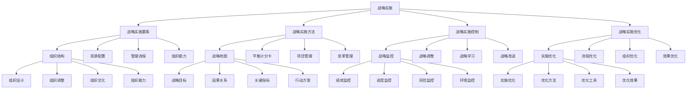

# 战略实施

## 🎯 学习目标
掌握战略实施理论和方法，学会有效实施企业战略，提升战略实施能力和战略目标达成率。

## 📊 战略实施框架

### 战略实施模型

## 🏗️ 战略实施要素

### 组织结构
**组织设计**：
- **组织设计**：组织设计
- **设计原则**：设计原则
- **设计方法**：设计方法
- **设计效果**：设计效果

**组织调整**：
- **组织调整**：组织调整
- **调整方法**：调整方法
- **调整工具**：调整工具
- **调整效果**：调整效果

**组织文化**：
- **组织文化**：组织文化
- **文化建设**：文化建设
- **文化传播**：文化传播
- **文化效果**：文化效果

**组织能力**：
- **组织能力**：组织能力
- **能力建设**：能力建设
- **能力提升**：能力提升
- **能力效果**：能力效果

### 资源配置
**人力资源配置**：
- **人力资源配置**：人力资源配置
- **配置方法**：配置方法
- **配置工具**：配置工具
- **配置效果**：配置效果

**财务资源配置**：
- **财务资源配置**：财务资源配置
- **配置方法**：配置方法
- **配置工具**：配置工具
- **配置效果**：配置效果

**技术资源配置**：
- **技术资源配置**：技术资源配置
- **配置方法**：配置方法
- **配置工具**：配置工具
- **配置效果**：配置效果

**信息资源配置**：
- **信息资源配置**：信息资源配置
- **配置方法**：配置方法
- **配置工具**：配置工具
- **配置效果**：配置效果

### 管理流程
**决策流程**：
- **决策流程**：决策流程
- **流程设计**：流程设计
- **流程实施**：流程实施
- **流程效果**：流程效果

**执行流程**：
- **执行流程**：执行流程
- **流程设计**：流程设计
- **流程实施**：流程实施
- **流程效果**：流程效果

**监控流程**：
- **监控流程**：监控流程
- **流程设计**：流程设计
- **流程实施**：流程实施
- **流程效果**：流程效果

**改进流程**：
- **改进流程**：改进流程
- **流程设计**：流程设计
- **流程实施**：流程实施
- **流程效果**：流程效果

### 组织能力
**组织能力**：
- **组织能力**：组织能力
- **能力建设**：能力建设
- **能力提升**：能力提升
- **能力效果**：能力效果

**能力体系**：
- **能力体系**：能力体系
- **体系设计**：体系设计
- **体系实施**：体系实施
- **体系优化**：体系优化

## 🎯 战略实施方法

### 战略地图
**战略目标**：
- **战略目标**：战略目标
- **目标设定**：目标设定
- **目标管理**：目标管理
- **目标效果**：目标效果

**因果关系**：
- **因果关系**：因果关系
- **关系分析**：关系分析
- **关系管理**：关系管理
- **关系效果**：关系效果

**关键指标**：
- **关键指标**：关键指标
- **指标设计**：指标设计
- **指标管理**：指标管理
- **指标效果**：指标效果

**行动方案**：
- **行动方案**：行动方案
- **方案设计**：方案设计
- **方案实施**：方案实施
- **方案效果**：方案效果

### 平衡计分卡
**财务维度**：
- **财务维度**：财务维度
- **维度设计**：维度设计
- **维度实施**：维度实施
- **维度效果**：维度效果

**客户维度**：
- **客户维度**：客户维度
- **维度设计**：维度设计
- **维度实施**：维度实施
- **维度效果**：维度效果

**内部流程维度**：
- **内部流程维度**：内部流程维度
- **维度设计**：维度设计
- **维度实施**：维度实施
- **维度效果**：维度效果

**学习成长维度**：
- **学习成长维度**：学习成长维度
- **维度设计**：维度设计
- **维度实施**：维度实施
- **维度效果**：维度效果

### 项目管理
**项目规划**：
- **项目规划**：项目规划
- **规划方法**：规划方法
- **规划工具**：规划工具
- **规划效果**：规划效果

**项目执行**：
- **项目执行**：项目执行
- **执行方法**：执行方法
- **执行工具**：执行工具
- **执行效果**：执行效果

**项目监控**：
- **项目监控**：项目监控
- **监控方法**：监控方法
- **监控工具**：监控工具
- **监控效果**：监控效果

**项目收尾**：
- **项目收尾**：项目收尾
- **收尾方法**：收尾方法
- **收尾工具**：收尾工具
- **收尾效果**：收尾效果

### 变革管理
**变革管理**：
- **变革管理**：变革管理
- **管理方法**：管理方法
- **管理工具**：管理工具
- **管理效果**：管理效果

**变革策略**：
- **变革策略**：变革策略
- **策略制定**：策略制定
- **策略实施**：策略实施
- **策略效果**：策略效果

## 📊 战略实施控制

### 战略监控
**绩效监控**：
- **绩效监控**：绩效监控
- **监控方法**：监控方法
- **监控工具**：监控工具
- **监控效果**：监控效果

**进度监控**：
- **进度监控**：进度监控
- **监控方法**：监控方法
- **监控工具**：监控工具
- **监控效果**：监控效果

**风险监控**：
- **风险监控**：风险监控
- **监控方法**：监控方法
- **监控工具**：监控工具
- **监控效果**：监控效果

**环境监控**：
- **环境监控**：环境监控
- **监控方法**：监控方法
- **监控工具**：监控工具
- **监控效果**：监控效果

### 战略调整
**战略评估**：
- **战略评估**：战略评估
- **评估方法**：评估方法
- **评估工具**：评估工具
- **评估结果**：评估结果

**战略修正**：
- **战略修正**：战略修正
- **修正方法**：修正方法
- **修正工具**：修正工具
- **修正效果**：修正效果

**战略更新**：
- **战略更新**：战略更新
- **更新方法**：更新方法
- **更新工具**：更新工具
- **更新效果**：更新效果

**战略创新**：
- **战略创新**：战略创新
- **创新方法**：创新方法
- **创新工具**：创新工具
- **创新效果**：创新效果

### 战略学习
**经验总结**：
- **经验总结**：经验总结
- **总结方法**：总结方法
- **总结工具**：总结工具
- **总结效果**：总结效果

**知识积累**：
- **知识积累**：知识积累
- **积累方法**：积累方法
- **积累工具**：积累工具
- **积累效果**：积累效果

**能力提升**：
- **能力提升**：能力提升
- **提升方法**：提升方法
- **提升工具**：提升工具
- **提升效果**：提升效果

**持续改进**：
- **持续改进**：持续改进
- **改进方法**：改进方法
- **改进工具**：改进工具
- **改进效果**：改进效果

### 战略改进
**战略改进**：
- **战略改进**：战略改进
- **改进方法**：改进方法
- **改进工具**：改进工具
- **改进效果**：改进效果

**改进策略**：
- **改进策略**：改进策略
- **策略制定**：策略制定
- **策略实施**：策略实施
- **策略效果**：策略效果

## 🚀 战略实施优化

### 实施优化
**实施优化**：
- **实施优化**：实施优化
- **优化方法**：优化方法
- **优化工具**：优化工具
- **优化效果**：优化效果

**优化策略**：
- **优化策略**：优化策略
- **策略制定**：策略制定
- **策略实施**：策略实施
- **策略效果**：策略效果

### 流程优化
**流程优化**：
- **流程优化**：流程优化
- **优化方法**：优化方法
- **优化工具**：优化工具
- **优化效果**：优化效果

**优化策略**：
- **优化策略**：优化策略
- **策略制定**：策略制定
- **策略实施**：策略实施
- **策略效果**：策略效果

### 组织优化
**组织优化**：
- **组织优化**：组织优化
- **优化方法**：优化方法
- **优化工具**：优化工具
- **优化效果**：优化效果

**优化策略**：
- **优化策略**：优化策略
- **策略制定**：策略制定
- **策略实施**：策略实施
- **策略效果**：策略效果

### 效果优化
**效果优化**：
- **效果优化**：效果优化
- **优化方法**：优化方法
- **优化工具**：优化工具
- **优化效果**：优化效果

**优化策略**：
- **优化策略**：优化策略
- **策略制定**：策略制定
- **策略实施**：策略实施
- **策略效果**：策略效果

## 💡 战略实施案例

### 成功案例
**苹果公司战略实施**：
- **战略实施**：创新战略实施
- **实施方法**：系统实施方法
- **实施效果**：卓越实施效果
- **效果**：战略实施质量极高

**特斯拉公司战略实施**：
- **战略实施**：前瞻战略实施
- **实施方法**：创新实施方法
- **实施效果**：显著实施效果
- **效果**：战略实施质量极佳

**亚马逊公司战略实施**：
- **战略实施**：全面战略实施
- **实施方法**：系统实施方法
- **实施效果**：突出实施效果
- **效果**：战略实施质量突出

### 失败案例
**失败原因**：
- **战略实施准备不足**：战略实施准备不足
- **资源配置不合理**：资源配置不合理
- **组织能力不足**：组织能力不足
- **监控控制缺失**：监控控制缺失

**失败教训**：
- **战略实施准备**：充分准备战略实施
- **资源配置**：合理配置资源
- **组织能力**：提升组织能力
- **监控控制**：加强监控控制

## 🧠 学习要点

### 费曼学习法应用
1. **选择概念**：战略实施
2. **简化解释**：用简单语言解释战略实施
3. **识别盲点**：找出理解不足的地方
4. **重新学习**：针对盲点深入学习

### 刻意练习要点
- **理论掌握**：掌握战略实施理论
- **方法应用**：掌握战略实施方法
- **工具使用**：掌握战略实施工具
- **实践应用**：实践应用战略实施

## 🔗 关联学习

### 前置知识
- [[03-战略制定]] - 战略制定
- [[02-战略分析工具]] - 战略分析工具
- [[01-战略管理概论]] - 战略管理概论

### 后续学习
- [[01-成本领先战略]] - 成本领先战略
- [[02-差异化战略]] - 差异化战略
- [[03-蓝海战略]] - 蓝海战略

### 实践应用
- 企业战略实施
- 战略目标达成
- 战略实施控制
- 战略实施优化

## 🎯 学习检验

### 理解检验
- [ ] 能够理解战略实施理论
- [ ] 能够掌握战略实施方法
- [ ] 能够应用战略实施工具
- [ ] 能够实施企业战略

### 应用检验
- [ ] 能够实施企业战略
- [ ] 能够控制战略实施
- [ ] 能够优化战略实施
- [ ] 能够达成战略目标

---
**下一步**：[[01-成本领先战略]] - 成本领先战略