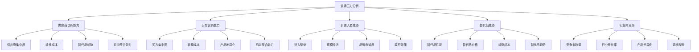

# 波特五力模型

## 🎯 学习目标
掌握波特五力分析模型，学会分析行业竞争环境，制定有效的竞争策略。

## 📊 波特五力分析框架

### 五力模型

## 🔧 供应商议价能力

### 供应商集中度
**集中度分析**：
- **供应商数量**：供应商数量分析
- **市场份额**：供应商市场份额
- **集中程度**：供应商集中程度
- **垄断程度**：供应商垄断程度

**集中度影响**：
- **议价能力**：集中度对议价能力的影响
- **价格控制**：集中度对价格控制的影响
- **供应稳定性**：集中度对供应稳定性的影响
- **创新动力**：集中度对创新动力的影响

**应对策略**：
- **供应商多元化**：供应商多元化策略
- **供应商管理**：供应商管理策略
- **供应商合作**：供应商合作策略
- **供应商替代**：供应商替代策略

### 转换成本
**转换成本类型**：
- **技术转换成本**：技术转换成本
- **设备转换成本**：设备转换成本
- **培训转换成本**：培训转换成本
- **关系转换成本**：关系转换成本

**转换成本影响**：
- **议价能力**：转换成本对议价能力的影响
- **供应商锁定**：转换成本对供应商锁定的影响
- **竞争程度**：转换成本对竞争程度的影响
- **创新动力**：转换成本对创新动力的影响

**降低策略**：
- **标准化**：产品标准化策略
- **模块化**：产品模块化策略
- **技术开放**：技术开放策略
- **供应商培养**：供应商培养策略

### 替代品威胁
**替代品识别**：
- **直接替代品**：直接替代品识别
- **间接替代品**：间接替代品识别
- **潜在替代品**：潜在替代品识别
- **技术替代品**：技术替代品识别

**替代品分析**：
- **替代品性能**：替代品性能分析
- **替代品价格**：替代品价格分析
- **替代品趋势**：替代品趋势分析
- **替代品威胁**：替代品威胁分析

**应对策略**：
- **产品差异化**：产品差异化策略
- **成本领先**：成本领先策略
- **技术创新**：技术创新策略
- **市场教育**：市场教育策略

### 前向整合能力
**整合能力分析**：
- **整合动机**：供应商前向整合动机
- **整合能力**：供应商前向整合能力
- **整合障碍**：供应商前向整合障碍
- **整合威胁**：供应商前向整合威胁

**整合影响**：
- **议价能力**：前向整合对议价能力的影响
- **竞争格局**：前向整合对竞争格局的影响
- **市场结构**：前向整合对市场结构的影响
- **创新动力**：前向整合对创新动力的影响

**应对策略**：
- **后向整合**：后向整合策略
- **战略联盟**：战略联盟策略
- **技术控制**：技术控制策略
- **市场控制**：市场控制策略

## 👥 买方议价能力

### 买方集中度
**集中度分析**：
- **买方数量**：买方数量分析
- **市场份额**：买方市场份额
- **集中程度**：买方集中程度
- **垄断程度**：买方垄断程度

**集中度影响**：
- **议价能力**：集中度对议价能力的影响
- **价格控制**：集中度对价格控制的影响
- **需求稳定性**：集中度对需求稳定性的影响
- **创新动力**：集中度对创新动力的影响

**应对策略**：
- **客户多元化**：客户多元化策略
- **客户管理**：客户管理策略
- **客户合作**：客户合作策略
- **客户替代**：客户替代策略

### 转换成本
**转换成本类型**：
- **技术转换成本**：技术转换成本
- **培训转换成本**：培训转换成本
- **关系转换成本**：关系转换成本
- **系统转换成本**：系统转换成本

**转换成本影响**：
- **议价能力**：转换成本对议价能力的影响
- **客户锁定**：转换成本对客户锁定的影响
- **竞争程度**：转换成本对竞争程度的影响
- **创新动力**：转换成本对创新动力的影响

**提高策略**：
- **产品差异化**：产品差异化策略
- **服务差异化**：服务差异化策略
- **关系建设**：关系建设策略
- **价值创造**：价值创造策略

### 产品差异化
**差异化程度**：
- **产品差异化**：产品差异化程度
- **服务差异化**：服务差异化程度
- **品牌差异化**：品牌差异化程度
- **体验差异化**：体验差异化程度

**差异化影响**：
- **议价能力**：差异化对议价能力的影响
- **竞争程度**：差异化对竞争程度的影响
- **客户忠诚度**：差异化对客户忠诚度的影响
- **创新动力**：差异化对创新动力的影响

**差异化策略**：
- **产品创新**：产品创新策略
- **服务创新**：服务创新策略
- **品牌建设**：品牌建设策略
- **体验设计**：体验设计策略

### 后向整合能力
**整合能力分析**：
- **整合动机**：买方后向整合动机
- **整合能力**：买方后向整合能力
- **整合障碍**：买方后向整合障碍
- **整合威胁**：买方后向整合威胁

**整合影响**：
- **议价能力**：后向整合对议价能力的影响
- **竞争格局**：后向整合对竞争格局的影响
- **市场结构**：后向整合对市场结构的影响
- **创新动力**：后向整合对创新动力的影响

**应对策略**：
- **前向整合**：前向整合策略
- **战略联盟**：战略联盟策略
- **技术控制**：技术控制策略
- **市场控制**：市场控制策略

## 🚪 新进入者威胁

### 进入壁垒
**结构性壁垒**：
- **规模经济**：规模经济壁垒
- **产品差异化**：产品差异化壁垒
- **资本需求**：资本需求壁垒
- **转换成本**：转换成本壁垒

**行为性壁垒**：
- **品牌忠诚度**：品牌忠诚度壁垒
- **专利保护**：专利保护壁垒
- **政府政策**：政府政策壁垒
- **网络效应**：网络效应壁垒

**壁垒分析**：
- **壁垒高度**：进入壁垒高度分析
- **壁垒强度**：进入壁垒强度分析
- **壁垒变化**：进入壁垒变化分析
- **壁垒突破**：进入壁垒突破分析

**壁垒策略**：
- **提高壁垒**：提高进入壁垒策略
- **降低壁垒**：降低进入壁垒策略
- **利用壁垒**：利用进入壁垒策略
- **突破壁垒**：突破进入壁垒策略

### 规模经济
**规模经济分析**：
- **规模效应**：规模效应分析
- **规模门槛**：规模门槛分析
- **规模优势**：规模优势分析
- **规模劣势**：规模劣势分析

**规模经济影响**：
- **进入壁垒**：规模经济对进入壁垒的影响
- **竞争程度**：规模经济对竞争程度的影响
- **成本结构**：规模经济对成本结构的影响
- **创新动力**：规模经济对创新动力的影响

**规模策略**：
- **规模扩张**：规模扩张策略
- **规模优化**：规模优化策略
- **规模合作**：规模合作策略
- **规模创新**：规模创新策略

### 品牌忠诚度
**忠诚度分析**：
- **忠诚度水平**：品牌忠诚度水平
- **忠诚度原因**：品牌忠诚度原因
- **忠诚度变化**：品牌忠诚度变化
- **忠诚度价值**：品牌忠诚度价值

**忠诚度影响**：
- **进入壁垒**：品牌忠诚度对进入壁垒的影响
- **竞争程度**：品牌忠诚度对竞争程度的影响
- **议价能力**：品牌忠诚度对议价能力的影响
- **创新动力**：品牌忠诚度对创新动力的影响

**忠诚度策略**：
- **忠诚度建设**：品牌忠诚度建设策略
- **忠诚度维护**：品牌忠诚度维护策略
- **忠诚度提升**：品牌忠诚度提升策略
- **忠诚度创新**：品牌忠诚度创新策略

### 政府政策
**政策分析**：
- **政策支持**：政府政策支持
- **政策限制**：政府政策限制
- **政策变化**：政府政策变化
- **政策影响**：政府政策影响

**政策影响**：
- **进入壁垒**：政府政策对进入壁垒的影响
- **竞争程度**：政府政策对竞争程度的影响
- **市场结构**：政府政策对市场结构的影响
- **创新动力**：政府政策对创新动力的影响

**政策策略**：
- **政策利用**：政府政策利用策略
- **政策适应**：政府政策适应策略
- **政策影响**：政府政策影响策略
- **政策创新**：政府政策创新策略

## 🔄 替代品威胁

### 替代品性能
**性能分析**：
- **功能性能**：替代品功能性能
- **质量性能**：替代品质量性能
- **可靠性**：替代品可靠性
- **耐用性**：替代品耐用性

**性能影响**：
- **替代威胁**：性能对替代威胁的影响
- **竞争程度**：性能对竞争程度的影响
- **市场结构**：性能对市场结构的影响
- **创新动力**：性能对创新动力的影响

**性能策略**：
- **性能提升**：产品性能提升策略
- **性能差异化**：产品性能差异化策略
- **性能创新**：产品性能创新策略
- **性能教育**：产品性能教育策略

### 替代品价格
**价格分析**：
- **价格水平**：替代品价格水平
- **价格趋势**：替代品价格趋势
- **价格竞争力**：替代品价格竞争力
- **价格敏感性**：替代品价格敏感性

**价格影响**：
- **替代威胁**：价格对替代威胁的影响
- **竞争程度**：价格对竞争程度的影响
- **市场结构**：价格对市场结构的影响
- **创新动力**：价格对创新动力的影响

**价格策略**：
- **价格竞争**：价格竞争策略
- **价格差异化**：价格差异化策略
- **价格创新**：价格创新策略
- **价值定价**：价值定价策略

### 转换成本
**转换成本分析**：
- **技术转换成本**：技术转换成本
- **培训转换成本**：培训转换成本
- **关系转换成本**：关系转换成本
- **系统转换成本**：系统转换成本

**转换成本影响**：
- **替代威胁**：转换成本对替代威胁的影响
- **竞争程度**：转换成本对竞争程度的影响
- **市场结构**：转换成本对市场结构的影响
- **创新动力**：转换成本对创新动力的影响

**转换成本策略**：
- **提高转换成本**：提高转换成本策略
- **降低转换成本**：降低转换成本策略
- **利用转换成本**：利用转换成本策略
- **创新转换成本**：创新转换成本策略

### 替代品趋势
**趋势分析**：
- **技术趋势**：替代品技术趋势
- **市场趋势**：替代品市场趋势
- **需求趋势**：替代品需求趋势
- **竞争趋势**：替代品竞争趋势

**趋势影响**：
- **替代威胁**：趋势对替代威胁的影响
- **竞争程度**：趋势对竞争程度的影响
- **市场结构**：趋势对市场结构的影响
- **创新动力**：趋势对创新动力的影响

**趋势策略**：
- **趋势适应**：趋势适应策略
- **趋势利用**：趋势利用策略
- **趋势创新**：趋势创新策略
- **趋势引领**：趋势引领策略

## ⚔️ 行业内竞争

### 竞争者数量
**数量分析**：
- **竞争者数量**：行业内竞争者数量
- **竞争者规模**：行业内竞争者规模
- **竞争者分布**：行业内竞争者分布
- **竞争者变化**：行业内竞争者变化

**数量影响**：
- **竞争程度**：竞争者数量对竞争程度的影响
- **市场结构**：竞争者数量对市场结构的影响
- **创新动力**：竞争者数量对创新动力的影响
- **盈利能力**：竞争者数量对盈利能力的影响

**数量策略**：
- **竞争策略**：竞争策略制定
- **合作策略**：合作策略制定
- **差异化策略**：差异化策略制定
- **创新策略**：创新策略制定

### 行业增长率
**增长率分析**：
- **行业增长率**：行业增长率分析
- **增长率趋势**：行业增长率趋势
- **增长率影响**：行业增长率影响
- **增长率预测**：行业增长率预测

**增长率影响**：
- **竞争程度**：增长率对竞争程度的影响
- **市场结构**：增长率对市场结构的影响
- **创新动力**：增长率对创新动力的影响
- **盈利能力**：增长率对盈利能力的影响

**增长率策略**：
- **增长策略**：增长策略制定
- **稳定策略**：稳定策略制定
- **转型策略**：转型策略制定
- **创新策略**：创新策略制定

### 产品差异化
**差异化分析**：
- **差异化程度**：产品差异化程度
- **差异化类型**：产品差异化类型
- **差异化价值**：产品差异化价值
- **差异化趋势**：产品差异化趋势

**差异化影响**：
- **竞争程度**：差异化对竞争程度的影响
- **市场结构**：差异化对市场结构的影响
- **创新动力**：差异化对创新动力的影响
- **盈利能力**：差异化对盈利能力的影响

**差异化策略**：
- **差异化建设**：差异化建设策略
- **差异化维护**：差异化维护策略
- **差异化提升**：差异化提升策略
- **差异化创新**：差异化创新策略

### 退出壁垒
**壁垒分析**：
- **结构性壁垒**：退出结构性壁垒
- **行为性壁垒**：退出行为性壁垒
- **壁垒高度**：退出壁垒高度
- **壁垒影响**：退出壁垒影响

**壁垒影响**：
- **竞争程度**：退出壁垒对竞争程度的影响
- **市场结构**：退出壁垒对市场结构的影响
- **创新动力**：退出壁垒对创新动力的影响
- **盈利能力**：退出壁垒对盈利能力的影响

**壁垒策略**：
- **壁垒利用**：退出壁垒利用策略
- **壁垒降低**：退出壁垒降低策略
- **壁垒创新**：退出壁垒创新策略
- **壁垒管理**：退出壁垒管理策略

## 💡 实践应用

### 波特五力分析流程
1. **数据收集**：收集相关数据
2. **五力分析**：分析五个力量
3. **力量评估**：评估各力量强度
4. **竞争态势**：分析竞争态势
5. **策略制定**：制定竞争策略
6. **策略实施**：实施竞争策略
7. **效果评估**：评估策略效果

### 案例分析
**选择案例**：如智能手机行业
**五力分析**：
- **供应商议价能力**：芯片供应商集中度高
- **买方议价能力**：消费者议价能力较强
- **新进入者威胁**：进入壁垒较高
- **替代品威胁**：替代品威胁较大
- **行业内竞争**：竞争激烈

## 🧠 学习要点

### 费曼学习法应用
1. **选择概念**：波特五力分析
2. **简化解释**：用简单语言解释五力分析
3. **识别盲点**：找出理解不足的地方
4. **重新学习**：针对盲点深入学习

### 刻意练习要点
- **分析框架**：掌握五力分析框架
- **分析方法**：掌握五力分析方法
- **分析技巧**：掌握五力分析技巧
- **策略制定**：掌握竞争策略制定

## 🔗 关联学习

### 前置知识
- [[01-战略管理概论]] - 战略管理
- [[01-商业环境分析]] - 环境分析
- [[01-SWOT分析]] - SWOT分析

### 后续学习
- [[02-价值链分析]] - 价值链分析
- [[03-蓝海战略]] - 蓝海战略
- [[04-差异化战略]] - 差异化战略

### 实践应用
- 行业竞争分析
- 竞争策略制定
- 市场进入决策
- 竞争定位选择

## 🎯 学习检验

### 理解检验
- [ ] 能够解释波特五力分析模型
- [ ] 能够分析五个竞争力量
- [ ] 能够评估竞争态势
- [ ] 能够制定竞争策略

### 应用检验
- [ ] 能够分析具体行业竞争环境
- [ ] 能够评估企业竞争地位
- [ ] 能够制定企业竞争策略
- [ ] 能够实施竞争策略

---
**下一步**：[[02-价值链分析]] - 价值链分析

