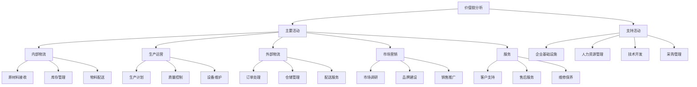

# 价值链分析

## 🎯 学习目标
掌握价值链分析理论，学会识别企业价值创造活动，优化价值链结构，提升竞争优势。

## 📊 价值链分析框架

### 价值链模型

## 🏭 主要活动分析

### 内部物流
**活动内容**：
- **原材料接收**：原材料验收、质量检查、入库管理
- **库存管理**：库存控制、仓储管理、物料跟踪
- **物料配送**：内部配送、生产供应、物料调度

**价值创造**：
- **成本控制**：降低物流成本，提高效率
- **质量保证**：确保原材料质量，减少缺陷
- **及时供应**：保证生产连续性，避免停工

**优化策略**：
- **供应商管理**：建立战略供应商关系
- **库存优化**：实施JIT库存管理
- **物流整合**：整合内部物流系统

### 生产运营
**活动内容**：
- **生产计划**：生产排程、产能规划、资源配置
- **质量控制**：质量检测、过程控制、持续改进
- **设备维护**：设备保养、故障维修、技术升级

**价值创造**：
- **效率提升**：提高生产效率，降低单位成本
- **质量改进**：提升产品质量，增强竞争力
- **技术创新**：推动技术进步，创造差异化

**优化策略**：
- **精益生产**：实施精益生产管理
- **自动化**：推进生产自动化
- **标准化**：建立标准化作业流程

### 外部物流
**活动内容**：
- **订单处理**：订单接收、处理、跟踪
- **仓储管理**：成品仓储、库存控制、配送准备
- **配送服务**：运输安排、配送执行、客户交付

**价值创造**：
- **客户满意**：提高交付效率，增强客户体验
- **成本控制**：优化配送网络，降低物流成本
- **市场响应**：快速响应市场需求变化

**优化策略**：
- **网络优化**：优化配送网络布局
- **技术应用**：应用物流信息技术
- **合作伙伴**：建立物流合作伙伴关系

### 市场营销
**活动内容**：
- **市场调研**：市场分析、客户研究、竞争分析
- **品牌建设**：品牌定位、品牌传播、品牌管理
- **销售推广**：销售策略、渠道管理、促销活动

**价值创造**：
- **市场开拓**：扩大市场份额，增加销售收入
- **品牌价值**：提升品牌价值，增强议价能力
- **客户关系**：建立客户关系，提高忠诚度

**优化策略**：
- **数字化营销**：应用数字营销技术
- **精准营销**：实施精准营销策略
- **渠道整合**：整合线上线下渠道

### 服务
**活动内容**：
- **客户支持**：客户咨询、技术支持、问题解决
- **售后服务**：产品维修、退换货、客户培训
- **维修保养**：定期维护、故障维修、升级服务

**价值创造**：
- **客户满意**：提高客户满意度，增强忠诚度
- **收入增长**：通过服务创造额外收入
- **竞争优势**：建立服务差异化优势

**优化策略**：
- **服务标准化**：建立标准化服务体系
- **技术支撑**：应用服务技术平台
- **人员培训**：提升服务人员能力

## 🛠️ 支持活动分析

### 企业基础设施
**活动内容**：
- **组织架构**：组织设计、管理结构、决策流程
- **信息系统**：IT系统、数据管理、信息安全
- **财务管理**：财务规划、成本控制、风险管理

**价值创造**：
- **效率提升**：提高管理效率，降低管理成本
- **决策支持**：提供决策支持，改善决策质量
- **风险控制**：控制经营风险，保障企业安全

**优化策略**：
- **数字化转型**：推进企业数字化转型
- **流程优化**：优化管理流程
- **系统集成**：集成信息系统

### 人力资源管理
**活动内容**：
- **人才招聘**：人才规划、招聘选拔、入职培训
- **绩效管理**：绩效评估、激励机制、职业发展
- **培训发展**：员工培训、能力提升、知识管理

**价值创造**：
- **人才优势**：建立人才优势，提升竞争力
- **创新能力**：提升创新能力，推动发展
- **组织文化**：建设组织文化，增强凝聚力

**优化策略**：
- **人才战略**：制定人才发展战略
- **激励机制**：完善激励机制
- **文化建设**：加强企业文化建设

### 技术开发
**活动内容**：
- **研发管理**：研发规划、项目管理、成果转化
- **技术创新**：技术研发、专利申请、技术合作
- **技术应用**：技术推广、应用支持、技术培训

**价值创造**：
- **产品创新**：推动产品创新，创造差异化
- **成本降低**：通过技术改进降低成本
- **市场领先**：建立技术领先优势

**优化策略**：
- **研发投入**：增加研发投入
- **技术合作**：建立技术合作关系
- **创新文化**：营造创新文化氛围

### 采购管理
**活动内容**：
- **供应商管理**：供应商选择、评估、关系管理
- **采购策略**：采购规划、成本控制、风险管控
- **合同管理**：合同谈判、执行、监控

**价值创造**：
- **成本控制**：降低采购成本，提高效益
- **质量保证**：确保采购质量，降低风险
- **供应稳定**：保证供应稳定，支持生产

**优化策略**：
- **战略采购**：实施战略采购管理
- **供应商整合**：整合供应商资源
- **采购数字化**：推进采购数字化

## 💡 价值链优化

### 价值链重构
**重构原则**：
- **价值导向**：以价值创造为导向
- **客户中心**：以客户需求为中心
- **效率优先**：提高价值链效率
- **创新驱动**：以创新驱动发展

**重构方法**：
- **活动整合**：整合相关价值活动
- **流程优化**：优化价值链流程
- **技术应用**：应用先进技术
- **外包策略**：实施战略外包

### 价值链协同
**协同机制**：
- **内部协同**：内部活动协同
- **外部协同**：与外部伙伴协同
- **供应链协同**：供应链协同管理
- **生态协同**：构建生态协同

**协同策略**：
- **信息共享**：建立信息共享机制
- **资源整合**：整合内外部资源
- **风险共担**：建立风险共担机制
- **利益共享**：建立利益共享机制

### 价值链创新
**创新方向**：
- **模式创新**：创新商业模式
- **技术创新**：推动技术创新
- **管理创新**：实施管理创新
- **服务创新**：推进服务创新

**创新策略**：
- **开放创新**：实施开放创新
- **协同创新**：推进协同创新
- **持续创新**：建立持续创新机制
- **创新文化**：营造创新文化

## 📈 价值链分析工具

### 价值链图
**绘制步骤**：
1. **识别活动**：识别所有价值活动
2. **分类活动**：将活动分为主要活动和支持活动
3. **分析联系**：分析活动间的联系
4. **评估价值**：评估各活动的价值贡献
5. **识别机会**：识别优化机会

### 成本分析
**分析方法**：
- **成本分解**：分解各活动成本
- **成本比较**：与竞争对手比较
- **成本驱动**：识别成本驱动因素
- **成本优化**：制定成本优化策略

### 价值分析
**分析内容**：
- **价值识别**：识别价值创造点
- **价值评估**：评估价值贡献
- **价值比较**：与竞争对手比较
- **价值提升**：制定价值提升策略

## 🧠 学习要点

### 费曼学习法应用
1. **选择概念**：价值链分析
2. **简化解释**：用简单语言解释价值链分析
3. **识别盲点**：找出理解不足的地方
4. **重新学习**：针对盲点深入学习

### 刻意练习要点
- **分析框架**：掌握价值链分析框架
- **分析方法**：掌握价值链分析方法
- **优化策略**：掌握价值链优化策略
- **实践应用**：掌握价值链分析实践应用

## 🔗 关联学习

### 前置知识
- [[01-波特五力模型]] - 波特五力分析
- [[01-战略管理概论]] - 战略管理
- [[01-商业环境分析]] - 环境分析

### 后续学习
- [[03-蓝海战略]] - 蓝海战略
- [[04-差异化战略]] - 差异化战略
- [[01-商业模式画布]] - 商业模式画布

### 实践应用
- 企业价值链分析
- 价值链优化设计
- 竞争优势构建
- 商业模式创新

## 🎯 学习检验

### 理解检验
- [ ] 能够理解价值链分析理论
- [ ] 能够识别企业价值活动
- [ ] 能够分析价值链结构
- [ ] 能够制定优化策略

### 应用检验
- [ ] 能够分析具体企业价值链
- [ ] 能够识别价值链优化机会
- [ ] 能够制定价值链优化策略
- [ ] 能够实施价值链优化

---
**下一步**：[[03-蓝海战略]] - 蓝海战略

