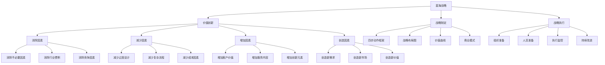

# 蓝海战略

## 🎯 学习目标
掌握蓝海战略理论，学会创造无竞争的市场空间，实现价值创新，获得持续竞争优势。

## 📊 蓝海战略框架

### 蓝海战略模型

## 🌊 蓝海战略核心概念

### 红海vs蓝海
**红海特征**：
- **竞争激烈**：现有市场空间竞争激烈
- **价格战**：主要通过价格竞争
- **同质化**：产品服务同质化严重
- **增长有限**：市场增长空间有限

**蓝海特征**：
- **无竞争**：创造无竞争的市场空间
- **价值创新**：通过价值创新获得优势
- **差异化**：提供独特的产品服务
- **增长无限**：创造新的市场需求

**对比分析**：
| 维度 | 红海战略 | 蓝海战略 |
|------|----------|----------|
| 竞争范围 | 现有市场 | 无竞争市场 |
| 竞争方式 | 价格竞争 | 价值创新 |
| 产品特征 | 同质化 | 差异化 |
| 增长方式 | 市场份额 | 市场创造 |
| 战略重点 | 竞争 | 创新 |

### 价值创新
**价值创新定义**：
- **同时追求**：同时追求差异化和低成本
- **价值提升**：为客户创造价值提升
- **成本降低**：为企业降低运营成本
- **价值曲线**：重新设计价值曲线

**价值创新要素**：
- **客户价值**：提升客户获得的价值
- **企业价值**：提升企业创造的价值
- **成本结构**：优化成本结构
- **收入模式**：创新收入模式

**价值创新方法**：
- **重新定义**：重新定义行业边界
- **重新组合**：重新组合价值要素
- **重新创造**：创造新的价值要素
- **重新配置**：重新配置资源

## 🎯 四步动作框架

### 消除因素
**消除原则**：
- **行业惯例**：消除行业认为理所当然的因素
- **不必要因素**：消除对客户价值无贡献的因素
- **竞争因素**：消除导致竞争的因素
- **过时因素**：消除过时的因素

**消除方法**：
- **价值分析**：分析各因素的价值贡献
- **客户调研**：了解客户真实需求
- **竞争分析**：分析竞争因素
- **趋势分析**：分析行业发展趋势

**消除案例**：
- **西南航空**：消除餐饮服务、座位分配
- **太阳马戏团**：消除动物表演、明星演员
- **任天堂Wii**：消除复杂操作、高画质

### 减少因素
**减少原则**：
- **过度设计**：减少过度设计因素
- **复杂流程**：减少复杂流程因素
- **成本因素**：减少高成本因素
- **冗余因素**：减少冗余因素

**减少方法**：
- **成本分析**：分析各因素的成本
- **效率分析**：分析各因素的效率
- **客户分析**：分析客户对因素的重视程度
- **技术分析**：分析技术可行性

**减少案例**：
- **宜家**：减少组装服务、配送服务
- **Zara**：减少库存、广告投入
- **小米**：减少渠道成本、营销成本

### 增加因素
**增加原则**：
- **客户价值**：增加客户价值因素
- **服务内容**：增加服务内容因素
- **创新元素**：增加创新元素因素
- **差异化因素**：增加差异化因素

**增加方法**：
- **需求分析**：分析客户潜在需求
- **价值分析**：分析价值创造机会
- **创新分析**：分析创新可能性
- **差异化分析**：分析差异化机会

**增加案例**：
- **星巴克**：增加第三空间体验
- **苹果**：增加设计美学、用户体验
- **特斯拉**：增加自动驾驶、环保理念

### 创造因素
**创造原则**：
- **新需求**：创造新的客户需求
- **新市场**：创造新的市场空间
- **新价值**：创造新的价值主张
- **新模式**：创造新的商业模式

**创造方法**：
- **趋势分析**：分析未来发展趋势
- **技术分析**：分析新技术可能性
- **需求挖掘**：挖掘潜在需求
- **模式创新**：创新商业模式

**创造案例**：
- **Uber**：创造共享出行模式
- **Airbnb**：创造共享住宿模式
- **Netflix**：创造流媒体模式

## 📈 战略布局图

### 战略布局图构建
**构建步骤**：
1. **确定范围**：确定战略布局图的范围
2. **识别因素**：识别关键竞争因素
3. **评估水平**：评估各因素的水平
4. **绘制曲线**：绘制价值曲线
5. **分析对比**：与竞争对手对比

**关键因素**：
- **价格**：产品服务价格
- **质量**：产品服务质量
- **功能**：产品服务功能
- **服务**：客户服务水平
- **品牌**：品牌影响力
- **渠道**：销售渠道覆盖

### 价值曲线分析
**价值曲线特征**：
- **差异化**：与竞争对手不同的价值曲线
- **聚焦性**：聚焦关键价值因素
- **创新性**：创新价值创造方式
- **一致性**：价值曲线内部一致

**价值曲线优化**：
- **提升高点**：提升高价值因素
- **降低低点**：降低低价值因素
- **消除冗余**：消除冗余因素
- **创造新点**：创造新的价值点

### 战略布局图应用
**应用场景**：
- **战略规划**：用于战略规划
- **竞争分析**：用于竞争分析
- **价值创新**：用于价值创新
- **市场定位**：用于市场定位

**应用方法**：
- **现状分析**：分析现状价值曲线
- **目标设定**：设定目标价值曲线
- **差距分析**：分析现状与目标差距
- **改进策略**：制定改进策略

## 🚀 蓝海战略执行

### 组织准备
**组织变革**：
- **组织结构**：调整组织结构
- **管理流程**：优化管理流程
- **决策机制**：建立决策机制
- **激励机制**：完善激励机制

**组织能力**：
- **创新能力**：提升创新能力
- **执行能力**：提升执行能力
- **学习能力**：提升学习能力
- **适应能力**：提升适应能力

### 人员准备
**人员培训**：
- **战略培训**：蓝海战略培训
- **技能培训**：相关技能培训
- **文化培训**：企业文化培训
- **创新培训**：创新思维培训

**人员激励**：
- **目标激励**：设定明确目标
- **物质激励**：提供物质激励
- **精神激励**：提供精神激励
- **发展激励**：提供发展机会

### 执行监控
**监控指标**：
- **财务指标**：收入、利润、成本
- **市场指标**：市场份额、客户满意度
- **创新指标**：新产品、新服务
- **执行指标**：执行进度、执行质量

**监控方法**：
- **定期评估**：定期评估执行情况
- **实时监控**：实时监控关键指标
- **问题识别**：及时识别问题
- **调整优化**：及时调整优化

### 持续改进
**改进机制**：
- **反馈机制**：建立反馈机制
- **学习机制**：建立学习机制
- **创新机制**：建立创新机制
- **改进机制**：建立改进机制

**改进方法**：
- **数据分析**：分析执行数据
- **客户反馈**：收集客户反馈
- **市场变化**：关注市场变化
- **技术发展**：关注技术发展

## 💡 蓝海战略案例

### 成功案例
**西南航空**：
- **消除因素**：消除餐饮、座位分配
- **减少因素**：减少服务复杂度
- **增加因素**：增加便利性、低价
- **创造因素**：创造低成本航空模式

**太阳马戏团**：
- **消除因素**：消除动物表演、明星
- **减少因素**：减少马戏传统元素
- **增加因素**：增加艺术性、故事性
- **创造因素**：创造艺术马戏模式

**任天堂Wii**：
- **消除因素**：消除复杂操作、高画质
- **减少因素**：减少硬件成本
- **增加因素**：增加体感操作、家庭娱乐
- **创造因素**：创造体感游戏模式

### 失败案例
**失败原因**：
- **执行不力**：战略执行不力
- **市场变化**：市场环境变化
- **竞争加剧**：竞争加剧
- **创新不足**：创新不足

**失败教训**：
- **执行重要**：执行比战略更重要
- **环境适应**：适应环境变化
- **持续创新**：持续创新
- **竞争应对**：应对竞争

## 🧠 学习要点

### 费曼学习法应用
1. **选择概念**：蓝海战略
2. **简化解释**：用简单语言解释蓝海战略
3. **识别盲点**：找出理解不足的地方
4. **重新学习**：针对盲点深入学习

### 刻意练习要点
- **理论掌握**：掌握蓝海战略理论
- **方法应用**：掌握四步动作框架
- **案例分析**：分析成功失败案例
- **实践应用**：实践应用蓝海战略

## 🔗 关联学习

### 前置知识
- [[02-价值链分析]] - 价值链分析
- [[01-波特五力模型]] - 波特五力分析
- [[01-战略管理概论]] - 战略管理

### 后续学习
- [[04-差异化战略]] - 差异化战略
- [[01-商业模式画布]] - 商业模式画布
- [[01-创新管理]] - 创新管理

### 实践应用
- 企业蓝海战略制定
- 价值创新实践
- 市场空间创造
- 竞争优势构建

## 🎯 学习检验

### 理解检验
- [ ] 能够理解蓝海战略理论
- [ ] 能够掌握四步动作框架
- [ ] 能够分析价值曲线
- [ ] 能够制定蓝海战略

### 应用检验
- [ ] 能够分析具体行业蓝海机会
- [ ] 能够制定企业蓝海战略
- [ ] 能够执行蓝海战略
- [ ] 能够持续创新

---
**下一步**：[[04-差异化战略]] - 差异化战略

