# 商业模式画布

## 🎯 学习目标
掌握商业模式画布工具，学会设计、分析和优化商业模式，提升商业创新能力。

## 📊 商业模式画布框架

### 九大要素

```mermaid
graph TD
    A[商业模式画布] --> B[价值主张]
    A --> C[客户细分]
    A --> D[客户关系]
    A --> E[渠道通路]
    A --> F[关键业务]
    A --> G[核心资源]
    A --> H[重要伙伴]
    A --> I[成本结构]
    A --> J[收入来源]
    
    B --> B1[产品服务]
    B --> B2[价值创造]
    B --> B3[差异化优势]
    B --> B4[客户价值]
    
    C --> C1[目标客户]
    C --> C2[客户特征]
    C --> C3[客户需求]
    C --> C4[客户行为]
    
    D --> D1[关系类型]
    D --> D2[关系建立]
    D --> D3[关系维护]
    D --> D4[关系价值]
    
    E --> E1[销售渠道]
    E --> E2[服务渠道]
    E --> E3[沟通渠道]
    E --> E4[渠道管理]
    
    F --> F1[核心业务]
    F --> F2[业务流程]
    F --> F3[业务能力]
    F --> F4[业务创新]
    
    G --> G1[人力资源]
    G --> G2[物质资源]
    G --> G3[技术资源]
    G --> G4[品牌资源]
    
    H --> H1[供应商伙伴]
    H --> H2[渠道伙伴]
    H --> H3[技术伙伴]
    H --> H4[战略伙伴]
    
    I --> I1[固定成本]
    I --> I2[变动成本]
    I --> I3[成本控制]
    I --> I4[成本优化]
    
    J --> J1[收入模式]
    J --> J2[定价策略]
    J --> J3[收入结构]
    J --> J4[收入增长]
```

## 💎 价值主张

### 价值创造
**功能价值**：
- **基础功能**：产品服务的基础功能
- **核心功能**：产品服务的核心功能
- **增值功能**：产品服务的增值功能
- **创新功能**：产品服务的创新功能

**情感价值**：
- **体验价值**：客户体验价值
- **情感价值**：客户情感价值
- **社交价值**：客户社交价值
- **身份价值**：客户身份价值

**社会价值**：
- **环保价值**：环保社会价值
- **公益价值**：公益社会价值
- **教育价值**：教育社会价值
- **文化价值**：文化社会价值

**经济价值**：
- **成本节约**：客户成本节约
- **效率提升**：客户效率提升
- **收益增加**：客户收益增加
- **风险降低**：客户风险降低

### 差异化优势
**产品差异化**：
- **功能差异化**：产品功能差异化
- **质量差异化**：产品质量差异化
- **设计差异化**：产品设计差异化
- **创新差异化**：产品创新差异化

**服务差异化**：
- **服务内容**：服务内容差异化
- **服务方式**：服务方式差异化
- **服务质量**：服务质量差异化
- **服务体验**：服务体验差异化

**品牌差异化**：
- **品牌形象**：品牌形象差异化
- **品牌价值**：品牌价值差异化
- **品牌文化**：品牌文化差异化
- **品牌体验**：品牌体验差异化

**商业模式差异化**：
- **盈利模式**：盈利模式差异化
- **运营模式**：运营模式差异化
- **合作模式**：合作模式差异化
- **创新模式**：创新模式差异化

## 👥 客户细分

### 目标客户识别
**客户特征**：
- **人口特征**：年龄、性别、收入、教育
- **地理特征**：地区、城市、气候、文化
- **心理特征**：价值观、生活方式、个性
- **行为特征**：购买行为、使用行为、忠诚度

**客户需求**：
- **功能需求**：产品功能需求
- **情感需求**：产品情感需求
- **社会需求**：产品社会需求
- **自我实现需求**：产品自我实现需求

**客户价值**：
- **客户价值**：客户为企业创造的价值
- **客户成本**：服务客户的成本
- **客户潜力**：客户的发展潜力
- **客户忠诚度**：客户的忠诚程度

### 客户细分方法
**单一变量细分**：
- **地理细分**：按地理位置细分
- **人口细分**：按人口特征细分
- **心理细分**：按心理特征细分
- **行为细分**：按行为特征细分

**多变量细分**：
- **综合细分**：综合多个变量细分
- **聚类细分**：基于数据聚类细分
- **因子细分**：基于因子分析细分
- **情景细分**：基于使用情景细分

**动态细分**：
- **生命周期细分**：按客户生命周期细分
- **价值细分**：按客户价值细分
- **行为细分**：按客户行为细分
- **需求细分**：按客户需求细分

## 🤝 客户关系

### 关系类型
**个人关系**：
- **一对一关系**：与客户建立个人关系
- **专属关系**：为客户提供专属服务
- **顾问关系**：为客户提供专业顾问
- **伙伴关系**：与客户建立伙伴关系

**自动化关系**：
- **自助服务**：客户自助服务
- **在线服务**：在线客户服务
- **智能服务**：智能客户服务
- **预测服务**：预测客户需求

**社区关系**：
- **用户社区**：建立用户社区
- **知识社区**：建立知识社区
- **兴趣社区**：建立兴趣社区
- **价值社区**：建立价值社区

**共创关系**：
- **产品共创**：与客户共创产品
- **服务共创**：与客户共创服务
- **价值共创**：与客户共创价值
- **体验共创**：与客户共创体验

### 关系建立
**关系策略**：
- **获取策略**：获取新客户策略
- **激活策略**：激活客户策略
- **留存策略**：留存客户策略
- **推荐策略**：客户推荐策略

**关系工具**：
- **CRM系统**：客户关系管理系统
- **营销工具**：营销自动化工具
- **服务工具**：客户服务工具
- **分析工具**：客户分析工具

**关系管理**：
- **关系规划**：客户关系规划
- **关系执行**：客户关系执行
- **关系监控**：客户关系监控
- **关系优化**：客户关系优化

## 🛣️ 渠道通路

### 销售渠道
**直接渠道**：
- **直销渠道**：企业直接销售
- **在线渠道**：在线销售渠道
- **门店渠道**：实体门店销售
- **电话渠道**：电话销售渠道

**间接渠道**：
- **经销商渠道**：通过经销商销售
- **代理商渠道**：通过代理商销售
- **零售商渠道**：通过零售商销售
- **平台渠道**：通过平台销售

**混合渠道**：
- **多渠道**：多种渠道组合
- **全渠道**：全渠道整合
- **跨渠道**：跨渠道协同
- **智能渠道**：智能渠道管理

### 服务渠道
**服务方式**：
- **现场服务**：现场客户服务
- **远程服务**：远程客户服务
- **在线服务**：在线客户服务
- **自助服务**：客户自助服务

**服务渠道**：
- **服务中心**：客户服务中心
- **服务网点**：客户服务网点
- **服务热线**：客户服务热线
- **服务网站**：客户服务网站

**服务管理**：
- **服务标准**：客户服务标准
- **服务流程**：客户服务流程
- **服务质量**：客户服务质量
- **服务创新**：客户服务创新

### 沟通渠道
**传统渠道**：
- **广告渠道**：传统广告渠道
- **公关渠道**：公共关系渠道
- **促销渠道**：促销活动渠道
- **展会渠道**：展览会渠道

**数字渠道**：
- **社交媒体**：社交媒体渠道
- **搜索引擎**：搜索引擎渠道
- **内容营销**：内容营销渠道
- **邮件营销**：邮件营销渠道

**新兴渠道**：
- **直播渠道**：直播营销渠道
- **短视频渠道**：短视频营销渠道
- **KOL渠道**：意见领袖渠道
- **AR/VR渠道**：AR/VR营销渠道

## ⚙️ 关键业务

### 核心业务
**生产业务**：
- **产品生产**：产品生产过程
- **质量控制**：产品质量控制
- **生产优化**：生产过程优化
- **生产创新**：生产过程创新

**服务业务**：
- **客户服务**：客户服务过程
- **技术支持**：技术支持服务
- **售后服务**：售后服务过程
- **增值服务**：增值服务过程

**营销业务**：
- **市场推广**：市场推广活动
- **品牌建设**：品牌建设活动
- **客户获取**：客户获取活动
- **客户维护**：客户维护活动

**管理业务**：
- **战略管理**：战略管理过程
- **运营管理**：运营管理过程
- **财务管理**：财务管理过程
- **人力资源管理**：人力资源管理过程

### 业务流程
**业务流程设计**：
- **流程识别**：业务流程识别
- **流程分析**：业务流程分析
- **流程设计**：业务流程设计
- **流程优化**：业务流程优化

**流程管理**：
- **流程执行**：业务流程执行
- **流程监控**：业务流程监控
- **流程改进**：业务流程改进
- **流程创新**：业务流程创新

**流程工具**：
- **流程图**：业务流程图
- **流程系统**：业务流程系统
- **流程分析**：业务流程分析工具
- **流程优化**：业务流程优化工具

### 业务能力
**核心能力**：
- **技术能力**：核心技术能力
- **管理能力**：核心管理能力
- **营销能力**：核心营销能力
- **服务能力**：核心服务能力

**能力建设**：
- **能力识别**：核心能力识别
- **能力培养**：核心能力培养
- **能力提升**：核心能力提升
- **能力创新**：核心能力创新

**能力管理**：
- **能力评估**：核心能力评估
- **能力规划**：核心能力规划
- **能力实施**：核心能力实施
- **能力监控**：核心能力监控

## 🏗️ 核心资源

### 人力资源
**管理团队**：
- **核心团队**：核心管理团队
- **专业团队**：专业管理团队
- **创新团队**：创新管理团队
- **执行团队**：执行管理团队

**技术团队**：
- **研发团队**：技术研发团队
- **工程团队**：技术工程团队
- **运维团队**：技术运维团队
- **创新团队**：技术创新团队

**营销团队**：
- **市场团队**：市场营销团队
- **销售团队**：产品销售团队
- **服务团队**：客户服务团队
- **品牌团队**：品牌建设团队

**运营团队**：
- **生产团队**：生产运营团队
- **供应链团队**：供应链管理团队
- **质量团队**：质量管理团队
- **财务团队**：财务管理团队

### 物质资源
**生产设施**：
- **生产设备**：生产制造设备
- **生产厂房**：生产制造厂房
- **生产工具**：生产制造工具
- **生产材料**：生产制造材料

**办公设施**：
- **办公场所**：办公工作场所
- **办公设备**：办公工作设备
- **办公工具**：办公工作工具
- **办公环境**：办公工作环境

**仓储设施**：
- **仓储空间**：仓储存储空间
- **仓储设备**：仓储存储设备
- **仓储工具**：仓储存储工具
- **仓储管理**：仓储存储管理

**物流设施**：
- **运输工具**：物流运输工具
- **配送网络**：物流配送网络
- **物流系统**：物流管理系统
- **物流服务**：物流服务能力

### 技术资源
**核心技术**：
- **专利技术**：核心专利技术
- **专有技术**：核心专有技术
- **技术标准**：核心技术标准
- **技术规范**：核心技术规范

**技术平台**：
- **技术平台**：技术开发平台
- **技术工具**：技术开发工具
- **技术系统**：技术管理系统
- **技术服务**：技术服务能力

**技术能力**：
- **研发能力**：技术研发能力
- **创新能力**：技术创新能力
- **应用能力**：技术应用能力
- **维护能力**：技术维护能力

### 品牌资源
**品牌资产**：
- **品牌知名度**：品牌知名度
- **品牌美誉度**：品牌美誉度
- **品牌忠诚度**：品牌忠诚度
- **品牌价值**：品牌价值

**品牌形象**：
- **品牌标识**：品牌标识形象
- **品牌文化**：品牌文化形象
- **品牌个性**：品牌个性形象
- **品牌体验**：品牌体验形象

**品牌管理**：
- **品牌规划**：品牌发展规划
- **品牌建设**：品牌建设活动
- **品牌维护**：品牌维护活动
- **品牌创新**：品牌创新活动

## 🤝 重要伙伴

### 供应商伙伴
**原材料供应商**：
- **供应商选择**：原材料供应商选择
- **供应商管理**：原材料供应商管理
- **供应商关系**：原材料供应商关系
- **供应商优化**：原材料供应商优化

**设备供应商**：
- **设备供应商**：生产设备供应商
- **技术服务商**：技术服务供应商
- **维护服务商**：维护服务供应商
- **升级服务商**：升级服务供应商

**服务供应商**：
- **物流服务商**：物流服务供应商
- **金融服务商**：金融服务供应商
- **咨询服务商**：咨询服务供应商
- **技术服务商**：技术服务供应商

### 渠道伙伴
**销售伙伴**：
- **经销商伙伴**：销售经销商伙伴
- **代理商伙伴**：销售代理商伙伴
- **零售商伙伴**：销售零售商伙伴
- **平台伙伴**：销售平台伙伴

**服务伙伴**：
- **服务商伙伴**：客户服务商伙伴
- **技术支持伙伴**：技术支持伙伴
- **培训伙伴**：培训服务伙伴
- **咨询伙伴**：咨询服务伙伴

**营销伙伴**：
- **广告伙伴**：广告服务伙伴
- **媒体伙伴**：媒体服务伙伴
- **活动伙伴**：活动服务伙伴
- **内容伙伴**：内容服务伙伴

### 技术伙伴
**技术合作**：
- **技术研发合作**：技术研发合作
- **技术应用合作**：技术应用合作
- **技术标准合作**：技术标准合作
- **技术创新合作**：技术创新合作

**平台合作**：
- **技术平台合作**：技术平台合作
- **数据平台合作**：数据平台合作
- **云平台合作**：云平台合作
- **AI平台合作**：AI平台合作

**生态合作**：
- **技术生态合作**：技术生态合作
- **产业生态合作**：产业生态合作
- **创新生态合作**：创新生态合作
- **价值生态合作**：价值生态合作

### 战略伙伴
**投资伙伴**：
- **战略投资者**：战略投资伙伴
- **财务投资者**：财务投资伙伴
- **产业投资者**：产业投资伙伴
- **政府投资者**：政府投资伙伴

**业务伙伴**：
- **业务合作**：业务合作伙伴
- **市场合作**：市场合作伙伴
- **渠道合作**：渠道合作伙伴
- **服务合作**：服务合作伙伴

**创新伙伴**：
- **研发合作**：研发合作伙伴
- **创新合作**：创新合作伙伴
- **孵化合作**：孵化合作伙伴
- **加速合作**：加速合作伙伴

## 💰 成本结构

### 成本类型
**固定成本**：
- **人力成本**：固定人力成本
- **设备成本**：固定设备成本
- **租金成本**：固定租金成本
- **管理成本**：固定管理成本

**变动成本**：
- **材料成本**：变动材料成本
- **能源成本**：变动能源成本
- **运输成本**：变动运输成本
- **销售成本**：变动销售成本

**混合成本**：
- **半固定成本**：半固定成本
- **半变动成本**：半变动成本
- **阶梯成本**：阶梯成本
- **曲线成本**：曲线成本

### 成本控制
**成本预算**：
- **成本预算**：年度成本预算
- **成本计划**：月度成本计划
- **成本控制**：成本控制措施
- **成本分析**：成本分析报告

**成本管理**：
- **成本核算**：成本核算方法
- **成本分析**：成本分析方法
- **成本控制**：成本控制方法
- **成本优化**：成本优化方法

**成本工具**：
- **成本系统**：成本管理系统
- **成本分析**：成本分析工具
- **成本控制**：成本控制工具
- **成本优化**：成本优化工具

### 成本优化
**成本降低**：
- **效率提升**：通过效率提升降低成本
- **规模效应**：通过规模效应降低成本
- **技术创新**：通过技术创新降低成本
- **管理创新**：通过管理创新降低成本

**成本结构优化**：
- **成本结构**：优化成本结构
- **成本分配**：优化成本分配
- **成本控制**：优化成本控制
- **成本管理**：优化成本管理

## 💵 收入来源

### 收入模式
**一次性收入**：
- **产品销售**：产品销售一次性收入
- **服务收费**：服务收费一次性收入
- **项目收费**：项目收费一次性收入
- **授权收费**：授权收费一次性收入

**持续性收入**：
- **订阅收入**：订阅服务持续性收入
- **会员收入**：会员服务持续性收入
- **租赁收入**：租赁服务持续性收入
- **分成收入**：分成合作持续性收入

**平台收入**：
- **佣金收入**：平台佣金收入
- **广告收入**：平台广告收入
- **数据收入**：平台数据收入
- **服务收入**：平台服务收入

**生态收入**：
- **生态收入**：生态系统收入
- **价值收入**：价值创造收入
- **创新收入**：创新服务收入
- **合作收入**：合作服务收入

### 定价策略
**成本定价**：
- **成本加成**：成本加成定价
- **目标利润**：目标利润定价
- **边际成本**：边际成本定价
- **完全成本**：完全成本定价

**价值定价**：
- **价值感知**：价值感知定价
- **价值创造**：价值创造定价
- **价值传递**：价值传递定价
- **价值实现**：价值实现定价

**竞争定价**：
- **竞争导向**：竞争导向定价
- **市场渗透**：市场渗透定价
- **市场撇脂**：市场撇脂定价
- **跟随定价**：跟随定价策略

**动态定价**：
- **需求定价**：需求导向定价
- **时间定价**：时间导向定价
- **场景定价**：场景导向定价
- **个性化定价**：个性化定价

### 收入结构
**收入构成**：
- **主营业务收入**：主营业务收入
- **其他业务收入**：其他业务收入
- **投资收益**：投资收益
- **营业外收入**：营业外收入

**收入增长**：
- **收入增长**：收入增长策略
- **收入结构**：收入结构优化
- **收入质量**：收入质量提升
- **收入可持续性**：收入可持续性

**收入管理**：
- **收入预测**：收入预测管理
- **收入分析**：收入分析管理
- **收入控制**：收入控制管理
- **收入优化**：收入优化管理

## 💡 实践应用

### 商业模式画布应用
**画布绘制**：
1. **价值主张**：明确价值主张
2. **客户细分**：识别客户细分
3. **客户关系**：设计客户关系
4. **渠道通路**：规划渠道通路
5. **关键业务**：确定关键业务
6. **核心资源**：识别核心资源
7. **重要伙伴**：选择重要伙伴
8. **成本结构**：分析成本结构
9. **收入来源**：设计收入来源

**画布分析**：
- **完整性分析**：分析画布完整性
- **一致性分析**：分析画布一致性
- **可行性分析**：分析画布可行性
- **创新性分析**：分析画布创新性

**画布优化**：
- **画布迭代**：迭代优化画布
- **画布创新**：创新优化画布
- **画布验证**：验证优化画布
- **画布实施**：实施优化画布

### 案例分析
**选择案例**：如Uber商业模式
**画布分析**：
- **价值主张**：便捷出行服务
- **客户细分**：出行需求用户
- **客户关系**：平台化服务关系
- **渠道通路**：移动应用平台
- **关键业务**：平台运营管理
- **核心资源**：技术平台、司机网络
- **重要伙伴**：司机、乘客、支付平台
- **成本结构**：技术开发、运营管理
- **收入来源**：平台佣金收入

## 🧠 学习要点

### 费曼学习法应用
1. **选择概念**：商业模式画布
2. **简化解释**：用简单语言解释商业模式画布
3. **识别盲点**：找出理解不足的地方
4. **重新学习**：针对盲点深入学习

### 刻意练习要点
- **画布绘制**：能够绘制商业模式画布
- **画布分析**：能够分析商业模式画布
- **画布优化**：能够优化商业模式画布
- **画布创新**：能够创新商业模式画布

## 🔗 关联学习

### 前置知识
- [[01-商业学概论]] - 商业学基础
- [[01-战略管理概论]] - 战略管理
- [[01-商业环境分析]] - 环境分析

### 后续学习
- [[02-平台商业模式]] - 平台模式
- [[03-订阅商业模式]] - 订阅模式
- [[04-共享经济模式]] - 共享模式

### 实践应用
- 商业模式设计
- 商业模式分析
- 商业模式优化
- 商业模式创新

## 🎯 学习检验

### 理解检验
- [ ] 能够解释商业模式画布九大要素
- [ ] 能够绘制商业模式画布
- [ ] 能够分析商业模式画布
- [ ] 能够优化商业模式画布

### 应用检验
- [ ] 能够设计企业商业模式
- [ ] 能够分析企业商业模式
- [ ] 能够优化企业商业模式
- [ ] 能够创新企业商业模式

---
**下一步**：[[02-平台商业模式]] - 平台模式