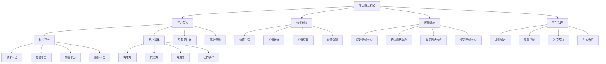

# 平台商业模式

## 🎯 学习目标
掌握平台商业模式理论，学会构建和运营平台生态，实现网络效应和价值创造。

## 📊 平台商业模式框架

### 平台生态模型

## 🏗️ 平台架构

### 核心平台
**技术平台**：
- **基础设施**：提供技术基础设施
- **API接口**：提供API接口服务
- **数据服务**：提供数据服务
- **云服务**：提供云计算服务

**交易平台**：
- **交易撮合**：撮合买卖双方交易
- **支付服务**：提供支付服务
- **物流服务**：提供物流服务
- **信用服务**：提供信用服务

**内容平台**：
- **内容创作**：支持内容创作
- **内容分发**：内容分发服务
- **内容消费**：内容消费服务
- **内容变现**：内容变现服务

**服务平台**：
- **服务匹配**：匹配服务供需
- **服务交付**：服务交付支持
- **服务质量**：服务质量保障
- **服务评价**：服务评价体系

### 用户群体
**需求方**：
- **个人用户**：个人消费者
- **企业用户**：企业客户
- **政府用户**：政府机构
- **非营利组织**：非营利组织

**供给方**：
- **个人提供者**：个人服务提供者
- **企业提供者**：企业服务提供者
- **专业机构**：专业服务机构
- **平台合作伙伴**：平台合作伙伴

**开发者**：
- **应用开发者**：应用开发者
- **服务开发者**：服务开发者
- **内容创作者**：内容创作者
- **技术开发者**：技术开发者

**合作伙伴**：
- **技术合作伙伴**：技术合作伙伴
- **业务合作伙伴**：业务合作伙伴
- **渠道合作伙伴**：渠道合作伙伴
- **投资合作伙伴**：投资合作伙伴

### 服务提供者
**核心服务**：
- **平台服务**：核心平台服务
- **基础服务**：基础服务支持
- **增值服务**：增值服务提供
- **专业服务**：专业服务支持

**第三方服务**：
- **技术服务**：第三方技术服务
- **业务服务**：第三方业务服务
- **金融服务**：第三方金融服务
- **物流服务**：第三方物流服务

**生态服务**：
- **培训服务**：生态培训服务
- **咨询服务**：生态咨询服务
- **支持服务**：生态支持服务
- **创新服务**：生态创新服务

### 基础设施
**技术基础设施**：
- **云计算**：云计算基础设施
- **大数据**：大数据基础设施
- **人工智能**：AI基础设施
- **物联网**：IoT基础设施

**业务基础设施**：
- **支付系统**：支付基础设施
- **物流网络**：物流基础设施
- **信用体系**：信用基础设施
- **监管体系**：监管基础设施

**服务基础设施**：
- **客服系统**：客服基础设施
- **营销系统**：营销基础设施
- **分析系统**：分析基础设施
- **安全系统**：安全基础设施

## 💎 价值创造

### 价值主张
**用户价值**：
- **便利性**：提供便利的服务
- **效率性**：提高效率
- **成本性**：降低成本
- **体验性**：提升体验

**平台价值**：
- **连接价值**：连接供需双方
- **匹配价值**：精准匹配需求
- **规模价值**：规模经济效应
- **创新价值**：推动创新

**生态价值**：
- **协同价值**：生态协同效应
- **网络价值**：网络效应价值
- **数据价值**：数据价值创造
- **创新价值**：生态创新价值

### 价值传递
**价值传递机制**：
- **直接传递**：直接价值传递
- **间接传递**：间接价值传递
- **网络传递**：网络价值传递
- **生态传递**：生态价值传递

**价值传递方式**：
- **服务传递**：通过服务传递价值
- **数据传递**：通过数据传递价值
- **网络传递**：通过网络传递价值
- **生态传递**：通过生态传递价值

**价值传递效率**：
- **传递速度**：价值传递速度
- **传递质量**：价值传递质量
- **传递成本**：价值传递成本
- **传递效果**：价值传递效果

### 价值获取
**收入模式**：
- **交易佣金**：交易佣金收入
- **广告收入**：广告收入
- **订阅收入**：订阅收入
- **服务收入**：服务收入

**价值获取方式**：
- **直接收费**：直接收费模式
- **间接收费**：间接收费模式
- **增值收费**：增值收费模式
- **生态收费**：生态收费模式

**价值获取策略**：
- **定价策略**：定价策略
- **收费策略**：收费策略
- **分成策略**：分成策略
- **激励策略**：激励策略

### 价值分配
**价值分配原则**：
- **公平原则**：公平分配原则
- **效率原则**：效率分配原则
- **激励原则**：激励分配原则
- **可持续原则**：可持续分配原则

**价值分配方式**：
- **直接分配**：直接价值分配
- **间接分配**：间接价值分配
- **网络分配**：网络价值分配
- **生态分配**：生态价值分配

**价值分配机制**：
- **分成机制**：分成分配机制
- **激励机制**：激励分配机制
- **竞争机制**：竞争分配机制
- **合作机制**：合作分配机制

## 🌐 网络效应

### 同边网络效应
**定义**：
- **同边用户**：同一侧用户群体
- **网络价值**：网络价值随用户增加而增加
- **正反馈**：用户增加吸引更多用户
- **规模效应**：规模越大效应越强

**类型**：
- **直接网络效应**：用户间直接互动
- **间接网络效应**：通过平台间接互动
- **数据网络效应**：通过数据共享
- **学习网络效应**：通过学习共享

**影响因素**：
- **用户质量**：用户质量影响
- **用户活跃度**：用户活跃度影响
- **用户多样性**：用户多样性影响
- **用户粘性**：用户粘性影响

### 跨边网络效应
**定义**：
- **跨边用户**：不同侧用户群体
- **相互依赖**：不同侧用户相互依赖
- **价值创造**：跨边互动创造价值
- **生态效应**：构建生态效应

**类型**：
- **需求方效应**：需求方对供给方的影响
- **供给方效应**：供给方对需求方的影响
- **双边效应**：双边相互影响
- **多边效应**：多边相互影响

**影响因素**：
- **匹配效率**：匹配效率影响
- **交易质量**：交易质量影响
- **服务体验**：服务体验影响
- **信任关系**：信任关系影响

### 数据网络效应
**定义**：
- **数据积累**：数据不断积累
- **价值提升**：数据价值不断提升
- **智能服务**：提供智能服务
- **竞争优势**：形成竞争优势

**类型**：
- **用户数据**：用户行为数据
- **交易数据**：交易数据
- **服务数据**：服务数据
- **生态数据**：生态数据

**价值创造**：
- **个性化服务**：个性化服务
- **智能推荐**：智能推荐
- **风险控制**：风险控制
- **决策支持**：决策支持

### 学习网络效应
**定义**：
- **学习积累**：学习不断积累
- **能力提升**：能力不断提升
- **服务改进**：服务不断改进
- **创新驱动**：驱动创新

**类型**：
- **用户学习**：用户学习效应
- **平台学习**：平台学习效应
- **算法学习**：算法学习效应
- **生态学习**：生态学习效应

**价值创造**：
- **服务优化**：服务优化
- **效率提升**：效率提升
- **创新推动**：创新推动
- **竞争优势**：竞争优势

## 🛡️ 平台治理

### 规则制定
**规则类型**：
- **准入规则**：用户准入规则
- **行为规则**：用户行为规则
- **交易规则**：交易规则
- **退出规则**：用户退出规则

**规则制定原则**：
- **公平原则**：公平制定规则
- **透明原则**：透明制定规则
- **效率原则**：效率制定规则
- **可持续原则**：可持续制定规则

**规则制定流程**：
- **需求分析**：分析规则需求
- **规则设计**：设计规则内容
- **规则评估**：评估规则效果
- **规则实施**：实施规则

### 质量控制
**质量控制体系**：
- **准入控制**：准入质量控制
- **过程控制**：过程质量控制
- **结果控制**：结果质量控制
- **持续改进**：持续质量改进

**质量控制方法**：
- **标准制定**：制定质量标准
- **检查评估**：检查评估质量
- **反馈改进**：反馈改进质量
- **认证体系**：建立认证体系

**质量控制工具**：
- **评价系统**：质量评价系统
- **监控系统**：质量监控系统
- **分析系统**：质量分析系统
- **改进系统**：质量改进系统

### 冲突解决
**冲突类型**：
- **用户冲突**：用户间冲突
- **服务冲突**：服务冲突
- **利益冲突**：利益冲突
- **规则冲突**：规则冲突

**冲突解决机制**：
- **协商机制**：协商解决机制
- **仲裁机制**：仲裁解决机制
- **调解机制**：调解解决机制
- **诉讼机制**：诉讼解决机制

**冲突预防**：
- **规则预防**：通过规则预防
- **教育预防**：通过教育预防
- **技术预防**：通过技术预防
- **文化预防**：通过文化预防

### 生态治理
**治理原则**：
- **开放原则**：开放治理原则
- **透明原则**：透明治理原则
- **公平原则**：公平治理原则
- **可持续原则**：可持续治理原则

**治理机制**：
- **参与机制**：参与治理机制
- **决策机制**：决策治理机制
- **监督机制**：监督治理机制
- **评价机制**：评价治理机制

**治理工具**：
- **技术工具**：技术治理工具
- **管理工具**：管理治理工具
- **法律工具**：法律治理工具
- **文化工具**：文化治理工具

## 💡 平台商业模式案例

### 成功案例
**阿里巴巴**：
- **平台类型**：电商平台
- **核心价值**：连接买卖双方
- **网络效应**：双边网络效应
- **成功因素**：规模效应、信任体系

**腾讯**：
- **平台类型**：社交平台
- **核心价值**：连接用户
- **网络效应**：同边网络效应
- **成功因素**：用户粘性、生态构建

**滴滴出行**：
- **平台类型**：出行平台
- **核心价值**：连接司机乘客
- **网络效应**：双边网络效应
- **成功因素**：规模效应、服务体验

### 失败案例
**失败原因**：
- **网络效应不足**：网络效应不足
- **价值创造有限**：价值创造有限
- **竞争激烈**：竞争激烈
- **监管压力**：监管压力

**失败教训**：
- **网络效应**：重视网络效应
- **价值创造**：持续价值创造
- **竞争应对**：有效应对竞争
- **合规经营**：合规经营

## 🧠 学习要点

### 费曼学习法应用
1. **选择概念**：平台商业模式
2. **简化解释**：用简单语言解释平台商业模式
3. **识别盲点**：找出理解不足的地方
4. **重新学习**：针对盲点深入学习

### 刻意练习要点
- **理论掌握**：掌握平台商业模式理论
- **方法应用**：掌握平台构建方法
- **案例分析**：分析成功失败案例
- **实践应用**：实践应用平台商业模式

## 🔗 关联学习

### 前置知识
- [[01-商业模式画布]] - 商业模式画布
- [[01-网络效应]] - 网络效应
- [[01-平台治理]] - 平台治理

### 后续学习
- [[02-订阅商业模式]] - 订阅商业模式
- [[03-共享经济模式]] - 共享经济模式
- [[01-数字化转型]] - 数字化转型

### 实践应用
- 平台商业模式设计
- 平台生态构建
- 网络效应利用
- 平台治理实践

## 🎯 学习检验

### 理解检验
- [ ] 能够理解平台商业模式理论
- [ ] 能够掌握网络效应机制
- [ ] 能够分析平台价值创造
- [ ] 能够制定平台治理策略

### 应用检验
- [ ] 能够设计平台商业模式
- [ ] 能够构建平台生态
- [ ] 能够利用网络效应
- [ ] 能够实施平台治理

---
**下一步**：[[02-订阅商业模式]] - 订阅商业模式

