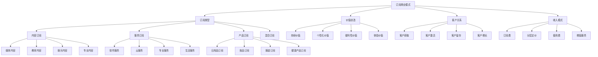

# 订阅商业模式

## 🎯 学习目标
掌握订阅商业模式理论，学会构建可持续的订阅服务，实现客户价值和企业价值的双赢。

## 📊 订阅商业模式框架

### 订阅模式模型

## 📱 订阅类型

### 内容订阅
**媒体内容**：
- **新闻订阅**：新闻媒体订阅
- **视频订阅**：视频平台订阅
- **音乐订阅**：音乐平台订阅
- **播客订阅**：播客平台订阅

**教育内容**：
- **在线课程**：在线教育课程
- **专业培训**：专业培训服务
- **技能学习**：技能学习平台
- **知识付费**：知识付费内容

**娱乐内容**：
- **游戏订阅**：游戏平台订阅
- **电子书**：电子书订阅
- **漫画订阅**：漫画平台订阅
- **体育内容**：体育内容订阅

**专业内容**：
- **研究报告**：研究报告订阅
- **行业资讯**：行业资讯订阅
- **技术文档**：技术文档订阅
- **法律资讯**：法律资讯订阅

### 服务订阅
**软件服务**：
- **SaaS服务**：软件即服务
- **办公软件**：办公软件订阅
- **设计软件**：设计软件订阅
- **开发工具**：开发工具订阅

**云服务**：
- **云计算**：云计算服务
- **存储服务**：云存储服务
- **数据库服务**：数据库服务
- **AI服务**：人工智能服务

**专业服务**：
- **咨询服务**：专业咨询服务
- **法律服务**：法律服务订阅
- **会计服务**：会计服务订阅
- **营销服务**：营销服务订阅

**生活服务**：
- **健身服务**：健身服务订阅
- **美容服务**：美容服务订阅
- **家政服务**：家政服务订阅
- **维修服务**：维修服务订阅

### 产品订阅
**日用品订阅**：
- **清洁用品**：清洁用品订阅
- **个人护理**：个人护理用品
- **办公用品**：办公用品订阅
- **宠物用品**：宠物用品订阅

**食品订阅**：
- **生鲜食品**：生鲜食品订阅
- **有机食品**：有机食品订阅
- **特色食品**：特色食品订阅
- **健康食品**：健康食品订阅

**服装订阅**：
- **服装租赁**：服装租赁订阅
- **时尚订阅**：时尚订阅盒
- **定制服装**：定制服装订阅
- **运动服装**：运动服装订阅

**健康产品订阅**：
- **保健品**：保健品订阅
- **医疗器械**：医疗器械订阅
- **营养品**：营养品订阅
- **健身器材**：健身器材订阅

### 混合订阅
**内容+服务**：
- **教育平台**：内容+服务
- **医疗平台**：内容+服务
- **金融平台**：内容+服务
- **企业服务**：内容+服务

**产品+服务**：
- **智能硬件**：产品+服务
- **汽车服务**：产品+服务
- **家电服务**：产品+服务
- **家居服务**：产品+服务

**多业务订阅**：
- **生态系统**：多业务订阅
- **平台服务**：平台订阅服务
- **综合服务**：综合订阅服务
- **定制服务**：定制订阅服务

## 💎 价值创造

### 持续价值
**价值持续性**：
- **长期价值**：提供长期价值
- **稳定价值**：提供稳定价值
- **可预测价值**：可预测的价值
- **持续改进**：持续价值改进

**价值交付**：
- **定期交付**：定期价值交付
- **即时交付**：即时价值交付
- **按需交付**：按需价值交付
- **自动交付**：自动价值交付

**价值保障**：
- **质量保障**：价值质量保障
- **服务保障**：服务保障
- **体验保障**：体验保障
- **满意度保障**：满意度保障

### 个性化价值
**个性化服务**：
- **定制服务**：定制化服务
- **个性化推荐**：个性化推荐
- **个人偏好**：个人偏好服务
- **专属服务**：专属服务

**个性化内容**：
- **内容定制**：内容定制
- **个性化内容**：个性化内容
- **智能推荐**：智能推荐
- **学习算法**：学习算法

**个性化体验**：
- **体验定制**：体验定制
- **界面定制**：界面定制
- **功能定制**：功能定制
- **服务定制**：服务定制

### 便利性价值
**使用便利**：
- **简单易用**：简单易用
- **随时随地**：随时随地使用
- **一键操作**：一键操作
- **自动化**：自动化服务

**获取便利**：
- **即时获取**：即时获取
- **无限制**：无限制使用
- **多设备**：多设备同步
- **离线使用**：离线使用

**管理便利**：
- **自动管理**：自动管理
- **智能提醒**：智能提醒
- **统一管理**：统一管理
- **便捷管理**：便捷管理

### 体验价值
**用户体验**：
- **流畅体验**：流畅用户体验
- **沉浸体验**：沉浸式体验
- **互动体验**：互动体验
- **社交体验**：社交体验

**服务体验**：
- **专业服务**：专业服务体验
- **贴心服务**：贴心服务体验
- **快速响应**：快速响应体验
- **问题解决**：问题解决体验

**情感体验**：
- **情感连接**：情感连接
- **归属感**：归属感
- **成就感**：成就感
- **满足感**：满足感

## 👥 客户关系

### 客户获取
**获客渠道**：
- **数字营销**：数字营销获客
- **内容营销**：内容营销获客
- **社交营销**：社交营销获客
- **口碑营销**：口碑营销获客

**获客策略**：
- **免费试用**：免费试用策略
- **优惠促销**：优惠促销策略
- **推荐奖励**：推荐奖励策略
- **合作伙伴**：合作伙伴策略

**获客成本**：
- **CAC计算**：客户获取成本
- **成本优化**：成本优化
- **ROI分析**：投资回报分析
- **渠道效果**：渠道效果分析

### 客户激活
**激活策略**：
- **引导流程**：用户引导流程
- **功能体验**：功能体验激活
- **价值感知**：价值感知激活
- **使用习惯**：使用习惯培养

**激活指标**：
- **激活率**：用户激活率
- **使用频率**：使用频率
- **功能使用**：功能使用率
- **价值实现**：价值实现率

**激活优化**：
- **流程优化**：激活流程优化
- **体验优化**：激活体验优化
- **内容优化**：激活内容优化
- **工具优化**：激活工具优化

### 客户留存
**留存策略**：
- **价值持续**：持续价值提供
- **关系维护**：客户关系维护
- **体验优化**：体验持续优化
- **个性化服务**：个性化服务

**留存指标**：
- **留存率**：客户留存率
- **流失率**：客户流失率
- **生命周期**：客户生命周期
- **价值贡献**：客户价值贡献

**留存优化**：
- **流失预警**：流失预警机制
- **挽回策略**：客户挽回策略
- **忠诚度**：客户忠诚度建设
- **满意度**：客户满意度提升

### 客户增长
**增长策略**：
- **使用升级**：使用升级策略
- **功能扩展**：功能扩展策略
- **服务升级**：服务升级策略
- **价值提升**：价值提升策略

**增长指标**：
- **使用深度**：使用深度增长
- **使用广度**：使用广度增长
- **价值增长**：客户价值增长
- **推荐增长**：推荐增长

**增长优化**：
- **增长路径**：增长路径设计
- **激励机制**：增长激励机制
- **价值传递**：价值传递优化
- **体验提升**：体验提升优化

## 💰 收入模式

### 订阅费
**订阅费类型**：
- **月费**：月度订阅费
- **年费**：年度订阅费
- **季费**：季度订阅费
- **终身费**：终身订阅费

**定价策略**：
- **成本定价**：基于成本定价
- **价值定价**：基于价值定价
- **竞争定价**：基于竞争定价
- **心理定价**：基于心理定价

**定价优化**：
- **价格测试**：价格测试
- **弹性分析**：价格弹性分析
- **价值分析**：价值分析
- **市场反馈**：市场反馈分析

### 分层定价
**分层策略**：
- **基础版**：基础版定价
- **专业版**：专业版定价
- **企业版**：企业版定价
- **定制版**：定制版定价

**分层设计**：
- **功能分层**：功能分层设计
- **服务分层**：服务分层设计
- **用户分层**：用户分层设计
- **价值分层**：价值分层设计

**分层优化**：
- **分层测试**：分层测试
- **转换分析**：转换分析
- **价值分析**：价值分析
- **优化调整**：优化调整

### 使用费
**使用费类型**：
- **按使用量**：按使用量收费
- **按时间**：按时间收费
- **按功能**：按功能收费
- **按效果**：按效果收费

**使用费设计**：
- **计费单位**：计费单位设计
- **计费周期**：计费周期设计
- **计费方式**：计费方式设计
- **计费规则**：计费规则设计

**使用费优化**：
- **使用分析**：使用分析
- **成本分析**：成本分析
- **价值分析**：价值分析
- **定价优化**：定价优化

### 增值服务
**增值服务类型**：
- **高级功能**：高级功能服务
- **专业服务**：专业服务
- **定制服务**：定制服务
- **培训服务**：培训服务

**增值服务设计**：
- **服务内容**：服务内容设计
- **服务方式**：服务方式设计
- **服务标准**：服务标准设计
- **服务流程**：服务流程设计

**增值服务优化**：
- **需求分析**：需求分析
- **价值分析**：价值分析
- **成本分析**：成本分析
- **效果分析**：效果分析

## 📈 订阅商业模式案例

### 成功案例
**Netflix**：
- **模式类型**：内容订阅
- **核心价值**：无限观看优质内容
- **成功因素**：内容质量、用户体验
- **收入模式**：月费订阅

**Spotify**：
- **模式类型**：音乐订阅
- **核心价值**：无限音乐播放
- **成功因素**：音乐库、个性化推荐
- **收入模式**：免费+付费订阅

**Adobe**：
- **模式类型**：软件订阅
- **核心价值**：专业软件服务
- **成功因素**：专业功能、云端同步
- **收入模式**：Creative Cloud订阅

**Amazon Prime**：
- **模式类型**：综合订阅
- **核心价值**：多服务综合价值
- **成功因素**：服务整合、价值叠加
- **收入模式**：年费订阅

### 失败案例
**失败原因**：
- **价值不足**：订阅价值不足
- **竞争激烈**：竞争激烈
- **成本过高**：运营成本过高
- **用户流失**：用户流失严重

**失败教训**：
- **价值创造**：持续价值创造
- **成本控制**：控制运营成本
- **竞争应对**：有效应对竞争
- **用户留存**：重视用户留存

## 🧠 学习要点

### 费曼学习法应用
1. **选择概念**：订阅商业模式
2. **简化解释**：用简单语言解释订阅商业模式
3. **识别盲点**：找出理解不足的地方
4. **重新学习**：针对盲点深入学习

### 刻意练习要点
- **理论掌握**：掌握订阅商业模式理论
- **方法应用**：掌握订阅模式设计方法
- **案例分析**：分析成功失败案例
- **实践应用**：实践应用订阅商业模式

## 🔗 关联学习

### 前置知识
- [[02-平台商业模式]] - 平台商业模式
- [[01-商业模式画布]] - 商业模式画布
- [[01-客户关系管理]] - 客户关系管理

### 后续学习
- [[03-共享经济模式]] - 共享经济模式
- [[01-数字化转型]] - 数字化转型
- [[01-客户生命周期价值]] - 客户生命周期价值

### 实践应用
- 订阅商业模式设计
- 订阅服务构建
- 客户关系管理
- 收入模式优化

## 🎯 学习检验

### 理解检验
- [ ] 能够理解订阅商业模式理论
- [ ] 能够掌握订阅类型和特点
- [ ] 能够分析价值创造机制
- [ ] 能够设计收入模式

### 应用检验
- [ ] 能够设计订阅商业模式
- [ ] 能够构建订阅服务
- [ ] 能够管理客户关系
- [ ] 能够优化收入模式

---
**下一步**：[[03-共享经济模式]] - 共享经济模式

