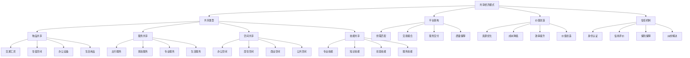

# 共享经济模式

## 🎯 学习目标
掌握共享经济模式理论，学会构建共享平台，实现资源优化配置和价值创造。

## 📊 共享经济模式框架

### 共享经济模型

## 🔄 共享类型

### 物品共享
**交通工具**：
- **汽车共享**：汽车租赁共享
- **自行车共享**：共享单车
- **电动车共享**：共享电动车
- **滑板车共享**：共享滑板车

**住宿空间**：
- **房屋共享**：房屋租赁共享
- **房间共享**：房间租赁共享
- **床位共享**：床位租赁共享
- **办公空间**：办公空间共享

**办公设备**：
- **设备租赁**：办公设备租赁
- **会议室**：会议室共享
- **打印服务**：打印服务共享
- **IT设备**：IT设备共享

**生活用品**：
- **服装共享**：服装租赁共享
- **工具共享**：工具租赁共享
- **电器共享**：电器租赁共享
- **图书共享**：图书租赁共享

### 服务共享
**出行服务**：
- **网约车**：网约车服务
- **顺风车**：顺风车服务
- **代驾服务**：代驾服务
- **货运服务**：货运服务

**家政服务**：
- **清洁服务**：清洁服务
- **维修服务**：维修服务
- **搬家服务**：搬家服务
- **宠物服务**：宠物服务

**专业服务**：
- **咨询服务**：专业咨询服务
- **设计服务**：设计服务
- **翻译服务**：翻译服务
- **法律服务**：法律服务

**生活服务**：
- **配送服务**：配送服务
- **跑腿服务**：跑腿服务
- **陪护服务**：陪护服务
- **教育服务**：教育服务

### 空间共享
**办公空间**：
- **联合办公**：联合办公空间
- **会议室**：会议室共享
- **活动场地**：活动场地共享
- **培训教室**：培训教室共享

**居住空间**：
- **短租公寓**：短租公寓
- **民宿**：民宿共享
- **青年旅社**：青年旅社
- **家庭旅馆**：家庭旅馆

**商业空间**：
- **商铺共享**：商铺共享
- **仓库共享**：仓库共享
- **停车场**：停车场共享
- **广告位**：广告位共享

**公共空间**：
- **公园**：公园共享
- **图书馆**：图书馆共享
- **体育馆**：体育馆共享
- **文化场所**：文化场所共享

### 技能共享
**专业技能**：
- **技术技能**：技术技能共享
- **设计技能**：设计技能共享
- **营销技能**：营销技能共享
- **管理技能**：管理技能共享

**知识技能**：
- **教学技能**：教学技能共享
- **咨询技能**：咨询技能共享
- **写作技能**：写作技能共享
- **翻译技能**：翻译技能共享

**创意技能**：
- **艺术创作**：艺术创作技能
- **内容创作**：内容创作技能
- **产品设计**：产品设计技能
- **品牌设计**：品牌设计技能

**服务技能**：
- **生活服务**：生活服务技能
- **健康服务**：健康服务技能
- **娱乐服务**：娱乐服务技能
- **社交服务**：社交服务技能

## 🏗️ 平台架构

### 供需匹配
**需求识别**：
- **需求分析**：需求分析
- **需求分类**：需求分类
- **需求预测**：需求预测
- **需求优化**：需求优化

**供给管理**：
- **供给分析**：供给分析
- **供给分类**：供给分类
- **供给优化**：供给优化
- **供给激励**：供给激励

**匹配算法**：
- **智能匹配**：智能匹配算法
- **推荐系统**：推荐系统
- **优化算法**：优化算法
- **学习算法**：学习算法

**匹配效率**：
- **匹配速度**：匹配速度
- **匹配准确度**：匹配准确度
- **匹配满意度**：匹配满意度
- **匹配成本**：匹配成本

### 交易撮合
**交易流程**：
- **交易发起**：交易发起
- **交易确认**：交易确认
- **交易执行**：交易执行
- **交易完成**：交易完成

**支付系统**：
- **支付方式**：支付方式
- **支付安全**：支付安全
- **支付便捷**：支付便捷
- **支付成本**：支付成本

**定价机制**：
- **动态定价**：动态定价
- **市场定价**：市场定价
- **协商定价**：协商定价
- **固定定价**：固定定价

**交易保障**：
- **交易安全**：交易安全
- **交易透明**：交易透明
- **交易公平**：交易公平
- **交易效率**：交易效率

### 服务交付
**交付方式**：
- **线上交付**：线上服务交付
- **线下交付**：线下服务交付
- **混合交付**：混合交付方式
- **自动交付**：自动交付

**交付标准**：
- **质量标准**：服务质量标准
- **时间标准**：交付时间标准
- **流程标准**：交付流程标准
- **体验标准**：交付体验标准

**交付监控**：
- **实时监控**：实时交付监控
- **质量监控**：质量监控
- **进度监控**：进度监控
- **效果监控**：效果监控

**交付优化**：
- **流程优化**：交付流程优化
- **效率优化**：交付效率优化
- **质量优化**：交付质量优化
- **体验优化**：交付体验优化

### 质量保障
**质量标准**：
- **服务标准**：服务质量标准
- **产品标准**：产品质量标准
- **安全标准**：安全标准
- **环保标准**：环保标准

**质量监控**：
- **过程监控**：过程质量监控
- **结果监控**：结果质量监控
- **用户反馈**：用户反馈监控
- **第三方监控**：第三方监控

**质量改进**：
- **问题识别**：质量问题识别
- **原因分析**：原因分析
- **改进措施**：改进措施
- **效果评估**：效果评估

**质量认证**：
- **认证体系**：质量认证体系
- **认证标准**：认证标准
- **认证流程**：认证流程
- **认证维护**：认证维护

## 💎 价值创造

### 资源优化
**资源配置**：
- **资源整合**：资源整合
- **资源分配**：资源分配
- **资源利用**：资源利用
- **资源回收**：资源回收

**资源效率**：
- **使用效率**：使用效率提升
- **配置效率**：配置效率提升
- **管理效率**：管理效率提升
- **运营效率**：运营效率提升

**资源节约**：
- **成本节约**：成本节约
- **时间节约**：时间节约
- **空间节约**：空间节约
- **能源节约**：能源节约

**资源创新**：
- **资源创新**：资源创新利用
- **模式创新**：模式创新
- **技术创新**：技术创新
- **服务创新**：服务创新

### 成本降低
**交易成本**：
- **信息成本**：信息成本降低
- **搜索成本**：搜索成本降低
- **谈判成本**：谈判成本降低
- **执行成本**：执行成本降低

**运营成本**：
- **管理成本**：管理成本降低
- **维护成本**：维护成本降低
- **营销成本**：营销成本降低
- **服务成本**：服务成本降低

**机会成本**：
- **闲置成本**：闲置成本降低
- **等待成本**：等待成本降低
- **选择成本**：选择成本降低
- **转换成本**：转换成本降低

**社会成本**：
- **环境成本**：环境成本降低
- **交通成本**：交通成本降低
- **资源成本**：资源成本降低
- **社会成本**：社会成本降低

### 效率提升
**匹配效率**：
- **匹配速度**：匹配速度提升
- **匹配准确度**：匹配准确度提升
- **匹配成功率**：匹配成功率提升
- **匹配满意度**：匹配满意度提升

**交易效率**：
- **交易速度**：交易速度提升
- **交易便利性**：交易便利性提升
- **交易安全性**：交易安全性提升
- **交易透明度**：交易透明度提升

**服务效率**：
- **服务速度**：服务速度提升
- **服务质量**：服务质量提升
- **服务便利性**：服务便利性提升
- **服务满意度**：服务满意度提升

**管理效率**：
- **管理效率**：管理效率提升
- **决策效率**：决策效率提升
- **执行效率**：执行效率提升
- **监控效率**：监控效率提升

### 价值创造
**用户价值**：
- **便利性**：便利性价值
- **经济性**：经济性价值
- **多样性**：多样性价值
- **个性化**：个性化价值

**供给方价值**：
- **收入增加**：收入增加价值
- **资源利用**：资源利用价值
- **技能发挥**：技能发挥价值
- **社会价值**：社会价值

**平台价值**：
- **连接价值**：连接价值
- **匹配价值**：匹配价值
- **服务价值**：服务价值
- **数据价值**：数据价值

**社会价值**：
- **资源节约**：资源节约价值
- **环境保护**：环境保护价值
- **就业创造**：就业创造价值
- **社会和谐**：社会和谐价值

## 🛡️ 信任机制

### 身份认证
**认证方式**：
- **实名认证**：实名认证
- **身份验证**：身份验证
- **资质认证**：资质认证
- **信用认证**：信用认证

**认证标准**：
- **认证标准**：认证标准
- **认证流程**：认证流程
- **认证要求**：认证要求
- **认证维护**：认证维护

**认证技术**：
- **生物识别**：生物识别技术
- **数字证书**：数字证书技术
- **区块链**：区块链技术
- **人工智能**：人工智能技术

**认证管理**：
- **认证管理**：认证管理
- **认证更新**：认证更新
- **认证撤销**：认证撤销
- **认证监控**：认证监控

### 信用评价
**评价体系**：
- **评价指标**：评价指标体系
- **评价方法**：评价方法
- **评价标准**：评价标准
- **评价周期**：评价周期

**评价内容**：
- **服务质量**：服务质量评价
- **交易行为**：交易行为评价
- **用户反馈**：用户反馈评价
- **平台表现**：平台表现评价

**评价机制**：
- **双向评价**：双向评价机制
- **多维度评价**：多维度评价机制
- **动态评价**：动态评价机制
- **综合评价**：综合评价机制

**评价应用**：
- **信用等级**：信用等级应用
- **服务推荐**：服务推荐应用
- **风险控制**：风险控制应用
- **激励机制**：激励机制应用

### 保险保障
**保险类型**：
- **责任保险**：责任保险
- **财产保险**：财产保险
- **人身保险**：人身保险
- **信用保险**：信用保险

**保险范围**：
- **服务保障**：服务保障范围
- **财产保障**：财产保障范围
- **人身保障**：人身保障范围
- **责任保障**：责任保障范围

**保险机制**：
- **保险机制**：保险机制
- **理赔机制**：理赔机制
- **风险分担**：风险分担机制
- **保障机制**：保障机制

**保险管理**：
- **保险管理**：保险管理
- **风险评估**：风险评估
- **理赔管理**：理赔管理
- **风险控制**：风险控制

### 纠纷解决
**纠纷类型**：
- **服务纠纷**：服务纠纷
- **质量纠纷**：质量纠纷
- **支付纠纷**：支付纠纷
- **责任纠纷**：责任纠纷

**解决机制**：
- **协商解决**：协商解决机制
- **调解解决**：调解解决机制
- **仲裁解决**：仲裁解决机制
- **诉讼解决**：诉讼解决机制

**解决流程**：
- **纠纷受理**：纠纷受理流程
- **调查核实**：调查核实流程
- **解决方案**：解决方案制定
- **执行监督**：执行监督流程

**解决保障**：
- **解决保障**：解决保障
- **执行保障**：执行保障
- **监督保障**：监督保障
- **救济保障**：救济保障

## 💡 共享经济模式案例

### 成功案例
**Uber**：
- **模式类型**：出行共享
- **核心价值**：连接司机乘客
- **成功因素**：便利性、价格优势
- **收入模式**：交易佣金

**Airbnb**：
- **模式类型**：住宿共享
- **核心价值**：连接房东房客
- **成功因素**：个性化、价格优势
- **收入模式**：交易佣金

**滴滴出行**：
- **模式类型**：出行共享
- **核心价值**：连接司机乘客
- **成功因素**：本土化、服务体验
- **收入模式**：交易佣金

**WeWork**：
- **模式类型**：办公空间共享
- **核心价值**：提供灵活办公空间
- **成功因素**：社区氛围、服务配套
- **收入模式**：租金收入

### 失败案例
**失败原因**：
- **信任问题**：信任机制不完善
- **监管压力**：监管政策压力
- **竞争激烈**：竞争激烈
- **盈利困难**：盈利模式困难

**失败教训**：
- **信任建设**：重视信任机制建设
- **合规经营**：合规经营
- **竞争应对**：有效应对竞争
- **盈利模式**：建立可持续盈利模式

## 🧠 学习要点

### 费曼学习法应用
1. **选择概念**：共享经济模式
2. **简化解释**：用简单语言解释共享经济模式
3. **识别盲点**：找出理解不足的地方
4. **重新学习**：针对盲点深入学习

### 刻意练习要点
- **理论掌握**：掌握共享经济模式理论
- **方法应用**：掌握共享平台构建方法
- **案例分析**：分析成功失败案例
- **实践应用**：实践应用共享经济模式

## 🔗 关联学习

### 前置知识
- [[03-订阅商业模式]] - 订阅商业模式
- [[02-平台商业模式]] - 平台商业模式
- [[01-商业模式画布]] - 商业模式画布

### 后续学习
- [[01-数字化转型]] - 数字化转型
- [[01-网络效应]] - 网络效应
- [[01-信任机制设计]] - 信任机制设计

### 实践应用
- 共享经济模式设计
- 共享平台构建
- 信任机制建设
- 价值创造实践

## 🎯 学习检验

### 理解检验
- [ ] 能够理解共享经济模式理论
- [ ] 能够掌握共享类型和特点
- [ ] 能够分析价值创造机制
- [ ] 能够设计信任机制

### 应用检验
- [ ] 能够设计共享经济模式
- [ ] 能够构建共享平台
- [ ] 能够建立信任机制
- [ ] 能够实现价值创造

---
**下一步**：[[01-数字化转型]] - 数字化转型

