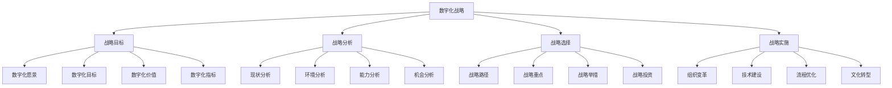

# 数字化战略

## 🎯 学习目标
理解数字化战略的重要性，掌握数字化战略制定和实施方法，提升企业数字化能力。

## 📊 数字化战略框架

### 战略要素

## 🎯 数字化战略目标

### 数字化愿景
**愿景描述**：
- **未来状态**：企业数字化未来状态
- **价值创造**：数字化价值创造
- **竞争优势**：数字化竞争优势
- **行业地位**：数字化行业地位

**愿景特点**：
- **前瞻性**：具有前瞻性思维
- **激励性**：具有激励作用
- **可实现性**：具有可实现性
- **独特性**：具有独特性

**愿景制定**：
- **愿景调研**：进行愿景调研
- **愿景设计**：设计数字化愿景
- **愿景沟通**：沟通数字化愿景
- **愿景共识**：达成愿景共识

### 数字化目标
**战略目标**：
- **市场目标**：数字化市场目标
- **客户目标**：数字化客户目标
- **运营目标**：数字化运营目标
- **创新目标**：数字化创新目标

**业务目标**：
- **效率目标**：数字化效率目标
- **质量目标**：数字化质量目标
- **成本目标**：数字化成本目标
- **服务目标**：数字化服务目标

**技术目标**：
- **技术目标**：数字化技术目标
- **平台目标**：数字化平台目标
- **数据目标**：数字化数据目标
- **安全目标**：数字化安全目标

**组织目标**：
- **能力目标**：数字化能力目标
- **文化目标**：数字化文化目标
- **人才目标**：数字化人才目标
- **管理目标**：数字化管理目标

### 数字化价值
**客户价值**：
- **体验价值**：客户体验价值
- **服务价值**：客户服务价值
- **便利价值**：客户便利价值
- **个性化价值**：客户个性化价值

**企业价值**：
- **效率价值**：企业效率价值
- **成本价值**：企业成本价值
- **创新价值**：企业创新价值
- **竞争价值**：企业竞争价值

**社会价值**：
- **环保价值**：社会环保价值
- **就业价值**：社会就业价值
- **教育价值**：社会教育价值
- **公益价值**：社会公益价值

**生态价值**：
- **生态价值**：生态系统价值
- **合作价值**：合作伙伴价值
- **创新价值**：生态创新价值
- **可持续发展价值**：可持续发展价值

### 数字化指标
**财务指标**：
- **收入指标**：数字化收入指标
- **成本指标**：数字化成本指标
- **利润指标**：数字化利润指标
- **投资回报**：数字化投资回报

**运营指标**：
- **效率指标**：数字化效率指标
- **质量指标**：数字化质量指标
- **服务指标**：数字化服务指标
- **创新指标**：数字化创新指标

**客户指标**：
- **满意度指标**：客户满意度指标
- **忠诚度指标**：客户忠诚度指标
- **获取指标**：客户获取指标
- **留存指标**：客户留存指标

**技术指标**：
- **技术指标**：数字化技术指标
- **数据指标**：数字化数据指标
- **安全指标**：数字化安全指标
- **平台指标**：数字化平台指标

## 🔍 数字化战略分析

### 现状分析
**数字化成熟度**：
- **数字化水平**：企业数字化水平
- **数字化能力**：企业数字化能力
- **数字化应用**：企业数字化应用
- **数字化效果**：企业数字化效果

**数字化差距**：
- **技术差距**：数字化技术差距
- **能力差距**：数字化能力差距
- **应用差距**：数字化应用差距
- **效果差距**：数字化效果差距

**数字化问题**：
- **技术问题**：数字化技术问题
- **管理问题**：数字化管理问题
- **人员问题**：数字化人员问题
- **文化问题**：数字化文化问题

**数字化机会**：
- **技术机会**：数字化技术机会
- **市场机会**：数字化市场机会
- **业务机会**：数字化业务机会
- **创新机会**：数字化创新机会

### 环境分析
**技术环境**：
- **技术趋势**：数字化技术趋势
- **技术成熟度**：数字化技术成熟度
- **技术成本**：数字化技术成本
- **技术风险**：数字化技术风险

**市场环境**：
- **市场需求**：数字化市场需求
- **竞争态势**：数字化竞争态势
- **客户行为**：数字化客户行为
- **市场机会**：数字化市场机会

**政策环境**：
- **政策支持**：数字化政策支持
- **政策限制**：数字化政策限制
- **政策变化**：数字化政策变化
- **政策影响**：数字化政策影响

**社会环境**：
- **社会接受度**：数字化社会接受度
- **社会影响**：数字化社会影响
- **社会需求**：数字化社会需求
- **社会价值**：数字化社会价值

### 能力分析
**技术能力**：
- **技术基础**：数字化技术基础
- **技术人才**：数字化技术人才
- **技术管理**：数字化技术管理
- **技术创新**：数字化技术创新

**管理能力**：
- **战略管理**：数字化战略管理
- **项目管理**：数字化项目管理
- **变革管理**：数字化变革管理
- **风险管理**：数字化风险管理

**业务能力**：
- **业务理解**：数字化业务理解
- **业务创新**：数字化业务创新
- **业务整合**：数字化业务整合
- **业务优化**：数字化业务优化

**组织能力**：
- **组织变革**：数字化组织变革
- **文化建设**：数字化文化建设
- **人才培养**：数字化人才培养
- **能力建设**：数字化能力建设

### 机会分析
**技术机会**：
- **新技术应用**：新技术应用机会
- **技术升级**：技术升级机会
- **技术集成**：技术集成机会
- **技术创新**：技术创新机会

**市场机会**：
- **新市场开拓**：新市场开拓机会
- **市场细分**：市场细分机会
- **客户需求**：客户需求机会
- **竞争优势**：竞争优势机会

**业务机会**：
- **业务创新**：业务创新机会
- **业务优化**：业务优化机会
- **业务扩展**：业务扩展机会
- **业务转型**：业务转型机会

**合作机会**：
- **技术合作**：技术合作机会
- **业务合作**：业务合作机会
- **生态合作**：生态合作机会
- **创新合作**：创新合作机会

## 🛤️ 数字化战略选择

### 战略路径
**渐进式路径**：
- **路径特点**：逐步推进数字化
- **适用条件**：传统企业、资源有限
- **优势**：风险较低、易于管理
- **劣势**：速度较慢、可能落后

**激进式路径**：
- **路径特点**：快速推进数字化
- **适用条件**：新兴企业、资源充足
- **优势**：速度较快、竞争优势
- **劣势**：风险较高、管理复杂

**混合式路径**：
- **路径特点**：结合渐进和激进
- **适用条件**：大型企业、资源充足
- **优势**：平衡风险和速度
- **劣势**：管理复杂、协调困难

**创新式路径**：
- **路径特点**：创新数字化模式
- **适用条件**：创新企业、技术领先
- **优势**：差异化优势、领先地位
- **劣势**：风险最高、不确定性大

### 战略重点
**技术重点**：
- **核心技术**：数字化核心技术
- **平台技术**：数字化平台技术
- **数据技术**：数字化数据技术
- **安全技术**：数字化安全技术

**业务重点**：
- **核心业务**：数字化核心业务
- **关键流程**：数字化关键流程
- **客户体验**：数字化客户体验
- **运营效率**：数字化运营效率

**组织重点**：
- **组织变革**：数字化组织变革
- **文化建设**：数字化文化建设
- **人才培养**：数字化人才培养
- **能力建设**：数字化能力建设

**生态重点**：
- **生态建设**：数字化生态建设
- **合作网络**：数字化合作网络
- **价值创造**：数字化价值创造
- **可持续发展**：数字化可持续发展

### 战略举措
**技术举措**：
- **技术建设**：数字化技术建设
- **平台建设**：数字化平台建设
- **数据建设**：数字化数据建设
- **安全建设**：数字化安全建设

**业务举措**：
- **业务数字化**：业务数字化改造
- **流程优化**：业务流程优化
- **客户体验**：客户体验提升
- **运营优化**：运营效率优化

**组织举措**：
- **组织变革**：组织变革管理
- **文化建设**：数字化文化建设
- **人才培养**：数字化人才培养
- **能力建设**：数字化能力建设

**管理举措**：
- **战略管理**：数字化战略管理
- **项目管理**：数字化项目管理
- **变革管理**：数字化变革管理
- **风险管理**：数字化风险管理

### 战略投资
**投资重点**：
- **技术投资**：数字化技术投资
- **人才投资**：数字化人才投资
- **平台投资**：数字化平台投资
- **数据投资**：数字化数据投资

**投资策略**：
- **投资规模**：数字化投资规模
- **投资节奏**：数字化投资节奏
- **投资重点**：数字化投资重点
- **投资回报**：数字化投资回报

**投资管理**：
- **投资规划**：数字化投资规划
- **投资控制**：数字化投资控制
- **投资评估**：数字化投资评估
- **投资优化**：数字化投资优化

## 🚀 数字化战略实施

### 组织变革
**组织架构**：
- **数字化部门**：建立数字化部门
- **跨部门协作**：建立跨部门协作
- **决策机制**：建立数字化决策机制
- **沟通机制**：建立数字化沟通机制

**组织文化**：
- **数字化文化**：建设数字化文化
- **创新文化**：建设创新文化
- **学习文化**：建设学习文化
- **协作文化**：建设协作文化

**组织能力**：
- **数字化能力**：提升数字化能力
- **创新能力**：提升创新能力
- **学习能力**：提升学习能力
- **协作能力**：提升协作能力

### 技术建设
**技术架构**：
- **技术架构**：设计数字化技术架构
- **技术标准**：制定数字化技术标准
- **技术规范**：制定数字化技术规范
- **技术管理**：建立数字化技术管理

**技术平台**：
- **技术平台**：建设数字化技术平台
- **数据平台**：建设数字化数据平台
- **应用平台**：建设数字化应用平台
- **安全平台**：建设数字化安全平台

**技术能力**：
- **技术能力**：提升数字化技术能力
- **开发能力**：提升数字化开发能力
- **运维能力**：提升数字化运维能力
- **创新能力**：提升数字化创新能力

### 流程优化
**业务流程**：
- **流程梳理**：梳理业务流程
- **流程优化**：优化业务流程
- **流程数字化**：业务流程数字化
- **流程创新**：业务流程创新

**管理流程**：
- **管理流程**：优化管理流程
- **决策流程**：优化决策流程
- **审批流程**：优化审批流程
- **监控流程**：优化监控流程

**服务流程**：
- **服务流程**：优化服务流程
- **客户流程**：优化客户流程
- **支持流程**：优化支持流程
- **创新流程**：优化创新流程

### 文化转型
**文化变革**：
- **文化变革**：推进数字化文化变革
- **价值观**：建立数字化价值观
- **行为规范**：建立数字化行为规范
- **激励机制**：建立数字化激励机制

**文化传播**：
- **文化传播**：传播数字化文化
- **文化培训**：进行数字化文化培训
- **文化实践**：实践数字化文化
- **文化评估**：评估数字化文化

**文化持续**：
- **文化持续**：持续数字化文化
- **文化创新**：创新数字化文化
- **文化优化**：优化数字化文化
- **文化发展**：发展数字化文化

## 💡 实践应用

### 数字化战略制定流程
1. **现状分析**：分析数字化现状
2. **环境分析**：分析数字化环境
3. **能力分析**：分析数字化能力
4. **机会分析**：分析数字化机会
5. **目标设定**：设定数字化目标
6. **路径选择**：选择数字化路径
7. **举措制定**：制定数字化举措
8. **投资规划**：规划数字化投资
9. **实施计划**：制定实施计划

### 案例分析
**选择案例**：如某传统制造业数字化转型
**分析维度**：
- 战略目标：数字化愿景、目标、价值、指标
- 战略分析：现状、环境、能力、机会分析
- 战略选择：路径、重点、举措、投资
- 战略实施：组织变革、技术建设、流程优化、文化转型

## 🧠 学习要点

### 费曼学习法应用
1. **选择概念**：数字化战略
2. **简化解释**：用简单语言解释数字化战略
3. **识别盲点**：找出理解不足的地方
4. **重新学习**：针对盲点深入学习

### 刻意练习要点
- **战略思维**：培养数字化战略思维
- **分析方法**：掌握数字化分析方法
- **规划能力**：提升数字化规划能力
- **实施能力**：提升数字化实施能力

## 🔗 关联学习

### 前置知识
- [[01-战略管理概论]] - 战略管理
- [[01-商业环境分析]] - 环境分析
- [[01-商业模式画布]] - 商业模式

### 后续学习
- [[02-数据驱动决策]] - 数据决策
- [[03-人工智能应用]] - AI应用
- [[04-数字化营销]] - 数字营销

### 实践应用
- 企业数字化战略制定
- 数字化战略实施
- 数字化能力建设
- 数字化文化转型

## 🎯 学习检验

### 理解检验
- [ ] 能够解释数字化战略概念
- [ ] 能够进行数字化战略分析
- [ ] 能够制定数字化战略
- [ ] 能够实施数字化战略

### 应用检验
- [ ] 能够分析企业数字化现状
- [ ] 能够制定企业数字化战略
- [ ] 能够实施企业数字化战略
- [ ] 能够评估数字化战略效果

---
**下一步**：[[02-数据驱动决策]] - 数据决策