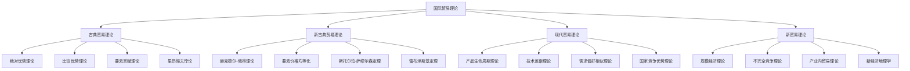

# 国际贸易理论

## 🎯 学习目标
掌握国际贸易理论和方法，学会分析国际贸易环境，制定国际化战略，提升企业国际竞争力。

## 📊 国际贸易理论框架

### 理论体系

## 📚 古典贸易理论

### 绝对优势理论
**理论内容**：
- **基本假设**：劳动是唯一生产要素
- **核心观点**：各国应专业化生产具有绝对优势的产品
- **贸易基础**：绝对成本差异
- **贸易收益**：提高整体效率

**理论贡献**：
- 首次系统阐述国际贸易原理
- 为比较优势理论奠定基础
- 解释贸易互利性
- 推动自由贸易发展

**理论局限**：
- 假设条件过于严格
- 无法解释双向贸易
- 忽略其他生产要素
- 现实适用性有限

### 比较优势理论
**理论内容**：
- **基本假设**：两国两商品模型
- **核心观点**：各国应专业化生产比较优势产品
- **贸易基础**：相对成本差异
- **贸易收益**：实现帕累托改进

**理论优势**：
- 解释力更强
- 适用性更广
- 逻辑更严密
- 影响更深远

**理论发展**：
- 多国多商品模型
- 考虑运输成本
- 引入货币因素
- 动态比较优势

## 🔄 新古典贸易理论

### 赫克歇尔-俄林理论
**理论内容**：
- **基本假设**：两国两要素两商品模型
- **核心观点**：各国应出口密集使用丰裕要素的产品
- **贸易基础**：要素禀赋差异
- **贸易模式**：要素密集度决定

**理论机制**：
- **要素价格**：贸易影响要素价格
- **收入分配**：贸易改变收入分配
- **要素流动**：贸易促进要素流动
- **技术进步**：贸易推动技术进步

**理论验证**：
- **实证研究**：大量实证研究
- **里昂惕夫悖论**：理论与现实矛盾
- **理论修正**：不断修正完善
- **现代发展**：现代理论发展

### 要素价格均等化
**理论内容**：
- **基本假设**：完全竞争市场
- **核心观点**：自由贸易使要素价格趋同
- **实现条件**：要素自由流动
- **现实意义**：解释收入趋同

**理论机制**：
- **价格传导**：商品价格影响要素价格
- **要素替代**：要素间替代关系
- **技术进步**：技术进步影响
- **制度因素**：制度因素影响

## 🚀 现代贸易理论

### 产品生命周期理论
**理论内容**：
- **基本假设**：技术是动态变化的
- **核心观点**：产品生命周期决定贸易模式
- **发展阶段**：创新、成熟、标准化
- **贸易流向**：从发达国家到发展中国家

**理论机制**：
- **技术创新**：技术创新驱动
- **市场扩张**：市场扩张过程
- **成本竞争**：成本竞争加剧
- **产业转移**：产业转移发生

**理论应用**：
- **产业分析**：分析产业发展
- **投资决策**：指导投资决策
- **技术转移**：技术转移策略
- **竞争策略**：制定竞争策略

### 国家竞争优势理论
**理论内容**：
- **钻石模型**：四要素分析框架
- **核心观点**：国家竞争优势决定贸易模式
- **要素条件**：生产要素条件
- **需求条件**：国内需求条件
- **相关产业**：相关和支持产业
- **企业战略**：企业战略和竞争

**理论机制**：
- **要素创造**：要素创造机制
- **需求拉动**：需求拉动机制
- **产业协同**：产业协同机制
- **竞争驱动**：竞争驱动机制

## 🌐 新贸易理论

### 规模经济理论
**理论内容**：
- **基本假设**：存在规模经济
- **核心观点**：规模经济是贸易的重要基础
- **贸易模式**：产业内贸易
- **贸易收益**：规模经济收益

**理论机制**：
- **内部规模经济**：企业内部规模经济
- **外部规模经济**：产业外部规模经济
- **学习效应**：学习效应
- **网络效应**：网络效应

### 不完全竞争理论
**理论内容**：
- **基本假设**：市场不完全竞争
- **核心观点**：不完全竞争影响贸易模式
- **贸易基础**：市场力量差异
- **贸易收益**：垄断利润

**理论机制**：
- **市场结构**：市场结构影响
- **产品差异化**：产品差异化
- **价格歧视**：价格歧视
- **战略行为**：战略行为

## 💡 实践应用

### 国际贸易分析框架
1. **理论选择**：选择合适的贸易理论
2. **环境分析**：分析国际贸易环境
3. **竞争优势**：识别竞争优势
4. **贸易策略**：制定贸易策略
5. **实施监控**：实施和监控

### 案例分析
**选择案例**：如中国制造业国际化
**分析维度**：
- 理论应用：比较优势、要素禀赋、产品生命周期
- 环境分析：政策环境、市场环境、竞争环境
- 竞争优势：成本优势、技术优势、市场优势
- 贸易策略：出口策略、投资策略、合作策略

## 🧠 学习要点

### 费曼学习法应用
1. **选择概念**：国际贸易理论
2. **简化解释**：用简单语言解释贸易理论
3. **识别盲点**：找出理解不足的地方
4. **重新学习**：针对盲点深入学习

### 刻意练习要点
- **理论掌握**：掌握各种贸易理论
- **分析能力**：提升贸易分析能力
- **应用能力**：提升理论应用能力
- **实践能力**：提升实践应用能力

## 🔗 关联学习

### 前置知识
- [[01-商业环境分析]] - 环境分析
- [[01-商业学概论]] - 商业学基础
- [[01-战略管理概论]] - 战略管理

### 后续学习
- [[02-跨文化管理]] - 跨文化管理
- [[03-国际市场营销]] - 国际市场营销
- [[04-全球供应链管理]] - 全球供应链

### 实践应用
- 国际贸易分析
- 国际化战略制定
- 国际竞争分析
- 国际贸易决策

## 🎯 学习检验

### 理解检验
- [ ] 能够理解各种国际贸易理论
- [ ] 能够分析国际贸易环境
- [ ] 能够识别竞争优势
- [ ] 能够制定贸易策略

### 应用检验
- [ ] 能够分析具体国际贸易案例
- [ ] 能够制定国际化战略
- [ ] 能够评估贸易机会
- [ ] 能够实施贸易策略

---
**下一步**：[[02-跨文化管理]] - 跨文化管理

