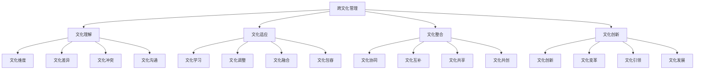

# 跨文化管理

## 🎯 学习目标
掌握跨文化管理理论和方法，学会处理文化差异，提升跨文化沟通能力，实现有效的国际化管理。

## 📊 跨文化管理框架

### 管理要素

## 🌍 文化理解

### 文化维度理论
**霍夫斯泰德文化维度**：
- **权力距离**：社会对权力不平等的接受程度
- **个人主义vs集体主义**：个人与集体的关系
- **男性气质vs女性气质**：性别角色期望
- **不确定性规避**：对不确定性的容忍度
- **长期导向vs短期导向**：时间观念
- **放纵vs约束**：对欲望的控制

**霍尔文化理论**：
- **高语境文化**：信息主要存在于语境中
- **低语境文化**：信息主要存在于语言中
- **时间观念**：单时制vs多时制
- **空间观念**：个人空间概念

**特罗姆彭纳斯文化维度**：
- **普遍主义vs特殊主义**：规则vs关系
- **个人主义vs集体主义**：个人vs群体
- **中性vs情感**：情感表达方式
- **具体vs扩散**：生活领域分离程度
- **成就vs归属**：地位获得方式
- **内控vs外控**：控制环境的能力
- **顺序时间vs同步时间**：时间处理方式

### 文化差异分析
**价值观差异**：
- **核心价值观**：不同文化的核心价值观
- **价值冲突**：价值观冲突的表现
- **价值融合**：价值观融合的可能性
- **价值创新**：价值观创新

**行为差异**：
- **沟通方式**：不同文化的沟通方式
- **决策方式**：不同文化的决策方式
- **领导方式**：不同文化的领导方式
- **工作方式**：不同文化的工作方式

**制度差异**：
- **法律制度**：不同文化的法律制度
- **经济制度**：不同文化的经济制度
- **社会制度**：不同文化的社会制度
- **教育制度**：不同文化的教育制度

### 文化冲突管理
**冲突类型**：
- **价值观冲突**：核心价值观冲突
- **行为冲突**：行为方式冲突
- **制度冲突**：制度安排冲突
- **利益冲突**：利益分配冲突

**冲突原因**：
- **文化误解**：文化理解错误
- **沟通障碍**：跨文化沟通障碍
- **期望差异**：期望值差异
- **资源竞争**：资源竞争

**冲突解决**：
- **文化调解**：文化调解方法
- **文化妥协**：文化妥协策略
- **文化整合**：文化整合方案
- **文化创新**：文化创新解决

## 🔄 文化适应

### 文化学习
**学习内容**：
- **文化知识**：学习目标文化知识
- **文化技能**：学习跨文化技能
- **文化态度**：培养文化敏感性
- **文化行为**：调整文化行为

**学习方法**：
- **文化培训**：系统文化培训
- **文化体验**：文化体验学习
- **文化观察**：文化观察学习
- **文化反思**：文化反思学习

**学习过程**：
- **文化冲击**：文化冲击阶段
- **文化适应**：文化适应阶段
- **文化融合**：文化融合阶段
- **文化创新**：文化创新阶段

### 文化调整
**调整策略**：
- **行为调整**：调整个人行为
- **态度调整**：调整个人态度
- **期望调整**：调整个人期望
- **目标调整**：调整个人目标

**调整方法**：
- **渐进调整**：渐进式调整
- **快速调整**：快速调整
- **选择性调整**：选择性调整
- **全面调整**：全面调整

**调整支持**：
- **组织支持**：组织支持措施
- **同事支持**：同事支持网络
- **专业支持**：专业支持服务
- **家庭支持**：家庭支持系统

### 文化融合
**融合策略**：
- **文化整合**：整合不同文化
- **文化互补**：文化互补发展
- **文化共享**：文化资源共享
- **文化共创**：文化共创价值

**融合方法**：
- **文化对话**：文化对话交流
- **文化合作**：文化合作项目
- **文化创新**：文化创新实践
- **文化传承**：文化传承发展

## 🤝 文化整合

### 文化协同
**协同机制**：
- **文化互补**：文化优势互补
- **文化协同**：文化协同效应
- **文化创新**：文化创新驱动
- **文化发展**：文化共同发展

**协同策略**：
- **战略协同**：战略层面协同
- **组织协同**：组织层面协同
- **流程协同**：流程层面协同
- **文化协同**：文化层面协同

### 文化互补
**互补类型**：
- **技能互补**：技能优势互补
- **知识互补**：知识优势互补
- **经验互补**：经验优势互补
- **资源互补**：资源优势互补

**互补策略**：
- **团队互补**：团队配置互补
- **项目互补**：项目组合互补
- **市场互补**：市场覆盖互补
- **技术互补**：技术能力互补

### 文化共享
**共享内容**：
- **知识共享**：知识资源共享
- **经验共享**：经验资源共享
- **价值共享**：价值观念共享
- **愿景共享**：愿景目标共享

**共享机制**：
- **平台共享**：共享平台建设
- **制度共享**：共享制度建设
- **文化共享**：共享文化建设
- **激励共享**：共享激励机制

## 🚀 文化创新

### 文化创新策略
**创新类型**：
- **文化融合创新**：融合不同文化创新
- **文化适应创新**：适应环境文化创新
- **文化引领创新**：引领发展文化创新
- **文化传承创新**：传承发展文化创新

**创新方法**：
- **文化实验**：文化实验创新
- **文化试点**：文化试点创新
- **文化推广**：文化推广创新
- **文化评估**：文化评估创新

### 文化变革管理
**变革策略**：
- **渐进变革**：渐进式文化变革
- **激进变革**：激进式文化变革
- **局部变革**：局部文化变革
- **全面变革**：全面文化变革

**变革管理**：
- **变革规划**：变革规划制定
- **变革实施**：变革实施管理
- **变革监控**：变革过程监控
- **变革评估**：变革效果评估

### 文化引领
**引领策略**：
- **价值引领**：价值观引领
- **行为引领**：行为方式引领
- **制度引领**：制度安排引领
- **创新引领**：创新实践引领

**引领方法**：
- **示范引领**：示范作用引领
- **激励引领**：激励机制引领
- **培训引领**：培训教育引领
- **文化引领**：文化建设引领

## 💡 实践应用

### 跨文化管理流程
1. **文化分析**：分析文化差异
2. **文化适应**：适应文化环境
3. **文化整合**：整合文化资源
4. **文化创新**：创新文化实践
5. **文化发展**：持续文化发展

### 案例分析
**选择案例**：如华为国际化跨文化管理
**分析维度**：
- 文化理解：文化维度分析、文化差异识别
- 文化适应：文化学习、文化调整、文化融合
- 文化整合：文化协同、文化互补、文化共享
- 文化创新：文化创新策略、文化变革管理

## 🧠 学习要点

### 费曼学习法应用
1. **选择概念**：跨文化管理
2. **简化解释**：用简单语言解释跨文化管理
3. **识别盲点**：找出理解不足的地方
4. **重新学习**：针对盲点深入学习

### 刻意练习要点
- **文化理解**：提升文化理解能力
- **文化适应**：提升文化适应能力
- **文化整合**：提升文化整合能力
- **文化创新**：提升文化创新能力

## 🔗 关联学习

### 前置知识
- [[01-国际贸易理论]] - 国际贸易理论
- [[01-商业环境分析]] - 环境分析
- [[01-组织文化]] - 组织文化

### 后续学习
- [[03-国际市场营销]] - 国际市场营销
- [[04-全球供应链管理]] - 全球供应链
- [[01-领导力]] - 领导力

### 实践应用
- 跨文化团队管理
- 国际化组织管理
- 跨文化沟通
- 跨文化合作

## 🎯 学习检验

### 理解检验
- [ ] 能够理解文化差异
- [ ] 能够分析文化冲突
- [ ] 能够制定文化适应策略
- [ ] 能够实施文化整合

### 应用检验
- [ ] 能够管理跨文化团队
- [ ] 能够处理跨文化冲突
- [ ] 能够促进文化融合
- [ ] 能够推动文化创新

---
**下一步**：[[03-国际市场营销]] - 国际市场营销

