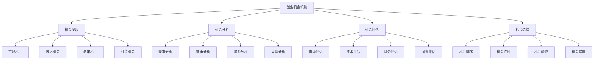

# 创业机会识别

## 🎯 学习目标
掌握创业机会识别的方法和技巧，学会发现和评估创业机会，提升创业成功率。

## 📊 创业机会识别框架

### 识别要素

## 🔍 机会发现

### 市场机会
**需求机会**：
- **未满足需求**：市场未满足的需求
- **潜在需求**：市场潜在的需求
- **新需求**：市场新出现的需求
- **升级需求**：市场升级的需求

**供给机会**：
- **供给不足**：市场供给不足
- **供给质量**：市场供给质量差
- **供给效率**：市场供给效率低
- **供给创新**：市场供给缺乏创新

**价格机会**：
- **价格过高**：市场价格过高
- **价格不合理**：市场价格不合理
- **价格竞争**：市场价格竞争激烈
- **价格创新**：市场价格创新机会

**渠道机会**：
- **渠道缺失**：市场渠道缺失
- **渠道效率**：市场渠道效率低
- **渠道创新**：市场渠道创新机会
- **渠道整合**：市场渠道整合机会

### 技术机会
**新技术应用**：
- **技术突破**：技术突破带来的机会
- **技术成熟**：技术成熟带来的机会
- **技术普及**：技术普及带来的机会
- **技术融合**：技术融合带来的机会

**技术改进**：
- **技术优化**：技术优化机会
- **技术升级**：技术升级机会
- **技术集成**：技术集成机会
- **技术创新**：技术创新机会

**技术转移**：
- **技术转移**：技术转移机会
- **技术转化**：技术转化机会
- **技术商业化**：技术商业化机会
- **技术产业化**：技术产业化机会

**技术标准**：
- **标准制定**：技术标准制定机会
- **标准推广**：技术标准推广机会
- **标准应用**：技术标准应用机会
- **标准创新**：技术标准创新机会

### 政策机会
**政策支持**：
- **政策扶持**：政策扶持机会
- **政策优惠**：政策优惠机会
- **政策引导**：政策引导机会
- **政策创新**：政策创新机会

**政策变化**：
- **政策调整**：政策调整机会
- **政策改革**：政策改革机会
- **政策开放**：政策开放机会
- **政策创新**：政策创新机会

**政策需求**：
- **政策需求**：政策需求机会
- **政策服务**：政策服务机会
- **政策咨询**：政策咨询机会
- **政策执行**：政策执行机会

**政策影响**：
- **政策影响**：政策影响机会
- **政策适应**：政策适应机会
- **政策利用**：政策利用机会
- **政策创新**：政策创新机会

### 社会机会
**社会问题**：
- **社会问题**：社会问题解决机会
- **社会需求**：社会需求满足机会
- **社会服务**：社会服务提供机会
- **社会创新**：社会创新机会

**社会趋势**：
- **社会趋势**：社会趋势机会
- **社会变化**：社会变化机会
- **社会发展**：社会发展机会
- **社会进步**：社会进步机会

**社会价值**：
- **社会价值**：社会价值创造机会
- **社会效益**：社会效益提升机会
- **社会责任**：社会责任履行机会
- **社会贡献**：社会贡献机会

**社会合作**：
- **社会合作**：社会合作机会
- **社会网络**：社会网络机会
- **社会资源**：社会资源机会
- **社会支持**：社会支持机会

## 📈 机会分析

### 需求分析
**需求识别**：
- **需求调研**：进行需求调研
- **需求分析**：分析需求特征
- **需求验证**：验证需求真实性
- **需求预测**：预测需求趋势

**需求特征**：
- **需求强度**：需求强度分析
- **需求频率**：需求频率分析
- **需求稳定性**：需求稳定性分析
- **需求变化性**：需求变化性分析

**需求满足**：
- **满足程度**：需求满足程度
- **满足方式**：需求满足方式
- **满足质量**：需求满足质量
- **满足成本**：需求满足成本

**需求创新**：
- **需求创新**：需求创新机会
- **需求升级**：需求升级机会
- **需求扩展**：需求扩展机会
- **需求创造**：需求创造机会

### 竞争分析
**竞争态势**：
- **竞争强度**：市场竞争强度
- **竞争格局**：市场竞争格局
- **竞争趋势**：市场竞争趋势
- **竞争变化**：市场竞争变化

**竞争对手**：
- **直接竞争**：直接竞争对手
- **间接竞争**：间接竞争对手
- **潜在竞争**：潜在竞争对手
- **替代竞争**：替代竞争对手

**竞争优势**：
- **成本优势**：成本竞争优势
- **差异化优势**：差异化竞争优势
- **技术优势**：技术竞争优势
- **服务优势**：服务竞争优势

**竞争策略**：
- **竞争策略**：竞争策略分析
- **竞争手段**：竞争手段分析
- **竞争效果**：竞争效果分析
- **竞争创新**：竞争创新机会

### 资源分析
**资源需求**：
- **人力资源**：人力资源需求
- **物质资源**：物质资源需求
- **技术资源**：技术资源需求
- **资金资源**：资金资源需求

**资源供给**：
- **内部资源**：内部资源供给
- **外部资源**：外部资源供给
- **资源获取**：资源获取能力
- **资源整合**：资源整合能力

**资源约束**：
- **资源约束**：资源约束分析
- **资源瓶颈**：资源瓶颈分析
- **资源风险**：资源风险分析
- **资源优化**：资源优化机会

**资源创新**：
- **资源创新**：资源创新机会
- **资源整合**：资源整合机会
- **资源优化**：资源优化机会
- **资源创造**：资源创造机会

### 风险分析
**市场风险**：
- **市场风险**：市场风险分析
- **需求风险**：需求风险分析
- **竞争风险**：竞争风险分析
- **价格风险**：价格风险分析

**技术风险**：
- **技术风险**：技术风险分析
- **技术成熟度**：技术成熟度风险
- **技术替代**：技术替代风险
- **技术保护**：技术保护风险

**财务风险**：
- **财务风险**：财务风险分析
- **资金风险**：资金风险分析
- **成本风险**：成本风险分析
- **收益风险**：收益风险分析

**运营风险**：
- **运营风险**：运营风险分析
- **管理风险**：管理风险分析
- **人员风险**：人员风险分析
- **外部风险**：外部风险分析

## 📊 机会评估

### 市场评估
**市场规模**：
- **市场容量**：目标市场容量
- **市场增长**：目标市场增长
- **市场潜力**：目标市场潜力
- **市场成熟度**：目标市场成熟度

**市场结构**：
- **市场结构**：目标市场结构
- **市场细分**：目标市场细分
- **市场集中度**：目标市场集中度
- **市场壁垒**：目标市场壁垒

**市场吸引力**：
- **市场吸引力**：目标市场吸引力
- **盈利能力**：目标市场盈利能力
- **增长前景**：目标市场增长前景
- **风险程度**：目标市场风险程度

**市场进入**：
- **进入壁垒**：市场进入壁垒
- **进入成本**：市场进入成本
- **进入时机**：市场进入时机
- **进入策略**：市场进入策略

### 技术评估
**技术成熟度**：
- **技术成熟度**：技术成熟度评估
- **技术可靠性**：技术可靠性评估
- **技术稳定性**：技术稳定性评估
- **技术先进性**：技术先进性评估

**技术可行性**：
- **技术可行性**：技术可行性评估
- **技术实现**：技术实现评估
- **技术风险**：技术风险评估
- **技术保护**：技术保护评估

**技术优势**：
- **技术优势**：技术优势评估
- **技术差异化**：技术差异化评估
- **技术壁垒**：技术壁垒评估
- **技术可持续性**：技术可持续性评估

**技术发展**：
- **技术发展**：技术发展趋势
- **技术升级**：技术升级机会
- **技术创新**：技术创新机会
- **技术转移**：技术转移机会

### 财务评估
**投资需求**：
- **投资需求**：投资需求评估
- **投资规模**：投资规模评估
- **投资结构**：投资结构评估
- **投资时机**：投资时机评估

**收益预测**：
- **收益预测**：收益预测评估
- **收益结构**：收益结构评估
- **收益稳定性**：收益稳定性评估
- **收益增长性**：收益增长性评估

**成本分析**：
- **成本分析**：成本分析评估
- **成本结构**：成本结构评估
- **成本控制**：成本控制评估
- **成本优化**：成本优化评估

**财务指标**：
- **财务指标**：财务指标评估
- **投资回报**：投资回报评估
- **现金流**：现金流评估
- **财务风险**：财务风险评估

### 团队评估
**团队能力**：
- **团队能力**：团队能力评估
- **专业技能**：专业技能评估
- **管理能力**：管理能力评估
- **创新能力**：创新能力评估

**团队结构**：
- **团队结构**：团队结构评估
- **团队配置**：团队配置评估
- **团队互补**：团队互补评估
- **团队协作**：团队协作评估

**团队经验**：
- **团队经验**：团队经验评估
- **行业经验**：行业经验评估
- **创业经验**：创业经验评估
- **管理经验**：管理经验评估

**团队发展**：
- **团队发展**：团队发展评估
- **团队成长**：团队成长评估
- **团队学习**：团队学习评估
- **团队创新**：团队创新评估

## 🎯 机会选择

### 机会排序
**排序标准**：
- **市场吸引力**：市场吸引力排序
- **技术可行性**：技术可行性排序
- **财务回报**：财务回报排序
- **风险程度**：风险程度排序

**排序方法**：
- **定量排序**：定量排序方法
- **定性排序**：定性排序方法
- **综合排序**：综合排序方法
- **专家排序**：专家排序方法

**排序结果**：
- **排序结果**：机会排序结果
- **排序分析**：排序结果分析
- **排序调整**：排序结果调整
- **排序验证**：排序结果验证

### 机会选择
**选择标准**：
- **选择标准**：机会选择标准
- **选择原则**：机会选择原则
- **选择方法**：机会选择方法
- **选择流程**：机会选择流程

**选择决策**：
- **选择决策**：机会选择决策
- **决策依据**：选择决策依据
- **决策过程**：选择决策过程
- **决策结果**：选择决策结果

**选择验证**：
- **选择验证**：机会选择验证
- **验证方法**：选择验证方法
- **验证结果**：选择验证结果
- **验证调整**：选择验证调整

### 机会验证
**市场验证**：
- **市场验证**：市场验证方法
- **需求验证**：需求验证方法
- **竞争验证**：竞争验证方法
- **价格验证**：价格验证方法

**技术验证**：
- **技术验证**：技术验证方法
- **功能验证**：功能验证方法
- **性能验证**：性能验证方法
- **可靠性验证**：可靠性验证方法

**财务验证**：
- **财务验证**：财务验证方法
- **成本验证**：成本验证方法
- **收益验证**：收益验证方法
- **现金流验证**：现金流验证方法

**团队验证**：
- **团队验证**：团队验证方法
- **能力验证**：能力验证方法
- **经验验证**：经验验证方法
- **协作验证**：协作验证方法

### 机会实施
**实施计划**：
- **实施计划**：机会实施计划
- **实施步骤**：实施步骤规划
- **实施时间**：实施时间规划
- **实施资源**：实施资源规划

**实施管理**：
- **实施管理**：机会实施管理
- **进度管理**：实施进度管理
- **质量管理**：实施质量管理
- **风险管理**：实施风险管理

**实施监控**：
- **实施监控**：机会实施监控
- **监控指标**：实施监控指标
- **监控方法**：实施监控方法
- **监控调整**：实施监控调整

**实施评估**：
- **实施评估**：机会实施评估
- **效果评估**：实施效果评估
- **问题识别**：实施问题识别
- **改进建议**：实施改进建议

## 💡 实践应用

### 创业机会识别流程
1. **机会发现**：发现创业机会
2. **机会分析**：分析创业机会
3. **机会评估**：评估创业机会
4. **机会选择**：选择创业机会
5. **机会验证**：验证创业机会
6. **机会实施**：实施创业机会

### 案例分析
**选择案例**：如共享单车创业机会
**分析维度**：
- 机会发现：市场机会、技术机会、政策机会、社会机会
- 机会分析：需求分析、竞争分析、资源分析、风险分析
- 机会评估：市场评估、技术评估、财务评估、团队评估
- 机会选择：机会排序、机会选择、机会验证、机会实施

## 🧠 学习要点

### 费曼学习法应用
1. **选择概念**：创业机会识别
2. **简化解释**：用简单语言解释创业机会识别
3. **识别盲点**：找出理解不足的地方
4. **重新学习**：针对盲点深入学习

### 刻意练习要点
- **机会发现**：培养机会发现能力
- **机会分析**：掌握机会分析方法
- **机会评估**：提升机会评估能力
- **机会选择**：提升机会选择能力

## 🔗 关联学习

### 前置知识
- [[01-商业学概论]] - 商业学基础
- [[01-商业环境分析]] - 环境分析
- [[01-商业模式画布]] - 商业模式

### 后续学习
- [[02-商业计划书]] - 商业计划
- [[03-创业融资]] - 创业融资
- [[04-创业团队管理]] - 团队管理

### 实践应用
- 创业机会识别
- 创业机会分析
- 创业机会评估
- 创业机会选择

## 🎯 学习检验

### 理解检验
- [ ] 能够解释创业机会识别概念
- [ ] 能够发现创业机会
- [ ] 能够分析创业机会
- [ ] 能够评估创业机会

### 应用检验
- [ ] 能够识别具体创业机会
- [ ] 能够分析创业机会可行性
- [ ] 能够评估创业机会价值
- [ ] 能够选择合适创业机会

---
**下一步**：[[02-商业计划书]] - 商业计划