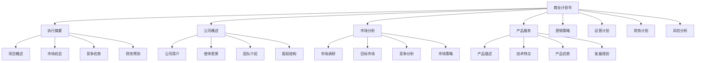

# 商业计划书

## 🎯 学习目标
掌握商业计划书编写方法和技巧，学会制定完整的商业计划，提升创业成功率和融资能力。

## 📊 商业计划书框架

### 计划要素

## 📋 执行摘要

### 项目概述
**项目简介**：
- **项目名称**：项目名称和定位
- **项目性质**：项目性质和类型
- **项目规模**：项目规模和范围
- **项目周期**：项目周期和时间

**核心价值**：
- **价值主张**：核心价值主张
- **目标客户**：目标客户群体
- **解决方案**：问题解决方案
- **商业模式**：商业模式创新

**关键指标**：
- **市场规模**：目标市场规模
- **收入预测**：收入预测数据
- **用户规模**：用户规模预测
- **市场份额**：市场份额目标

### 市场机会
**市场分析**：
- **市场现状**：市场现状分析
- **市场趋势**：市场发展趋势
- **市场机会**：市场机会识别
- **市场潜力**：市场潜力评估

**机会识别**：
- **需求机会**：市场需求机会
- **技术机会**：技术发展机会
- **政策机会**：政策支持机会
- **竞争机会**：竞争格局机会

**机会评估**：
- **机会大小**：机会规模评估
- **机会可行性**：机会可行性评估
- **机会持续性**：机会持续性评估
- **机会风险**：机会风险评估

### 竞争优势
**核心优势**：
- **技术优势**：技术能力优势
- **团队优势**：团队能力优势
- **资源优势**：资源优势
- **模式优势**：商业模式优势

**差异化优势**：
- **产品差异化**：产品差异化优势
- **服务差异化**：服务差异化优势
- **渠道差异化**：渠道差异化优势
- **品牌差异化**：品牌差异化优势

**可持续优势**：
- **壁垒优势**：竞争壁垒优势
- **网络优势**：网络效应优势
- **规模优势**：规模经济优势
- **创新优势**：持续创新优势

### 财务预测
**收入预测**：
- **收入来源**：收入来源分析
- **收入模式**：收入模式设计
- **收入预测**：收入预测数据
- **收入增长**：收入增长预测

**成本预测**：
- **成本结构**：成本结构分析
- **成本控制**：成本控制策略
- **成本预测**：成本预测数据
- **成本优化**：成本优化措施

**盈利预测**：
- **盈利模式**：盈利模式设计
- **盈利预测**：盈利预测数据
- **盈利增长**：盈利增长预测
- **盈利质量**：盈利质量分析

## 🏢 公司概述

### 公司简介
**基本信息**：
- **公司名称**：公司名称和注册信息
- **成立时间**：公司成立时间
- **注册资本**：注册资本和股权结构
- **经营范围**：经营范围和业务领域

**发展历程**：
- **创立阶段**：公司创立阶段
- **发展阶段**：公司发展阶段
- **现状阶段**：公司现状阶段
- **未来规划**：公司未来规划

**组织架构**：
- **组织架构**：公司组织架构
- **部门设置**：部门设置和职责
- **人员配置**：人员配置和规模
- **管理制度**：管理制度和流程

### 使命愿景
**使命陈述**：
- **使命定义**：公司使命定义
- **使命意义**：使命意义和价值
- **使命实现**：使命实现路径
- **使命评估**：使命实现评估

**愿景描述**：
- **愿景定义**：公司愿景定义
- **愿景目标**：愿景目标设定
- **愿景实现**：愿景实现策略
- **愿景评估**：愿景实现评估

**价值观**：
- **核心价值观**：核心价值观定义
- **价值理念**：价值理念和原则
- **价值实践**：价值实践和体现
- **价值评估**：价值实现评估

### 团队介绍
**核心团队**：
- **创始人**：创始人背景介绍
- **管理团队**：管理团队介绍
- **技术团队**：技术团队介绍
- **顾问团队**：顾问团队介绍

**团队优势**：
- **专业能力**：团队专业能力
- **行业经验**：团队行业经验
- **管理经验**：团队管理经验
- **创新能力**：团队创新能力

**团队建设**：
- **团队规划**：团队发展规划
- **人才引进**：人才引进计划
- **培训发展**：培训发展计划
- **激励机制**：激励机制设计

### 股权结构
**股权分配**：
- **股权结构**：股权结构设计
- **股东构成**：股东构成和比例
- **股权激励**：股权激励计划
- **股权管理**：股权管理制度

**治理结构**：
- **董事会**：董事会构成和职责
- **监事会**：监事会构成和职责
- **管理层**：管理层构成和职责
- **决策机制**：决策机制和流程

**融资计划**：
- **融资需求**：融资需求和用途
- **融资方式**：融资方式和条件
- **融资计划**：融资计划和时间
- **退出机制**：投资者退出机制

## 📈 市场分析

### 市场调研
**调研方法**：
- **定量调研**：定量调研方法
- **定性调研**：定性调研方法
- **混合调研**：混合调研方法
- **在线调研**：在线调研方法

**调研内容**：
- **市场规模**：市场规模调研
- **市场趋势**：市场趋势调研
- **用户需求**：用户需求调研
- **竞争状况**：竞争状况调研

**调研结果**：
- **调研数据**：调研数据整理
- **调研分析**：调研数据分析
- **调研结论**：调研结论总结
- **调研建议**：调研建议提出

### 目标市场
**市场细分**：
- **地理细分**：地理市场细分
- **人口细分**：人口市场细分
- **心理细分**：心理市场细分
- **行为细分**：行为市场细分

**目标市场**：
- **主要市场**：主要目标市场
- **次要市场**：次要目标市场
- **潜在市场**：潜在目标市场
- **国际市场**：国际目标市场

**市场定位**：
- **定位策略**：市场定位策略
- **定位优势**：定位优势分析
- **定位实施**：定位实施计划
- **定位评估**：定位效果评估

### 竞争分析
**竞争格局**：
- **竞争强度**：市场竞争强度
- **竞争结构**：市场竞争结构
- **竞争趋势**：市场竞争趋势
- **竞争变化**：市场竞争变化

**竞争对手**：
- **直接竞争**：直接竞争对手
- **间接竞争**：间接竞争对手
- **潜在竞争**：潜在竞争对手
- **替代竞争**：替代竞争对手

**竞争策略**：
- **竞争策略**：竞争策略分析
- **竞争优势**：竞争优势分析
- **竞争劣势**：竞争劣势分析
- **竞争机会**：竞争机会分析

### 市场策略
**进入策略**：
- **市场进入**：市场进入策略
- **进入时机**：市场进入时机
- **进入方式**：市场进入方式
- **进入成本**：市场进入成本

**扩张策略**：
- **市场扩张**：市场扩张策略
- **扩张方式**：市场扩张方式
- **扩张时机**：市场扩张时机
- **扩张风险**：市场扩张风险

**防御策略**：
- **市场防御**：市场防御策略
- **防御措施**：市场防御措施
- **防御成本**：市场防御成本
- **防御效果**：市场防御效果

## 🚀 产品服务

### 产品描述
**产品概述**：
- **产品名称**：产品名称和定位
- **产品功能**：产品功能描述
- **产品特点**：产品特点介绍
- **产品优势**：产品优势分析

**产品规格**：
- **技术规格**：产品技术规格
- **性能指标**：产品性能指标
- **质量标准**：产品质量标准
- **认证情况**：产品认证情况

**产品形态**：
- **产品形态**：产品形态描述
- **产品包装**：产品包装设计
- **产品交付**：产品交付方式
- **产品服务**：产品服务内容

### 技术特点
**核心技术**：
- **技术原理**：核心技术原理
- **技术优势**：技术优势分析
- **技术壁垒**：技术壁垒分析
- **技术保护**：技术保护措施

**技术实现**：
- **技术方案**：技术实现方案
- **技术架构**：技术架构设计
- **技术流程**：技术实现流程
- **技术标准**：技术实现标准

**技术发展**：
- **技术路线**：技术发展路线
- **技术升级**：技术升级计划
- **技术创新**：技术创新计划
- **技术合作**：技术合作计划

### 产品优势
**功能优势**：
- **功能创新**：功能创新优势
- **功能完善**：功能完善优势
- **功能易用**：功能易用优势
- **功能稳定**：功能稳定优势

**性能优势**：
- **性能卓越**：性能卓越优势
- **性能稳定**：性能稳定优势
- **性能可靠**：性能可靠优势
- **性能优化**：性能优化优势

**成本优势**：
- **成本控制**：成本控制优势
- **成本优化**：成本优化优势
- **成本效益**：成本效益优势
- **成本竞争力**：成本竞争力优势

### 发展规划
**产品规划**：
- **产品路线**：产品发展路线
- **产品升级**：产品升级计划
- **产品扩展**：产品扩展计划
- **产品创新**：产品创新计划

**技术规划**：
- **技术路线**：技术发展路线
- **技术升级**：技术升级计划
- **技术突破**：技术突破计划
- **技术合作**：技术合作计划

**市场规划**：
- **市场拓展**：市场拓展计划
- **市场深化**：市场深化计划
- **市场创新**：市场创新计划
- **市场合作**：市场合作计划

## 💡 实践应用

### 商业计划书编写流程
1. **需求分析**：分析商业计划需求
2. **信息收集**：收集相关信息数据
3. **结构设计**：设计计划书结构
4. **内容编写**：编写计划书内容
5. **审核完善**：审核完善计划书

### 案例分析
**选择案例**：如Airbnb商业计划书
**分析维度**：
- 执行摘要：项目概述、市场机会、竞争优势、财务预测
- 公司概述：公司简介、使命愿景、团队介绍、股权结构
- 市场分析：市场调研、目标市场、竞争分析、市场策略
- 产品服务：产品描述、技术特点、产品优势、发展规划

## 🧠 学习要点

### 费曼学习法应用
1. **选择概念**：商业计划书
2. **简化解释**：用简单语言解释商业计划书
3. **识别盲点**：找出理解不足的地方
4. **重新学习**：针对盲点深入学习

### 刻意练习要点
- **结构设计**：提升计划书结构设计能力
- **内容编写**：提升计划书内容编写能力
- **数据分析**：提升数据分析能力
- **逻辑思维**：提升逻辑思维能力

## 🔗 关联学习

### 前置知识
- [[01-创业机会识别]] - 创业机会识别
- [[01-商业模式画布]] - 商业模式画布
- [[01-战略管理概论]] - 战略管理

### 后续学习
- [[03-创业融资]] - 创业融资
- [[04-创业团队管理]] - 创业团队管理
- [[01-财务管理]] - 财务管理

### 实践应用
- 商业计划书编写
- 商业计划书评估
- 商业计划书展示
- 商业计划书优化

## 🎯 学习检验

### 理解检验
- [ ] 能够理解商业计划书结构
- [ ] 能够掌握计划书编写方法
- [ ] 能够分析市场机会
- [ ] 能够制定财务预测

### 应用检验
- [ ] 能够编写完整商业计划书
- [ ] 能够评估商业计划书质量
- [ ] 能够展示商业计划书
- [ ] 能够优化商业计划书

---
**下一步**：[[03-创业融资]] - 创业融资

