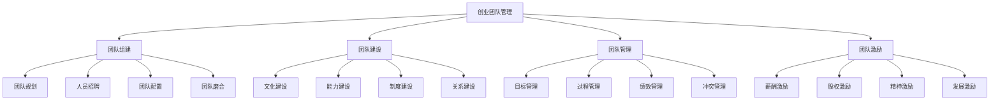

# 创业团队管理

## 🎯 学习目标
掌握创业团队管理理论和方法，学会组建、管理和激励创业团队，提升团队效率和创业成功率。

## 📊 创业团队管理框架

### 管理要素

## 👥 团队组建

### 团队规划
**团队设计**：
- **团队规模**：团队规模设计
- **团队结构**：团队结构设计
- **团队角色**：团队角色设计
- **团队职责**：团队职责设计

**团队需求**：
- **技能需求**：团队技能需求
- **经验需求**：团队经验需求
- **性格需求**：团队性格需求
- **文化需求**：团队文化需求

**团队标准**：
- **能力标准**：团队能力标准
- **素质标准**：团队素质标准
- **价值观标准**：团队价值观标准
- **文化标准**：团队文化标准

### 人员招聘
**招聘策略**：
- **招聘渠道**：招聘渠道选择
- **招聘方法**：招聘方法选择
- **招聘标准**：招聘标准制定
- **招聘流程**：招聘流程设计

**招聘实施**：
- **简历筛选**：简历筛选方法
- **面试安排**：面试安排流程
- **面试评估**：面试评估标准
- **录用决策**：录用决策流程

**招聘优化**：
- **招聘效率**：招聘效率优化
- **招聘质量**：招聘质量优化
- **招聘成本**：招聘成本优化
- **招聘体验**：招聘体验优化

### 团队配置
**人员配置**：
- **岗位配置**：岗位人员配置
- **技能配置**：技能人员配置
- **经验配置**：经验人员配置
- **性格配置**：性格人员配置

**结构配置**：
- **层级结构**：团队层级结构
- **职能结构**：团队职能结构
- **项目结构**：团队项目结构
- **矩阵结构**：团队矩阵结构

**配置优化**：
- **配置效率**：人员配置效率
- **配置平衡**：人员配置平衡
- **配置灵活**：人员配置灵活性
- **配置创新**：人员配置创新

### 团队磨合
**磨合过程**：
- **初期磨合**：团队初期磨合
- **中期磨合**：团队中期磨合
- **深度磨合**：团队深度磨合
- **稳定磨合**：团队稳定磨合

**磨合方法**：
- **团队活动**：团队建设活动
- **沟通交流**：团队沟通交流
- **协作训练**：团队协作训练
- **冲突处理**：团队冲突处理

**磨合管理**：
- **磨合监控**：团队磨合监控
- **磨合评估**：团队磨合评估
- **磨合调整**：团队磨合调整
- **磨合优化**：团队磨合优化

## 🏗️ 团队建设

### 文化建设
**文化塑造**：
- **价值观塑造**：团队价值观塑造
- **使命塑造**：团队使命塑造
- **愿景塑造**：团队愿景塑造
- **精神塑造**：团队精神塑造

**文化传播**：
- **文化宣传**：团队文化宣传
- **文化培训**：团队文化培训
- **文化实践**：团队文化实践
- **文化评估**：团队文化评估

**文化管理**：
- **文化维护**：团队文化维护
- **文化发展**：团队文化发展
- **文化创新**：团队文化创新
- **文化传承**：团队文化传承

### 能力建设
**能力规划**：
- **能力需求**：团队能力需求
- **能力现状**：团队能力现状
- **能力差距**：团队能力差距
- **能力规划**：团队能力规划

**能力提升**：
- **培训计划**：团队培训计划
- **学习计划**：团队学习计划
- **实践计划**：团队实践计划
- **发展计划**：团队发展计划

**能力管理**：
- **能力评估**：团队能力评估
- **能力监控**：团队能力监控
- **能力优化**：团队能力优化
- **能力创新**：团队能力创新

### 制度建设
**制度设计**：
- **管理制度**：团队管理制度
- **工作制度**：团队工作制度
- **考核制度**：团队考核制度
- **激励制度**：团队激励制度

**制度实施**：
- **制度宣传**：制度宣传教育
- **制度培训**：制度培训教育
- **制度执行**：制度执行管理
- **制度监督**：制度监督机制

**制度优化**：
- **制度评估**：制度效果评估
- **制度改进**：制度改进优化
- **制度创新**：制度创新实践
- **制度升级**：制度升级完善

### 关系建设
**关系建立**：
- **信任关系**：团队信任关系
- **合作关系**：团队合作关系
- **沟通关系**：团队沟通关系
- **支持关系**：团队支持关系

**关系维护**：
- **关系维护**：团队关系维护
- **关系发展**：团队关系发展
- **关系深化**：团队关系深化
- **关系优化**：团队关系优化

**关系管理**：
- **关系监控**：团队关系监控
- **关系评估**：团队关系评估
- **关系调整**：团队关系调整
- **关系创新**：团队关系创新

## 📊 团队管理

### 目标管理
**目标设定**：
- **团队目标**：团队目标设定
- **个人目标**：个人目标设定
- **项目目标**：项目目标设定
- **阶段目标**：阶段目标设定

**目标分解**：
- **目标分解**：目标分解方法
- **目标分配**：目标分配机制
- **目标协调**：目标协调机制
- **目标整合**：目标整合机制

**目标管理**：
- **目标监控**：目标执行监控
- **目标评估**：目标完成评估
- **目标调整**：目标调整机制
- **目标优化**：目标优化机制

### 过程管理
**过程设计**：
- **工作流程**：团队工作流程
- **决策流程**：团队决策流程
- **沟通流程**：团队沟通流程
- **协作流程**：团队协作流程

**过程实施**：
- **过程执行**：过程执行管理
- **过程监控**：过程执行监控
- **过程调整**：过程调整机制
- **过程优化**：过程优化机制

**过程管理**：
- **过程评估**：过程效果评估
- **过程改进**：过程改进措施
- **过程创新**：过程创新实践
- **过程升级**：过程升级完善

### 绩效管理
**绩效体系**：
- **绩效指标**：团队绩效指标
- **绩效标准**：团队绩效标准
- **绩效方法**：团队绩效方法
- **绩效工具**：团队绩效工具

**绩效实施**：
- **绩效计划**：绩效计划制定
- **绩效执行**：绩效执行管理
- **绩效监控**：绩效执行监控
- **绩效评估**：绩效效果评估

**绩效管理**：
- **绩效反馈**：绩效反馈机制
- **绩效改进**：绩效改进措施
- **绩效激励**：绩效激励机制
- **绩效优化**：绩效优化机制

### 冲突管理
**冲突识别**：
- **冲突类型**：团队冲突类型
- **冲突原因**：团队冲突原因
- **冲突影响**：团队冲突影响
- **冲突预警**：团队冲突预警

**冲突处理**：
- **冲突预防**：团队冲突预防
- **冲突调解**：团队冲突调解
- **冲突解决**：团队冲突解决
- **冲突转化**：团队冲突转化

**冲突管理**：
- **冲突监控**：团队冲突监控
- **冲突评估**：团队冲突评估
- **冲突改进**：团队冲突改进
- **冲突优化**：团队冲突优化

## 🎯 团队激励

### 薪酬激励
**薪酬设计**：
- **薪酬结构**：团队薪酬结构
- **薪酬水平**：团队薪酬水平
- **薪酬差异**：团队薪酬差异
- **薪酬增长**：团队薪酬增长

**薪酬实施**：
- **薪酬发放**：薪酬发放机制
- **薪酬调整**：薪酬调整机制
- **薪酬监控**：薪酬监控机制
- **薪酬评估**：薪酬评估机制

**薪酬管理**：
- **薪酬公平**：薪酬公平性
- **薪酬激励**：薪酬激励效果
- **薪酬优化**：薪酬优化机制
- **薪酬创新**：薪酬创新实践

### 股权激励
**股权设计**：
- **股权结构**：团队股权结构
- **股权分配**：团队股权分配
- **股权条件**：团队股权条件
- **股权退出**：团队股权退出

**股权实施**：
- **股权授予**：股权授予机制
- **股权行权**：股权行权机制
- **股权管理**：股权管理机制
- **股权监控**：股权监控机制

**股权管理**：
- **股权激励**：股权激励效果
- **股权优化**：股权优化机制
- **股权创新**：股权创新实践
- **股权升级**：股权升级完善

### 精神激励
**精神激励**：
- **认可激励**：团队认可激励
- **荣誉激励**：团队荣誉激励
- **成就激励**：团队成就激励
- **成长激励**：团队成长激励

**精神实施**：
- **精神激励**：精神激励实施
- **精神支持**：精神支持机制
- **精神关怀**：精神关怀机制
- **精神引导**：精神引导机制

**精神管理**：
- **精神激励**：精神激励效果
- **精神优化**：精神优化机制
- **精神创新**：精神创新实践
- **精神升级**：精神升级完善

### 发展激励
**发展机会**：
- **职业发展**：团队职业发展
- **能力发展**：团队能力发展
- **技能发展**：团队技能发展
- **管理发展**：团队管理发展

**发展支持**：
- **培训支持**：团队培训支持
- **学习支持**：团队学习支持
- **实践支持**：团队实践支持
- **创新支持**：团队创新支持

**发展管理**：
- **发展规划**：团队发展规划
- **发展监控**：团队发展监控
- **发展评估**：团队发展评估
- **发展优化**：团队发展优化

## 💡 实践应用

### 创业团队管理实施流程
1. **团队规划**：规划团队组建
2. **团队组建**：组建创业团队
3. **团队建设**：建设团队能力
4. **团队管理**：管理团队运营
5. **团队激励**：激励团队发展

### 案例分析
**选择案例**：如阿里巴巴创业团队
**分析维度**：
- 团队组建：团队规划、人员招聘、团队配置、团队磨合
- 团队建设：文化建设、能力建设、制度建设、关系建设
- 团队管理：目标管理、过程管理、绩效管理、冲突管理
- 团队激励：薪酬激励、股权激励、精神激励、发展激励

## 🧠 学习要点

### 费曼学习法应用
1. **选择概念**：创业团队管理
2. **简化解释**：用简单语言解释创业团队管理
3. **识别盲点**：找出理解不足的地方
4. **重新学习**：针对盲点深入学习

### 刻意练习要点
- **团队组建**：提升团队组建能力
- **团队建设**：提升团队建设能力
- **团队管理**：提升团队管理能力
- **团队激励**：提升团队激励能力

## 🔗 关联学习

### 前置知识
- [[03-创业融资]] - 创业融资
- [[02-商业计划书]] - 商业计划书
- [[01-创业机会识别]] - 创业机会识别

### 后续学习
- [[01-人力资源管理]] - 人力资源管理
- [[01-组织文化]] - 组织文化
- [[01-领导力]] - 领导力

### 实践应用
- 创业团队组建
- 创业团队建设
- 创业团队管理
- 创业团队激励

## 🎯 学习检验

### 理解检验
- [ ] 能够规划团队组建
- [ ] 能够建设团队能力
- [ ] 能够管理团队运营
- [ ] 能够激励团队发展

### 应用检验
- [ ] 能够组建创业团队
- [ ] 能够建设团队文化
- [ ] 能够管理团队绩效
- [ ] 能够激励团队创新

---
**下一步**：[[01-人力资源管理]] - 人力资源管理

