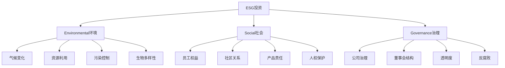

# ESG投资

## 🎯 学习目标
理解ESG投资理念，掌握ESG评估方法，学会ESG投资策略。

## 📊 ESG投资框架

### ESG要素

## 🌍 Environmental（环境）

### 气候变化
**气候变化风险**：
- **物理风险**：极端天气、海平面上升
- **转型风险**：政策变化、技术替代
- **声誉风险**：品牌形象、客户流失
- **合规风险**：法规要求、处罚风险

**气候变化应对**：
- 碳排放管理
- 清洁能源转型
- 绿色技术投资
- 气候适应策略

**投资机会**：
- 清洁能源
- 节能技术
- 碳捕获技术
- 气候适应技术

### 资源利用
**资源类型**：
- **能源资源**：化石燃料、可再生能源
- **水资源**：水资源管理、水污染控制
- **土地资源**：土地利用、生态保护
- **矿产资源**：可持续开采、循环利用

**资源管理**：
- 资源效率提升
- 循环经济模式
- 资源替代技术
- 资源保护措施

**投资机会**：
- 资源效率技术
- 循环经济模式
- 资源替代技术
- 资源保护技术

### 污染控制
**污染类型**：
- **空气污染**：工业排放、交通排放
- **水污染**：工业废水、生活污水
- **土壤污染**：工业污染、农业污染
- **噪音污染**：工业噪音、交通噪音

**污染控制**：
- 污染源控制
- 污染治理技术
- 污染监测系统
- 污染预防措施

**投资机会**：
- 污染治理技术
- 环境监测技术
- 清洁生产技术
- 环境服务

## 👥 Social（社会）

### 员工权益
**权益内容**：
- **工作条件**：安全健康、工作环境
- **薪酬福利**：公平薪酬、福利保障
- **职业发展**：培训机会、晋升通道
- **工作生活平衡**：工作时间、休假制度

**权益保护**：
- 劳动法规遵守
- 员工参与管理
- 多元化包容
- 员工满意度

**投资机会**：
- 人力资源服务
- 员工培训服务
- 工作环境改善
- 员工福利服务

### 社区关系
**关系类型**：
- **社区投资**：基础设施建设、公共服务
- **社区参与**：社区活动、志愿服务
- **社区支持**：教育支持、医疗支持
- **社区沟通**：信息公开、意见反馈

**关系管理**：
- 社区需求识别
- 社区项目投资
- 社区关系维护
- 社区影响评估

**投资机会**：
- 社区基础设施
- 社区服务
- 社区发展项目
- 社区投资工具

### 产品责任
**责任内容**：
- **产品质量**：安全可靠、性能优良
- **产品安全**：使用安全、环境影响
- **产品信息**：真实准确、透明公开
- **产品服务**：售后服务、客户支持

**责任管理**：
- 产品设计责任
- 生产过程责任
- 销售过程责任
- 使用过程责任

**投资机会**：
- 产品质量提升
- 产品安全技术
- 产品服务创新
- 产品责任管理

## 🏛️ Governance（治理）

### 公司治理
**治理结构**：
- **董事会**：独立性、专业性、多样性
- **管理层**：能力、诚信、责任
- **监事会**：监督职能、独立性
- **股东权利**：知情权、参与权、监督权

**治理机制**：
- 决策机制
- 监督机制
- 激励机制
- 约束机制

**治理标准**：
- 治理准则
- 治理评级
- 治理披露
- 治理改进

### 董事会结构
**结构要素**：
- **独立性**：独立董事比例、独立性
- **专业性**：专业背景、行业经验
- **多样性**：性别、年龄、背景
- **有效性**：决策效率、监督效果

**结构优化**：
- 结构设计
- 人员选任
- 职能分工
- 绩效评估

**投资机会**：
- 治理咨询服务
- 董事培训服务
- 治理评估服务
- 治理改进服务

### 透明度
**透明度内容**：
- **财务透明**：财务信息、审计报告
- **经营透明**：经营状况、战略规划
- **治理透明**：治理结构、决策过程
- **社会责任透明**：ESG表现、社会贡献

**透明度提升**：
- 信息披露
- 沟通机制
- 反馈渠道
- 持续改进

**投资机会**：
- 信息披露服务
- 透明度评估
- 沟通平台
- 透明度改进

## 💰 ESG投资策略

### 投资方法
**负面筛选**：
- 排除不符合ESG标准的投资
- 避免投资争议性行业
- 降低投资风险
- 提升投资声誉

**正面筛选**：
- 选择ESG表现优秀的投资
- 投资可持续发展企业
- 获得长期回报
- 创造社会价值

**主题投资**：
- 投资特定ESG主题
- 如清洁能源、绿色建筑
- 获得主题收益
- 推动主题发展

**影响力投资**：
- 投资具有社会影响力的项目
- 获得财务和社会回报
- 创造积极影响
- 推动社会进步

### 投资工具
**ESG基金**：
- ESG主题基金
- ESG筛选基金
- ESG指数基金
- ESG主动基金

**ESG指数**：
- ESG评级指数
- ESG主题指数
- ESG区域指数
- ESG行业指数

**ESG债券**：
- 绿色债券
- 社会债券
- 可持续发展债券
- ESG债券基金

**ESG衍生品**：
- ESG期货
- ESG期权
- ESG互换
- ESG结构化产品

## 📊 ESG评估

### 评估框架
**评估维度**：
- **环境维度**：气候变化、资源利用、污染控制
- **社会维度**：员工权益、社区关系、产品责任
- **治理维度**：公司治理、董事会结构、透明度

**评估方法**：
- 定量评估
- 定性评估
- 综合评估
- 比较评估

**评估标准**：
- 国际标准
- 行业标准
- 地区标准
- 企业标准

### 评估工具
**评级工具**：
- MSCI ESG评级
- Sustainalytics ESG评级
- Refinitiv ESG评级
- Bloomberg ESG评级

**数据工具**：
- ESG数据库
- ESG数据平台
- ESG分析工具
- ESG报告工具

**评估服务**：
- ESG评估服务
- ESG咨询服务
- ESG培训服务
- ESG认证服务

## 💡 实践应用

### ESG投资流程
1. **ESG评估**：评估投资标的ESG表现
2. **投资决策**：基于ESG评估做出投资决策
3. **投资实施**：实施ESG投资策略
4. **投资监控**：监控ESG投资表现
5. **投资报告**：报告ESG投资结果

### 案例分析
**选择案例**：如绿色能源投资
**分析维度**：
- ESG评估：环境、社会、治理表现
- 投资策略：主题投资、影响力投资
- 投资效果：财务回报、社会影响
- 投资风险：ESG风险、市场风险

## 🧠 学习要点

### 费曼学习法应用
1. **选择概念**：ESG投资
2. **简化解释**：用简单语言解释ESG
3. **识别盲点**：找出理解不足的地方
4. **重新学习**：针对盲点深入学习

### 刻意练习要点
- **概念理解**：准确理解ESG概念
- **评估能力**：能够进行ESG评估
- **投资策略**：能够制定ESG投资策略
- **实践应用**：能够实施ESG投资

## 🔗 关联学习

### 前置知识
- [[01-商业伦理与社会责任]] - 企业社会责任
- [[03-可持续发展]] - 可持续发展
- [[01-财务管理]] - 投资管理

### 后续学习
- [[02-循环经济]] - 循环经济
- [[03-绿色供应链]] - 绿色供应链
- [[04-碳中和商业]] - 碳中和

### 实践应用
- ESG投资决策
- ESG评估分析
- ESG投资管理
- ESG投资报告

## 🎯 学习检验

### 理解检验
- [ ] 能够解释ESG投资概念
- [ ] 能够进行ESG评估
- [ ] 能够制定ESG投资策略
- [ ] 能够实施ESG投资

### 应用检验
- [ ] 能够评估企业ESG表现
- [ ] 能够制定ESG投资组合
- [ ] 能够管理ESG投资风险
- [ ] 能够报告ESG投资效果

---
**下一步**：[[02-AI在营销中的应用]] - 人工智能营销