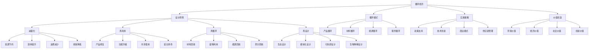

# 循环经济

## 🎯 学习目标
掌握循环经济理论，学会构建循环经济模式，实现资源高效利用和可持续发展。

## 📊 循环经济框架

### 循环经济模型

## 🔄 设计原则

### 减量化
**资源节约**：
- **材料节约**：减少材料使用
- **能源节约**：减少能源消耗
- **水资源节约**：减少水资源使用
- **土地节约**：减少土地占用

**效率提升**：
- **生产效率**：提升生产效率
- **使用效率**：提升使用效率
- **回收效率**：提升回收效率
- **处理效率**：提升处理效率

**浪费减少**：
- **生产浪费**：减少生产浪费
- **使用浪费**：减少使用浪费
- **运输浪费**：减少运输浪费
- **包装浪费**：减少包装浪费

**排放降低**：
- **温室气体**：降低温室气体排放
- **污染物**：降低污染物排放
- **废水排放**：降低废水排放
- **固体废物**：降低固体废物排放

### 再利用
**产品修复**：
- **故障修复**：产品故障修复
- **性能恢复**：性能恢复
- **功能修复**：功能修复
- **外观修复**：外观修复

**功能升级**：
- **技术升级**：技术升级
- **功能扩展**：功能扩展
- **性能提升**：性能提升
- **智能化升级**：智能化升级

**共享使用**：
- **产品共享**：产品共享使用
- **服务共享**：服务共享使用
- **空间共享**：空间共享使用
- **资源共享**：资源共享使用

**延长寿命**：
- **设计优化**：设计优化延长寿命
- **维护保养**：维护保养延长寿命
- **升级改造**：升级改造延长寿命
- **循环使用**：循环使用延长寿命

### 再循环
**材料回收**：
- **金属回收**：金属材料回收
- **塑料回收**：塑料材料回收
- **纸张回收**：纸张材料回收
- **玻璃回收**：玻璃材料回收

**废物利用**：
- **有机废物**：有机废物利用
- **无机废物**：无机废物利用
- **电子废物**：电子废物利用
- **建筑废物**：建筑废物利用

**能源回收**：
- **热能回收**：热能回收利用
- **电能回收**：电能回收利用
- **生物能回收**：生物能回收利用
- **化学能回收**：化学能回收利用

**养分回收**：
- **有机养分**：有机养分回收
- **无机养分**：无机养分回收
- **生物养分**：生物养分回收
- **循环利用**：养分循环利用

### 再设计
**生态设计**：
- **生态友好**：生态友好设计
- **环境兼容**：环境兼容设计
- **资源高效**：资源高效设计
- **污染最小**：污染最小设计

**模块化设计**：
- **模块化**：模块化设计
- **标准化**：标准化设计
- **可替换**：可替换设计
- **可升级**：可升级设计

**可拆卸设计**：
- **易拆卸**：易拆卸设计
- **易分离**：易分离设计
- **易回收**：易回收设计
- **易处理**：易处理设计

**生物降解设计**：
- **生物降解**：生物降解设计
- **可堆肥**：可堆肥设计
- **环境友好**：环境友好设计
- **循环利用**：循环利用设计

## 🔄 循环模式

### 产品循环
**产品生命周期**：
- **设计阶段**：产品设计阶段
- **生产阶段**：产品生产阶段
- **使用阶段**：产品使用阶段
- **回收阶段**：产品回收阶段

**循环策略**：
- **延长使用**：延长产品使用
- **功能升级**：产品功能升级
- **共享使用**：产品共享使用
- **回收利用**：产品回收利用

**循环技术**：
- **修复技术**：产品修复技术
- **升级技术**：产品升级技术
- **回收技术**：产品回收技术
- **处理技术**：产品处理技术

**循环管理**：
- **生命周期管理**：生命周期管理
- **循环跟踪**：循环跟踪管理
- **质量控制**：质量控制管理
- **成本控制**：成本控制管理

### 材料循环
**材料类型**：
- **金属材料**：金属材料循环
- **塑料材料**：塑料材料循环
- **纸张材料**：纸张材料循环
- **玻璃材料**：玻璃材料循环

**循环流程**：
- **收集分类**：材料收集分类
- **预处理**：材料预处理
- **回收处理**：材料回收处理
- **再利用**：材料再利用

**循环技术**：
- **分离技术**：材料分离技术
- **净化技术**：材料净化技术
- **改性技术**：材料改性技术
- **成型技术**：材料成型技术

**循环标准**：
- **质量标准**：材料质量标准
- **安全标准**：材料安全标准
- **环保标准**：材料环保标准
- **循环标准**：材料循环标准

### 能源循环
**能源类型**：
- **热能循环**：热能循环利用
- **电能循环**：电能循环利用
- **生物能循环**：生物能循环利用
- **化学能循环**：化学能循环利用

**循环技术**：
- **余热回收**：余热回收技术
- **废能利用**：废能利用技术
- **储能技术**：储能技术
- **转换技术**：能源转换技术

**循环系统**：
- **能源系统**：能源循环系统
- **热力系统**：热力循环系统
- **电力系统**：电力循环系统
- **综合系统**：综合循环系统

**循环效率**：
- **回收效率**：能源回收效率
- **转换效率**：能源转换效率
- **利用效率**：能源利用效率
- **系统效率**：系统循环效率

### 服务循环
**服务类型**：
- **维修服务**：维修服务循环
- **升级服务**：升级服务循环
- **回收服务**：回收服务循环
- **处理服务**：处理服务循环

**服务模式**：
- **服务外包**：服务外包模式
- **服务共享**：服务共享模式
- **服务租赁**：服务租赁模式
- **服务订阅**：服务订阅模式

**服务技术**：
- **诊断技术**：服务诊断技术
- **修复技术**：服务修复技术
- **升级技术**：服务升级技术
- **回收技术**：服务回收技术

**服务管理**：
- **服务流程**：服务流程管理
- **服务质量**：服务质量管理
- **服务成本**：服务成本管理
- **服务效果**：服务效果管理

## 🚀 实施策略

### 政策支持
**政策框架**：
- **法律法规**：循环经济法律法规
- **标准规范**：循环经济标准规范
- **政策措施**：循环经济政策措施
- **监管机制**：循环经济监管机制

**激励政策**：
- **财政支持**：财政支持政策
- **税收优惠**：税收优惠政策
- **金融支持**：金融支持政策
- **技术扶持**：技术扶持政策

**约束政策**：
- **排放限制**：排放限制政策
- **资源限制**：资源限制政策
- **废物限制**：废物限制政策
- **环境标准**：环境标准政策

**协调政策**：
- **部门协调**：部门协调政策
- **区域协调**：区域协调政策
- **国际协调**：国际协调政策
- **产业协调**：产业协调政策

### 技术创新
**技术研发**：
- **循环技术**：循环技术研发
- **回收技术**：回收技术研发
- **处理技术**：处理技术研发
- **利用技术**：利用技术研发

**技术应用**：
- **技术推广**：技术推广应用
- **技术示范**：技术示范应用
- **技术转移**：技术转移应用
- **技术合作**：技术合作应用

**技术标准**：
- **技术标准**：技术标准制定
- **质量标准**：质量标准制定
- **安全标准**：安全标准制定
- **环保标准**：环保标准制定

**技术管理**：
- **技术管理**：技术管理
- **知识产权**：知识产权管理
- **技术保密**：技术保密管理
- **技术评估**：技术评估管理

### 商业模式
**循环商业模式**：
- **产品服务化**：产品服务化模式
- **共享经济**：共享经济模式
- **租赁模式**：租赁模式
- **订阅模式**：订阅模式

**价值创造**：
- **价值主张**：价值主张设计
- **价值传递**：价值传递机制
- **价值获取**：价值获取方式
- **价值分配**：价值分配机制

**收入模式**：
- **服务收入**：服务收入模式
- **租赁收入**：租赁收入模式
- **回收收入**：回收收入模式
- **数据收入**：数据收入模式

**成本结构**：
- **成本控制**：成本控制
- **成本优化**：成本优化
- **成本分摊**：成本分摊
- **成本效益**：成本效益

### 供应链管理
**供应链设计**：
- **循环供应链**：循环供应链设计
- **逆向供应链**：逆向供应链设计
- **闭环供应链**：闭环供应链设计
- **绿色供应链**：绿色供应链设计

**供应链管理**：
- **供应商管理**：供应商管理
- **库存管理**：库存管理
- **物流管理**：物流管理
- **信息管理**：信息管理

**供应链优化**：
- **流程优化**：流程优化
- **效率优化**：效率优化
- **成本优化**：成本优化
- **质量优化**：质量优化

**供应链协同**：
- **协同机制**：协同机制
- **信息共享**：信息共享
- **风险共担**：风险共担
- **利益共享**：利益共享

## 💎 价值创造

### 环境价值
**资源节约**：
- **资源消耗**：减少资源消耗
- **资源浪费**：减少资源浪费
- **资源效率**：提高资源效率
- **资源循环**：促进资源循环

**污染减少**：
- **大气污染**：减少大气污染
- **水体污染**：减少水体污染
- **土壤污染**：减少土壤污染
- **噪声污染**：减少噪声污染

**生态保护**：
- **生物多样性**：保护生物多样性
- **生态系统**：保护生态系统
- **环境质量**：改善环境质量
- **可持续发展**：促进可持续发展

### 经济价值
**成本降低**：
- **生产成本**：降低生产成本
- **运营成本**：降低运营成本
- **处理成本**：降低处理成本
- **环境成本**：降低环境成本

**收入增加**：
- **回收收入**：增加回收收入
- **服务收入**：增加服务收入
- **创新收入**：增加创新收入
- **品牌价值**：增加品牌价值

**效率提升**：
- **生产效率**：提升生产效率
- **资源效率**：提升资源效率
- **能源效率**：提升能源效率
- **循环效率**：提升循环效率

**竞争优势**：
- **成本优势**：建立成本优势
- **技术优势**：建立技术优势
- **品牌优势**：建立品牌优势
- **市场优势**：建立市场优势

### 社会价值
**就业创造**：
- **直接就业**：创造直接就业
- **间接就业**：创造间接就业
- **绿色就业**：创造绿色就业
- **技能提升**：提升就业技能

**生活质量**：
- **环境质量**：改善环境质量
- **生活质量**：改善生活质量
- **健康水平**：提升健康水平
- **幸福感**：提升幸福感

**社会和谐**：
- **社会公平**：促进社会公平
- **社会包容**：促进社会包容
- **社会创新**：促进社会创新
- **社会进步**：促进社会进步

### 创新价值
**技术创新**：
- **循环技术**：循环技术创新
- **回收技术**：回收技术创新
- **处理技术**：处理技术创新
- **利用技术**：利用技术创新

**模式创新**：
- **商业模式**：商业模式创新
- **服务模式**：服务模式创新
- **管理模式**：管理模式创新
- **合作模式**：合作模式创新

**管理创新**：
- **管理理念**：管理理念创新
- **管理方法**：管理方法创新
- **管理工具**：管理工具创新
- **管理流程**：管理流程创新

## 💡 循环经济案例

### 成功案例
**苹果公司**：
- **循环策略**：产品回收再利用
- **技术创新**：材料回收技术
- **商业模式**：以旧换新模式
- **效果**：减少环境影响

**宜家**：
- **循环策略**：家具回收再利用
- **技术创新**：模块化设计
- **商业模式**：租赁服务模式
- **效果**：延长产品寿命

**特斯拉**：
- **循环策略**：电池回收再利用
- **技术创新**：电池回收技术
- **商业模式**：电池租赁模式
- **效果**：减少电池浪费

**可口可乐**：
- **循环策略**：包装回收再利用
- **技术创新**：包装回收技术
- **商业模式**：回收奖励模式
- **效果**：减少包装浪费

### 失败案例
**失败原因**：
- **技术不成熟**：技术不成熟
- **成本过高**：成本过高
- **市场接受度低**：市场接受度低
- **政策支持不足**：政策支持不足

**失败教训**：
- **技术选择**：选择成熟技术
- **成本控制**：控制实施成本
- **市场教育**：加强市场教育
- **政策支持**：争取政策支持

## 🧠 学习要点

### 费曼学习法应用
1. **选择概念**：循环经济
2. **简化解释**：用简单语言解释循环经济
3. **识别盲点**：找出理解不足的地方
4. **重新学习**：针对盲点深入学习

### 刻意练习要点
- **理论掌握**：掌握循环经济理论
- **方法应用**：掌握循环经济方法
- **案例分析**：分析成功失败案例
- **实践应用**：实践应用循环经济

## 🔗 关联学习

### 前置知识
- [[01-ESG投资]] - ESG投资
- [[01-可持续发展]] - 可持续发展
- [[01-企业社会责任]] - 企业社会责任

### 后续学习
- [[03-绿色供应链]] - 绿色供应链
- [[04-碳中和商业]] - 碳中和商业
- [[01-环境管理]] - 环境管理

### 实践应用
- 循环经济模式设计
- 循环经济实施
- 循环经济管理
- 循环经济评估

## 🎯 学习检验

### 理解检验
- [ ] 能够理解循环经济理论
- [ ] 能够掌握循环经济原则
- [ ] 能够分析循环经济模式
- [ ] 能够制定实施策略

### 应用检验
- [ ] 能够设计循环经济模式
- [ ] 能够实施循环经济策略
- [ ] 能够管理循环经济项目
- [ ] 能够评估循环经济效果

---
**下一步**：[[03-绿色供应链]] - 绿色供应链

