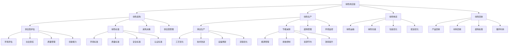

# 绿色供应链

## 🎯 学习目标
掌握绿色供应链管理理论，学会构建环境友好的供应链体系，实现可持续发展目标。

## 📊 绿色供应链框架

### 绿色供应链模型

## 🛒 绿色采购

### 供应商评估
**环境评估**：
- **环境影响**：供应商环境影响评估
- **环境管理**：环境管理体系评估
- **环境绩效**：环境绩效评估
- **环境合规**：环境合规性评估

**社会责任**：
- **劳工权益**：劳工权益保护
- **工作条件**：工作条件评估
- **社区关系**：社区关系评估
- **道德标准**：道德标准评估

**质量管理**：
- **质量体系**：质量管理体系
- **质量控制**：质量控制能力
- **质量改进**：质量改进能力
- **质量认证**：质量认证情况

**创新能力**：
- **技术创新**：技术创新能力
- **产品创新**：产品创新能力
- **管理创新**：管理创新能力
- **合作创新**：合作创新能力

### 绿色标准
**环境标准**：
- **ISO 14001**：环境管理体系标准
- **OHSAS 18001**：职业健康安全标准
- **SA 8000**：社会责任标准
- **FSC认证**：森林管理委员会认证

**质量标准**：
- **ISO 9001**：质量管理体系标准
- **TS 16949**：汽车行业质量标准
- **AS 9100**：航空航天质量标准
- **ISO 22000**：食品安全标准

**安全标准**：
- **产品安全**：产品安全标准
- **生产安全**：生产安全标准
- **运输安全**：运输安全标准
- **使用安全**：使用安全标准

**认证标准**：
- **有机认证**：有机产品认证
- **环保认证**：环保产品认证
- **节能认证**：节能产品认证
- **循环认证**：循环产品认证

### 采购决策
**决策因素**：
- **环境因素**：环境因素考虑
- **质量因素**：质量因素考虑
- **成本因素**：成本因素考虑
- **风险因素**：风险因素考虑

**决策方法**：
- **多准则决策**：多准则决策方法
- **成本效益分析**：成本效益分析
- **风险评估**：风险评估方法
- **综合评估**：综合评估方法

**决策流程**：
- **需求分析**：采购需求分析
- **供应商筛选**：供应商筛选
- **评估比较**：供应商评估比较
- **决策选择**：采购决策选择

### 供应商管理
**合作关系**：
- **战略合作**：战略合作关系
- **长期合作**：长期合作关系
- **互利共赢**：互利共赢关系
- **风险共担**：风险共担关系

**管理机制**：
- **评估机制**：供应商评估机制
- **激励机制**：供应商激励机制
- **约束机制**：供应商约束机制
- **改进机制**：供应商改进机制

**支持服务**：
- **技术支持**：技术支持服务
- **培训服务**：培训服务
- **咨询服务**：咨询服务
- **认证服务**：认证服务

## 🏭 绿色生产

### 清洁生产
**工艺优化**：
- **工艺改进**：生产工艺改进
- **技术升级**：生产技术升级
- **流程优化**：生产流程优化
- **自动化**：生产自动化

**技术改进**：
- **清洁技术**：清洁生产技术
- **节能技术**：节能技术应用
- **减排技术**：减排技术应用
- **循环技术**：循环技术应用

**设备更新**：
- **设备升级**：生产设备升级
- **设备改造**：设备技术改造
- **设备维护**：设备维护保养
- **设备管理**：设备管理优化

**流程优化**：
- **生产流程**：生产流程优化
- **管理流程**：管理流程优化
- **质量控制**：质量控制流程
- **环境管理**：环境管理流程

### 节能减排
**能源管理**：
- **能源审计**：能源审计
- **能源监测**：能源监测
- **能源优化**：能源优化
- **新能源应用**：新能源应用

**排放控制**：
- **废气处理**：废气处理
- **废水处理**：废水处理
- **固废处理**：固废处理
- **噪声控制**：噪声控制

**资源节约**：
- **原材料节约**：原材料节约
- **水资源节约**：水资源节约
- **能源节约**：能源节约
- **土地节约**：土地节约

**效率提升**：
- **生产效率**：生产效率提升
- **能源效率**：能源效率提升
- **资源效率**：资源效率提升
- **环境效率**：环境效率提升

### 废物管理
**废物分类**：
- **危险废物**：危险废物分类
- **一般废物**：一般废物分类
- **可回收废物**：可回收废物分类
- **有机废物**：有机废物分类

**废物处理**：
- **废物减量**：废物减量化
- **废物回收**：废物回收利用
- **废物处理**：废物处理处置
- **废物监控**：废物监控管理

**循环利用**：
- **材料循环**：材料循环利用
- **能源循环**：能源循环利用
- **水循环**：水循环利用
- **废物循环**：废物循环利用

**环境监控**：
- **环境监测**：环境监测
- **环境评估**：环境评估
- **环境报告**：环境报告
- **环境改进**：环境改进

## 🚚 绿色物流

### 绿色运输
**运输方式**：
- **绿色运输**：绿色运输方式
- **多式联运**：多式联运
- **智能运输**：智能运输
- **清洁运输**：清洁运输

**运输优化**：
- **路线优化**：运输路线优化
- **装载优化**：装载优化
- **时间优化**：运输时间优化
- **成本优化**：运输成本优化

**车辆管理**：
- **车辆选择**：车辆选择
- **车辆维护**：车辆维护
- **驾驶行为**：驾驶行为优化
- **燃油管理**：燃油管理

**排放控制**：
- **尾气排放**：尾气排放控制
- **噪声控制**：噪声控制
- **燃油消耗**：燃油消耗控制
- **环境影响**：环境影响控制

### 绿色仓储
**仓储设计**：
- **绿色建筑**：绿色仓储建筑
- **节能设计**：节能设计
- **环保材料**：环保材料使用
- **智能系统**：智能仓储系统

**仓储管理**：
- **库存管理**：库存管理优化
- **空间利用**：空间利用优化
- **设备管理**：设备管理优化
- **人员管理**：人员管理优化

**环境控制**：
- **温度控制**：温度控制
- **湿度控制**：湿度控制
- **空气质量**：空气质量控制
- **照明控制**：照明控制

**安全管理**：
- **消防安全**：消防安全
- **作业安全**：作业安全
- **产品安全**：产品安全
- **环境安全**：环境安全

### 包装优化
**包装设计**：
- **绿色包装**：绿色包装设计
- **减量化包装**：减量化包装
- **可回收包装**：可回收包装
- **可降解包装**：可降解包装

**包装材料**：
- **环保材料**：环保包装材料
- **可再生材料**：可再生材料
- **可回收材料**：可回收材料
- **生物材料**：生物材料

**包装工艺**：
- **包装工艺**：包装工艺优化
- **包装设备**：包装设备优化
- **包装流程**：包装流程优化
- **包装质量**：包装质量控制

**包装管理**：
- **包装管理**：包装管理
- **包装回收**：包装回收管理
- **包装成本**：包装成本控制
- **包装标准**：包装标准管理

### 配送优化
**配送网络**：
- **网络设计**：配送网络设计
- **节点优化**：配送节点优化
- **路径规划**：配送路径规划
- **服务覆盖**：服务覆盖优化

**配送方式**：
- **最后一公里**：最后一公里配送
- **共同配送**：共同配送
- **智能配送**：智能配送
- **绿色配送**：绿色配送

**配送管理**：
- **配送计划**：配送计划管理
- **配送调度**：配送调度管理
- **配送监控**：配送监控管理
- **配送优化**：配送优化管理

**客户服务**：
- **配送服务**：配送服务质量
- **客户体验**：客户体验优化
- **服务标准**：服务标准管理
- **客户满意度**：客户满意度管理

## ♻️ 绿色回收

### 产品回收
**回收策略**：
- **回收计划**：产品回收计划
- **回收网络**：回收网络建设
- **回收渠道**：回收渠道建设
- **回收激励**：回收激励机制

**回收流程**：
- **回收收集**：产品回收收集
- **回收分类**：产品回收分类
- **回收处理**：产品回收处理
- **回收利用**：产品回收利用

**回收技术**：
- **拆解技术**：产品拆解技术
- **分离技术**：材料分离技术
- **处理技术**：回收处理技术
- **利用技术**：回收利用技术

**回收管理**：
- **回收管理**：回收管理
- **质量控制**：回收质量控制
- **成本控制**：回收成本控制
- **效果评估**：回收效果评估

### 材料回收
**材料类型**：
- **金属材料**：金属材料回收
- **塑料材料**：塑料材料回收
- **纸张材料**：纸张材料回收
- **玻璃材料**：玻璃材料回收

**回收技术**：
- **分离技术**：材料分离技术
- **净化技术**：材料净化技术
- **改性技术**：材料改性技术
- **成型技术**：材料成型技术

**回收标准**：
- **质量标准**：回收材料质量标准
- **安全标准**：回收材料安全标准
- **环保标准**：回收材料环保标准
- **循环标准**：回收材料循环标准

**回收应用**：
- **再利用**：材料再利用
- **再制造**：材料再制造
- **循环利用**：材料循环利用
- **价值创造**：材料价值创造

### 废物处理
**处理方式**：
- **减量化**：废物减量化
- **资源化**：废物资源化
- **无害化**：废物无害化
- **循环化**：废物循环化

**处理技术**：
- **物理处理**：物理处理技术
- **化学处理**：化学处理技术
- **生物处理**：生物处理技术
- **热处理**：热处理技术

**处理标准**：
- **排放标准**：废物处理排放标准
- **质量标准**：废物处理质量标准
- **安全标准**：废物处理安全标准
- **环保标准**：废物处理环保标准

**处理管理**：
- **处理管理**：废物处理管理
- **监控管理**：处理监控管理
- **成本管理**：处理成本管理
- **效果管理**：处理效果管理

### 循环利用
**循环模式**：
- **产品循环**：产品循环利用
- **材料循环**：材料循环利用
- **能源循环**：能源循环利用
- **废物循环**：废物循环利用

**循环技术**：
- **循环技术**：循环利用技术
- **处理技术**：循环处理技术
- **利用技术**：循环利用技术
- **管理技术**：循环管理技术

**循环标准**：
- **循环标准**：循环利用标准
- **质量标准**：循环质量标准
- **安全标准**：循环安全标准
- **环保标准**：循环环保标准

**循环管理**：
- **循环管理**：循环利用管理
- **流程管理**：循环流程管理
- **质量管理**：循环质量管理
- **效果管理**：循环效果管理

## 💡 绿色供应链案例

### 成功案例
**苹果公司**：
- **绿色策略**：供应链绿色化
- **供应商管理**：供应商环境管理
- **产品设计**：产品绿色设计
- **效果**：减少环境影响

**沃尔玛**：
- **绿色策略**：供应链可持续发展
- **供应商评估**：供应商环境评估
- **绿色采购**：绿色采购政策
- **效果**：提升供应链绿色度

**丰田汽车**：
- **绿色策略**：绿色供应链管理
- **供应商合作**：供应商绿色合作
- **生产优化**：生产绿色优化
- **效果**：实现绿色制造

**联合利华**：
- **绿色策略**：可持续供应链
- **供应商支持**：供应商绿色支持
- **循环经济**：循环经济实践
- **效果**：实现可持续发展

### 失败案例
**失败原因**：
- **标准不统一**：绿色标准不统一
- **成本过高**：绿色成本过高
- **技术不成熟**：绿色技术不成熟
- **供应商配合度低**：供应商配合度低

**失败教训**：
- **标准制定**：制定统一标准
- **成本控制**：控制绿色成本
- **技术选择**：选择成熟技术
- **供应商管理**：加强供应商管理

## 🧠 学习要点

### 费曼学习法应用
1. **选择概念**：绿色供应链
2. **简化解释**：用简单语言解释绿色供应链
3. **识别盲点**：找出理解不足的地方
4. **重新学习**：针对盲点深入学习

### 刻意练习要点
- **理论掌握**：掌握绿色供应链理论
- **方法应用**：掌握绿色供应链方法
- **案例分析**：分析成功失败案例
- **实践应用**：实践应用绿色供应链

## 🔗 关联学习

### 前置知识
- [[02-循环经济]] - 循环经济
- [[01-ESG投资]] - ESG投资
- [[01-可持续发展]] - 可持续发展

### 后续学习
- [[04-碳中和商业]] - 碳中和商业
- [[01-环境管理]] - 环境管理
- [[01-供应链管理]] - 供应链管理

### 实践应用
- 绿色供应链设计
- 绿色供应链实施
- 绿色供应链管理
- 绿色供应链评估

## 🎯 学习检验

### 理解检验
- [ ] 能够理解绿色供应链理论
- [ ] 能够掌握绿色供应链方法
- [ ] 能够分析绿色供应链模式
- [ ] 能够制定实施策略

### 应用检验
- [ ] 能够设计绿色供应链
- [ ] 能够实施绿色供应链策略
- [ ] 能够管理绿色供应链项目
- [ ] 能够评估绿色供应链效果

---
**下一步**：[[04-碳中和商业]] - 碳中和商业

