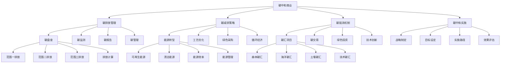

# 碳中和商业

## 🎯 学习目标
掌握碳中和商业理论，学会制定和实施碳中和战略，实现企业可持续发展目标。

## 📊 碳中和商业框架

### 碳中和模型

## 📊 碳排放管理

### 碳盘查
**范围一排放**：
- **直接排放**：企业直接排放
- **燃料燃烧**：燃料燃烧排放
- **工艺过程**：工艺过程排放
- **逸散排放**：逸散排放

**范围二排放**：
- **电力消耗**：电力消耗排放
- **热力消耗**：热力消耗排放
- **蒸汽消耗**：蒸汽消耗排放
- **制冷消耗**：制冷消耗排放

**范围三排放**：
- **供应链排放**：供应链排放
- **运输排放**：运输排放
- **员工通勤**：员工通勤排放
- **产品使用**：产品使用排放

**排放计算**：
- **计算方法**：排放计算方法
- **排放因子**：排放因子应用
- **活动数据**：活动数据收集
- **计算工具**：计算工具使用

### 碳监测
**监测体系**：
- **监测网络**：监测网络建设
- **监测设备**：监测设备配置
- **监测标准**：监测标准制定
- **监测流程**：监测流程管理

**监测技术**：
- **在线监测**：在线监测技术
- **离线监测**：离线监测技术
- **遥感监测**：遥感监测技术
- **智能监测**：智能监测技术

**监测数据**：
- **数据收集**：监测数据收集
- **数据处理**：监测数据处理
- **数据分析**：监测数据分析
- **数据应用**：监测数据应用

**监测管理**：
- **监测管理**：监测管理
- **质量控制**：监测质量控制
- **数据管理**：监测数据管理
- **效果评估**：监测效果评估

### 碳报告
**报告内容**：
- **排放清单**：排放清单报告
- **减排措施**：减排措施报告
- **目标进展**：目标进展报告
- **效果评估**：效果评估报告

**报告标准**：
- **报告标准**：报告标准
- **报告格式**：报告格式
- **报告周期**：报告周期
- **报告要求**：报告要求

**报告流程**：
- **数据收集**：报告数据收集
- **报告编制**：报告编制
- **报告审核**：报告审核
- **报告发布**：报告发布

**报告管理**：
- **报告管理**：报告管理
- **质量控制**：报告质量控制
- **版本管理**：报告版本管理
- **效果评估**：报告效果评估

### 碳管理
**管理体系**：
- **管理组织**：管理组织建设
- **管理制度**：管理制度建设
- **管理流程**：管理流程建设
- **管理工具**：管理工具建设

**管理内容**：
- **排放管理**：排放管理
- **减排管理**：减排管理
- **抵消管理**：抵消管理
- **目标管理**：目标管理

**管理方法**：
- **PDCA循环**：PDCA循环管理
- **风险管理**：风险管理方法
- **绩效管理**：绩效管理方法
- **持续改进**：持续改进方法

**管理工具**：
- **管理工具**：管理工具
- **信息系统**：信息系统工具
- **分析工具**：分析工具
- **决策工具**：决策工具

## 🌱 碳减排策略

### 能源转型
**可再生能源**：
- **太阳能**：太阳能应用
- **风能**：风能应用
- **水能**：水能应用
- **生物质能**：生物质能应用

**清洁能源**：
- **天然气**：天然气应用
- **氢能**：氢能应用
- **核能**：核能应用
- **地热能**：地热能应用

**能源效率**：
- **设备效率**：设备效率提升
- **系统效率**：系统效率提升
- **管理效率**：管理效率提升
- **使用效率**：使用效率提升

**能源管理**：
- **能源管理**：能源管理
- **能源监测**：能源监测
- **能源优化**：能源优化
- **能源节约**：能源节约

### 工艺优化
**工艺改进**：
- **工艺优化**：工艺优化
- **技术升级**：技术升级
- **设备更新**：设备更新
- **流程改进**：流程改进

**清洁生产**：
- **清洁技术**：清洁生产技术
- **清洁工艺**：清洁生产工艺
- **清洁设备**：清洁生产设备
- **清洁管理**：清洁生产管理

**循环利用**：
- **材料循环**：材料循环利用
- **能源循环**：能源循环利用
- **废物循环**：废物循环利用
- **水循环**：水循环利用

**技术创新**：
- **减排技术**：减排技术创新
- **节能技术**：节能技术创新
- **循环技术**：循环技术创新
- **碳捕集技术**：碳捕集技术

### 绿色采购
**供应商管理**：
- **供应商评估**：供应商环境评估
- **绿色标准**：绿色采购标准
- **供应商支持**：供应商绿色支持
- **供应商合作**：供应商绿色合作

**采购策略**：
- **绿色采购**：绿色采购策略
- **低碳采购**：低碳采购策略
- **循环采购**：循环采购策略
- **可持续采购**：可持续采购策略

**采购管理**：
- **采购管理**：绿色采购管理
- **成本管理**：采购成本管理
- **质量管理**：采购质量管理
- **风险管理**：采购风险管理

### 循环经济
**循环模式**：
- **产品循环**：产品循环模式
- **材料循环**：材料循环模式
- **能源循环**：能源循环模式
- **废物循环**：废物循环模式

**循环技术**：
- **循环技术**：循环经济技术
- **回收技术**：回收技术
- **处理技术**：处理技术
- **利用技术**：利用技术

**循环管理**：
- **循环管理**：循环经济管理
- **流程管理**：循环流程管理
- **质量管理**：循环质量管理
- **效果管理**：循环效果管理

## 🌳 碳抵消机制

### 碳汇项目
**森林碳汇**：
- **造林项目**：造林碳汇项目
- **森林保护**：森林保护项目
- **森林管理**：森林管理项目
- **森林恢复**：森林恢复项目

**海洋碳汇**：
- **海洋保护**：海洋保护项目
- **海洋修复**：海洋修复项目
- **海洋管理**：海洋管理项目
- **海洋监测**：海洋监测项目

**土壤碳汇**：
- **土壤保护**：土壤保护项目
- **土壤修复**：土壤修复项目
- **土壤管理**：土壤管理项目
- **土壤监测**：土壤监测项目

**技术碳汇**：
- **碳捕集**：碳捕集技术
- **碳封存**：碳封存技术
- **碳利用**：碳利用技术
- **碳转化**：碳转化技术

### 碳交易
**交易机制**：
- **碳配额**：碳配额交易
- **碳信用**：碳信用交易
- **碳期货**：碳期货交易
- **碳期权**：碳期权交易

**交易市场**：
- **国内市场**：国内碳交易市场
- **国际市场**：国际碳交易市场
- **区域市场**：区域碳交易市场
- **行业市场**：行业碳交易市场

**交易管理**：
- **交易管理**：碳交易管理
- **风险管理**：交易风险管理
- **合规管理**：交易合规管理
- **效果管理**：交易效果管理

### 绿色投资
**投资方向**：
- **清洁能源**：清洁能源投资
- **节能技术**：节能技术投资
- **循环经济**：循环经济投资
- **碳技术**：碳技术投资

**投资方式**：
- **直接投资**：直接投资
- **间接投资**：间接投资
- **股权投资**：股权投资
- **债权投资**：债权投资

**投资管理**：
- **投资管理**：绿色投资管理
- **风险管理**：投资风险管理
- **绩效管理**：投资绩效管理
- **效果评估**：投资效果评估

### 技术创新
**技术创新**：
- **减排技术**：减排技术创新
- **节能技术**：节能技术创新
- **循环技术**：循环技术创新
- **碳技术**：碳技术创新

**技术应用**：
- **技术应用**：技术应用
- **技术推广**：技术推广
- **技术转移**：技术转移
- **技术合作**：技术合作

**技术管理**：
- **技术管理**：技术管理
- **知识产权**：知识产权管理
- **技术保密**：技术保密管理
- **技术评估**：技术评估管理

## 🚀 碳中和实施

### 战略制定
**战略分析**：
- **现状分析**：碳中和现状分析
- **目标分析**：碳中和目标分析
- **资源分析**：资源能力分析
- **风险分析**：风险因素分析

**战略选择**：
- **战略方向**：碳中和战略方向
- **战略重点**：碳中和战略重点
- **战略路径**：碳中和战略路径
- **战略措施**：碳中和战略措施

**战略规划**：
- **战略目标**：碳中和战略目标
- **战略计划**：碳中和战略计划
- **资源配置**：资源配置计划
- **时间安排**：时间安排计划

### 目标设定
**目标类型**：
- **绝对目标**：绝对减排目标
- **相对目标**：相对减排目标
- **强度目标**：碳强度目标
- **时间目标**：时间节点目标

**目标设定**：
- **目标设定**：碳中和目标设定
- **目标分解**：目标分解
- **目标分配**：目标分配
- **目标调整**：目标调整

**目标管理**：
- **目标管理**：碳中和目标管理
- **目标监控**：目标监控
- **目标评估**：目标评估
- **目标改进**：目标改进

### 实施路径
**实施阶段**：
- **准备阶段**：实施准备阶段
- **启动阶段**：实施启动阶段
- **推进阶段**：实施推进阶段
- **完成阶段**：实施完成阶段

**实施措施**：
- **技术措施**：技术实施措施
- **管理措施**：管理实施措施
- **经济措施**：经济实施措施
- **政策措施**：政策实施措施

**实施保障**：
- **组织保障**：组织保障
- **资金保障**：资金保障
- **技术保障**：技术保障
- **政策保障**：政策保障

### 效果评估
**评估指标**：
- **减排指标**：减排效果指标
- **成本指标**：成本效益指标
- **环境指标**：环境效果指标
- **社会指标**：社会效果指标

**评估方法**：
- **定量评估**：定量评估方法
- **定性评估**：定性评估方法
- **对比评估**：对比评估方法
- **综合评估**：综合评估方法

**评估管理**：
- **评估管理**：效果评估管理
- **评估周期**：评估周期管理
- **评估报告**：评估报告管理
- **评估改进**：评估改进管理

## 💡 碳中和商业案例

### 成功案例
**苹果公司**：
- **碳中和目标**：2030年实现碳中和
- **减排策略**：供应链减排、产品设计优化
- **抵消措施**：森林保护、可再生能源
- **效果**：显著减少碳排放

**微软公司**：
- **碳中和目标**：2030年实现负碳排放
- **减排策略**：数据中心绿色化、办公场所节能
- **抵消措施**：碳捕集技术、森林保护
- **效果**：实现负碳排放

**特斯拉**：
- **碳中和目标**：推动电动汽车普及
- **减排策略**：电动汽车生产、太阳能应用
- **抵消措施**：超级充电站绿色化
- **效果**：推动交通领域减排

**谷歌**：
- **碳中和目标**：2007年实现碳中和
- **减排策略**：数据中心绿色化、办公场所节能
- **抵消措施**：可再生能源、碳抵消项目
- **效果**：持续保持碳中和

### 失败案例
**失败原因**：
- **目标过高**：碳中和目标过高
- **技术不成熟**：减排技术不成熟
- **成本过高**：实施成本过高
- **政策变化**：政策环境变化

**失败教训**：
- **目标设定**：设定合理目标
- **技术选择**：选择成熟技术
- **成本控制**：控制实施成本
- **风险应对**：应对政策风险

## 🧠 学习要点

### 费曼学习法应用
1. **选择概念**：碳中和商业
2. **简化解释**：用简单语言解释碳中和商业
3. **识别盲点**：找出理解不足的地方
4. **重新学习**：针对盲点深入学习

### 刻意练习要点
- **理论掌握**：掌握碳中和商业理论
- **方法应用**：掌握碳中和实施方法
- **案例分析**：分析成功失败案例
- **实践应用**：实践应用碳中和商业

## 🔗 关联学习

### 前置知识
- [[03-绿色供应链]] - 绿色供应链
- [[02-循环经济]] - 循环经济
- [[01-ESG投资]] - ESG投资

### 后续学习
- [[01-环境管理]] - 环境管理
- [[01-可持续发展]] - 可持续发展
- [[01-气候变化]] - 气候变化

### 实践应用
- 碳中和战略制定
- 碳中和实施管理
- 碳减排技术应用
- 碳中和效果评估

## 🎯 学习检验

### 理解检验
- [ ] 能够理解碳中和商业理论
- [ ] 能够掌握碳排放管理方法
- [ ] 能够分析碳减排策略
- [ ] 能够制定碳中和实施计划

### 应用检验
- [ ] 能够制定碳中和战略
- [ ] 能够实施碳中和措施
- [ ] 能够管理碳中和项目
- [ ] 能够评估碳中和效果

---
**下一步**：[[01-环境管理]] - 环境管理

