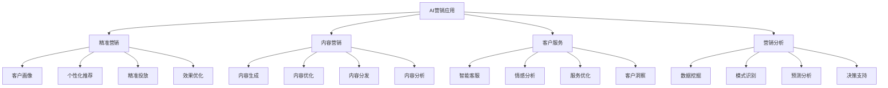

# AI在营销中的应用

## 🎯 学习目标
理解AI在营销中的应用，掌握AI营销工具和方法，学会AI营销策略。

## 📊 AI营销应用框架

### 应用领域

## 🎯 精准营销

### 客户画像
**画像构建**：
- **数据收集**：行为数据、偏好数据、社交数据
- **特征提取**：人口特征、行为特征、心理特征
- **画像生成**：客户标签、客户分群、客户画像
- **画像更新**：实时更新、动态调整、持续优化

**画像应用**：
- 精准定位
- 个性化服务
- 精准营销
- 客户管理

**技术实现**：
- 机器学习算法
- 大数据分析
- 实时计算
- 可视化展示

### 个性化推荐
**推荐算法**：
- **协同过滤**：基于用户行为相似性
- **内容过滤**：基于内容特征相似性
- **混合推荐**：多种算法结合
- **深度学习**：神经网络推荐

**推荐场景**：
- 商品推荐
- 内容推荐
- 服务推荐
- 活动推荐

**推荐优化**：
- 算法优化
- 效果评估
- A/B测试
- 持续改进

### 精准投放
**投放策略**：
- **人群定向**：年龄、性别、兴趣、行为
- **时间定向**：投放时间、频次控制
- **地域定向**：地理位置、区域特征
- **设备定向**：设备类型、操作系统

**投放优化**：
- 实时竞价
- 动态出价
- 效果优化
- 成本控制

**投放效果**：
- 点击率提升
- 转化率提升
- 成本降低
- ROI提升

## 📝 内容营销

### 内容生成
**生成技术**：
- **自然语言处理**：文本生成、语言理解
- **计算机视觉**：图像生成、视频制作
- **语音合成**：语音生成、语音转换
- **多模态生成**：文本+图像+视频

**生成内容**：
- 营销文案
- 产品描述
- 广告创意
- 社交媒体内容

**生成优化**：
- 内容质量
- 内容相关性
- 内容创新性
- 内容效果

### 内容优化
**优化维度**：
- **标题优化**：吸引力、相关性、点击率
- **内容优化**：可读性、相关性、价值性
- **关键词优化**：SEO优化、搜索排名
- **格式优化**：排版、图片、视频

**优化方法**：
- A/B测试
- 效果分析
- 用户反馈
- 持续优化

**优化效果**：
- 阅读量提升
- 互动率提升
- 转化率提升
- 品牌认知提升

### 内容分发
**分发策略**：
- **渠道选择**：社交媒体、搜索引擎、内容平台
- **时间优化**：最佳发布时间、频次控制
- **人群定向**：目标受众、兴趣匹配
- **内容适配**：渠道适配、格式适配

**分发优化**：
- 自动化分发
- 智能调度
- 效果监控
- 策略调整

## 🤖 客户服务

### 智能客服
**技术实现**：
- **自然语言处理**：理解用户意图、生成回复
- **知识图谱**：知识管理、问答系统
- **对话管理**：对话流程、上下文理解
- **情感分析**：情感识别、情感回应

**服务功能**：
- 自动问答
- 问题分类
- 智能路由
- 情感支持

**服务优化**：
- 准确率提升
- 响应速度
- 用户满意度
- 成本降低

### 情感分析
**分析维度**：
- **情感识别**：正面、负面、中性
- **情感强度**：情感程度、情感变化
- **情感原因**：情感触发因素
- **情感趋势**：情感变化趋势

**分析应用**：
- 客户满意度
- 品牌声誉
- 产品反馈
- 服务改进

**分析工具**：
- 文本情感分析
- 语音情感分析
- 图像情感分析
- 多模态情感分析

### 服务优化
**优化策略**：
- **个性化服务**：基于客户画像
- **预测服务**：预测客户需求
- **主动服务**：主动提供服务
- **全渠道服务**：多渠道整合

**优化效果**：
- 服务效率提升
- 客户满意度提升
- 服务成本降低
- 客户忠诚度提升

## 📊 营销分析

### 数据挖掘
**挖掘技术**：
- **关联分析**：发现数据关联关系
- **聚类分析**：客户分群、市场细分
- **分类分析**：客户分类、行为预测
- **异常检测**：异常行为、异常事件

**挖掘应用**：
- 客户行为分析
- 市场趋势分析
- 竞争分析
- 风险识别

**挖掘价值**：
- 洞察发现
- 决策支持
- 机会识别
- 风险预警

### 模式识别
**识别类型**：
- **行为模式**：购买行为、浏览行为
- **偏好模式**：产品偏好、品牌偏好
- **生命周期模式**：客户生命周期
- **趋势模式**：市场趋势、消费趋势

**识别方法**：
- 机器学习
- 深度学习
- 时间序列分析
- 模式匹配

**识别应用**：
- 客户预测
- 市场预测
- 需求预测
- 趋势预测

### 预测分析
**预测模型**：
- **回归模型**：线性回归、逻辑回归
- **时间序列**：ARIMA、LSTM
- **机器学习**：随机森林、支持向量机
- **深度学习**：神经网络、深度学习

**预测应用**：
- 销售预测
- 需求预测
- 客户流失预测
- 市场趋势预测

**预测优化**：
- 模型选择
- 参数调优
- 特征工程
- 模型评估

## 💡 实践应用

### AI营销实施
**实施步骤**：
1. **需求分析**：分析营销需求
2. **技术选择**：选择AI技术
3. **数据准备**：准备训练数据
4. **模型训练**：训练AI模型
5. **模型部署**：部署AI系统
6. **效果评估**：评估AI效果
7. **持续优化**：持续改进优化

### 案例分析
**选择案例**：如电商AI推荐系统
**分析维度**：
- 技术实现：推荐算法、数据处理
- 应用效果：推荐准确率、转化率
- 商业价值：销售提升、客户满意度
- 实施挑战：数据质量、技术复杂度

## 🧠 学习要点

### 费曼学习法应用
1. **选择概念**：AI营销应用
2. **简化解释**：用简单语言解释AI营销
3. **识别盲点**：找出理解不足的地方
4. **重新学习**：针对盲点深入学习

### 刻意练习要点
- **技术理解**：理解AI技术原理
- **应用掌握**：掌握AI营销应用
- **策略制定**：能够制定AI营销策略
- **实施管理**：能够管理AI营销实施

## 🔗 关联学习

### 前置知识
- [[01-4P营销理论]] - 营销基础
- [[02-数字营销]] - 数字营销
- [[01-人工智能与商业]] - AI基础

### 后续学习
- [[02-AI在运营中的应用]] - AI运营
- [[03-AI在财务中的应用]] - AI财务
- [[04-AI伦理与治理]] - AI伦理

### 实践应用
- AI营销策略制定
- AI营销系统实施
- AI营销效果评估
- AI营销持续优化

## 🎯 学习检验

### 理解检验
- [ ] 能够解释AI营销应用
- [ ] 能够掌握AI营销技术
- [ ] 能够制定AI营销策略
- [ ] 能够实施AI营销系统

### 应用检验
- [ ] 能够设计AI营销方案
- [ ] 能够实施AI营销项目
- [ ] 能够评估AI营销效果
- [ ] 能够优化AI营销系统

---
**下一步**：[[03-平台商业模式]] - 平台经济