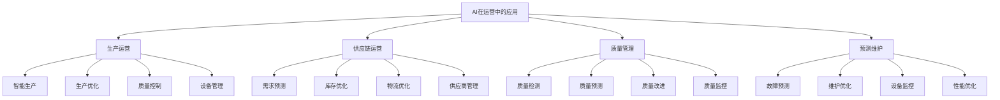

# AI在运营中的应用

## 🎯 学习目标
掌握人工智能在运营管理中的应用，学会运用AI技术优化运营流程，提升运营效率和智能化水平。

## 📊 AI运营应用框架

### 应用领域

## 🏭 生产运营

### 智能生产
**智能制造**：
- **智能工厂**：智能工厂建设
- **智能生产线**：智能生产线设计
- **智能设备**：智能设备应用
- **智能控制**：智能控制系统

**生产优化**：
- **生产计划**：AI驱动的生产计划
- **生产调度**：智能生产调度
- **资源配置**：智能资源配置
- **效率优化**：生产效率优化

**质量控制**：
- **实时检测**：实时质量检测
- **缺陷识别**：AI缺陷识别
- **质量预测**：质量趋势预测
- **质量改进**：质量改进建议

### 生产优化
**算法应用**：
- **优化算法**：生产优化算法
- **机器学习**：机器学习应用
- **深度学习**：深度学习应用
- **强化学习**：强化学习应用

**优化策略**：
- **成本优化**：生产成本优化
- **时间优化**：生产时间优化
- **质量优化**：生产质量优化
- **资源优化**：生产资源优化

**实施方法**：
- **数据收集**：生产数据收集
- **模型训练**：AI模型训练
- **系统集成**：系统集成实施
- **效果评估**：效果评估优化

## 📦 供应链运营

### 需求预测
**预测模型**：
- **时间序列**：时间序列预测
- **机器学习**：机器学习预测
- **深度学习**：深度学习预测
- **集成学习**：集成学习预测

**预测应用**：
- **销售预测**：销售需求预测
- **库存预测**：库存需求预测
- **采购预测**：采购需求预测
- **生产预测**：生产需求预测

**预测优化**：
- **准确性提升**：预测准确性提升
- **实时性增强**：预测实时性增强
- **适应性改进**：预测适应性改进
- **成本降低**：预测成本降低

### 库存优化
**优化算法**：
- **库存模型**：智能库存模型
- **优化算法**：库存优化算法
- **动态调整**：动态库存调整
- **风险控制**：库存风险控制

**优化策略**：
- **安全库存**：智能安全库存
- **订货策略**：智能订货策略
- **库存配置**：智能库存配置
- **成本优化**：库存成本优化

**实施效果**：
- **库存降低**：库存水平降低
- **缺货减少**：缺货情况减少
- **成本节约**：库存成本节约
- **效率提升**：库存效率提升

### 物流优化
**路径优化**：
- **路径规划**：智能路径规划
- **车辆调度**：智能车辆调度
- **配送优化**：智能配送优化
- **成本优化**：物流成本优化

**仓储优化**：
- **仓储布局**：智能仓储布局
- **作业优化**：智能作业优化
- **库存管理**：智能库存管理
- **效率提升**：仓储效率提升

**实时监控**：
- **位置跟踪**：实时位置跟踪
- **状态监控**：实时状态监控
- **异常预警**：异常情况预警
- **决策支持**：实时决策支持

## 🔍 质量管理

### 质量检测
**智能检测**：
- **视觉检测**：AI视觉检测
- **声音检测**：AI声音检测
- **振动检测**：AI振动检测
- **温度检测**：AI温度检测

**检测技术**：
- **计算机视觉**：计算机视觉技术
- **模式识别**：模式识别技术
- **信号处理**：信号处理技术
- **传感器融合**：传感器融合技术

**检测应用**：
- **产品检测**：产品质量检测
- **过程检测**：生产过程检测
- **设备检测**：设备状态检测
- **环境检测**：环境质量检测

### 质量预测
**预测模型**：
- **质量模型**：质量预测模型
- **趋势分析**：质量趋势分析
- **异常检测**：质量异常检测
- **风险评估**：质量风险评估

**预测应用**：
- **质量预警**：质量预警系统
- **质量改进**：质量改进建议
- **质量优化**：质量优化策略
- **质量决策**：质量决策支持

**预测效果**：
- **准确性提升**：预测准确性提升
- **及时性增强**：预测及时性增强
- **成本降低**：质量成本降低
- **效率提升**：质量效率提升

## 🔧 预测维护

### 故障预测
**预测技术**：
- **机器学习**：机器学习预测
- **深度学习**：深度学习预测
- **时间序列**：时间序列预测
- **异常检测**：异常检测技术

**预测模型**：
- **故障模型**：故障预测模型
- **寿命模型**：设备寿命模型
- **性能模型**：性能预测模型
- **维护模型**：维护需求模型

**预测应用**：
- **设备监控**：设备状态监控
- **故障预警**：故障预警系统
- **维护计划**：智能维护计划
- **资源优化**：维护资源优化

### 维护优化
**维护策略**：
- **预防维护**：预防性维护
- **预测维护**：预测性维护
- **条件维护**：基于条件的维护
- **可靠性维护**：可靠性维护

**维护优化**：
- **维护计划**：维护计划优化
- **维护资源**：维护资源优化
- **维护成本**：维护成本优化
- **维护效果**：维护效果优化

**维护管理**：
- **维护记录**：维护记录管理
- **维护分析**：维护数据分析
- **维护改进**：维护流程改进
- **维护创新**：维护技术创新

## 💡 实践应用

### AI运营实施流程
1. **需求分析**：分析运营需求
2. **技术选择**：选择AI技术
3. **系统设计**：设计AI系统
4. **系统实施**：实施AI系统
5. **效果评估**：评估实施效果

### 案例分析
**选择案例**：如特斯拉智能制造
**分析维度**：
- 生产运营：智能生产、生产优化、质量控制
- 供应链运营：需求预测、库存优化、物流优化
- 质量管理：质量检测、质量预测、质量改进
- 预测维护：故障预测、维护优化、设备管理

## 🧠 学习要点

### 费曼学习法应用
1. **选择概念**：AI在运营中的应用
2. **简化解释**：用简单语言解释AI运营应用
3. **识别盲点**：找出理解不足的地方
4. **重新学习**：针对盲点深入学习

### 刻意练习要点
- **技术理解**：理解AI技术原理
- **应用能力**：提升AI应用能力
- **系统思维**：培养系统思维
- **创新实践**：创新实践应用

## 🔗 关联学习

### 前置知识
- [[01-AI在营销中的应用]] - AI营销应用
- [[01-运营管理概论]] - 运营管理基础
- [[01-供应链管理]] - 供应链管理

### 后续学习
- [[03-AI在财务中的应用]] - AI财务应用
- [[04-AI伦理与治理]] - AI伦理治理
- [[01-数字化转型]] - 数字化转型

### 实践应用
- AI运营系统设计
- AI运营流程优化
- AI运营效果评估
- AI运营创新实践

## 🎯 学习检验

### 理解检验
- [ ] 能够理解AI运营应用原理
- [ ] 能够掌握AI运营技术
- [ ] 能够设计AI运营系统
- [ ] 能够评估AI运营效果

### 应用检验
- [ ] 能够实施AI运营项目
- [ ] 能够优化AI运营流程
- [ ] 能够解决AI运营问题
- [ ] 能够创新AI运营模式

---
**下一步**：[[03-AI在财务中的应用]] - AI财务应用

