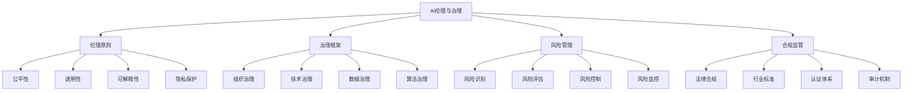

# AI伦理与治理

## 🎯 学习目标
掌握人工智能伦理与治理理论，学会制定AI伦理准则，建立AI治理体系，确保AI技术的负责任发展。

## 📊 AI伦理与治理框架

### 治理要素

## ⚖️ 伦理原则

### 公平性
**公平性原则**：
- **算法公平**：算法决策公平性
- **数据公平**：数据使用公平性
- **结果公平**：AI结果公平性
- **机会公平**：AI机会公平性

**公平性挑战**：
- **偏见问题**：算法偏见问题
- **歧视问题**：算法歧视问题
- **不平等问题**：AI加剧不平等
- **代表性不足**：数据代表性不足

**公平性保障**：
- **偏见检测**：算法偏见检测
- **偏见纠正**：算法偏见纠正
- **公平性测试**：公平性测试方法
- **公平性监控**：公平性持续监控

### 透明性
**透明性原则**：
- **算法透明**：算法逻辑透明
- **数据透明**：数据来源透明
- **决策透明**：决策过程透明
- **结果透明**：结果解释透明

**透明性要求**：
- **可理解性**：AI系统可理解
- **可追溯性**：决策可追溯
- **可验证性**：结果可验证
- **可审计性**：过程可审计

**透明性实现**：
- **文档化**：系统文档化
- **可视化**：过程可视化
- **解释性**：结果解释性
- **开放性**：系统开放性

### 可解释性
**可解释性要求**：
- **决策解释**：决策过程解释
- **结果解释**：结果原因解释
- **模型解释**：模型逻辑解释
- **影响解释**：影响范围解释

**可解释性技术**：
- **LIME**：局部可解释性
- **SHAP**：SHAP值解释
- **注意力机制**：注意力可视化
- **反事实解释**：反事实解释

**可解释性应用**：
- **医疗AI**：医疗AI解释
- **金融AI**：金融AI解释
- **法律AI**：法律AI解释
- **自动驾驶**：自动驾驶解释

### 隐私保护
**隐私保护原则**：
- **数据最小化**：数据收集最小化
- **目的限制**：数据使用目的限制
- **存储限制**：数据存储时间限制
- **访问控制**：数据访问控制

**隐私保护技术**：
- **差分隐私**：差分隐私技术
- **联邦学习**：联邦学习技术
- **同态加密**：同态加密技术
- **安全多方计算**：安全多方计算

**隐私保护应用**：
- **数据脱敏**：数据脱敏处理
- **匿名化**：数据匿名化
- **加密存储**：数据加密存储
- **访问控制**：访问权限控制

## 🏛️ 治理框架

### 组织治理
**治理结构**：
- **治理委员会**：AI治理委员会
- **伦理委员会**：AI伦理委员会
- **技术委员会**：AI技术委员会
- **风险委员会**：AI风险委员会

**治理职责**：
- **战略制定**：AI战略制定
- **政策制定**：AI政策制定
- **标准制定**：AI标准制定
- **监督执行**：AI监督执行

**治理流程**：
- **决策流程**：AI决策流程
- **审批流程**：AI审批流程
- **监控流程**：AI监控流程
- **评估流程**：AI评估流程

### 技术治理
**技术标准**：
- **技术规范**：AI技术规范
- **质量标准**：AI质量标准
- **安全标准**：AI安全标准
- **性能标准**：AI性能标准

**技术管理**：
- **技术选型**：AI技术选型
- **技术评估**：AI技术评估
- **技术监控**：AI技术监控
- **技术更新**：AI技术更新

**技术保障**：
- **技术安全**：AI技术安全
- **技术可靠**：AI技术可靠性
- **技术可维护**：AI技术可维护性
- **技术可扩展**：AI技术可扩展性

### 数据治理
**数据管理**：
- **数据收集**：数据收集管理
- **数据存储**：数据存储管理
- **数据处理**：数据处理管理
- **数据使用**：数据使用管理

**数据质量**：
- **数据准确性**：数据准确性保障
- **数据完整性**：数据完整性保障
- **数据一致性**：数据一致性保障
- **数据时效性**：数据时效性保障

**数据安全**：
- **数据加密**：数据加密保护
- **数据备份**：数据备份恢复
- **数据访问**：数据访问控制
- **数据审计**：数据使用审计

### 算法治理
**算法管理**：
- **算法设计**：算法设计管理
- **算法开发**：算法开发管理
- **算法测试**：算法测试管理
- **算法部署**：算法部署管理

**算法监控**：
- **性能监控**：算法性能监控
- **行为监控**：算法行为监控
- **偏差监控**：算法偏差监控
- **影响监控**：算法影响监控

**算法更新**：
- **模型更新**：模型更新机制
- **参数调整**：参数调整机制
- **版本管理**：版本管理机制
- **回滚机制**：回滚机制

## ⚠️ 风险管理

### 风险识别
**技术风险**：
- **算法风险**：算法技术风险
- **数据风险**：数据质量风险
- **系统风险**：系统安全风险
- **性能风险**：系统性能风险

**伦理风险**：
- **偏见风险**：算法偏见风险
- **歧视风险**：算法歧视风险
- **隐私风险**：隐私泄露风险
- **公平性风险**：公平性风险

**社会风险**：
- **就业风险**：就业替代风险
- **社会分化**：社会分化风险
- **权力集中**：权力集中风险
- **民主风险**：民主制度风险

**法律风险**：
- **合规风险**：法律合规风险
- **责任风险**：法律责任风险
- **知识产权风险**：知识产权风险
- **监管风险**：监管政策风险

### 风险评估
**评估方法**：
- **定性评估**：风险定性评估
- **定量评估**：风险定量评估
- **概率评估**：风险概率评估
- **影响评估**：风险影响评估

**评估工具**：
- **风险矩阵**：风险矩阵工具
- **风险地图**：风险地图工具
- **风险仪表板**：风险仪表板
- **风险模型**：风险预测模型

**评估流程**：
- **风险识别**：风险识别流程
- **风险分析**：风险分析流程
- **风险评价**：风险评价流程
- **风险报告**：风险报告流程

### 风险控制
**控制策略**：
- **风险规避**：风险规避策略
- **风险减轻**：风险减轻策略
- **风险转移**：风险转移策略
- **风险接受**：风险接受策略

**控制措施**：
- **技术控制**：技术控制措施
- **管理控制**：管理控制措施
- **制度控制**：制度控制措施
- **文化控制**：文化控制措施

**控制监控**：
- **实时监控**：风险实时监控
- **定期评估**：风险定期评估
- **预警机制**：风险预警机制
- **应急响应**：风险应急响应

## 📋 合规监管

### 法律合规
**法律法规**：
- **数据保护法**：数据保护法律法规
- **算法监管法**：算法监管法律法规
- **AI伦理法**：AI伦理法律法规
- **责任认定法**：AI责任认定法律

**合规要求**：
- **数据合规**：数据使用合规
- **算法合规**：算法应用合规
- **伦理合规**：AI伦理合规
- **责任合规**：AI责任合规

**合规管理**：
- **合规检查**：合规性检查
- **合规培训**：合规培训教育
- **合规监控**：合规性监控
- **合规报告**：合规性报告

### 行业标准
**技术标准**：
- **AI技术标准**：AI技术行业标准
- **数据标准**：数据行业标准
- **算法标准**：算法行业标准
- **安全标准**：AI安全行业标准

**伦理标准**：
- **AI伦理标准**：AI伦理行业标准
- **公平性标准**：公平性行业标准
- **透明性标准**：透明性行业标准
- **可解释性标准**：可解释性行业标准

**管理标准**：
- **治理标准**：AI治理行业标准
- **风险管理标准**：风险管理行业标准
- **质量管理标准**：质量管理行业标准
- **审计标准**：AI审计行业标准

### 认证体系
**认证类型**：
- **技术认证**：AI技术认证
- **伦理认证**：AI伦理认证
- **安全认证**：AI安全认证
- **质量认证**：AI质量认证

**认证流程**：
- **申请认证**：认证申请流程
- **评估认证**：认证评估流程
- **审核认证**：认证审核流程
- **颁发认证**：认证颁发流程

**认证管理**：
- **认证维护**：认证维护管理
- **认证更新**：认证更新管理
- **认证监督**：认证监督管理
- **认证撤销**：认证撤销管理

## 💡 实践应用

### AI伦理治理实施流程
1. **伦理原则制定**：制定AI伦理原则
2. **治理框架建立**：建立AI治理框架
3. **风险管理实施**：实施AI风险管理
4. **合规监管执行**：执行合规监管
5. **持续改进优化**：持续改进优化

### 案例分析
**选择案例**：如谷歌AI伦理治理
**分析维度**：
- 伦理原则：公平性、透明性、可解释性、隐私保护
- 治理框架：组织治理、技术治理、数据治理、算法治理
- 风险管理：风险识别、风险评估、风险控制
- 合规监管：法律合规、行业标准、认证体系

## 🧠 学习要点

### 费曼学习法应用
1. **选择概念**：AI伦理与治理
2. **简化解释**：用简单语言解释AI伦理治理
3. **识别盲点**：找出理解不足的地方
4. **重新学习**：针对盲点深入学习

### 刻意练习要点
- **伦理理解**：理解AI伦理原则
- **治理能力**：提升AI治理能力
- **风险意识**：培养AI风险意识
- **合规实践**：实践AI合规管理

## 🔗 关联学习

### 前置知识
- [[03-AI在财务中的应用]] - AI财务应用
- [[02-AI在运营中的应用]] - AI运营应用
- [[01-AI在营销中的应用]] - AI营销应用

### 后续学习
- [[01-可持续发展商业]] - 可持续发展商业
- [[01-数字化转型]] - 数字化转型
- [[01-商业伦理基础]] - 商业伦理基础

### 实践应用
- AI伦理准则制定
- AI治理体系建立
- AI风险管理实施
- AI合规监管执行

## 🎯 学习检验

### 理解检验
- [ ] 能够理解AI伦理原则
- [ ] 能够掌握AI治理框架
- [ ] 能够识别AI风险
- [ ] 能够执行AI合规

### 应用检验
- [ ] 能够制定AI伦理准则
- [ ] 能够建立AI治理体系
- [ ] 能够管理AI风险
- [ ] 能够确保AI合规

---
**下一步**：[[01-可持续发展商业]] - 可持续发展商业

