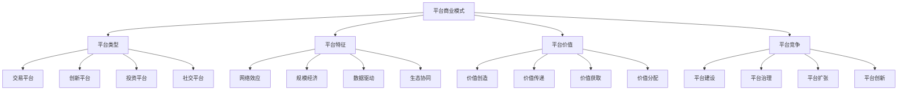

# 平台商业模式

## 🎯 学习目标
理解平台商业模式，掌握平台经济规律，学会平台商业策略。

## 📊 平台商业模式框架

### 平台要素

## 🏪 平台类型

### 交易平台
**平台特征**：
- **双边市场**：连接买家和卖家
- **交易撮合**：提供交易服务
- **价值创造**：降低交易成本
- **网络效应**：用户越多价值越大

**典型平台**：
- **电商平台**：淘宝、京东、亚马逊
- **出行平台**：滴滴、Uber、Lyft
- **住宿平台**：Airbnb、Booking
- **外卖平台**：美团、饿了么

**商业模式**：
- 交易佣金
- 广告收入
- 增值服务
- 数据变现

### 创新平台
**平台特征**：
- **创新生态**：连接创新者和用户
- **技术支撑**：提供技术基础设施
- **创新激励**：激励创新活动
- **价值共享**：创新价值共享

**典型平台**：
- **应用商店**：App Store、Google Play
- **云平台**：AWS、Azure、阿里云
- **开发平台**：GitHub、Stack Overflow
- **创新平台**：Kickstarter、Indiegogo

**商业模式**：
- 平台分成
- 技术服务费
- 订阅服务
- 创新投资

### 投资平台
**平台特征**：
- **资金撮合**：连接投资人和项目
- **风险评估**：提供风险评估服务
- **投资管理**：提供投资管理服务
- **收益分配**：投资收益分配

**典型平台**：
- **众筹平台**：Kickstarter、Indiegogo
- **P2P平台**：Lending Club、陆金所
- **股权平台**：AngelList、36氪
- **基金平台**：蚂蚁财富、天天基金

**商业模式**：
- 交易佣金
- 管理费
- 绩效费
- 增值服务

### 社交平台
**平台特征**：
- **社交网络**：连接用户和内容
- **内容创造**：用户创造内容
- **社交互动**：用户互动交流
- **网络效应**：社交网络价值

**典型平台**：
- **社交媒体**：Facebook、Twitter、微博
- **视频平台**：YouTube、抖音、快手
- **知识平台**：知乎、Quora、Stack Overflow
- **职业平台**：LinkedIn、脉脉

**商业模式**：
- 广告收入
- 会员服务
- 内容付费
- 电商变现

## 🔗 网络效应

### 网络效应类型
**直接网络效应**：
- 用户数量增加直接提升价值
- 如电话网络、社交网络
- 用户越多，每个用户价值越大
- 形成正向循环

**间接网络效应**：
- 一边用户增加提升另一边价值
- 如平台上的买家和卖家
- 买家越多，卖家价值越大
- 形成双边网络效应

**数据网络效应**：
- 数据积累提升平台价值
- 如搜索引擎、推荐系统
- 数据越多，服务越好
- 形成数据优势

**生态网络效应**：
- 生态系统整体价值提升
- 如苹果生态、谷歌生态
- 生态越完善，价值越大
- 形成生态优势

### 网络效应价值
**价值创造**：
- 降低交易成本
- 提高匹配效率
- 创造新价值
- 扩大市场规模

**价值分配**：
- 平台价值
- 用户价值
- 生态价值
- 社会价值

**价值获取**：
- 平台收费
- 数据变现
- 生态分成
- 创新收益

## 📈 规模经济

### 规模经济来源
**技术规模经济**：
- 技术成本分摊
- 技术效率提升
- 技术标准化
- 技术优化

**运营规模经济**：
- 运营成本降低
- 运营效率提升
- 运营标准化
- 运营优化

**数据规模经济**：
- 数据成本降低
- 数据价值提升
- 数据标准化
- 数据优化

**网络规模经济**：
- 网络成本降低
- 网络价值提升
- 网络效应增强
- 网络优化

### 规模经济效应
**成本效应**：
- 边际成本递减
- 平均成本降低
- 固定成本分摊
- 运营效率提升

**价值效应**：
- 网络价值提升
- 服务质量改善
- 用户体验优化
- 创新效率提升

**竞争效应**：
- 竞争优势增强
- 市场地位提升
- 进入壁垒提高
- 竞争格局改变

## 📊 数据驱动

### 数据价值
**数据资产**：
- 用户数据
- 交易数据
- 行为数据
- 内容数据

**数据应用**：
- 个性化服务
- 精准营销
- 智能推荐
- 风险控制

**数据变现**：
- 数据服务
- 数据产品
- 数据广告
- 数据投资

### 数据驱动决策
**决策支持**：
- 数据收集
- 数据分析
- 数据洞察
- 决策制定

**决策优化**：
- 实时决策
- 智能决策
- 预测决策
- 优化决策

**决策效果**：
- 决策准确性
- 决策效率
- 决策成本
- 决策价值

## 🌐 生态协同

### 生态构成
**核心平台**：
- 平台基础设施
- 平台服务能力
- 平台治理规则
- 平台价值分配

**生态伙伴**：
- 技术伙伴
- 服务伙伴
- 内容伙伴
- 渠道伙伴

**生态用户**：
- 平台用户
- 生态用户
- 潜在用户
- 流失用户

### 生态协同
**协同机制**：
- 价值共创
- 资源共享
- 风险共担
- 收益共享

**协同效应**：
- 整体价值提升
- 个体价值提升
- 创新效率提升
- 竞争能力提升

**协同管理**：
- 生态治理
- 伙伴管理
- 价值分配
- 风险控制

## 🏗️ 平台建设

### 平台设计
**架构设计**：
- 技术架构
- 业务架构
- 数据架构
- 安全架构

**功能设计**：
- 核心功能
- 增值功能
- 扩展功能
- 创新功能

**体验设计**：
- 用户界面
- 用户体验
- 交互设计
- 视觉设计

### 平台开发
**开发方法**：
- 敏捷开发
- 迭代开发
- 持续集成
- 持续部署

**开发技术**：
- 云计算
- 大数据
- 人工智能
- 移动互联网

**开发管理**：
- 项目管理
- 质量管理
- 风险管理
- 团队管理

## 🛡️ 平台治理

### 治理框架
**治理结构**：
- 治理主体
- 治理规则
- 治理机制
- 治理监督

**治理内容**：
- 用户治理
- 内容治理
- 交易治理
- 数据治理

**治理方法**：
- 规则治理
- 技术治理
- 社区治理
- 自律治理

### 治理策略
**用户治理**：
- 用户准入
- 用户行为
- 用户权益
- 用户服务

**内容治理**：
- 内容审核
- 内容质量
- 内容安全
- 内容创新

**交易治理**：
- 交易安全
- 交易公平
- 交易效率
- 交易纠纷

## 💡 实践应用

### 平台战略制定
**战略分析**：
- 市场分析
- 竞争分析
- 技术分析
- 用户分析

**战略制定**：
- 平台定位
- 平台策略
- 平台规划
- 平台实施

**战略实施**：
- 平台建设
- 平台运营
- 平台治理
- 平台优化

### 案例分析
**选择案例**：如微信平台
**分析维度**：
- 平台类型：社交平台+生态平台
- 网络效应：直接网络效应+间接网络效应
- 商业模式：广告+支付+生态分成
- 竞争优势：用户规模+生态协同

## 🧠 学习要点

### 费曼学习法应用
1. **选择概念**：平台商业模式
2. **简化解释**：用简单语言解释平台模式
3. **识别盲点**：找出理解不足的地方
4. **重新学习**：针对盲点深入学习

### 刻意练习要点
- **概念理解**：准确理解平台模式
- **规律掌握**：掌握平台经济规律
- **策略制定**：能够制定平台策略
- **实施管理**：能够管理平台实施

## 🔗 关联学习

### 前置知识
- [[01-商业模式画布]] - 商业模式
- [[01-数字化战略]] - 数字化转型
- [[01-网络效应]] - 网络效应

### 后续学习
- [[02-网络效应]] - 网络效应
- [[03-平台治理]] - 平台治理
- [[04-平台竞争策略]] - 竞争策略

### 实践应用
- 平台商业模式设计
- 平台战略制定
- 平台运营管理
- 平台治理优化

## 🎯 学习检验

### 理解检验
- [ ] 能够解释平台商业模式
- [ ] 能够分析平台经济规律
- [ ] 能够制定平台策略
- [ ] 能够管理平台实施

### 应用检验
- [ ] 能够设计平台商业模式
- [ ] 能够制定平台战略
- [ ] 能够运营平台业务
- [ ] 能够治理平台生态

---
**下一步**：完成知识体系学习