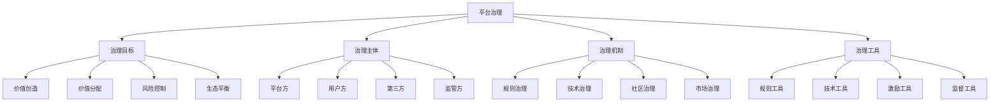

# 平台治理

## 🎯 学习目标
掌握平台治理理论和方法，学会设计平台治理机制，建立有效的平台治理体系，确保平台健康可持续发展。

## 📊 平台治理框架

### 治理要素

## 🎯 治理目标

### 价值创造
**价值创造目标**：
- **用户价值**：为用户创造价值
- **平台价值**：为平台创造价值
- **生态价值**：为生态创造价值
- **社会价值**：为社会创造价值

**价值创造机制**：
- **网络效应**：网络效应价值创造
- **规模效应**：规模效应价值创造
- **协同效应**：协同效应价值创造
- **创新效应**：创新效应价值创造

**价值创造优化**：
- **价值识别**：价值机会识别
- **价值设计**：价值创造设计
- **价值实现**：价值创造实现
- **价值评估**：价值创造评估

### 价值分配
**价值分配原则**：
- **公平原则**：价值分配公平性
- **效率原则**：价值分配效率性
- **激励原则**：价值分配激励性
- **可持续原则**：价值分配可持续性

**价值分配机制**：
- **收益分配**：收益分配机制
- **成本分担**：成本分担机制
- **风险分担**：风险分担机制
- **责任分担**：责任分担机制

**价值分配优化**：
- **分配公平**：分配公平性优化
- **分配效率**：分配效率性优化
- **分配激励**：分配激励性优化
- **分配可持续**：分配可持续性优化

### 风险控制
**风险类型**：
- **技术风险**：平台技术风险
- **市场风险**：平台市场风险
- **运营风险**：平台运营风险
- **合规风险**：平台合规风险

**风险控制机制**：
- **风险识别**：风险识别机制
- **风险评估**：风险评估机制
- **风险控制**：风险控制机制
- **风险监控**：风险监控机制

**风险控制优化**：
- **风险预防**：风险预防措施
- **风险减轻**：风险减轻措施
- **风险转移**：风险转移措施
- **风险应对**：风险应对措施

### 生态平衡
**生态平衡目标**：
- **供需平衡**：供需关系平衡
- **竞争平衡**：竞争关系平衡
- **利益平衡**：利益关系平衡
- **发展平衡**：发展关系平衡

**生态平衡机制**：
- **市场机制**：市场调节机制
- **规则机制**：规则约束机制
- **技术机制**：技术调节机制
- **社区机制**：社区自治机制

**生态平衡优化**：
- **平衡监测**：生态平衡监测
- **平衡调节**：生态平衡调节
- **平衡维护**：生态平衡维护
- **平衡发展**：生态平衡发展

## 👥 治理主体

### 平台方
**平台方职责**：
- **平台建设**：平台基础设施建设
- **规则制定**：平台规则制定
- **服务提供**：平台服务提供
- **生态维护**：平台生态维护

**平台方权力**：
- **规则制定权**：平台规则制定权
- **准入控制权**：用户准入控制权
- **行为监管权**：用户行为监管权
- **争议裁决权**：争议裁决权

**平台方约束**：
- **法律约束**：法律法规约束
- **市场约束**：市场竞争约束
- **用户约束**：用户选择约束
- **社会约束**：社会责任约束

### 用户方
**用户方权利**：
- **参与权**：平台参与权
- **选择权**：服务选择权
- **知情权**：信息知情权
- **监督权**：平台监督权

**用户方义务**：
- **合规义务**：平台规则遵守
- **诚信义务**：诚信经营义务
- **质量义务**：服务质量义务
- **责任义务**：行为责任义务

**用户方参与**：
- **规则参与**：规则制定参与
- **治理参与**：平台治理参与
- **监督参与**：平台监督参与
- **创新参与**：平台创新参与

### 第三方
**第三方类型**：
- **服务提供商**：第三方服务提供商
- **技术提供商**：第三方技术提供商
- **数据提供商**：第三方数据提供商
- **监管机构**：第三方监管机构

**第三方作用**：
- **服务补充**：平台服务补充
- **技术支撑**：平台技术支撑
- **数据支持**：平台数据支持
- **监管监督**：平台监管监督

**第三方管理**：
- **准入管理**：第三方准入管理
- **质量管理**：第三方质量管理
- **关系管理**：第三方关系管理
- **风险管理**：第三方风险管理

### 监管方
**监管方职责**：
- **规则监管**：平台规则监管
- **行为监管**：平台行为监管
- **市场监管**：平台市场监管
- **社会监管**：平台社会监管

**监管方权力**：
- **规则制定权**：监管规则制定权
- **执法权**：监管执法权
- **处罚权**：监管处罚权
- **监督权**：监管监督权

**监管方约束**：
- **法律约束**：监管法律约束
- **程序约束**：监管程序约束
- **责任约束**：监管责任约束
- **效果约束**：监管效果约束

## ⚙️ 治理机制

### 规则治理
**规则类型**：
- **准入规则**：平台准入规则
- **行为规则**：用户行为规则
- **交易规则**：平台交易规则
- **争议规则**：争议解决规则

**规则制定**：
- **规则设计**：规则内容设计
- **规则制定**：规则制定流程
- **规则审议**：规则审议机制
- **规则发布**：规则发布机制

**规则执行**：
- **规则宣传**：规则宣传教育
- **规则监督**：规则执行监督
- **规则执行**：规则执行机制
- **规则评估**：规则效果评估

### 技术治理
**技术手段**：
- **算法治理**：算法治理技术
- **数据治理**：数据治理技术
- **安全治理**：安全治理技术
- **监控治理**：监控治理技术

**技术应用**：
- **智能监管**：智能监管技术
- **自动化治理**：自动化治理技术
- **预测治理**：预测治理技术
- **优化治理**：优化治理技术

**技术管理**：
- **技术标准**：技术标准制定
- **技术评估**：技术效果评估
- **技术更新**：技术更新机制
- **技术安全**：技术安全管理

### 社区治理
**社区参与**：
- **社区建设**：社区建设机制
- **社区管理**：社区管理机制
- **社区自治**：社区自治机制
- **社区监督**：社区监督机制

**社区机制**：
- **投票机制**：社区投票机制
- **讨论机制**：社区讨论机制
- **反馈机制**：社区反馈机制
- **评价机制**：社区评价机制

**社区文化**：
- **社区文化**：社区文化建设
- **社区规范**：社区行为规范
- **社区价值**：社区价值观念
- **社区精神**：社区精神建设

### 市场治理
**市场机制**：
- **价格机制**：市场价格机制
- **竞争机制**：市场竞争机制
- **供求机制**：市场供求机制
- **信用机制**：市场信用机制

**市场调节**：
- **市场调节**：市场自动调节
- **政策调节**：政策调节机制
- **技术调节**：技术调节机制
- **社会调节**：社会调节机制

**市场监管**：
- **市场监测**：市场运行监测
- **市场分析**：市场分析评估
- **市场干预**：市场干预机制
- **市场优化**：市场优化机制

## 🛠️ 治理工具

### 规则工具
**规则工具类型**：
- **准入工具**：准入控制工具
- **行为工具**：行为约束工具
- **交易工具**：交易管理工具
- **争议工具**：争议解决工具

**规则工具应用**：
- **规则执行**：规则执行工具
- **规则监督**：规则监督工具
- **规则评估**：规则评估工具
- **规则优化**：规则优化工具

### 技术工具
**技术工具类型**：
- **监控工具**：平台监控工具
- **分析工具**：数据分析工具
- **预警工具**：风险预警工具
- **决策工具**：决策支持工具

**技术工具应用**：
- **智能治理**：智能治理工具
- **自动化治理**：自动化治理工具
- **预测治理**：预测治理工具
- **优化治理**：优化治理工具

### 激励工具
**激励工具类型**：
- **经济激励**：经济激励工具
- **声誉激励**：声誉激励工具
- **权利激励**：权利激励工具
- **机会激励**：机会激励工具

**激励工具应用**：
- **正向激励**：正向激励工具
- **负向激励**：负向激励工具
- **平衡激励**：平衡激励工具
- **动态激励**：动态激励工具

### 监督工具
**监督工具类型**：
- **内部监督**：内部监督工具
- **外部监督**：外部监督工具
- **社会监督**：社会监督工具
- **技术监督**：技术监督工具

**监督工具应用**：
- **实时监督**：实时监督工具
- **定期监督**：定期监督工具
- **专项监督**：专项监督工具
- **综合监督**：综合监督工具

## 💡 实践应用

### 平台治理实施流程
1. **治理目标设定**：设定平台治理目标
2. **治理主体确定**：确定治理主体
3. **治理机制设计**：设计治理机制
4. **治理工具选择**：选择治理工具
5. **治理效果评估**：评估治理效果

### 案例分析
**选择案例**：如淘宝平台治理
**分析维度**：
- 治理目标：价值创造、价值分配、风险控制、生态平衡
- 治理主体：平台方、用户方、第三方、监管方
- 治理机制：规则治理、技术治理、社区治理、市场治理
- 治理工具：规则工具、技术工具、激励工具、监督工具

## 🧠 学习要点

### 费曼学习法应用
1. **选择概念**：平台治理
2. **简化解释**：用简单语言解释平台治理
3. **识别盲点**：找出理解不足的地方
4. **重新学习**：针对盲点深入学习

### 刻意练习要点
- **理论理解**：理解平台治理理论
- **机制设计**：设计平台治理机制
- **工具应用**：应用平台治理工具
- **实践能力**：提升平台治理实践能力

## 🔗 关联学习

### 前置知识
- [[02-网络效应]] - 网络效应
- [[01-平台商业模式]] - 平台商业模式
- [[01-战略管理概论]] - 战略管理

### 后续学习
- [[04-平台竞争策略]] - 平台竞争策略
- [[01-数字化转型]] - 数字化转型
- [[01-商业伦理基础]] - 商业伦理基础

### 实践应用
- 平台治理体系设计
- 平台治理机制建立
- 平台治理工具应用
- 平台治理效果评估

## 🎯 学习检验

### 理解检验
- [ ] 能够理解平台治理理论
- [ ] 能够设计平台治理机制
- [ ] 能够选择平台治理工具
- [ ] 能够评估平台治理效果

### 应用检验
- [ ] 能够建立平台治理体系
- [ ] 能够实施平台治理机制
- [ ] 能够应用平台治理工具
- [ ] 能够优化平台治理效果

---
**下一步**：[[04-平台竞争策略]] - 平台竞争策略

