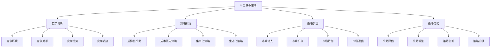

# 平台竞争策略

## 🎯 学习目标
掌握平台竞争策略理论和方法，学会制定平台竞争策略，构建平台竞争优势，实现平台可持续发展。

## 📊 平台竞争策略框架

### 策略要素

## 🔍 竞争分析

### 竞争环境
**宏观环境**：
- **政治环境**：政治政策环境
- **经济环境**：经济发展环境
- **社会环境**：社会文化环境
- **技术环境**：技术发展环境

**行业环境**：
- **行业结构**：平台行业结构
- **行业趋势**：平台行业趋势
- **行业壁垒**：平台行业壁垒
- **行业机会**：平台行业机会

**竞争环境**：
- **竞争强度**：平台竞争强度
- **竞争格局**：平台竞争格局
- **竞争趋势**：平台竞争趋势
- **竞争变化**：平台竞争变化

### 竞争对手
**竞争对手识别**：
- **直接竞争**：直接竞争对手
- **间接竞争**：间接竞争对手
- **潜在竞争**：潜在竞争对手
- **替代竞争**：替代竞争对手

**竞争对手分析**：
- **战略分析**：竞争对手战略分析
- **能力分析**：竞争对手能力分析
- **资源分析**：竞争对手资源分析
- **行为分析**：竞争对手行为分析

**竞争态势**：
- **竞争地位**：平台竞争地位
- **竞争关系**：平台竞争关系
- **竞争动态**：平台竞争动态
- **竞争预测**：平台竞争预测

### 竞争优势
**优势来源**：
- **网络效应**：网络效应优势
- **规模效应**：规模效应优势
- **技术优势**：技术能力优势
- **数据优势**：数据资源优势

**优势类型**：
- **成本优势**：成本领先优势
- **差异化优势**：差异化竞争优势
- **集中化优势**：集中化竞争优势
- **生态化优势**：生态化竞争优势

**优势维护**：
- **优势保护**：竞争优势保护
- **优势提升**：竞争优势提升
- **优势创新**：竞争优势创新
- **优势持续**：竞争优势持续

### 竞争威胁
**威胁类型**：
- **技术威胁**：技术变革威胁
- **市场威胁**：市场变化威胁
- **竞争威胁**：竞争加剧威胁
- **监管威胁**：监管政策威胁

**威胁分析**：
- **威胁识别**：竞争威胁识别
- **威胁评估**：竞争威胁评估
- **威胁影响**：竞争威胁影响
- **威胁应对**：竞争威胁应对

**威胁管理**：
- **威胁预防**：竞争威胁预防
- **威胁减轻**：竞争威胁减轻
- **威胁转移**：竞争威胁转移
- **威胁接受**：竞争威胁接受

## 🎯 策略制定

### 差异化策略
**差异化维度**：
- **产品差异化**：产品功能差异化
- **服务差异化**：服务质量差异化
- **体验差异化**：用户体验差异化
- **品牌差异化**：品牌形象差异化

**差异化策略**：
- **功能差异化**：产品功能差异化
- **设计差异化**：产品设计差异化
- **技术差异化**：技术能力差异化
- **服务差异化**：服务质量差异化

**差异化实施**：
- **差异化设计**：差异化产品设计
- **差异化开发**：差异化产品开发
- **差异化营销**：差异化营销策略
- **差异化维护**：差异化优势维护

### 成本领先策略
**成本控制**：
- **规模经济**：规模经济成本控制
- **技术效率**：技术效率成本控制
- **运营效率**：运营效率成本控制
- **管理效率**：管理效率成本控制

**成本优化**：
- **成本分析**：成本结构分析
- **成本控制**：成本控制措施
- **成本降低**：成本降低策略
- **成本管理**：成本管理体系

**成本优势**：
- **成本领先**：成本领先优势
- **价格竞争**：价格竞争策略
- **价值创造**：价值创造策略
- **市场扩张**：市场扩张策略

### 集中化策略
**市场集中**：
- **细分市场**：细分市场集中
- **用户群体**：用户群体集中
- **地理区域**：地理区域集中
- **产品类别**：产品类别集中

**集中化策略**：
- **市场专注**：市场专注策略
- **产品专注**：产品专注策略
- **服务专注**：服务专注策略
- **技术专注**：技术专注策略

**集中化优势**：
- **专业化优势**：专业化竞争优势
- **效率优势**：效率提升优势
- **质量优势**：质量提升优势
- **创新优势**：创新能力优势

### 生态化策略
**生态建设**：
- **生态规划**：生态系统规划
- **生态构建**：生态系统构建
- **生态运营**：生态系统运营
- **生态优化**：生态系统优化

**生态策略**：
- **生态整合**：生态整合策略
- **生态协同**：生态协同策略
- **生态创新**：生态创新策略
- **生态发展**：生态发展战略

**生态优势**：
- **网络效应**：生态网络效应
- **协同效应**：生态协同效应
- **创新效应**：生态创新效应
- **规模效应**：生态规模效应

## 🚀 策略实施

### 市场进入
**进入策略**：
- **直接进入**：直接市场进入
- **合作进入**：合作市场进入
- **收购进入**：收购市场进入
- **授权进入**：授权市场进入

**进入时机**：
- **早期进入**：市场早期进入
- **同步进入**：市场同步进入
- **后期进入**：市场后期进入
- **重新进入**：市场重新进入

**进入方法**：
- **快速进入**：快速市场进入
- **渐进进入**：渐进市场进入
- **重点进入**：重点市场进入
- **全面进入**：全面市场进入

### 市场扩张
**扩张策略**：
- **横向扩张**：横向市场扩张
- **纵向扩张**：纵向市场扩张
- **多元化扩张**：多元化市场扩张
- **国际化扩张**：国际化市场扩张

**扩张方法**：
- **有机扩张**：有机市场扩张
- **并购扩张**：并购市场扩张
- **合作扩张**：合作市场扩张
- **创新扩张**：创新市场扩张

**扩张管理**：
- **扩张规划**：市场扩张规划
- **扩张实施**：市场扩张实施
- **扩张监控**：市场扩张监控
- **扩张优化**：市场扩张优化

### 市场防御
**防御策略**：
- **成本防御**：成本领先防御
- **差异化防御**：差异化防御
- **集中化防御**：集中化防御
- **生态化防御**：生态化防御

**防御方法**：
- **壁垒建设**：竞争壁垒建设
- **能力提升**：核心能力提升
- **关系维护**：客户关系维护
- **创新持续**：持续创新防御

**防御管理**：
- **防御规划**：市场防御规划
- **防御实施**：市场防御实施
- **防御监控**：市场防御监控
- **防御调整**：市场防御调整

### 市场退出
**退出策略**：
- **主动退出**：主动市场退出
- **被动退出**：被动市场退出
- **部分退出**：部分市场退出
- **完全退出**：完全市场退出

**退出方法**：
- **出售退出**：出售市场退出
- **关闭退出**：关闭市场退出
- **转移退出**：转移市场退出
- **合作退出**：合作市场退出

**退出管理**：
- **退出规划**：市场退出规划
- **退出实施**：市场退出实施
- **退出监控**：市场退出监控
- **退出评估**：市场退出评估

## 📈 策略优化

### 策略评估
**评估指标**：
- **财务指标**：财务绩效指标
- **市场指标**：市场绩效指标
- **用户指标**：用户绩效指标
- **创新指标**：创新绩效指标

**评估方法**：
- **定量评估**：定量指标评估
- **定性评估**：定性指标评估
- **对比评估**：对比分析评估
- **趋势评估**：趋势分析评估

**评估报告**：
- **评估报告**：策略评估报告
- **问题识别**：问题识别分析
- **改进建议**：改进建议提出
- **行动计划**：行动计划制定

### 策略调整
**调整触发**：
- **环境变化**：环境变化触发
- **竞争变化**：竞争变化触发
- **绩效变化**：绩效变化触发
- **机会变化**：机会变化触发

**调整策略**：
- **策略修正**：策略修正调整
- **策略优化**：策略优化调整
- **策略创新**：策略创新调整
- **策略转型**：策略转型调整

**调整实施**：
- **调整计划**：策略调整计划
- **调整执行**：策略调整执行
- **调整监控**：策略调整监控
- **调整评估**：策略调整评估

### 策略创新
**创新类型**：
- **技术创新**：技术创新策略
- **模式创新**：模式创新策略
- **服务创新**：服务创新策略
- **管理创新**：管理创新策略

**创新方法**：
- **内部创新**：内部创新方法
- **外部创新**：外部创新方法
- **合作创新**：合作创新方法
- **开放创新**：开放创新方法

**创新管理**：
- **创新规划**：创新规划管理
- **创新实施**：创新实施管理
- **创新监控**：创新监控管理
- **创新评估**：创新评估管理

### 策略升级
**升级策略**：
- **技术升级**：技术能力升级
- **服务升级**：服务质量升级
- **体验升级**：用户体验升级
- **生态升级**：生态系统升级

**升级方法**：
- **渐进升级**：渐进式升级
- **激进升级**：激进式升级
- **局部升级**：局部升级
- **全面升级**：全面升级

**升级管理**：
- **升级规划**：升级规划管理
- **升级实施**：升级实施管理
- **升级监控**：升级监控管理
- **升级评估**：升级评估管理

## 💡 实践应用

### 平台竞争策略实施流程
1. **竞争分析**：分析竞争环境
2. **策略制定**：制定竞争策略
3. **策略实施**：实施竞争策略
4. **策略评估**：评估策略效果
5. **策略优化**：优化竞争策略

### 案例分析
**选择案例**：如滴滴平台竞争策略
**分析维度**：
- 竞争分析：竞争环境、竞争对手、竞争优势、竞争威胁
- 策略制定：差异化策略、成本领先策略、集中化策略、生态化策略
- 策略实施：市场进入、市场扩张、市场防御、市场退出
- 策略优化：策略评估、策略调整、策略创新、策略升级

## 🧠 学习要点

### 费曼学习法应用
1. **选择概念**：平台竞争策略
2. **简化解释**：用简单语言解释平台竞争策略
3. **识别盲点**：找出理解不足的地方
4. **重新学习**：针对盲点深入学习

### 刻意练习要点
- **分析能力**：提升竞争分析能力
- **策略制定**：提升策略制定能力
- **策略实施**：提升策略实施能力
- **策略优化**：提升策略优化能力

## 🔗 关联学习

### 前置知识
- [[03-平台治理]] - 平台治理
- [[02-网络效应]] - 网络效应
- [[01-平台商业模式]] - 平台商业模式

### 后续学习
- [[01-数字化转型]] - 数字化转型
- [[01-战略管理概论]] - 战略管理
- [[01-商业模式创新]] - 商业模式创新

### 实践应用
- 平台竞争策略制定
- 平台竞争优势构建
- 平台竞争策略实施
- 平台竞争策略优化

## 🎯 学习检验

### 理解检验
- [ ] 能够分析平台竞争环境
- [ ] 能够制定平台竞争策略
- [ ] 能够实施平台竞争策略
- [ ] 能够优化平台竞争策略

### 应用检验
- [ ] 能够分析具体平台竞争
- [ ] 能够制定平台竞争策略
- [ ] 能够实施平台竞争策略
- [ ] 能够优化平台竞争效果

---
**下一步**：[[01-数字化转型]] - 数字化转型

