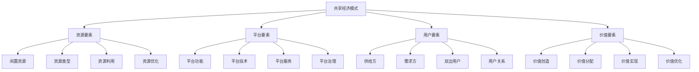

# 共享经济模式

## 🎯 学习目标
掌握共享经济模式理论，理解共享经济的运行机制和价值创造，学会设计和运营共享经济平台。

## 📊 共享经济模式框架

### 模式要素

## 🏠 资源要素

### 闲置资源
**资源类型**：
- **空间资源**：房屋、办公室、停车位
- **交通资源**：汽车、自行车、电动车
- **物品资源**：工具、设备、服装
- **技能资源**：知识、技能、服务

**资源特征**：
- **闲置性**：资源闲置特征
- **可分享性**：资源可分享特征
- **价值性**：资源价值特征
- **稀缺性**：资源稀缺特征

**资源识别**：
- **资源发现**：闲置资源发现
- **资源评估**：资源价值评估
- **资源分类**：资源类型分类
- **资源匹配**：资源需求匹配

### 资源利用
**利用方式**：
- **直接分享**：资源直接分享
- **间接分享**：资源间接分享
- **临时使用**：资源临时使用
- **长期租赁**：资源长期租赁

**利用效率**：
- **利用率提升**：资源利用率提升
- **效率优化**：资源利用效率优化
- **成本降低**：资源利用成本降低
- **价值最大化**：资源价值最大化

**利用管理**：
- **利用监控**：资源利用监控
- **利用分析**：资源利用分析
- **利用优化**：资源利用优化
- **利用创新**：资源利用创新

## 🖥️ 平台要素

### 平台功能
**核心功能**：
- **资源展示**：资源信息展示
- **需求匹配**：供需需求匹配
- **交易撮合**：交易撮合服务
- **支付结算**：支付结算服务

**增值功能**：
- **信用评价**：用户信用评价
- **保险服务**：风险保险服务
- **客服支持**：客户服务支持
- **数据分析**：数据统计分析

**创新功能**：
- **智能推荐**：智能推荐服务
- **预测分析**：需求预测分析
- **动态定价**：动态定价服务
- **社交功能**：社交互动功能

### 平台技术
**技术架构**：
- **前端技术**：用户界面技术
- **后端技术**：平台服务技术
- **数据库技术**：数据存储技术
- **云计算技术**：云计算技术

**核心技术**：
- **匹配算法**：供需匹配算法
- **推荐算法**：智能推荐算法
- **定价算法**：动态定价算法
- **风控算法**：风险控制算法

**技术应用**：
- **移动应用**：移动端应用
- **Web应用**：网页端应用
- **API接口**：开放API接口
- **数据分析**：大数据分析

### 平台服务
**基础服务**：
- **信息服务**：信息发布服务
- **交易服务**：交易撮合服务
- **支付服务**：支付结算服务
- **客服服务**：客户服务支持

**增值服务**：
- **保险服务**：风险保险服务
- **维修服务**：设备维修服务
- **清洁服务**：清洁保洁服务
- **配送服务**：物流配送服务

**创新服务**：
- **智能服务**：AI智能服务
- **个性化服务**：个性化定制服务
- **社交服务**：社交互动服务
- **生态服务**：生态圈服务

## 👥 用户要素

### 供给方
**供给方类型**：
- **个人供给方**：个人资源供给
- **企业供给方**：企业资源供给
- **专业供给方**：专业服务供给
- **平台供给方**：平台自营供给

**供给方特征**：
- **资源拥有**：拥有闲置资源
- **分享意愿**：愿意分享资源
- **服务能力**：提供服务能力
- **信用状况**：良好信用状况

**供给方管理**：
- **准入管理**：供给方准入管理
- **质量管理**：服务质量管理
- **信用管理**：信用评价管理
- **激励管理**：供给方激励管理

### 需求方
**需求方类型**：
- **个人需求方**：个人需求用户
- **企业需求方**：企业需求用户
- **临时需求方**：临时需求用户
- **长期需求方**：长期需求用户

**需求方特征**：
- **需求明确**：需求明确具体
- **支付能力**：具备支付能力
- **使用能力**：具备使用能力
- **信用状况**：良好信用状况

**需求方管理**：
- **需求分析**：需求分析管理
- **行为分析**：行为分析管理
- **满意度管理**：满意度管理
- **忠诚度管理**：忠诚度管理

### 双边用户
**双边关系**：
- **供需关系**：供给需求关系
- **交易关系**：交易合作关系
- **信任关系**：信任建立关系
- **长期关系**：长期合作关系

**双边平衡**：
- **供需平衡**：供需关系平衡
- **价值平衡**：价值分配平衡
- **利益平衡**：利益关系平衡
- **发展平衡**：发展关系平衡

**双边管理**：
- **关系管理**：双边关系管理
- **平衡管理**：双边平衡管理
- **协调管理**：双边协调管理
- **优化管理**：双边优化管理

## 💰 价值要素

### 价值创造
**价值来源**：
- **资源价值**：闲置资源价值
- **平台价值**：平台服务价值
- **网络价值**：网络效应价值
- **创新价值**：模式创新价值

**价值类型**：
- **经济价值**：经济收益价值
- **社会价值**：社会效益价值
- **环境价值**：环境保护价值
- **创新价值**：创新驱动价值

**价值机制**：
- **价值发现**：价值发现机制
- **价值创造**：价值创造机制
- **价值实现**：价值实现机制
- **价值分配**：价值分配机制

### 价值分配
**分配原则**：
- **公平原则**：价值分配公平
- **效率原则**：价值分配效率
- **激励原则**：价值分配激励
- **可持续原则**：价值分配可持续

**分配机制**：
- **平台分成**：平台服务分成
- **用户收益**：用户收益分配
- **服务费用**：服务费用分配
- **创新激励**：创新激励分配

**分配优化**：
- **分配公平**：分配公平性优化
- **分配效率**：分配效率性优化
- **分配激励**：分配激励性优化
- **分配可持续**：分配可持续性优化

### 价值实现
**实现方式**：
- **直接实现**：价值直接实现
- **间接实现**：价值间接实现
- **长期实现**：价值长期实现
- **创新实现**：价值创新实现

**实现路径**：
- **交易路径**：通过交易实现
- **服务路径**：通过服务实现
- **创新路径**：通过创新实现
- **生态路径**：通过生态实现

**实现优化**：
- **实现效率**：价值实现效率
- **实现质量**：价值实现质量
- **实现可持续**：价值实现可持续
- **实现创新**：价值实现创新

## 💡 实践应用

### 共享经济模式设计流程
1. **资源识别**：识别闲置资源
2. **需求分析**：分析市场需求
3. **平台设计**：设计共享平台
4. **模式验证**：验证商业模式
5. **运营优化**：优化运营模式

### 案例分析
**选择案例**：如Airbnb共享经济模式
**分析维度**：
- 资源要素：闲置资源、资源类型、资源利用
- 平台要素：平台功能、平台技术、平台服务
- 用户要素：供给方、需求方、双边用户
- 价值要素：价值创造、价值分配、价值实现

## 🧠 学习要点

### 费曼学习法应用
1. **选择概念**：共享经济模式
2. **简化解释**：用简单语言解释共享经济模式
3. **识别盲点**：找出理解不足的地方
4. **重新学习**：针对盲点深入学习

### 刻意练习要点
- **模式理解**：理解共享经济模式
- **设计能力**：提升模式设计能力
- **运营能力**：提升模式运营能力
- **创新实践**：创新模式实践

## 🔗 关联学习

### 前置知识
- [[01-平台商业模式]] - 平台商业模式
- [[02-网络效应]] - 网络效应
- [[01-商业模式画布]] - 商业模式画布

### 后续学习
- [[02-信任机制设计]] - 信任机制设计
- [[03-监管与合规]] - 监管与合规
- [[04-可持续发展]] - 可持续发展

### 实践应用
- 共享经济模式设计
- 共享经济平台建设
- 共享经济运营管理
- 共享经济价值创造

## 🎯 学习检验

### 理解检验
- [ ] 能够理解共享经济模式
- [ ] 能够分析共享经济要素
- [ ] 能够设计共享经济平台
- [ ] 能够运营共享经济模式

### 应用检验
- [ ] 能够设计具体共享经济模式
- [ ] 能够建设共享经济平台
- [ ] 能够管理共享经济运营
- [ ] 能够优化共享经济价值

---
**下一步**：[[02-信任机制设计]] - 信任机制设计

