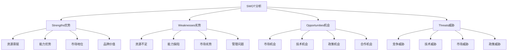

# SWOT分析

## 🎯 学习目标
掌握SWOT分析框架，学会识别企业内外部环境，制定战略策略。

## 📊 SWOT分析框架

### 分析要素

## 💪 Strengths（优势）

### 资源禀赋
**有形资源**：
- 财务资源
- 物质资源
- 技术资源
- 人力资源

**无形资源**：
- 品牌资源
- 知识资源
- 关系资源
- 文化资源

### 能力优势
**核心能力**：
- 技术能力
- 管理能力
- 营销能力
- 创新能力

**动态能力**：
- 学习能力
- 适应能力
- 整合能力
- 变革能力

### 市场地位
**竞争地位**：
- 市场份额
- 品牌地位
- 客户关系
- 渠道优势

**市场表现**：
- 销售业绩
- 盈利能力
- 增长能力
- 创新能力

## 😰 Weaknesses（劣势）

### 资源不足
**资源缺口**：
- 资金不足
- 人才缺乏
- 技术落后
- 信息不足

**资源质量**：
- 资源老化
- 资源分散
- 资源浪费
- 资源低效

### 能力缺陷
**能力不足**：
- 技术能力
- 管理能力
- 营销能力
- 创新能力

**能力老化**：
- 知识老化
- 技能落后
- 经验不足
- 学习能力

### 市场劣势
**竞争劣势**：
- 市场份额低
- 品牌影响力弱
- 客户关系差
- 渠道劣势

**市场表现**：
- 销售业绩差
- 盈利能力低
- 增长缓慢
- 创新能力弱

## 🚀 Opportunities（机会）

### 市场机会
**市场增长**：
- 市场规模扩大
- 市场需求增长
- 市场细分机会
- 新兴市场机会

**市场变化**：
- 消费升级
- 需求变化
- 渠道变化
- 竞争格局变化

### 技术机会
**技术发展**：
- 新技术出现
- 技术升级
- 技术应用
- 技术融合

**技术趋势**：
- 数字化趋势
- 智能化趋势
- 绿色化趋势
- 个性化趋势

### 政策机会
**政策支持**：
- 产业政策
- 税收政策
- 金融政策
- 人才政策

**政策变化**：
- 政策放宽
- 政策创新
- 政策支持
- 政策引导

## ⚠️ Threats（威胁）

### 竞争威胁
**直接竞争**：
- 竞争对手增加
- 竞争强度加大
- 价格竞争激烈
- 产品同质化

**间接竞争**：
- 替代品威胁
- 潜在进入者
- 供应商威胁
- 买方威胁

### 技术威胁
**技术威胁**：
- 技术落后
- 技术替代
- 技术标准
- 技术壁垒

**技术风险**：
- 技术风险
- 技术投资风险
- 技术应用风险
- 技术保护风险

### 市场威胁
**市场威胁**：
- 市场萎缩
- 需求下降
- 价格下降
- 利润下降

**市场风险**：
- 市场风险
- 汇率风险
- 政策风险
- 经济风险

## 🔄 SWOT策略矩阵

### SO策略（优势-机会）
**策略重点**：
- 利用优势抓住机会
- 扩大市场份额
- 提升竞争地位
- 实现快速增长

**实施措施**：
- 市场扩张
- 产品创新
- 品牌建设
- 渠道拓展

### WO策略（劣势-机会）
**策略重点**：
- 克服劣势抓住机会
- 提升能力水平
- 改善市场地位
- 实现转型发展

**实施措施**：
- 能力建设
- 资源整合
- 合作联盟
- 技术引进

### ST策略（优势-威胁）
**策略重点**：
- 利用优势应对威胁
- 保持竞争优势
- 降低威胁影响
- 实现稳定发展

**实施措施**：
- 差异化竞争
- 成本控制
- 风险防范
- 战略调整

### WT策略（劣势-威胁）
**策略重点**：
- 克服劣势应对威胁
- 避免风险损失
- 寻找生存空间
- 实现转型发展

**实施措施**：
- 战略收缩
- 业务重组
- 合作联盟
- 转型发展

## 💡 实践应用

### SWOT分析步骤
1. **信息收集**：收集内外部环境信息
2. **要素识别**：识别优势劣势机会威胁
3. **要素分析**：分析各要素的影响程度
4. **策略制定**：制定相应的战略策略
5. **策略实施**：实施制定的策略

### 分析工具
**信息收集工具**：
- 市场调研
- 竞争分析
- 内部评估
- 专家访谈

**分析工具**：
- 影响矩阵
- 重要性分析
- 趋势分析
- 情景分析

## 🧠 学习要点

### 费曼学习法应用
1. **选择概念**：SWOT分析
2. **简化解释**：用简单语言解释SWOT
3. **识别盲点**：找出理解不足的地方
4. **重新学习**：针对盲点深入学习

### 刻意练习要点
- **框架掌握**：掌握SWOT分析框架
- **要素识别**：能够识别各要素
- **策略制定**：能够制定战略策略
- **分析应用**：能够进行SWOT分析

## 🔗 关联学习

### 前置知识
- [[01-商业环境分析]] - 环境分析
- [[02-战略管理概论]] - 战略基础

### 后续学习
- [[02-波特五力分析]] - 竞争分析
- [[03-PEST分析]] - 环境分析
- [[04-波士顿矩阵]] - 业务组合

### 实践应用
- 企业战略分析
- 竞争环境分析
- 投资决策分析
- 市场进入分析

## 🎯 学习检验

### 理解检验
- [ ] 能够解释SWOT分析框架
- [ ] 能够识别各要素
- [ ] 能够制定战略策略
- [ ] 能够进行SWOT分析

### 应用检验
- [ ] 能够分析企业内外部环境
- [ ] 能够识别机会威胁
- [ ] 能够制定应对策略
- [ ] 能够评估战略效果

---
**下一步**：[[02-波特五力分析]] - 竞争环境分析