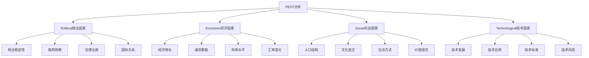

# PEST分析

## 🎯 学习目标
掌握PEST分析框架，学会分析宏观环境因素，制定适应环境变化的策略。

## 📊 PEST分析框架

### 分析要素

## 🏛️ Political（政治因素）

### 政治稳定性
**政治环境**：
- **政治制度**：政治制度稳定性
- **政治领导**：政治领导稳定性
- **政治变革**：政治变革频率
- **政治风险**：政治风险评估

**政治影响**：
- **投资环境**：政治对投资环境的影响
- **营商环境**：政治对营商环境的影响
- **市场环境**：政治对市场环境的影响
- **创新环境**：政治对创新环境的影响

**应对策略**：
- **政治风险**：政治风险管理策略
- **政策适应**：政策适应策略
- **合规管理**：合规管理策略
- **关系建设**：关系建设策略

### 政府政策
**政策类型**：
- **产业政策**：政府产业政策
- **税收政策**：政府税收政策
- **贸易政策**：政府贸易政策
- **投资政策**：政府投资政策

**政策影响**：
- **行业发展**：政策对行业发展的影响
- **企业运营**：政策对企业运营的影响
- **市场竞争**：政策对市场竞争的影响
- **创新动力**：政策对创新动力的影响

**政策策略**：
- **政策利用**：政策利用策略
- **政策适应**：政策适应策略
- **政策影响**：政策影响策略
- **政策创新**：政策创新策略

### 法律法规
**法律环境**：
- **法律体系**：法律体系完善程度
- **法律执行**：法律执行力度
- **法律变化**：法律变化频率
- **法律风险**：法律风险评估

**法规影响**：
- **合规成本**：法规对合规成本的影响
- **运营风险**：法规对运营风险的影响
- **创新约束**：法规对创新约束的影响
- **竞争环境**：法规对竞争环境的影响

**法规策略**：
- **合规管理**：合规管理策略
- **风险控制**：风险控制策略
- **法律适应**：法律适应策略
- **法律创新**：法律创新策略

### 国际关系
**国际环境**：
- **国际关系**：国际关系状况
- **贸易关系**：贸易关系状况
- **投资关系**：投资关系状况
- **技术合作**：技术合作关系

**国际影响**：
- **市场准入**：国际关系对市场准入的影响
- **贸易便利**：国际关系对贸易便利的影响
- **投资环境**：国际关系对投资环境的影响
- **技术转移**：国际关系对技术转移的影响

**国际策略**：
- **国际化**：国际化策略
- **本土化**：本土化策略
- **合作策略**：国际合作策略
- **竞争策略**：国际竞争策略

## 💰 Economic（经济因素）

### 经济增长
**经济指标**：
- **GDP增长**：GDP增长率
- **人均收入**：人均收入水平
- **消费水平**：消费水平变化
- **投资水平**：投资水平变化

**增长影响**：
- **市场需求**：经济增长对市场需求的影响
- **消费能力**：经济增长对消费能力的影响
- **投资机会**：经济增长对投资机会的影响
- **就业环境**：经济增长对就业环境的影响

**增长策略**：
- **市场扩张**：市场扩张策略
- **产品升级**：产品升级策略
- **服务创新**：服务创新策略
- **投资决策**：投资决策策略

### 通货膨胀
**通胀水平**：
- **通胀率**：通货膨胀率
- **通胀趋势**：通货膨胀趋势
- **通胀预期**：通货膨胀预期
- **通胀影响**：通货膨胀影响

**通胀影响**：
- **成本结构**：通胀对成本结构的影响
- **价格水平**：通胀对价格水平的影响
- **消费行为**：通胀对消费行为的影响
- **投资决策**：通胀对投资决策的影响

**通胀策略**：
- **成本控制**：成本控制策略
- **价格策略**：价格策略调整
- **产品策略**：产品策略调整
- **投资策略**：投资策略调整

### 利率水平
**利率环境**：
- **利率水平**：利率水平高低
- **利率趋势**：利率变化趋势
- **利率政策**：利率政策变化
- **利率影响**：利率影响分析

**利率影响**：
- **融资成本**：利率对融资成本的影响
- **投资决策**：利率对投资决策的影响
- **消费行为**：利率对消费行为的影响
- **汇率变化**：利率对汇率变化的影响

**利率策略**：
- **融资策略**：融资策略调整
- **投资策略**：投资策略调整
- **消费策略**：消费策略调整
- **汇率策略**：汇率策略调整

### 汇率变化
**汇率环境**：
- **汇率水平**：汇率水平高低
- **汇率趋势**：汇率变化趋势
- **汇率政策**：汇率政策变化
- **汇率风险**：汇率风险评估

**汇率影响**：
- **贸易成本**：汇率对贸易成本的影响
- **投资回报**：汇率对投资回报的影响
- **价格竞争力**：汇率对价格竞争力的影响
- **市场准入**：汇率对市场准入的影响

**汇率策略**：
- **汇率风险**：汇率风险管理策略
- **贸易策略**：贸易策略调整
- **投资策略**：投资策略调整
- **价格策略**：价格策略调整

## 👥 Social（社会因素）

### 人口结构
**人口特征**：
- **人口规模**：人口规模变化
- **年龄结构**：人口年龄结构
- **性别比例**：人口性别比例
- **教育水平**：人口教育水平

**结构影响**：
- **市场需求**：人口结构对市场需求的影响
- **消费行为**：人口结构对消费行为的影响
- **劳动力供给**：人口结构对劳动力供给的影响
- **社会需求**：人口结构对社会需求的影响

**结构策略**：
- **市场细分**：市场细分策略
- **产品策略**：产品策略调整
- **服务策略**：服务策略调整
- **人才策略**：人才策略调整

### 文化变迁
**文化变化**：
- **文化价值观**：文化价值观变化
- **文化传统**：文化传统变化
- **文化融合**：文化融合趋势
- **文化创新**：文化创新趋势

**文化影响**：
- **消费偏好**：文化对消费偏好的影响
- **产品需求**：文化对产品需求的影响
- **服务期望**：文化对服务期望的影响
- **品牌认知**：文化对品牌认知的影响

**文化策略**：
- **文化适应**：文化适应策略
- **文化创新**：文化创新策略
- **文化传播**：文化传播策略
- **文化价值**：文化价值策略

### 生活方式
**生活变化**：
- **生活节奏**：生活节奏变化
- **生活品质**：生活品质要求
- **生活便利**：生活便利需求
- **生活健康**：生活健康关注

**生活影响**：
- **消费模式**：生活方式对消费模式的影响
- **产品需求**：生活方式对产品需求的影响
- **服务需求**：生活方式对服务需求的影响
- **体验需求**：生活方式对体验需求的影响

**生活策略**：
- **产品设计**：产品设计策略
- **服务设计**：服务设计策略
- **体验设计**：体验设计策略
- **便利性**：便利性策略

### 价值观念
**价值变化**：
- **价值取向**：价值取向变化
- **价值追求**：价值追求变化
- **价值实现**：价值实现方式
- **价值创造**：价值创造方式

**价值影响**：
- **消费动机**：价值观念对消费动机的影响
- **产品选择**：价值观念对产品选择的影响
- **品牌偏好**：价值观念对品牌偏好的影响
- **服务期望**：价值观念对服务期望的影响

**价值策略**：
- **价值定位**：价值定位策略
- **价值创造**：价值创造策略
- **价值传递**：价值传递策略
- **价值实现**：价值实现策略

## 🔬 Technological（技术因素）

### 技术发展
**技术趋势**：
- **技术突破**：技术突破趋势
- **技术成熟**：技术成熟趋势
- **技术融合**：技术融合趋势
- **技术应用**：技术应用趋势

**发展影响**：
- **产品创新**：技术发展对产品创新的影响
- **服务创新**：技术发展对服务创新的影响
- **商业模式**：技术发展对商业模式的影响
- **竞争格局**：技术发展对竞争格局的影响

**发展策略**：
- **技术投入**：技术投入策略
- **技术合作**：技术合作策略
- **技术应用**：技术应用策略
- **技术创新**：技术创新策略

### 技术应用
**应用领域**：
- **生产应用**：技术在生产中的应用
- **服务应用**：技术在服务中的应用
- **管理应用**：技术在管理中的应用
- **营销应用**：技术在营销中的应用

**应用影响**：
- **效率提升**：技术应用对效率提升的影响
- **成本降低**：技术应用对成本降低的影响
- **质量改善**：技术应用对质量改善的影响
- **创新驱动**：技术应用对创新驱动的影响

**应用策略**：
- **应用规划**：技术应用规划策略
- **应用实施**：技术应用实施策略
- **应用优化**：技术应用优化策略
- **应用创新**：技术应用创新策略

### 技术标准
**标准体系**：
- **技术标准**：技术标准体系
- **行业标准**：行业标准体系
- **国际标准**：国际标准体系
- **企业标准**：企业标准体系

**标准影响**：
- **技术兼容**：标准对技术兼容的影响
- **市场准入**：标准对市场准入的影响
- **竞争格局**：标准对竞争格局的影响
- **创新方向**：标准对创新方向的影响

**标准策略**：
- **标准参与**：标准参与策略
- **标准制定**：标准制定策略
- **标准应用**：标准应用策略
- **标准创新**：标准创新策略

### 技术风险
**风险类型**：
- **技术风险**：技术风险类型
- **应用风险**：技术应用风险
- **标准风险**：技术标准风险
- **安全风险**：技术安全风险

**风险影响**：
- **投资风险**：技术风险对投资风险的影响
- **运营风险**：技术风险对运营风险的影响
- **竞争风险**：技术风险对竞争风险的影响
- **创新风险**：技术风险对创新风险的影响

**风险策略**：
- **风险识别**：技术风险识别策略
- **风险评估**：技术风险评估策略
- **风险控制**：技术风险控制策略
- **风险应对**：技术风险应对策略

## 💡 实践应用

### PEST分析流程
1. **数据收集**：收集PEST相关数据
2. **因素分析**：分析四个环境因素
3. **影响评估**：评估各因素影响
4. **机会识别**：识别环境机会
5. **威胁识别**：识别环境威胁
6. **策略制定**：制定应对策略
7. **策略实施**：实施应对策略
8. **效果评估**：评估策略效果

### 案例分析
**选择案例**：如新能源汽车行业
**PEST分析**：
- **Political**：政策支持、环保法规
- **Economic**：经济增长、消费升级
- **Social**：环保意识、生活方式
- **Technological**：电池技术、智能技术

## 🧠 学习要点

### 费曼学习法应用
1. **选择概念**：PEST分析
2. **简化解释**：用简单语言解释PEST分析
3. **识别盲点**：找出理解不足的地方
4. **重新学习**：针对盲点深入学习

### 刻意练习要点
- **分析框架**：掌握PEST分析框架
- **分析方法**：掌握PEST分析方法
- **分析技巧**：掌握PEST分析技巧
- **策略制定**：掌握环境适应策略制定

## 🔗 关联学习

### 前置知识
- [[01-商业环境分析]] - 环境分析
- [[01-战略管理概论]] - 战略管理
- [[01-SWOT分析]] - SWOT分析

### 后续学习
- [[02-波特五力分析]] - 竞争分析
- [[03-波士顿矩阵]] - 业务分析
- [[04-决策树分析]] - 决策分析

### 实践应用
- 宏观环境分析
- 战略规划制定
- 市场进入决策
- 风险识别管理

## 🎯 学习检验

### 理解检验
- [ ] 能够解释PEST分析框架
- [ ] 能够分析四个环境因素
- [ ] 能够识别环境机会威胁
- [ ] 能够制定环境适应策略

### 应用检验
- [ ] 能够分析具体行业环境
- [ ] 能够评估环境变化影响
- [ ] 能够制定环境适应策略
- [ ] 能够实施环境适应策略

---
**下一步**：[[03-竞争环境分析]] - 竞争分析