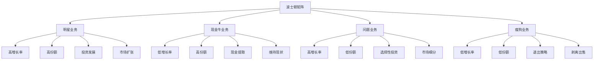

# 波士顿矩阵

## 🎯 学习目标
掌握波士顿矩阵分析方法和应用技巧，学会运用波士顿矩阵进行业务组合分析，制定有效的业务发展战略。

## 📊 波士顿矩阵框架

### 矩阵结构

## 🌟 明星业务

### 业务特征
**市场特征**：
- **高市场增长率**：市场增长率超过10%
- **高相对市场份额**：相对市场份额大于1.0
- **市场地位**：市场领导者地位
- **竞争地位**：强势竞争地位

**财务特征**：
- **投资需求大**：需要大量投资支持
- **盈利能力强**：具有较强盈利能力
- **现金流**：现金流可能为负
- **投资回报**：预期投资回报高

**发展特征**：
- **成长潜力**：具有很大成长潜力
- **市场机会**：面临巨大市场机会
- **竞争优势**：具有明显竞争优势
- **发展前景**：发展前景广阔

### 发展战略
**投资策略**：
- **加大投资**：加大投资力度
- **市场扩张**：积极市场扩张
- **产品创新**：持续产品创新
- **技术升级**：技术能力升级

**竞争策略**：
- **竞争优势**：巩固竞争优势
- **市场领导**：保持市场领导地位
- **品牌建设**：加强品牌建设
- **渠道建设**：完善渠道建设

**发展策略**：
- **规模扩张**：扩大业务规模
- **市场渗透**：深化市场渗透
- **产品线扩展**：扩展产品线
- **国际化发展**：推进国际化发展

### 管理要点
**投资管理**：
- **投资规划**：制定投资规划
- **投资监控**：监控投资效果
- **投资优化**：优化投资结构
- **投资评估**：评估投资回报

**风险管理**：
- **市场风险**：防范市场风险
- **竞争风险**：应对竞争风险
- **技术风险**：控制技术风险
- **财务风险**：管理财务风险

## 💰 现金牛业务

### 业务特征
**市场特征**：
- **低市场增长率**：市场增长率低于10%
- **高相对市场份额**：相对市场份额大于1.0
- **市场地位**：市场领导者地位
- **竞争地位**：稳定竞争地位

**财务特征**：
- **投资需求小**：投资需求相对较小
- **现金产生能力强**：现金产生能力强
- **盈利稳定**：盈利相对稳定
- **现金流充足**：现金流充足

**发展特征**：
- **成熟市场**：处于成熟市场阶段
- **稳定发展**：发展相对稳定
- **规模效应**：具有规模效应
- **成本优势**：具有成本优势

### 发展战略
**维持策略**：
- **维持现状**：维持现有市场地位
- **效率提升**：提升运营效率
- **成本控制**：严格控制成本
- **质量改进**：持续质量改进

**现金策略**：
- **现金提取**：提取现金支持其他业务
- **分红政策**：实施分红政策
- **投资其他业务**：投资明星业务
- **储备资金**：建立储备资金

**优化策略**：
- **流程优化**：优化业务流程
- **技术改进**：改进生产技术
- **管理提升**：提升管理水平
- **服务创新**：创新服务模式

### 管理要点
**现金管理**：
- **现金规划**：制定现金规划
- **现金监控**：监控现金状况
- **现金优化**：优化现金使用
- **现金投资**：合理现金投资

**效率管理**：
- **效率提升**：持续效率提升
- **成本控制**：严格控制成本
- **质量保证**：保证产品质量
- **服务优化**：优化客户服务

## ❓ 问题业务

### 业务特征
**市场特征**：
- **高市场增长率**：市场增长率超过10%
- **低相对市场份额**：相对市场份额小于1.0
- **市场地位**：市场跟随者地位
- **竞争地位**：竞争地位较弱

**财务特征**：
- **投资需求大**：需要大量投资
- **盈利能力不确定**：盈利能力不确定
- **现金流为负**：现金流通常为负
- **投资回报不确定**：投资回报不确定

**发展特征**：
- **成长潜力**：具有成长潜力
- **市场机会**：面临市场机会
- **竞争劣势**：存在竞争劣势
- **发展风险**：发展风险较大

### 发展战略
**投资策略**：
- **选择性投资**：选择性重点投资
- **市场细分**：寻找细分市场
- **产品改进**：改进产品性能
- **技术突破**：寻求技术突破

**竞争策略**：
- **差异化竞争**：实施差异化竞争
- **成本领先**：追求成本领先
- **集中化战略**：实施集中化战略
- **合作联盟**：寻求合作联盟

**发展策略**：
- **重点发展**：重点发展有潜力业务
- **转型发展**：转型发展模式
- **退出考虑**：考虑退出无潜力业务
- **整合重组**：整合重组资源

### 管理要点
**投资管理**：
- **投资评估**：严格投资评估
- **投资控制**：控制投资风险
- **投资监控**：监控投资效果
- **投资调整**：及时调整投资

**风险管理**：
- **风险识别**：识别各种风险
- **风险评估**：评估风险程度
- **风险控制**：控制风险水平
- **风险应对**：制定风险应对措施

## 🐕 瘦狗业务

### 业务特征
**市场特征**：
- **低市场增长率**：市场增长率低于10%
- **低相对市场份额**：相对市场份额小于1.0
- **市场地位**：市场弱势地位
- **竞争地位**：竞争地位较弱

**财务特征**：
- **投资需求小**：投资需求相对较小
- **盈利能力差**：盈利能力较差
- **现金流紧张**：现金流相对紧张
- **投资回报低**：投资回报较低

**发展特征**：
- **市场萎缩**：市场可能萎缩
- **竞争激烈**：竞争相对激烈
- **发展困难**：发展相对困难
- **前景不明**：发展前景不明

### 发展战略
**退出策略**：
- **逐步退出**：逐步退出市场
- **快速退出**：快速退出市场
- **剥离出售**：剥离出售业务
- **清算关闭**：清算关闭业务

**转型策略**：
- **业务转型**：转型其他业务
- **技术转型**：转型技术方向
- **市场转型**：转型目标市场
- **模式转型**：转型商业模式

**维持策略**：
- **维持现状**：维持基本运营
- **成本控制**：严格控制成本
- **效率提升**：提升运营效率
- **等待机会**：等待市场机会

### 管理要点
**退出管理**：
- **退出规划**：制定退出规划
- **退出实施**：实施退出计划
- **退出监控**：监控退出过程
- **退出评估**：评估退出效果

**转型管理**：
- **转型规划**：制定转型规划
- **转型实施**：实施转型计划
- **转型监控**：监控转型过程
- **转型评估**：评估转型效果

## 📈 矩阵应用

### 分析步骤
**数据收集**：
- **市场数据**：收集市场增长率数据
- **份额数据**：收集相对市场份额数据
- **财务数据**：收集财务数据
- **竞争数据**：收集竞争数据

**矩阵构建**：
- **坐标设定**：设定矩阵坐标
- **业务定位**：定位各业务位置
- **象限划分**：划分四个象限
- **矩阵绘制**：绘制波士顿矩阵

**策略制定**：
- **现状分析**：分析业务现状
- **策略选择**：选择合适策略
- **策略制定**：制定具体策略
- **策略实施**：实施制定策略

### 应用技巧
**数据准确性**：
- **数据来源**：确保数据来源可靠
- **数据质量**：保证数据质量
- **数据更新**：及时更新数据
- **数据验证**：验证数据准确性

**分析深度**：
- **深入分析**：进行深入分析
- **多维度分析**：多维度分析
- **动态分析**：动态分析变化
- **综合分析**：综合分析结果

**策略灵活性**：
- **策略调整**：及时调整策略
- **策略创新**：创新策略方法
- **策略优化**：优化策略效果
- **策略升级**：升级策略水平

### 应用案例
**案例选择**：
- **成功案例**：分析成功应用案例
- **失败案例**：分析失败应用案例
- **对比案例**：对比不同案例
- **创新案例**：分析创新应用案例

**案例分析**：
- **背景分析**：分析案例背景
- **过程分析**：分析应用过程
- **结果分析**：分析应用结果
- **经验总结**：总结应用经验

## ⚠️ 矩阵局限性

### 分析局限
**简化问题**：
- **过于简化**：分析过于简化
- **忽略因素**：忽略重要因素
- **静态分析**：静态分析局限
- **缺乏动态**：缺乏动态考虑

**数据局限**：
- **数据要求**：对数据要求较高
- **数据获取**：数据获取困难
- **数据质量**：数据质量问题
- **数据时效**：数据时效性问题

**主观局限**：
- **主观判断**：存在主观判断
- **标准不一**：标准不统一
- **偏见影响**：偏见影响分析
- **经验依赖**：过度依赖经验

### 应用局限
**环境变化**：
- **市场变化**：市场环境变化
- **技术变化**：技术环境变化
- **政策变化**：政策环境变化
- **竞争变化**：竞争环境变化

**协同效应**：
- **忽略协同**：忽略业务协同
- **资源整合**：资源整合不足
- **能力互补**：能力互补考虑不足
- **整体优化**：整体优化不足

**创新考虑**：
- **忽略创新**：忽略创新因素
- **技术突破**：技术突破考虑不足
- **模式创新**：模式创新考虑不足
- **市场创造**：市场创造考虑不足

### 改进方法
**方法改进**：
- **多维度分析**：增加分析维度
- **动态分析**：加强动态分析
- **综合评估**：综合评估方法
- **创新考虑**：增加创新考虑

**工具结合**：
- **工具结合**：结合其他工具
- **方法融合**：融合不同方法
- **技术应用**：应用新技术
- **数据挖掘**：利用数据挖掘

**持续改进**：
- **持续改进**：持续改进方法
- **经验积累**：积累应用经验
- **最佳实践**：学习最佳实践
- **创新发展**：创新发展方法

## 💡 实践应用

### 波士顿矩阵实施流程
1. **数据收集**：收集相关数据
2. **矩阵构建**：构建波士顿矩阵
3. **业务分析**：分析各业务地位
4. **策略制定**：制定业务策略
5. **策略实施**：实施制定策略

### 案例分析
**选择案例**：如宝洁公司业务组合
**分析维度**：
- 明星业务：洗发水、护肤品等
- 现金牛业务：洗衣粉、牙膏等
- 问题业务：新兴个人护理产品
- 瘦狗业务：传统清洁用品

## 🧠 学习要点

### 费曼学习法应用
1. **选择概念**：波士顿矩阵
2. **简化解释**：用简单语言解释波士顿矩阵
3. **识别盲点**：找出理解不足的地方
4. **重新学习**：针对盲点深入学习

### 刻意练习要点
- **矩阵构建**：提升矩阵构建能力
- **业务分析**：提升业务分析能力
- **策略制定**：提升策略制定能力
- **应用实践**：提升应用实践能力

## 🔗 关联学习

### 前置知识
- [[01-战略管理概论]] - 战略管理基础
- [[01-商业环境分析]] - 环境分析
- [[01-竞争环境分析]] - 竞争分析

### 后续学习
- [[01-SWOT分析]] - SWOT分析
- [[02-波特五力分析]] - 波特五力分析
- [[03-PEST分析]] - PEST分析

### 实践应用
- 业务组合分析
- 投资决策支持
- 资源配置优化
- 战略规划制定

## 🎯 学习检验

### 理解检验
- [ ] 能够理解波士顿矩阵原理
- [ ] 能够构建波士顿矩阵
- [ ] 能够分析业务地位
- [ ] 能够制定业务策略

### 应用检验
- [ ] 能够分析具体业务组合
- [ ] 能够制定业务发展战略
- [ ] 能够优化资源配置
- [ ] 能够评估策略效果

---
**下一步**：[[01-SWOT分析]] - SWOT分析