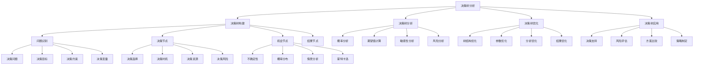

# 决策树分析

## 🎯 学习目标
掌握决策树分析理论和方法，学会运用决策树进行商业决策分析，提升决策质量和效率。

## 📊 决策树分析框架

### 决策树模型

## 🌳 决策树构建

### 问题识别
**决策问题**：
- **问题定义**：决策问题定义
- **问题类型**：决策问题类型
- **问题范围**：决策问题范围
- **问题约束**：决策问题约束

**决策目标**：
- **目标设定**：决策目标设定
- **目标层次**：目标层次结构
- **目标权重**：目标权重分配
- **目标评估**：目标评估标准

**决策约束**：
- **资源约束**：资源约束条件
- **时间约束**：时间约束条件
- **技术约束**：技术约束条件
- **政策约束**：政策约束条件

**决策变量**：
- **决策变量**：决策变量识别
- **变量类型**：变量类型分析
- **变量范围**：变量取值范围
- **变量关系**：变量关系分析

### 决策节点
**决策选择**：
- **选择方案**：决策选择方案
- **选择标准**：决策选择标准
- **选择方法**：决策选择方法
- **选择结果**：决策选择结果

**决策时机**：
- **时机选择**：决策时机选择
- **时机分析**：时机分析
- **时机优化**：时机优化
- **时机风险**：时机风险

**决策资源**：
- **资源需求**：决策资源需求
- **资源分配**：决策资源分配
- **资源约束**：决策资源约束
- **资源优化**：决策资源优化

**决策风险**：
- **风险识别**：决策风险识别
- **风险评估**：决策风险评估
- **风险控制**：决策风险控制
- **风险应对**：决策风险应对

### 机会节点
**不确定性**：
- **不确定性来源**：不确定性来源
- **不确定性类型**：不确定性类型
- **不确定性程度**：不确定性程度
- **不确定性影响**：不确定性影响

**概率分布**：
- **概率估计**：概率估计方法
- **概率分布**：概率分布类型
- **概率更新**：概率更新方法
- **概率验证**：概率验证方法

**情景分析**：
- **情景构建**：情景构建方法
- **情景分析**：情景分析方法
- **情景比较**：情景比较方法
- **情景选择**：情景选择方法

**蒙特卡洛**：
- **蒙特卡洛模拟**：蒙特卡洛模拟
- **随机抽样**：随机抽样方法
- **模拟次数**：模拟次数确定
- **结果分析**：模拟结果分析

### 结果节点
**结果定义**：
- **结果类型**：结果类型定义
- **结果度量**：结果度量方法
- **结果评估**：结果评估方法
- **结果比较**：结果比较方法

**结果计算**：
- **计算方法**：结果计算方法
- **计算模型**：结果计算模型
- **计算工具**：结果计算工具
- **计算验证**：结果计算验证

**结果分析**：
- **结果分析**：结果分析方法
- **结果解释**：结果解释方法
- **结果应用**：结果应用方法
- **结果改进**：结果改进方法

## 📈 决策树分析

### 概率分析
**概率估计**：
- **主观概率**：主观概率估计
- **客观概率**：客观概率估计
- **贝叶斯概率**：贝叶斯概率估计
- **频率概率**：频率概率估计

**概率分布**：
- **离散分布**：离散概率分布
- **连续分布**：连续概率分布
- **正态分布**：正态分布
- **其他分布**：其他概率分布

**概率更新**：
- **贝叶斯更新**：贝叶斯概率更新
- **信息更新**：信息更新概率
- **经验更新**：经验更新概率
- **模型更新**：模型更新概率

**概率验证**：
- **概率验证**：概率验证方法
- **敏感性分析**：概率敏感性分析
- **稳健性分析**：概率稳健性分析
- **可靠性分析**：概率可靠性分析

### 期望值计算
**期望值理论**：
- **期望值定义**：期望值定义
- **期望值性质**：期望值性质
- **期望值计算**：期望值计算方法
- **期望值应用**：期望值应用

**期望值计算**：
- **简单期望值**：简单期望值计算
- **条件期望值**：条件期望值计算
- **复合期望值**：复合期望值计算
- **动态期望值**：动态期望值计算

**期望值分析**：
- **期望值分析**：期望值分析方法
- **期望值比较**：期望值比较方法
- **期望值优化**：期望值优化方法
- **期望值决策**：期望值决策方法

**期望值应用**：
- **投资决策**：投资决策应用
- **风险管理**：风险管理应用
- **资源配置**：资源配置应用
- **战略选择**：战略选择应用

### 敏感性分析
**敏感性分析**：
- **敏感性分析**：敏感性分析方法
- **参数敏感性**：参数敏感性分析
- **结果敏感性**：结果敏感性分析
- **模型敏感性**：模型敏感性分析

**敏感性指标**：
- **敏感性系数**：敏感性系数
- **弹性系数**：弹性系数
- **边际效应**：边际效应
- **影响因子**：影响因子

**敏感性测试**：
- **单因素测试**：单因素敏感性测试
- **多因素测试**：多因素敏感性测试
- **情景测试**：情景敏感性测试
- **蒙特卡洛测试**：蒙特卡洛敏感性测试

**敏感性应用**：
- **风险识别**：风险识别应用
- **决策优化**：决策优化应用
- **参数调整**：参数调整应用
- **模型改进**：模型改进应用

### 风险分析
**风险识别**：
- **风险识别**：风险识别方法
- **风险分类**：风险分类方法
- **风险来源**：风险来源分析
- **风险特征**：风险特征分析

**风险评估**：
- **风险评估**：风险评估方法
- **风险度量**：风险度量方法
- **风险等级**：风险等级评估
- **风险影响**：风险影响评估

**风险控制**：
- **风险控制**：风险控制方法
- **风险规避**：风险规避方法
- **风险减轻**：风险减轻方法
- **风险转移**：风险转移方法

**风险应对**：
- **风险应对**：风险应对策略
- **应急预案**：应急预案制定
- **风险监控**：风险监控机制
- **风险报告**：风险报告机制

## 🔧 决策树优化

### 树结构优化
**结构设计**：
- **结构设计**：树结构设计
- **节点设计**：节点设计优化
- **分支设计**：分支设计优化
- **层次设计**：层次设计优化

**结构简化**：
- **结构简化**：树结构简化
- **节点合并**：节点合并优化
- **分支合并**：分支合并优化
- **层次减少**：层次减少优化

**结构扩展**：
- **结构扩展**：树结构扩展
- **节点增加**：节点增加优化
- **分支增加**：分支增加优化
- **层次增加**：层次增加优化

**结构平衡**：
- **结构平衡**：树结构平衡
- **节点平衡**：节点平衡优化
- **分支平衡**：分支平衡优化
- **层次平衡**：层次平衡优化

### 参数优化
**参数选择**：
- **参数选择**：参数选择方法
- **参数估计**：参数估计方法
- **参数验证**：参数验证方法
- **参数调整**：参数调整方法

**参数优化**：
- **参数优化**：参数优化方法
- **目标函数**：目标函数设计
- **约束条件**：约束条件设定
- **优化算法**：优化算法选择

**参数敏感性**：
- **参数敏感性**：参数敏感性分析
- **敏感性测试**：敏感性测试
- **稳健性分析**：稳健性分析
- **可靠性评估**：可靠性评估

**参数更新**：
- **参数更新**：参数更新机制
- **信息更新**：信息更新机制
- **模型更新**：模型更新机制
- **结果更新**：结果更新机制

### 分析优化
**分析方法**：
- **分析方法**：分析方法优化
- **计算效率**：计算效率优化
- **精度提升**：精度提升优化
- **稳定性**：稳定性优化

**分析工具**：
- **分析工具**：分析工具优化
- **软件工具**：软件工具选择
- **计算工具**：计算工具选择
- **可视化工具**：可视化工具选择

**分析流程**：
- **分析流程**：分析流程优化
- **步骤优化**：分析步骤优化
- **时间优化**：分析时间优化
- **质量优化**：分析质量优化

**分析结果**：
- **结果优化**：分析结果优化
- **结果解释**：结果解释优化
- **结果应用**：结果应用优化
- **结果改进**：结果改进优化

### 结果优化
**结果改进**：
- **结果改进**：结果改进方法
- **精度提升**：精度提升方法
- **稳定性**：稳定性改进方法
- **可靠性**：可靠性改进方法

**结果验证**：
- **结果验证**：结果验证方法
- **模型验证**：模型验证方法
- **数据验证**：数据验证方法
- **逻辑验证**：逻辑验证方法

**结果应用**：
- **结果应用**：结果应用方法
- **决策支持**：决策支持应用
- **风险评估**：风险评估应用
- **策略制定**：策略制定应用

**结果监控**：
- **结果监控**：结果监控机制
- **性能监控**：性能监控机制
- **质量监控**：质量监控机制
- **效果监控**：效果监控机制

## 💼 决策树应用

### 决策支持
**决策支持**：
- **决策支持**：决策支持应用
- **方案比较**：方案比较应用
- **风险评估**：风险评估应用
- **策略选择**：策略选择应用

**决策优化**：
- **决策优化**：决策优化应用
- **目标优化**：目标优化应用
- **约束优化**：约束优化应用
- **多目标优化**：多目标优化应用

**决策监控**：
- **决策监控**：决策监控应用
- **执行监控**：执行监控应用
- **效果监控**：效果监控应用
- **调整监控**：调整监控应用

### 风险评估
**风险识别**：
- **风险识别**：风险识别应用
- **风险分类**：风险分类应用
- **风险来源**：风险来源分析
- **风险特征**：风险特征分析

**风险评估**：
- **风险评估**：风险评估应用
- **风险度量**：风险度量应用
- **风险等级**：风险等级评估
- **风险影响**：风险影响评估

**风险控制**：
- **风险控制**：风险控制应用
- **风险规避**：风险规避应用
- **风险减轻**：风险减轻应用
- **风险转移**：风险转移应用

### 方案比较
**方案识别**：
- **方案识别**：方案识别应用
- **方案生成**：方案生成应用
- **方案筛选**：方案筛选应用
- **方案优化**：方案优化应用

**方案评估**：
- **方案评估**：方案评估应用
- **多准则评估**：多准则评估应用
- **成本效益**：成本效益评估
- **风险评估**：风险评估应用

**方案选择**：
- **方案选择**：方案选择应用
- **最优方案**：最优方案选择
- **满意方案**：满意方案选择
- **妥协方案**：妥协方案选择

### 策略制定
**策略分析**：
- **策略分析**：策略分析应用
- **环境分析**：环境分析应用
- **资源分析**：资源分析应用
- **能力分析**：能力分析应用

**策略选择**：
- **策略选择**：策略选择应用
- **战略选择**：战略选择应用
- **战术选择**：战术选择应用
- **操作选择**：操作选择应用

**策略实施**：
- **策略实施**：策略实施应用
- **实施计划**：实施计划制定
- **资源配置**：资源配置应用
- **风险控制**：风险控制应用

## 💡 决策树分析案例

### 成功案例
**投资决策**：
- **问题**：新产品投资决策
- **分析**：市场需求、竞争状况、技术风险
- **结果**：选择最优投资方案
- **效果**：成功推出新产品

**风险管理**：
- **问题**：项目风险管理
- **分析**：技术风险、市场风险、财务风险
- **结果**：制定风险应对策略
- **效果**：项目成功实施

**资源配置**：
- **问题**：资源优化配置
- **分析**：资源约束、需求预测、效益评估
- **结果**：最优资源配置方案
- **效果**：提高资源利用效率

### 失败案例
**失败原因**：
- **数据不准确**：分析数据不准确
- **假设不合理**：分析假设不合理
- **模型不适用**：分析模型不适用
- **结果误用**：分析结果误用

**失败教训**：
- **数据质量**：重视数据质量
- **假设验证**：验证分析假设
- **模型选择**：选择合适的模型
- **结果应用**：正确应用分析结果

## 🧠 学习要点

### 费曼学习法应用
1. **选择概念**：决策树分析
2. **简化解释**：用简单语言解释决策树分析
3. **识别盲点**：找出理解不足的地方
4. **重新学习**：针对盲点深入学习

### 刻意练习要点
- **理论掌握**：掌握决策树分析理论
- **方法应用**：掌握决策树分析方法
- **案例分析**：分析成功失败案例
- **实践应用**：实践应用决策树分析

## 🔗 关联学习

### 前置知识
- [[01-商业学概论]] - 商业学概论
- [[01-战略管理概论]] - 战略管理
- [[01-财务管理]] - 财务管理

### 后续学习
- [[02-敏感性分析]] - 敏感性分析
- [[03-蒙特卡洛模拟]] - 蒙特卡洛模拟
- [[04-情景规划]] - 情景规划

### 实践应用
- 商业决策分析
- 投资决策支持
- 风险管理应用
- 战略选择支持

## 🎯 学习检验

### 理解检验
- [ ] 能够理解决策树分析理论
- [ ] 能够掌握决策树构建方法
- [ ] 能够进行决策树分析
- [ ] 能够优化决策树

### 应用检验
- [ ] 能够构建决策树
- [ ] 能够进行决策分析
- [ ] 能够支持决策制定
- [ ] 能够评估决策效果

---
**下一步**：[[02-敏感性分析]] - 敏感性分析

