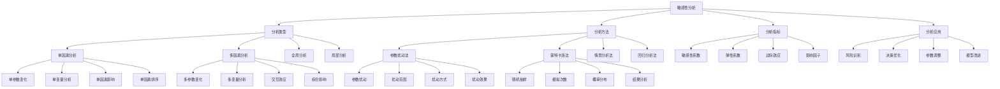

# 敏感性分析

## 🎯 学习目标
掌握敏感性分析理论和方法，学会评估决策结果对关键参数变化的敏感程度，提升决策稳健性。

## 📊 敏感性分析框架

### 敏感性分析模型

## 🔍 分析类型

### 单因素分析
**单参数变化**：
- **参数选择**：选择关键参数
- **变化范围**：确定变化范围
- **变化步长**：设定变化步长
- **变化方式**：选择变化方式

**单变量分析**：
- **变量识别**：识别关键变量
- **变量范围**：确定变量范围
- **变量分布**：分析变量分布
- **变量影响**：分析变量影响

**单因素影响**：
- **影响分析**：分析单因素影响
- **影响程度**：评估影响程度
- **影响方向**：确定影响方向
- **影响机制**：分析影响机制

**单因素排序**：
- **敏感性排序**：敏感性排序
- **重要性排序**：重要性排序
- **优先级排序**：优先级排序
- **风险排序**：风险排序

### 多因素分析
**多参数变化**：
- **参数组合**：参数组合选择
- **变化模式**：变化模式设计
- **变化范围**：变化范围确定
- **变化约束**：变化约束设定

**多变量分析**：
- **变量组合**：变量组合分析
- **变量关系**：变量关系分析
- **变量交互**：变量交互分析
- **变量综合**：变量综合分析

**交互效应**：
- **交互识别**：交互效应识别
- **交互分析**：交互效应分析
- **交互强度**：交互强度评估
- **交互影响**：交互影响分析

**综合影响**：
- **综合影响**：综合影响分析
- **影响叠加**：影响叠加分析
- **影响抵消**：影响抵消分析
- **影响平衡**：影响平衡分析

### 全局分析
**全局敏感性**：
- **全局分析**：全局敏感性分析
- **参数空间**：参数空间分析
- **结果空间**：结果空间分析
- **敏感性映射**：敏感性映射

**全局优化**：
- **全局优化**：全局优化分析
- **最优参数**：最优参数寻找
- **最优结果**：最优结果寻找
- **最优策略**：最优策略寻找

**全局稳健性**：
- **稳健性分析**：全局稳健性分析
- **稳健性指标**：稳健性指标
- **稳健性评估**：稳健性评估
- **稳健性改进**：稳健性改进

### 局部分析
**局部敏感性**：
- **局部分析**：局部敏感性分析
- **局部区域**：局部区域分析
- **局部变化**：局部变化分析
- **局部影响**：局部影响分析

**局部优化**：
- **局部优化**：局部优化分析
- **局部最优**：局部最优寻找
- **局部改进**：局部改进分析
- **局部调整**：局部调整分析

**局部稳健性**：
- **局部稳健性**：局部稳健性分析
- **局部稳定性**：局部稳定性分析
- **局部可靠性**：局部可靠性分析
- **局部适应性**：局部适应性分析

## 🛠️ 分析方法

### 参数扰动法
**参数扰动**：
- **扰动方式**：参数扰动方式
- **扰动幅度**：扰动幅度设定
- **扰动方向**：扰动方向选择
- **扰动频率**：扰动频率设定

**扰动范围**：
- **扰动范围**：扰动范围确定
- **范围设定**：范围设定方法
- **范围验证**：范围验证方法
- **范围调整**：范围调整方法

**扰动方式**：
- **线性扰动**：线性扰动方式
- **非线性扰动**：非线性扰动方式
- **随机扰动**：随机扰动方式
- **系统扰动**：系统扰动方式

**扰动效果**：
- **扰动效果**：扰动效果分析
- **效果度量**：效果度量方法
- **效果比较**：效果比较方法
- **效果评估**：效果评估方法

### 蒙特卡洛法
**随机抽样**：
- **抽样方法**：随机抽样方法
- **抽样分布**：抽样分布选择
- **抽样数量**：抽样数量确定
- **抽样质量**：抽样质量控制

**模拟次数**：
- **模拟次数**：模拟次数确定
- **次数选择**：次数选择方法
- **次数优化**：次数优化方法
- **次数验证**：次数验证方法

**概率分布**：
- **分布选择**：概率分布选择
- **分布参数**：分布参数设定
- **分布验证**：分布验证方法
- **分布调整**：分布调整方法

**结果分析**：
- **结果分析**：模拟结果分析
- **统计分析**：统计分析
- **概率分析**：概率分析
- **敏感性分析**：敏感性分析

### 情景分析法
**情景构建**：
- **情景设计**：情景设计方法
- **情景类型**：情景类型选择
- **情景参数**：情景参数设定
- **情景验证**：情景验证方法

**情景分析**：
- **情景分析**：情景分析方法
- **情景比较**：情景比较方法
- **情景评估**：情景评估方法
- **情景选择**：情景选择方法

**情景优化**：
- **情景优化**：情景优化方法
- **最优情景**：最优情景寻找
- **情景调整**：情景调整方法
- **情景改进**：情景改进方法

**情景应用**：
- **情景应用**：情景应用方法
- **决策支持**：决策支持应用
- **风险评估**：风险评估应用
- **策略制定**：策略制定应用

### 回归分析法
**回归模型**：
- **模型选择**：回归模型选择
- **模型构建**：模型构建方法
- **模型验证**：模型验证方法
- **模型优化**：模型优化方法

**回归分析**：
- **回归分析**：回归分析方法
- **参数估计**：参数估计方法
- **显著性检验**：显著性检验
- **拟合优度**：拟合优度评估

**敏感性分析**：
- **敏感性分析**：回归敏感性分析
- **系数分析**：回归系数分析
- **影响分析**：影响分析
- **预测分析**：预测分析

**结果应用**：
- **结果应用**：回归结果应用
- **预测应用**：预测应用
- **决策支持**：决策支持应用
- **优化应用**：优化应用

## 📊 分析指标

### 敏感性系数
**敏感性系数**：
- **系数定义**：敏感性系数定义
- **系数计算**：系数计算方法
- **系数解释**：系数解释方法
- **系数应用**：系数应用方法

**系数类型**：
- **绝对系数**：绝对敏感性系数
- **相对系数**：相对敏感性系数
- **标准化系数**：标准化敏感性系数
- **归一化系数**：归一化敏感性系数

**系数分析**：
- **系数分析**：敏感性系数分析
- **系数比较**：系数比较方法
- **系数排序**：系数排序方法
- **系数评估**：系数评估方法

**系数应用**：
- **系数应用**：敏感性系数应用
- **风险识别**：风险识别应用
- **参数调整**：参数调整应用
- **决策优化**：决策优化应用

### 弹性系数
**弹性系数**：
- **弹性定义**：弹性系数定义
- **弹性计算**：弹性系数计算
- **弹性解释**：弹性系数解释
- **弹性应用**：弹性系数应用

**弹性类型**：
- **价格弹性**：价格弹性系数
- **收入弹性**：收入弹性系数
- **交叉弹性**：交叉弹性系数
- **需求弹性**：需求弹性系数

**弹性分析**：
- **弹性分析**：弹性系数分析
- **弹性比较**：弹性比较方法
- **弹性排序**：弹性排序方法
- **弹性评估**：弹性评估方法

**弹性应用**：
- **弹性应用**：弹性系数应用
- **市场分析**：市场分析应用
- **价格策略**：价格策略应用
- **需求预测**：需求预测应用

### 边际效应
**边际效应**：
- **边际定义**：边际效应定义
- **边际计算**：边际效应计算
- **边际解释**：边际效应解释
- **边际应用**：边际效应应用

**边际类型**：
- **边际成本**：边际成本效应
- **边际收益**：边际收益效应
- **边际效用**：边际效用效应
- **边际产出**：边际产出效应

**边际分析**：
- **边际分析**：边际效应分析
- **边际比较**：边际比较方法
- **边际优化**：边际优化方法
- **边际决策**：边际决策方法

**边际应用**：
- **边际应用**：边际效应应用
- **生产决策**：生产决策应用
- **消费决策**：消费决策应用
- **投资决策**：投资决策应用

### 影响因子
**影响因子**：
- **因子定义**：影响因子定义
- **因子识别**：影响因子识别
- **因子分析**：影响因子分析
- **因子评估**：影响因子评估

**因子类型**：
- **直接因子**：直接影响因子
- **间接因子**：间接影响因子
- **交互因子**：交互影响因子
- **综合因子**：综合影响因子

**因子分析**：
- **因子分析**：影响因子分析
- **因子权重**：因子权重分析
- **因子排序**：因子排序分析
- **因子优化**：因子优化分析

**因子应用**：
- **因子应用**：影响因子应用
- **风险控制**：风险控制应用
- **决策优化**：决策优化应用
- **策略制定**：策略制定应用

## 💼 分析应用

### 风险识别
**风险识别**：
- **风险识别**：敏感性风险识别
- **风险来源**：风险来源识别
- **风险类型**：风险类型识别
- **风险特征**：风险特征识别

**风险评估**：
- **风险评估**：敏感性风险评估
- **风险度量**：风险度量方法
- **风险等级**：风险等级评估
- **风险影响**：风险影响评估

**风险控制**：
- **风险控制**：敏感性风险控制
- **风险规避**：风险规避策略
- **风险减轻**：风险减轻策略
- **风险转移**：风险转移策略

**风险监控**：
- **风险监控**：敏感性风险监控
- **监控指标**：风险监控指标
- **监控机制**：风险监控机制
- **监控报告**：风险监控报告

### 决策优化
**决策优化**：
- **决策优化**：敏感性决策优化
- **目标优化**：目标优化方法
- **约束优化**：约束优化方法
- **多目标优化**：多目标优化方法

**参数优化**：
- **参数优化**：敏感性参数优化
- **参数调整**：参数调整方法
- **参数选择**：参数选择方法
- **参数验证**：参数验证方法

**策略优化**：
- **策略优化**：敏感性策略优化
- **策略调整**：策略调整方法
- **策略选择**：策略选择方法
- **策略实施**：策略实施方法

**效果优化**：
- **效果优化**：敏感性效果优化
- **效果提升**：效果提升方法
- **效果评估**：效果评估方法
- **效果改进**：效果改进方法

### 参数调整
**参数调整**：
- **参数调整**：敏感性参数调整
- **调整策略**：参数调整策略
- **调整方法**：参数调整方法
- **调整效果**：参数调整效果

**调整优化**：
- **调整优化**：参数调整优化
- **最优调整**：最优调整方法
- **调整约束**：调整约束设定
- **调整验证**：调整验证方法

**调整监控**：
- **调整监控**：参数调整监控
- **监控指标**：调整监控指标
- **监控机制**：调整监控机制
- **监控报告**：调整监控报告

**调整应用**：
- **调整应用**：参数调整应用
- **模型改进**：模型改进应用
- **决策支持**：决策支持应用
- **风险控制**：风险控制应用

### 模型改进
**模型改进**：
- **模型改进**：敏感性模型改进
- **结构改进**：模型结构改进
- **参数改进**：模型参数改进
- **算法改进**：模型算法改进

**改进方法**：
- **改进方法**：模型改进方法
- **改进策略**：改进策略制定
- **改进实施**：改进实施方法
- **改进验证**：改进验证方法

**改进效果**：
- **改进效果**：模型改进效果
- **效果评估**：改进效果评估
- **效果比较**：改进效果比较
- **效果优化**：改进效果优化

**改进应用**：
- **改进应用**：模型改进应用
- **决策支持**：决策支持应用
- **预测应用**：预测应用
- **优化应用**：优化应用

## 💡 敏感性分析案例

### 成功案例
**投资决策**：
- **问题**：投资项目敏感性分析
- **分析**：关键参数敏感性分析
- **结果**：识别关键风险因素
- **效果**：优化投资决策

**价格策略**：
- **问题**：产品价格敏感性分析
- **分析**：价格弹性分析
- **结果**：制定最优价格策略
- **效果**：提升市场竞争力

**风险管理**：
- **问题**：项目风险敏感性分析
- **分析**：风险因素敏感性分析
- **结果**：制定风险控制策略
- **效果**：降低项目风险

### 失败案例
**失败原因**：
- **参数选择不当**：关键参数选择不当
- **分析方法错误**：分析方法选择错误
- **数据质量差**：分析数据质量差
- **结果解释错误**：分析结果解释错误

**失败教训**：
- **参数选择**：合理选择关键参数
- **方法选择**：选择合适分析方法
- **数据质量**：重视数据质量
- **结果解释**：正确解释分析结果

## 🧠 学习要点

### 费曼学习法应用
1. **选择概念**：敏感性分析
2. **简化解释**：用简单语言解释敏感性分析
3. **识别盲点**：找出理解不足的地方
4. **重新学习**：针对盲点深入学习

### 刻意练习要点
- **理论掌握**：掌握敏感性分析理论
- **方法应用**：掌握敏感性分析方法
- **案例分析**：分析成功失败案例
- **实践应用**：实践应用敏感性分析

## 🔗 关联学习

### 前置知识
- [[01-决策树分析]] - 决策树分析
- [[01-商业学概论]] - 商业学概论
- [[01-财务管理]] - 财务管理

### 后续学习
- [[03-蒙特卡洛模拟]] - 蒙特卡洛模拟
- [[04-情景规划]] - 情景规划
- [[01-风险评估]] - 风险评估

### 实践应用
- 商业决策分析
- 投资风险评估
- 价格策略制定
- 风险管理应用

## 🎯 学习检验

### 理解检验
- [ ] 能够理解敏感性分析理论
- [ ] 能够掌握敏感性分析方法
- [ ] 能够进行敏感性分析
- [ ] 能够解释分析结果

### 应用检验
- [ ] 能够进行敏感性分析
- [ ] 能够识别关键风险因素
- [ ] 能够优化决策参数
- [ ] 能够改进分析模型

---
**下一步**：[[03-蒙特卡洛模拟]] - 蒙特卡洛模拟

