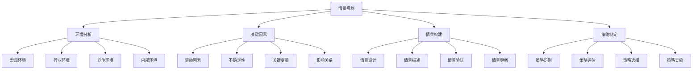

# 情景规划

## 🎯 学习目标
掌握情景规划理论和方法，学会构建情景分析框架，制定应对不同情景的策略，提升战略决策的前瞻性和适应性。

## 📊 情景规划框架

### 规划要素

## 🌍 环境分析

### 宏观环境
**政治环境**：
- **政策变化**：政策环境变化
- **法规调整**：法规制度调整
- **政治稳定**：政治稳定性
- **国际关系**：国际政治关系

**经济环境**：
- **经济增长**：经济增长趋势
- **通胀水平**：通胀水平变化
- **利率变化**：利率水平变化
- **汇率波动**：汇率波动情况

**社会环境**：
- **人口结构**：人口结构变化
- **消费习惯**：消费习惯变化
- **价值观念**：社会价值观念
- **文化趋势**：文化发展趋势

**技术环境**：
- **技术发展**：技术发展水平
- **技术突破**：技术突破可能
- **技术应用**：技术应用普及
- **技术标准**：技术标准变化

### 行业环境
**行业结构**：
- **行业规模**：行业市场规模
- **行业集中度**：行业集中度
- **行业壁垒**：行业进入壁垒
- **行业成熟度**：行业成熟度

**行业趋势**：
- **增长趋势**：行业增长趋势
- **技术趋势**：行业技术趋势
- **消费趋势**：行业消费趋势
- **竞争趋势**：行业竞争趋势

**行业变化**：
- **结构变化**：行业结构变化
- **模式变化**：商业模式变化
- **价值链变化**：价值链变化
- **生态变化**：行业生态变化

### 竞争环境
**竞争格局**：
- **竞争强度**：市场竞争强度
- **竞争结构**：市场竞争结构
- **竞争动态**：竞争动态变化
- **竞争趋势**：竞争发展趋势

**竞争对手**：
- **直接竞争**：直接竞争对手
- **间接竞争**：间接竞争对手
- **潜在竞争**：潜在竞争对手
- **替代竞争**：替代竞争对手

**竞争策略**：
- **竞争策略**：竞争对手策略
- **竞争手段**：竞争手段分析
- **竞争效果**：竞争效果评估
- **竞争创新**：竞争创新分析

### 内部环境
**资源能力**：
- **资源状况**：内部资源状况
- **能力水平**：内部能力水平
- **优势劣势**：内部优势劣势
- **发展潜力**：内部发展潜力

**组织状况**：
- **组织结构**：组织结构状况
- **管理水平**：管理水平状况
- **文化状况**：组织文化状况
- **制度状况**：制度体系状况

**财务状况**：
- **财务健康**：财务健康状况
- **盈利能力**：盈利能力状况
- **现金流**：现金流状况
- **财务风险**：财务风险状况

## 🔑 关键因素

### 驱动因素
**技术驱动**：
- **技术创新**：技术创新驱动
- **技术突破**：技术突破驱动
- **技术应用**：技术应用驱动
- **技术标准**：技术标准驱动

**市场驱动**：
- **需求变化**：市场需求变化
- **消费升级**：消费升级驱动
- **市场细分**：市场细分驱动
- **全球化**：全球化驱动

**政策驱动**：
- **政策支持**：政策支持驱动
- **政策限制**：政策限制驱动
- **政策变化**：政策变化驱动
- **政策创新**：政策创新驱动

**社会驱动**：
- **社会变化**：社会变化驱动
- **文化变化**：文化变化驱动
- **价值变化**：价值观念变化
- **生活方式**：生活方式变化

### 不确定性
**技术不确定性**：
- **技术发展**：技术发展不确定性
- **技术突破**：技术突破不确定性
- **技术应用**：技术应用不确定性
- **技术风险**：技术风险不确定性

**市场不确定性**：
- **需求变化**：需求变化不确定性
- **竞争变化**：竞争变化不确定性
- **价格变化**：价格变化不确定性
- **市场风险**：市场风险不确定性

**政策不确定性**：
- **政策变化**：政策变化不确定性
- **法规变化**：法规变化不确定性
- **监管变化**：监管变化不确定性
- **政策风险**：政策风险不确定性

**环境不确定性**：
- **经济环境**：经济环境不确定性
- **社会环境**：社会环境不确定性
- **自然环境**：自然环境不确定性
- **国际环境**：国际环境不确定性

### 关键变量
**市场变量**：
- **市场规模**：市场规模变量
- **市场增长率**：市场增长率变量
- **市场份额**：市场份额变量
- **市场价格**：市场价格变量

**技术变量**：
- **技术水平**：技术水平变量
- **技术成熟度**：技术成熟度变量
- **技术成本**：技术成本变量
- **技术性能**：技术性能变量

**政策变量**：
- **政策支持**：政策支持变量
- **政策限制**：政策限制变量
- **政策变化**：政策变化变量
- **政策影响**：政策影响变量

**竞争变量**：
- **竞争强度**：竞争强度变量
- **竞争策略**：竞争策略变量
- **竞争成本**：竞争成本变量
- **竞争效果**：竞争效果变量

### 影响关系
**因果关系**：
- **直接因果**：直接因果关系
- **间接因果**：间接因果关系
- **多因一果**：多因一果关系
- **一因多果**：一因多果关系

**相关关系**：
- **正相关**：正相关关系
- **负相关**：负相关关系
- **非线性相关**：非线性相关关系
- **条件相关**：条件相关关系

**反馈关系**：
- **正反馈**：正反馈关系
- **负反馈**：负反馈关系
- **延迟反馈**：延迟反馈关系
- **非线性反馈**：非线性反馈关系

## 🎭 情景构建

### 情景设计
**情景类型**：
- **乐观情景**：乐观发展情景
- **悲观情景**：悲观发展情景
- **基准情景**：基准发展情景
- **极端情景**：极端发展情景

**情景数量**：
- **情景数量**：情景数量确定
- **情景平衡**：情景间平衡
- **情景覆盖**：情景覆盖范围
- **情景区分**：情景间区分度

**情景逻辑**：
- **逻辑一致性**：情景逻辑一致性
- **逻辑合理性**：情景逻辑合理性
- **逻辑完整性**：情景逻辑完整性
- **逻辑可验证性**：情景逻辑可验证性

### 情景描述
**情景内容**：
- **环境描述**：环境状况描述
- **事件描述**：关键事件描述
- **结果描述**：预期结果描述
- **影响描述**：影响范围描述

**情景特征**：
- **时间维度**：情景时间维度
- **空间维度**：情景空间维度
- **程度维度**：情景程度维度
- **概率维度**：情景概率维度

**情景表达**：
- **文字描述**：文字情景描述
- **图表表达**：图表情景表达
- **数据表达**：数据情景表达
- **模型表达**：模型情景表达

### 情景验证
**验证方法**：
- **专家验证**：专家情景验证
- **历史验证**：历史情景验证
- **逻辑验证**：逻辑情景验证
- **数据验证**：数据情景验证

**验证标准**：
- **合理性**：情景合理性标准
- **一致性**：情景一致性标准
- **完整性**：情景完整性标准
- **可操作性**：情景可操作性标准

**验证结果**：
- **验证结果**：情景验证结果
- **修改建议**：情景修改建议
- **完善措施**：情景完善措施
- **更新计划**：情景更新计划

### 情景更新
**更新触发**：
- **环境变化**：环境变化触发
- **事件发生**：关键事件发生
- **信息更新**：新信息获得
- **定期更新**：定期更新机制

**更新内容**：
- **情景内容**：情景内容更新
- **情景参数**：情景参数更新
- **情景关系**：情景关系更新
- **情景概率**：情景概率更新

**更新管理**：
- **更新流程**：情景更新流程
- **更新监控**：情景更新监控
- **更新评估**：情景更新评估
- **更新优化**：情景更新优化

## 📋 策略制定

### 策略识别
**策略类型**：
- **适应策略**：情景适应策略
- **应对策略**：情景应对策略
- **利用策略**：情景利用策略
- **创造策略**：情景创造策略

**策略层次**：
- **战略策略**：战略层面策略
- **战术策略**：战术层面策略
- **操作策略**：操作层面策略
- **应急策略**：应急策略

**策略方向**：
- **进攻策略**：进攻性策略
- **防御策略**：防御性策略
- **合作策略**：合作性策略
- **创新策略**：创新性策略

### 策略评估
**评估维度**：
- **可行性**：策略可行性评估
- **有效性**：策略有效性评估
- **成本效益**：策略成本效益评估
- **风险水平**：策略风险水平评估

**评估方法**：
- **定量评估**：定量评估方法
- **定性评估**：定性评估方法
- **综合评估**：综合评估方法
- **对比评估**：对比评估方法

**评估标准**：
- **评估标准**：策略评估标准
- **评估指标**：策略评估指标
- **评估权重**：策略评估权重
- **评估阈值**：策略评估阈值

### 策略选择
**选择原则**：
- **最优原则**：最优策略选择
- **满意原则**：满意策略选择
- **稳健原则**：稳健策略选择
- **灵活原则**：灵活策略选择

**选择方法**：
- **决策树**：决策树选择方法
- **多准则决策**：多准则决策方法
- **博弈论**：博弈论选择方法
- **优化方法**：优化选择方法

**选择结果**：
- **策略组合**：策略组合选择
- **策略优先级**：策略优先级排序
- **策略实施**：策略实施计划
- **策略监控**：策略监控计划

### 策略实施
**实施计划**：
- **实施计划**：策略实施计划
- **实施步骤**：策略实施步骤
- **实施时间**：策略实施时间
- **实施资源**：策略实施资源

**实施管理**：
- **实施监控**：策略实施监控
- **实施调整**：策略实施调整
- **实施评估**：策略实施评估
- **实施优化**：策略实施优化

**实施保障**：
- **组织保障**：策略实施组织保障
- **资源保障**：策略实施资源保障
- **制度保障**：策略实施制度保障
- **技术保障**：策略实施技术保障

## 💡 实践应用

### 情景规划实施流程
1. **环境分析**：分析内外部环境
2. **关键因素**：识别关键驱动因素
3. **情景构建**：构建不同情景
4. **策略制定**：制定应对策略
5. **策略实施**：实施制定策略

### 应用领域
**战略规划**：
- **企业战略**：企业战略规划
- **业务战略**：业务战略规划
- **投资战略**：投资战略规划
- **创新战略**：创新战略规划

**风险管理**：
- **风险识别**：风险因素识别
- **风险评估**：风险程度评估
- **风险应对**：风险应对策略
- **风险监控**：风险监控机制

**决策支持**：
- **投资决策**：投资决策支持
- **技术决策**：技术决策支持
- **市场决策**：市场决策支持
- **政策决策**：政策决策支持

### 案例分析
**选择案例**：如能源行业情景规划
**分析维度**：
- 环境分析：宏观环境、行业环境、竞争环境
- 关键因素：技术驱动、政策驱动、市场驱动
- 情景构建：传统能源、新能源、混合能源情景
- 策略制定：适应策略、应对策略、创新策略

## 🧠 学习要点

### 费曼学习法应用
1. **选择概念**：情景规划
2. **简化解释**：用简单语言解释情景规划
3. **识别盲点**：找出理解不足的地方
4. **重新学习**：针对盲点深入学习

### 刻意练习要点
- **环境分析**：提升环境分析能力
- **因素识别**：提升关键因素识别能力
- **情景构建**：提升情景构建能力
- **策略制定**：提升策略制定能力

## 🔗 关联学习

### 前置知识
- [[03-蒙特卡洛模拟]] - 蒙特卡洛模拟
- [[02-敏感性分析]] - 敏感性分析
- [[01-决策树分析]] - 决策树分析

### 后续学习
- [[01-战略管理概论]] - 战略管理
- [[01-风险管理]] - 风险管理
- [[01-商业环境分析]] - 环境分析

### 实践应用
- 战略情景规划
- 风险情景分析
- 投资情景评估
- 政策情景分析

## 🎯 学习检验

### 理解检验
- [ ] 能够理解情景规划原理
- [ ] 能够分析环境因素
- [ ] 能够构建情景框架
- [ ] 能够制定应对策略

### 应用检验
- [ ] 能够构建具体情景
- [ ] 能够制定情景策略
- [ ] 能够评估策略效果
- [ ] 能够优化情景规划

---
**下一步**：[[01-战略管理概论]] - 战略管理概论

