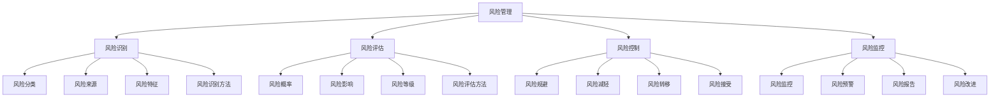

# 风险管理

## 🎯 学习目标
掌握风险管理理论和方法，学会识别、评估、控制和监控各类风险，提升风险应对能力和决策质量。

## 📊 风险管理框架

### 管理要素

## 🔍 风险识别

### 风险分类
**按风险来源分类**：
- **市场风险**：市场价格波动风险
- **信用风险**：交易对手违约风险
- **操作风险**：操作失误或系统故障风险
- **流动性风险**：资金流动性不足风险

**按风险性质分类**：
- **系统性风险**：影响整个市场的风险
- **非系统性风险**：影响特定个体的风险
- **可分散风险**：可通过分散化降低的风险
- **不可分散风险**：无法通过分散化消除的风险

**按风险影响分类**：
- **财务风险**：影响财务状况的风险
- **经营风险**：影响经营活动的风险
- **战略风险**：影响战略目标的风险
- **合规风险**：违反法律法规的风险

**按风险时间分类**：
- **短期风险**：短期内可能发生的风险
- **中期风险**：中期内可能发生的风险
- **长期风险**：长期内可能发生的风险
- **持续风险**：持续存在的风险

### 风险来源
**外部风险来源**：
- **宏观经济**：宏观经济环境变化
- **政策法规**：政策法规变化
- **市场竞争**：市场竞争加剧
- **技术变革**：技术变革影响

**内部风险来源**：
- **管理风险**：管理决策失误
- **人员风险**：人员流失或能力不足
- **系统风险**：信息系统故障
- **流程风险**：业务流程缺陷

**行业风险来源**：
- **行业周期**：行业周期性波动
- **行业竞争**：行业竞争格局变化
- **行业监管**：行业监管政策变化
- **行业技术**：行业技术发展变化

**项目风险来源**：
- **项目计划**：项目计划不完善
- **项目资源**：项目资源不足
- **项目技术**：项目技术风险
- **项目环境**：项目环境变化

### 风险特征
**不确定性**：
- **概率不确定**：风险发生概率不确定
- **时间不确定**：风险发生时间不确定
- **影响不确定**：风险影响程度不确定
- **后果不确定**：风险后果不确定

**客观性**：
- **客观存在**：风险客观存在
- **不以意志转移**：不因主观意志转移
- **可识别**：风险可以被识别
- **可测量**：风险可以被测量

**可变性**：
- **动态变化**：风险动态变化
- **相互转化**：风险相互转化
- **可控制**：风险可以控制
- **可管理**：风险可以管理

**损失性**：
- **潜在损失**：存在潜在损失
- **损失程度**：损失程度不同
- **损失范围**：损失范围不同
- **损失时间**：损失发生时间不同

### 风险识别方法
**定性方法**：
- **专家判断**：专家经验判断
- **头脑风暴**：头脑风暴方法
- **德尔菲法**：德尔菲专家法
- **检查表法**：风险检查表法

**定量方法**：
- **统计分析**：历史数据统计分析
- **模型分析**：风险模型分析
- **敏感性分析**：敏感性分析方法
- **蒙特卡洛模拟**：蒙特卡洛模拟方法

**综合方法**：
- **情景分析**：情景分析方法
- **故障树分析**：故障树分析方法
- **事件树分析**：事件树分析方法
- **因果分析**：因果分析方法

## 📈 风险评估

### 风险概率
**概率评估**：
- **历史概率**：基于历史数据评估
- **主观概率**：基于主观判断评估
- **客观概率**：基于客观数据评估
- **贝叶斯概率**：贝叶斯概率评估

**概率分布**：
- **正态分布**：正态概率分布
- **泊松分布**：泊松概率分布
- **指数分布**：指数概率分布
- **威布尔分布**：威布尔概率分布

**概率更新**：
- **信息更新**：新信息更新概率
- **贝叶斯更新**：贝叶斯概率更新
- **时间更新**：时间因素更新概率
- **条件更新**：条件变化更新概率

### 风险影响
**影响类型**：
- **财务影响**：财务损失影响
- **运营影响**：运营中断影响
- **声誉影响**：声誉损失影响
- **战略影响**：战略目标影响

**影响程度**：
- **轻微影响**：影响程度轻微
- **中等影响**：影响程度中等
- **严重影响**：影响程度严重
- **灾难性影响**：影响程度灾难性

**影响范围**：
- **局部影响**：影响范围局部
- **部门影响**：影响范围部门
- **企业影响**：影响范围企业
- **行业影响**：影响范围行业

**影响时间**：
- **短期影响**：影响时间短期
- **中期影响**：影响时间中期
- **长期影响**：影响时间长期
- **持续影响**：影响时间持续

### 风险等级
**等级划分**：
- **低风险**：风险等级低
- **中风险**：风险等级中等
- **高风险**：风险等级高
- **极高风险**：风险等级极高

**等级标准**：
- **概率标准**：基于概率的等级标准
- **影响标准**：基于影响的等级标准
- **综合标准**：综合概率和影响的等级标准
- **行业标准**：行业特定的等级标准

**等级矩阵**：
- **风险矩阵**：风险等级矩阵
- **概率影响矩阵**：概率影响矩阵
- **风险地图**：风险等级地图
- **风险仪表板**：风险等级仪表板

### 风险评估方法
**定性评估**：
- **专家评估**：专家评估方法
- **德尔菲法**：德尔菲评估方法
- **层次分析法**：层次分析法
- **模糊评估**：模糊评估方法

**定量评估**：
- **统计方法**：统计评估方法
- **模型方法**：模型评估方法
- **模拟方法**：模拟评估方法
- **优化方法**：优化评估方法

**综合评估**：
- **多准则评估**：多准则评估方法
- **综合评分**：综合评分方法
- **权重分析**：权重分析方法
- **敏感性分析**：敏感性分析方法

## 🛡️ 风险控制

### 风险规避
**规避策略**：
- **避免风险**：完全避免风险
- **退出风险**：退出风险活动
- **替代方案**：选择替代方案
- **风险转移**：转移风险责任

**规避方法**：
- **决策规避**：通过决策规避风险
- **行为规避**：通过行为规避风险
- **环境规避**：通过环境规避风险
- **时间规避**：通过时间规避风险

**规避评估**：
- **成本效益**：规避成本效益分析
- **机会成本**：规避机会成本分析
- **可行性**：规避可行性分析
- **效果评估**：规避效果评估

### 风险减轻
**减轻策略**：
- **预防措施**：预防风险发生
- **缓解措施**：缓解风险影响
- **应急措施**：应急风险处理
- **恢复措施**：风险后恢复

**减轻方法**：
- **技术方法**：技术手段减轻风险
- **管理方法**：管理手段减轻风险
- **制度方法**：制度手段减轻风险
- **文化方法**：文化手段减轻风险

**减轻实施**：
- **计划制定**：减轻计划制定
- **资源投入**：减轻资源投入
- **过程监控**：减轻过程监控
- **效果评估**：减轻效果评估

### 风险转移
**转移方式**：
- **保险转移**：通过保险转移风险
- **合同转移**：通过合同转移风险
- **外包转移**：通过外包转移风险
- **合作转移**：通过合作转移风险

**转移对象**：
- **保险公司**：向保险公司转移
- **合作伙伴**：向合作伙伴转移
- **供应商**：向供应商转移
- **客户**：向客户转移

**转移管理**：
- **转移评估**：转移可行性评估
- **转移实施**：转移方案实施
- **转移监控**：转移效果监控
- **转移优化**：转移方案优化

### 风险接受
**接受条件**：
- **风险可控**：风险在可控范围内
- **成本合理**：控制成本不合理
- **影响可承受**：影响可承受
- **机会大于风险**：机会大于风险

**接受策略**：
- **被动接受**：被动接受风险
- **主动接受**：主动接受风险
- **条件接受**：有条件接受风险
- **临时接受**：临时接受风险

**接受管理**：
- **接受决策**：接受风险决策
- **接受监控**：接受风险监控
- **接受应对**：接受风险应对
- **接受评估**：接受效果评估

## 📊 风险监控

### 风险监控
**监控体系**：
- **监控指标**：风险监控指标
- **监控频率**：风险监控频率
- **监控方法**：风险监控方法
- **监控工具**：风险监控工具

**监控内容**：
- **风险状态**：风险状态监控
- **风险变化**：风险变化监控
- **控制效果**：控制效果监控
- **环境变化**：环境变化监控

**监控实施**：
- **监控计划**：监控计划制定
- **监控执行**：监控计划执行
- **监控分析**：监控数据分析
- **监控报告**：监控报告生成

### 风险预警
**预警机制**：
- **预警指标**：风险预警指标
- **预警阈值**：风险预警阈值
- **预警等级**：风险预警等级
- **预警流程**：风险预警流程

**预警方法**：
- **定量预警**：定量指标预警
- **定性预警**：定性判断预警
- **模型预警**：风险模型预警
- **专家预警**：专家判断预警

**预警响应**：
- **预警接收**：预警信息接收
- **预警分析**：预警信息分析
- **预警决策**：预警响应决策
- **预警行动**：预警响应行动

### 风险报告
**报告内容**：
- **风险状况**：当前风险状况
- **风险变化**：风险变化趋势
- **控制效果**：风险控制效果
- **改进建议**：风险改进建议

**报告形式**：
- **定期报告**：定期风险报告
- **专项报告**：专项风险报告
- **应急报告**：应急风险报告
- **综合报告**：综合风险报告

**报告管理**：
- **报告制度**：风险报告制度
- **报告流程**：风险报告流程
- **报告质量**：风险报告质量
- **报告应用**：风险报告应用

### 风险改进
**改进识别**：
- **问题识别**：风险管理问题识别
- **差距分析**：风险管理差距分析
- **改进机会**：风险管理改进机会
- **最佳实践**：风险管理最佳实践

**改进实施**：
- **改进计划**：风险管理改进计划
- **改进措施**：风险管理改进措施
- **改进实施**：改进措施实施
- **改进监控**：改进效果监控

**改进评估**：
- **改进效果**：改进效果评估
- **改进成本**：改进成本评估
- **改进收益**：改进收益评估
- **改进持续**：改进持续优化

## 💡 实践应用

### 风险管理实施流程
1. **风险识别**：识别各类风险
2. **风险评估**：评估风险等级
3. **风险控制**：制定控制策略
4. **风险监控**：监控风险状况
5. **风险改进**：持续改进优化

### 应用领域
**企业风险管理**：
- **战略风险**：企业战略风险管理
- **财务风险**：企业财务风险管理
- **运营风险**：企业运营风险管理
- **合规风险**：企业合规风险管理

**项目风险管理**：
- **项目风险**：项目风险管理
- **技术风险**：项目技术风险管理
- **进度风险**：项目进度风险管理
- **成本风险**：项目成本风险管理

**投资风险管理**：
- **市场风险**：投资市场风险管理
- **信用风险**：投资信用风险管理
- **流动性风险**：投资流动性风险管理
- **操作风险**：投资操作风险管理

### 案例分析
**选择案例**：如2008年金融危机风险管理
**分析维度**：
- 风险识别：市场风险、信用风险、流动性风险识别
- 风险评估：风险概率、影响程度、等级评估
- 风险控制：风险规避、减轻、转移、接受策略
- 风险监控：风险监控、预警、报告、改进机制

## 🧠 学习要点

### 费曼学习法应用
1. **选择概念**：风险管理
2. **简化解释**：用简单语言解释风险管理
3. **识别盲点**：找出理解不足的地方
4. **重新学习**：针对盲点深入学习

### 刻意练习要点
- **风险识别**：提升风险识别能力
- **风险评估**：提升风险评估能力
- **风险控制**：提升风险控制能力
- **风险监控**：提升风险监控能力

## 🔗 关联学习

### 前置知识
- [[02-敏捷管理]] - 敏捷管理
- [[01-项目管理基础]] - 项目管理基础
- [[01-决策树分析]] - 决策分析

### 后续学习
- [[04-变更管理]] - 变更管理
- [[01-投资决策]] - 投资决策
- [[01-战略管理概论]] - 战略管理

### 实践应用
- 企业风险管理
- 项目风险管理
- 投资风险管理
- 运营风险管理

## 🎯 学习检验

### 理解检验
- [ ] 能够识别各类风险
- [ ] 能够评估风险等级
- [ ] 能够制定控制策略
- [ ] 能够监控风险状况

### 应用检验
- [ ] 能够建立风险管理体系
- [ ] 能够实施风险控制措施
- [ ] 能够监控风险变化趋势
- [ ] 能够优化风险管理效果

---
**下一步**：[[04-变更管理]] - 变更管理

