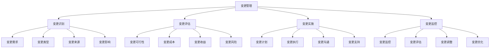

# 变更管理

## 🎯 学习目标
掌握变更管理理论和方法，学会有效管理组织变革和项目变更，提升变更成功率和组织适应性。

## 📊 变更管理框架

### 管理要素

## 🔍 变更识别

### 变更需求
**需求来源**：
- **外部驱动**：外部环境变化驱动
- **内部驱动**：内部发展需要驱动
- **战略调整**：战略目标调整驱动
- **技术升级**：技术升级需要驱动

**需求类型**：
- **战略变更**：战略方向变更需求
- **组织变更**：组织结构变更需求
- **流程变更**：业务流程变更需求
- **技术变更**：技术系统变更需求

**需求分析**：
- **需求识别**：变更需求识别
- **需求分析**：变更需求分析
- **需求优先级**：需求优先级排序
- **需求验证**：需求合理性验证

**需求管理**：
- **需求收集**：变更需求收集
- **需求整理**：变更需求整理
- **需求跟踪**：变更需求跟踪
- **需求变更**：需求变更管理

### 变更类型
**按变更范围分类**：
- **战略变更**：战略层面变更
- **组织变更**：组织层面变更
- **流程变更**：流程层面变更
- **技术变更**：技术层面变更

**按变更程度分类**：
- **渐进变更**：渐进式变更
- **激进变更**：激进式变更
- **局部变更**：局部范围变更
- **全面变更**：全面范围变更

**按变更性质分类**：
- **计划变更**：计划内变更
- **应急变更**：应急性变更
- **主动变更**：主动发起变更
- **被动变更**：被动应对变更

**按变更时间分类**：
- **短期变更**：短期变更
- **中期变更**：中期变更
- **长期变更**：长期变更
- **持续变更**：持续变更

### 变更来源
**外部来源**：
- **市场变化**：市场环境变化
- **政策变化**：政策法规变化
- **技术变化**：技术发展变化
- **竞争变化**：竞争环境变化

**内部来源**：
- **战略调整**：企业战略调整
- **组织发展**：组织发展需要
- **流程优化**：流程优化需要
- **技术升级**：技术升级需要

**项目来源**：
- **项目需求**：项目需求变化
- **项目环境**：项目环境变化
- **项目资源**：项目资源变化
- **项目风险**：项目风险应对

**人员来源**：
- **人员需求**：人员需求变化
- **能力提升**：能力提升需要
- **文化变革**：文化变革需要
- **激励调整**：激励体系调整

### 变更影响
**影响范围**：
- **局部影响**：局部范围影响
- **部门影响**：部门范围影响
- **企业影响**：企业范围影响
- **行业影响**：行业范围影响

**影响程度**：
- **轻微影响**：影响程度轻微
- **中等影响**：影响程度中等
- **严重影响**：影响程度严重
- **根本影响**：影响程度根本性

**影响类型**：
- **正面影响**：正面积极影响
- **负面影响**：负面消极影响
- **中性影响**：中性无影响
- **混合影响**：正负混合影响

**影响时间**：
- **短期影响**：短期时间影响
- **中期影响**：中期时间影响
- **长期影响**：长期时间影响
- **持续影响**：持续时间影响

## 📈 变更评估

### 变更可行性
**技术可行性**：
- **技术能力**：技术能力评估
- **技术资源**：技术资源评估
- **技术风险**：技术风险评估
- **技术成熟度**：技术成熟度评估

**经济可行性**：
- **投资需求**：投资需求评估
- **成本效益**：成本效益分析
- **投资回报**：投资回报评估
- **财务风险**：财务风险评估

**组织可行性**：
- **组织能力**：组织能力评估
- **组织资源**：组织资源评估
- **组织文化**：组织文化评估
- **组织准备度**：组织准备度评估

**时间可行性**：
- **时间要求**：时间要求评估
- **时间资源**：时间资源评估
- **时间风险**：时间风险评估
- **时间安排**：时间安排评估

### 变更成本
**直接成本**：
- **人力成本**：人力投入成本
- **物力成本**：物力投入成本
- **财力成本**：财力投入成本
- **时间成本**：时间投入成本

**间接成本**：
- **机会成本**：机会成本损失
- **转换成本**：转换过程成本
- **学习成本**：学习适应成本
- **协调成本**：协调沟通成本

**隐性成本**：
- **文化成本**：文化适应成本
- **心理成本**：心理适应成本
- **关系成本**：关系调整成本
- **信任成本**：信任重建成本

**成本控制**：
- **成本预算**：变更成本预算
- **成本监控**：成本执行监控
- **成本优化**：成本结构优化
- **成本评估**：成本效果评估

### 变更收益
**直接收益**：
- **效率提升**：效率提升收益
- **成本降低**：成本降低收益
- **质量改善**：质量改善收益
- **收入增长**：收入增长收益

**间接收益**：
- **能力提升**：能力提升收益
- **竞争优势**：竞争优势收益
- **市场地位**：市场地位收益
- **品牌价值**：品牌价值收益

**长期收益**：
- **战略收益**：战略目标收益
- **发展收益**：发展潜力收益
- **创新收益**：创新能力收益
- **可持续收益**：可持续发展收益

**收益评估**：
- **收益预测**：收益预测分析
- **收益量化**：收益量化评估
- **收益实现**：收益实现监控
- **收益评估**：收益效果评估

### 变更风险
**实施风险**：
- **执行风险**：变更执行风险
- **技术风险**：技术实施风险
- **资源风险**：资源不足风险
- **时间风险**：时间延误风险

**接受风险**：
- **抵制风险**：员工抵制风险
- **适应风险**：适应困难风险
- **文化风险**：文化冲突风险
- **能力风险**：能力不足风险

**效果风险**：
- **效果风险**：效果不达预期风险
- **副作用风险**：负面副作用风险
- **回退风险**：变更回退风险
- **连锁风险**：连锁反应风险

**风险控制**：
- **风险识别**：变更风险识别
- **风险评估**：变更风险评估
- **风险控制**：变更风险控制
- **风险监控**：变更风险监控

## 🚀 变更实施

### 变更计划
**计划制定**：
- **目标设定**：变更目标设定
- **策略选择**：变更策略选择
- **步骤规划**：实施步骤规划
- **时间安排**：时间进度安排

**计划内容**：
- **实施计划**：变更实施计划
- **资源计划**：资源需求计划
- **沟通计划**：沟通协调计划
- **风险计划**：风险应对计划

**计划管理**：
- **计划审批**：变更计划审批
- **计划发布**：变更计划发布
- **计划执行**：计划执行管理
- **计划调整**：计划调整机制

### 变更执行
**执行准备**：
- **资源准备**：执行资源准备
- **人员准备**：执行人员准备
- **系统准备**：系统环境准备
- **文化准备**：文化氛围准备

**执行过程**：
- **执行启动**：变更执行启动
- **执行监控**：执行过程监控
- **执行调整**：执行过程调整
- **执行完成**：变更执行完成

**执行管理**：
- **执行控制**：执行过程控制
- **执行协调**：执行过程协调
- **执行支持**：执行过程支持
- **执行评估**：执行效果评估

### 变更沟通
**沟通策略**：
- **沟通目标**：沟通目标设定
- **沟通对象**：沟通对象识别
- **沟通内容**：沟通内容设计
- **沟通方式**：沟通方式选择

**沟通实施**：
- **沟通计划**：沟通计划制定
- **沟通执行**：沟通计划执行
- **沟通反馈**：沟通反馈收集
- **沟通调整**：沟通策略调整

**沟通管理**：
- **沟通监控**：沟通效果监控
- **沟通评估**：沟通效果评估
- **沟通改进**：沟通方式改进
- **沟通优化**：沟通策略优化

### 变更支持
**支持体系**：
- **领导支持**：领导层支持
- **资源支持**：资源投入支持
- **技术支持**：技术能力支持
- **培训支持**：培训学习支持

**支持措施**：
- **激励措施**：激励支持措施
- **保障措施**：保障支持措施
- **服务措施**：服务支持措施
- **应急措施**：应急支持措施

**支持管理**：
- **支持监控**：支持效果监控
- **支持评估**：支持效果评估
- **支持调整**：支持措施调整
- **支持优化**：支持体系优化

## 📊 变更监控

### 变更监控
**监控体系**：
- **监控指标**：变更监控指标
- **监控频率**：监控频率设定
- **监控方法**：监控方法选择
- **监控工具**：监控工具应用

**监控内容**：
- **进度监控**：变更进度监控
- **质量监控**：变更质量监控
- **成本监控**：变更成本监控
- **风险监控**：变更风险监控

**监控实施**：
- **监控计划**：监控计划制定
- **监控执行**：监控计划执行
- **监控分析**：监控数据分析
- **监控报告**：监控报告生成

### 变更评估
**评估维度**：
- **目标达成**：变更目标达成评估
- **效果评估**：变更效果评估
- **成本效益**：成本效益评估
- **风险控制**：风险控制评估

**评估方法**：
- **定量评估**：定量指标评估
- **定性评估**：定性指标评估
- **对比评估**：对比分析评估
- **综合评估**：综合评估方法

**评估实施**：
- **评估计划**：评估计划制定
- **评估执行**：评估计划执行
- **评估分析**：评估结果分析
- **评估报告**：评估报告生成

### 变更调整
**调整触发**：
- **问题触发**：问题发现触发调整
- **风险触发**：风险发生触发调整
- **环境触发**：环境变化触发调整
- **反馈触发**：反馈意见触发调整

**调整内容**：
- **目标调整**：变更目标调整
- **策略调整**：变更策略调整
- **计划调整**：实施计划调整
- **资源调整**：资源配置调整

**调整管理**：
- **调整决策**：调整决策机制
- **调整实施**：调整措施实施
- **调整监控**：调整效果监控
- **调整评估**：调整效果评估

### 变更优化
**优化识别**：
- **问题识别**：变更问题识别
- **机会识别**：优化机会识别
- **最佳实践**：最佳实践学习
- **创新机会**：创新优化机会

**优化实施**：
- **优化计划**：优化计划制定
- **优化措施**：优化措施实施
- **优化监控**：优化效果监控
- **优化评估**：优化效果评估

**优化管理**：
- **优化文化**：持续优化文化
- **优化机制**：优化机制建立
- **优化能力**：优化能力建设
- **优化创新**：优化创新实践

## 💡 实践应用

### 变更管理实施流程
1. **变更识别**：识别变更需求
2. **变更评估**：评估变更可行性
3. **变更实施**：实施变更计划
4. **变更监控**：监控变更过程
5. **变更优化**：持续优化改进

### 应用领域
**组织变革**：
- **战略变革**：企业战略变革管理
- **组织变革**：组织结构变革管理
- **文化变革**：企业文化变革管理
- **流程变革**：业务流程变革管理

**项目变更**：
- **需求变更**：项目需求变更管理
- **范围变更**：项目范围变更管理
- **进度变更**：项目进度变更管理
- **成本变更**：项目成本变更管理

**技术变更**：
- **系统变更**：信息系统变更管理
- **技术升级**：技术升级变更管理
- **平台迁移**：平台迁移变更管理
- **架构调整**：架构调整变更管理

### 案例分析
**选择案例**：如微软向云服务转型
**分析维度**：
- 变更识别：战略转型需求、技术变革需求
- 变更评估：技术可行性、经济可行性、组织可行性
- 变更实施：转型计划、执行过程、沟通协调
- 变更监控：进度监控、效果评估、持续优化

## 🧠 学习要点

### 费曼学习法应用
1. **选择概念**：变更管理
2. **简化解释**：用简单语言解释变更管理
3. **识别盲点**：找出理解不足的地方
4. **重新学习**：针对盲点深入学习

### 刻意练习要点
- **变更识别**：提升变更识别能力
- **变更评估**：提升变更评估能力
- **变更实施**：提升变更实施能力
- **变更监控**：提升变更监控能力

## 🔗 关联学习

### 前置知识
- [[03-风险管理]] - 风险管理
- [[02-敏捷管理]] - 敏捷管理
- [[01-项目管理基础]] - 项目管理基础

### 后续学习
- [[01-战略管理概论]] - 战略管理
- [[01-组织文化]] - 组织文化
- [[01-数字化转型]] - 数字化转型

### 实践应用
- 组织变革管理
- 项目变更管理
- 技术变更管理
- 流程变更管理

## 🎯 学习检验

### 理解检验
- [ ] 能够识别变更需求
- [ ] 能够评估变更可行性
- [ ] 能够制定变更计划
- [ ] 能够监控变更过程

### 应用检验
- [ ] 能够实施组织变革
- [ ] 能够管理项目变更
- [ ] 能够控制变更风险
- [ ] 能够优化变更效果

---
**下一步**：[[01-战略管理概论]] - 战略管理概论

