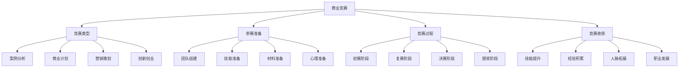

# 商业竞赛

## 🎯 学习目标
了解各类商业竞赛类型和参与方式，学会通过商业竞赛提升商业技能和实践能力，积累商业经验和人脉资源。

## 📊 商业竞赛框架

### 竞赛要素

## 🏆 竞赛类型

### 案例分析竞赛
**竞赛特点**：
- **案例研究**：真实商业案例研究
- **问题解决**：商业问题解决方案
- **分析能力**：商业分析能力展示
- **创新思维**：创新思维体现

**知名竞赛**：
- **欧莱雅全球商业策略竞赛**：L'Oréal Brandstorm
- **贝恩杯咨询启航案例大赛**：Bain Cup
- **罗兰贝格校园精英挑战赛**：Roland Berger Challenge
- **德勤税务精英挑战赛**：Deloitte Tax Challenge

**参赛要求**：
- **团队参赛**：通常3-5人团队
- **专业背景**：商科或相关专业
- **分析能力**：商业分析能力
- **表达能力**：口头表达能力

**竞赛流程**：
- **案例发布**：竞赛案例发布
- **分析准备**：案例分析和方案准备
- **方案提交**：分析方案提交
- **现场展示**：现场展示和答辩

### 商业计划竞赛
**竞赛特点**：
- **创业项目**：创业项目商业计划
- **市场分析**：市场分析和定位
- **财务规划**：财务规划和预测
- **实施计划**：项目实施计划

**知名竞赛**：
- **挑战杯中国大学生创业计划竞赛**：Challenge Cup
- **互联网+大学生创新创业大赛**：Internet Plus
- **创青春全国大学生创业大赛**：Youth Innovation
- **中国创新创业大赛**：China Innovation

**参赛要求**：
- **创业项目**：具有创新性的创业项目
- **团队完整**：完整的创业团队
- **市场前景**：良好的市场前景
- **可行性**：项目具有可行性

**竞赛流程**：
- **项目申报**：创业项目申报
- **初赛评审**：初赛项目评审
- **复赛路演**：复赛项目路演
- **决赛展示**：决赛项目展示

### 营销策划竞赛
**竞赛特点**：
- **营销策略**：营销策略制定
- **创意设计**：营销创意设计
- **执行方案**：营销执行方案
- **效果评估**：营销效果评估

**知名竞赛**：
- **宝洁挑战赛**：P&G Challenge
- **联合利华未来领袖挑战赛**：Unilever Future Leaders
- **可口可乐商业挑战赛**：Coca-Cola Business Challenge
- **雀巢商业挑战赛**：Nestlé Business Challenge

**参赛要求**：
- **营销知识**：营销理论知识
- **创意能力**：营销创意能力
- **执行能力**：营销执行能力
- **团队协作**：团队协作能力

**竞赛流程**：
- **题目发布**：营销题目发布
- **方案设计**：营销方案设计
- **方案提交**：营销方案提交
- **现场展示**：现场展示和答辩

### 创新创业竞赛
**竞赛特点**：
- **技术创新**：技术创新项目
- **商业模式**：商业模式创新
- **市场应用**：市场应用前景
- **社会价值**：社会价值创造

**知名竞赛**：
- **中国国际互联网+大学生创新创业大赛**：China International Internet Plus
- **中美青年创客大赛**：China-US Young Makers
- **全国大学生电子设计竞赛**：National Electronic Design Contest
- **全国大学生数学建模竞赛**：National Mathematical Modeling Contest

**参赛要求**：
- **创新项目**：具有创新性的项目
- **技术含量**：一定的技术含量
- **市场价值**：市场应用价值
- **团队能力**：团队执行能力

**竞赛流程**：
- **项目申报**：创新项目申报
- **技术评审**：技术方案评审
- **市场验证**：市场应用验证
- **投资对接**：投资机构对接

## 🎯 参赛准备

### 团队组建
**团队结构**：
- **队长**：团队负责人
- **技术专家**：技术能力专家
- **市场专家**：市场分析专家
- **财务专家**：财务分析专家

**团队要求**：
- **技能互补**：团队成员技能互补
- **性格匹配**：团队成员性格匹配
- **目标一致**：团队目标一致
- **责任明确**：团队成员责任明确

**团队管理**：
- **沟通机制**：团队沟通机制
- **决策机制**：团队决策机制
- **激励机制**：团队激励机制
- **冲突解决**：团队冲突解决

### 技能准备
**分析技能**：
- **商业分析**：商业分析技能
- **数据分析**：数据分析技能
- **市场分析**：市场分析技能
- **财务分析**：财务分析技能

**表达技能**：
- **口头表达**：口头表达能力
- **书面表达**：书面表达能力
- **PPT制作**：PPT制作能力
- **演讲技巧**：演讲技巧能力

**创新技能**：
- **创新思维**：创新思维能力
- **创意设计**：创意设计能力
- **问题解决**：问题解决能力
- **批判思维**：批判思维能力

**协作技能**：
- **团队协作**：团队协作能力
- **沟通协调**：沟通协调能力
- **时间管理**：时间管理能力
- **压力管理**：压力管理能力

### 材料准备
**项目材料**：
- **商业计划书**：完整的商业计划书
- **市场调研报告**：详细的市场调研报告
- **财务预测**：财务预测和分析
- **技术方案**：技术实现方案

**展示材料**：
- **PPT演示**：专业的PPT演示
- **视频材料**：项目介绍视频
- **产品原型**：产品原型或模型
- **宣传材料**：项目宣传材料

**支撑材料**：
- **团队介绍**：团队成员介绍
- **项目背景**：项目背景资料
- **市场数据**：市场数据支撑
- **技术资料**：技术资料支撑

### 心理准备
**心态调整**：
- **积极心态**：保持积极心态
- **学习心态**：保持学习心态
- **竞争心态**：正确竞争心态
- **合作心态**：团队合作心态

**压力管理**：
- **时间压力**：时间压力管理
- **竞争压力**：竞争压力管理
- **期望压力**：期望压力管理
- **失败压力**：失败压力管理

**情绪管理**：
- **情绪控制**：情绪控制能力
- **情绪调节**：情绪调节能力
- **情绪表达**：情绪表达能力
- **情绪支持**：情绪支持机制

## 🚀 竞赛过程

### 初赛阶段
**初赛准备**：
- **材料提交**：初赛材料提交
- **资格审查**：参赛资格审查
- **初步评审**：初步方案评审
- **结果通知**：初赛结果通知

**初赛策略**：
- **方案完整**：确保方案完整性
- **逻辑清晰**：确保逻辑清晰性
- **创新突出**：突出创新亮点
- **可行性强**：确保方案可行性

**初赛注意**：
- **时间节点**：注意时间节点
- **材料格式**：注意材料格式
- **内容质量**：注意内容质量
- **团队协作**：注意团队协作

### 复赛阶段
**复赛准备**：
- **方案优化**：方案进一步优化
- **展示准备**：现场展示准备
- **答辩准备**：答辩问题准备
- **团队演练**：团队配合演练

**复赛策略**：
- **展示技巧**：掌握展示技巧
- **答辩技巧**：掌握答辩技巧
- **时间控制**：控制展示时间
- **互动技巧**：掌握互动技巧

**复赛注意**：
- **现场表现**：注意现场表现
- **问题回答**：注意问题回答
- **团队配合**：注意团队配合
- **评委反馈**：注意评委反馈

### 决赛阶段
**决赛准备**：
- **方案完善**：方案最终完善
- **展示优化**：展示效果优化
- **答辩强化**：答辩能力强化
- **心理调整**：心理状态调整

**决赛策略**：
- **亮点突出**：突出项目亮点
- **差异化**：体现差异化优势
- **市场价值**：强调市场价值
- **执行能力**：展示执行能力

**决赛注意**：
- **细节把控**：注意细节把控
- **临场发挥**：注意临场发挥
- **评委关注**：关注评委关注点
- **竞争对手**：了解竞争对手

### 颁奖阶段
**颁奖准备**：
- **获奖感言**：准备获奖感言
- **媒体采访**：准备媒体采访
- **后续规划**：制定后续规划
- **资源对接**：准备资源对接

**颁奖策略**：
- **感谢表达**：表达感谢之情
- **经验分享**：分享参赛经验
- **未来展望**：展望未来发展
- **合作机会**：寻找合作机会

**颁奖注意**：
- **礼仪规范**：注意礼仪规范
- **形象管理**：注意形象管理
- **网络传播**：注意网络传播
- **后续跟进**：注意后续跟进

## 🎁 竞赛收获

### 技能提升
**分析技能**：
- **商业分析**：商业分析能力提升
- **数据分析**：数据分析能力提升
- **市场分析**：市场分析能力提升
- **财务分析**：财务分析能力提升

**表达技能**：
- **口头表达**：口头表达能力提升
- **书面表达**：书面表达能力提升
- **PPT制作**：PPT制作能力提升
- **演讲技巧**：演讲技巧能力提升

**创新技能**：
- **创新思维**：创新思维能力提升
- **创意设计**：创意设计能力提升
- **问题解决**：问题解决能力提升
- **批判思维**：批判思维能力提升

**协作技能**：
- **团队协作**：团队协作能力提升
- **沟通协调**：沟通协调能力提升
- **时间管理**：时间管理能力提升
- **压力管理**：压力管理能力提升

### 经验积累
**项目经验**：
- **项目管理**：项目管理经验
- **团队管理**：团队管理经验
- **时间管理**：时间管理经验
- **资源管理**：资源管理经验

**行业经验**：
- **行业认知**：行业认知经验
- **市场经验**：市场分析经验
- **技术经验**：技术应用经验
- **商业经验**：商业运作经验

**竞赛经验**：
- **参赛经验**：参赛流程经验
- **展示经验**：项目展示经验
- **答辩经验**：现场答辩经验
- **竞争经验**：竞争策略经验

### 人脉拓展
**同学人脉**：
- **同校同学**：同校同学人脉
- **同专业同学**：同专业同学人脉
- **竞赛伙伴**：竞赛伙伴人脉
- **学习伙伴**：学习伙伴人脉

**行业人脉**：
- **行业专家**：行业专家人脉
- **企业高管**：企业高管人脉
- **投资人**：投资人人脉
- **创业者**：创业伙伴人脉

**导师人脉**：
- **学术导师**：学术导师人脉
- **企业导师**：企业导师人脉
- **行业导师**：行业导师人脉
- **创业导师**：创业导师人脉

### 职业发展
**就业机会**：
- **实习机会**：实习机会获得
- **工作机会**：工作机会获得
- **内推机会**：内推机会获得
- **转正机会**：转正机会获得

**创业机会**：
- **项目孵化**：项目孵化机会
- **投资对接**：投资对接机会
- **合作伙伴**：合作伙伴机会
- **市场机会**：市场机会获得

**发展机会**：
- **能力认证**：能力认证获得
- **荣誉获得**：荣誉奖项获得
- **媒体关注**：媒体关注获得
- **社会认可**：社会认可获得

## 💡 实践应用

### 参赛策略
**选择策略**：
- **兴趣匹配**：选择兴趣匹配的竞赛
- **能力匹配**：选择能力匹配的竞赛
- **时间匹配**：选择时间匹配的竞赛
- **目标匹配**：选择目标匹配的竞赛

**准备策略**：
- **充分准备**：充分准备参赛材料
- **团队协作**：加强团队协作配合
- **技能提升**：持续提升相关技能
- **心理准备**：做好心理准备

**参赛策略**：
- **突出优势**：突出团队和项目优势
- **差异化**：体现差异化竞争优势
- **创新性**：强调项目创新性
- **可行性**：证明项目可行性

### 成功要素
**项目质量**：
- **创新性**：项目具有创新性
- **可行性**：项目具有可行性
- **市场价值**：项目具有市场价值
- **技术含量**：项目具有技术含量

**团队能力**：
- **专业能力**：团队成员专业能力
- **协作能力**：团队协作能力
- **表达能力**：团队表达能力
- **执行能力**：团队执行能力

**展示效果**：
- **逻辑清晰**：展示逻辑清晰
- **重点突出**：重点内容突出
- **视觉效果好**：视觉效果良好
- **互动性强**：互动性强

### 注意事项
**时间管理**：
- **时间规划**：合理规划时间
- **进度控制**：控制项目进度
- **截止时间**：注意截止时间
- **时间分配**：合理分配时间

**团队协作**：
- **角色分工**：明确角色分工
- **沟通机制**：建立沟通机制
- **决策机制**：建立决策机制
- **冲突解决**：解决团队冲突

**材料准备**：
- **材料完整**：确保材料完整
- **格式规范**：注意格式规范
- **内容质量**：保证内容质量
- **及时提交**：及时提交材料

## 🧠 学习要点

### 费曼学习法应用
1. **选择概念**：商业竞赛
2. **简化解释**：用简单语言解释商业竞赛
3. **识别盲点**：找出理解不足的地方
4. **重新学习**：针对盲点深入学习

### 刻意练习要点
- **分析能力**：提升商业分析能力
- **表达能力**：提升表达展示能力
- **团队协作**：提升团队协作能力
- **创新思维**：提升创新思维能力

## 🔗 关联学习

### 前置知识
- [[01-商业学概论]] - 商业学基础
- [[01-战略管理概论]] - 战略管理
- [[01-商业模式画布]] - 商业模式

### 后续学习
- [[02-实习机会]] - 实习机会
- [[03-行业报告]] - 行业报告
- [[01-创业管理]] - 创业管理

### 实践应用
- 商业案例分析
- 商业计划制定
- 营销策略设计
- 创新创业实践

## 🎯 学习检验

### 理解检验
- [ ] 能够了解各类商业竞赛
- [ ] 能够准备参赛材料
- [ ] 能够参与竞赛过程
- [ ] 能够获得竞赛收获

### 应用检验
- [ ] 能够选择合适的竞赛
- [ ] 能够组建参赛团队
- [ ] 能够制定参赛策略
- [ ] 能够获得竞赛成功

---
**下一步**：[[02-实习机会]] - 实习机会