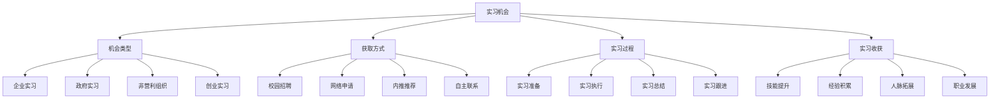

# 实习机会

## 🎯 学习目标
了解商业实习机会类型和获取方式，学会通过实习提升实践能力和职业素养，积累工作经验和行业认知。

## 📊 实习机会框架

### 机会要素

## 🏢 机会类型

### 企业实习
**大型企业**：
- **跨国公司**：跨国公司实习机会
- **国有企业**：国有企业实习机会
- **民营企业**：民营企业实习机会
- **上市公司**：上市公司实习机会

**行业分布**：
- **金融行业**：银行、证券、保险实习
- **咨询行业**：管理咨询、战略咨询实习
- **科技行业**：互联网、软件、硬件实习
- **制造业**：汽车、电子、机械实习

**岗位类型**：
- **管理岗位**：管理培训生、助理岗位
- **技术岗位**：技术开发、数据分析岗位
- **营销岗位**：市场营销、销售岗位
- **财务岗位**：财务分析、会计岗位

**实习特点**：
- **体系完善**：完善的实习体系
- **培训丰富**：丰富的培训内容
- **导师指导**：专业导师指导
- **转正机会**：转正就业机会

### 政府实习
**政府机构**：
- **中央部委**：中央部委实习机会
- **地方政府**：地方政府实习机会
- **事业单位**：事业单位实习机会
- **国有企业**：国有企业实习机会

**实习内容**：
- **政策研究**：政策研究和分析
- **项目管理**：政府项目管理
- **公共服务**：公共服务提供
- **行政事务**：行政事务处理

**实习特点**：
- **稳定环境**：稳定的工作环境
- **政策学习**：政策制定学习
- **公共服务**：公共服务体验
- **职业发展**：公务员职业发展

### 非营利组织
**组织类型**：
- **国际组织**：联合国、世界银行等
- **国内NGO**：国内非营利组织
- **基金会**：各类基金会
- **社会企业**：社会企业实习

**实习内容**：
- **项目管理**：公益项目管理
- **筹款活动**：筹款活动组织
- **社会调研**：社会问题调研
- **志愿服务**：志愿服务组织

**实习特点**：
- **社会价值**：创造社会价值
- **多元文化**：多元文化体验
- **创新能力**：创新能力培养
- **国际视野**：国际视野拓展

### 创业实习
**创业公司**：
- **初创公司**：初创公司实习
- **成长公司**：成长公司实习
- **独角兽公司**：独角兽公司实习
- **传统企业**：传统企业创新部门

**实习内容**：
- **产品开发**：产品开发和设计
- **市场拓展**：市场拓展和营销
- **运营管理**：运营管理和优化
- **融资支持**：融资和投资支持

**实习特点**：
- **快速成长**：快速成长环境
- **多元角色**：多元角色体验
- **创新氛围**：创新氛围浓厚
- **创业机会**：创业机会获得

## 🎯 获取方式

### 校园招聘
**校园宣讲**：
- **企业宣讲**：企业校园宣讲会
- **行业讲座**：行业专家讲座
- **招聘会**：校园招聘会
- **职业指导**：职业指导活动

**招聘流程**：
- **简历投递**：简历投递和筛选
- **笔试面试**：笔试和面试环节
- **实习确认**：实习机会确认
- **入职准备**：入职准备工作

**校园资源**：
- **就业中心**：学校就业指导中心
- **校友网络**：校友网络资源
- **教授推荐**：教授推荐机会
- **同学介绍**：同学介绍机会

### 网络申请
**招聘网站**：
- **综合招聘**：智联招聘、前程无忧
- **专业招聘**：拉勾网、Boss直聘
- **企业官网**：企业官方网站
- **社交媒体**：LinkedIn、脉脉

**申请策略**：
- **简历优化**：简历内容优化
- **投递技巧**：投递时机和技巧
- **跟进策略**：申请跟进策略
- **面试准备**：面试准备技巧

**在线平台**：
- **实习平台**：实习僧、刺猬实习
- **校园平台**：校园招聘平台
- **行业平台**：行业专业平台
- **社交平台**：社交媒体平台

### 内推推荐
**内推渠道**：
- **校友推荐**：校友内推机会
- **朋友推荐**：朋友内推机会
- **导师推荐**：导师推荐机会
- **同事推荐**：同事推荐机会

**内推优势**：
- **成功率高**：内推成功率较高
- **信息准确**：内推信息更准确
- **快速反馈**：内推反馈更快速
- **个性化**：内推更个性化

**内推策略**：
- **关系维护**：维护人际关系
- **价值提供**：提供价值给对方
- **时机把握**：把握推荐时机
- **感谢表达**：表达感谢之情

### 自主联系
**直接联系**：
- **企业HR**：直接联系企业HR
- **部门负责人**：联系部门负责人
- **项目负责人**：联系项目负责人
- **创始人**：联系公司创始人

**联系方式**：
- **邮件联系**：邮件联系方式
- **电话联系**：电话联系方式
- **社交媒体**：社交媒体联系
- **线下活动**：线下活动接触

**联系技巧**：
- **自我介绍**：简洁自我介绍
- **价值展示**：展示个人价值
- **需求表达**：表达实习需求
- **跟进策略**：联系跟进策略

## 🚀 实习过程

### 实习准备
**心理准备**：
- **心态调整**：调整实习心态
- **期望管理**：管理实习期望
- **压力准备**：准备工作压力
- **学习准备**：准备学习态度

**技能准备**：
- **专业技能**：准备专业技能
- **办公技能**：准备办公技能
- **沟通技能**：准备沟通技能
- **学习技能**：准备学习技能

**材料准备**：
- **简历更新**：更新个人简历
- **作品集**：准备作品集
- **推荐信**：准备推荐信
- **证书材料**：准备相关证书

**生活准备**：
- **住宿安排**：安排住宿问题
- **交通安排**：安排交通问题
- **生活用品**：准备生活用品
- **财务安排**：安排财务问题

### 实习执行
**工作适应**：
- **环境适应**：适应工作环境
- **文化适应**：适应企业文化
- **团队适应**：适应团队氛围
- **任务适应**：适应工作任务

**学习成长**：
- **主动学习**：主动学习新知识
- **技能提升**：提升工作技能
- **经验积累**：积累工作经验
- **能力发展**：发展综合能力

**工作表现**：
- **任务完成**：高质量完成任务
- **主动承担**：主动承担责任
- **团队协作**：积极参与团队协作
- **创新贡献**：提供创新想法

**关系建立**：
- **同事关系**：建立良好同事关系
- **导师关系**：建立导师关系
- **客户关系**：建立客户关系
- **合作伙伴**：建立合作伙伴关系

### 实习总结
**工作总结**：
- **工作内容**：总结工作内容
- **工作成果**：总结工作成果
- **工作收获**：总结工作收获
- **工作不足**：总结工作不足

**学习总结**：
- **知识学习**：总结知识学习
- **技能提升**：总结技能提升
- **能力发展**：总结能力发展
- **经验积累**：总结经验积累

**关系总结**：
- **人际关系**：总结人际关系
- **导师关系**：总结导师关系
- **客户关系**：总结客户关系
- **合作伙伴**：总结合作伙伴

**未来规划**：
- **职业规划**：制定职业规划
- **学习规划**：制定学习规划
- **能力规划**：制定能力规划
- **发展规划**：制定发展规划

### 实习跟进
**关系维护**：
- **定期联系**：定期联系同事
- **节日问候**：节日问候联系
- **信息分享**：分享有用信息
- **帮助支持**：提供帮助支持

**机会把握**：
- **工作机会**：把握工作机会
- **学习机会**：把握学习机会
- **合作机会**：把握合作机会
- **发展机会**：把握发展机会

**持续学习**：
- **技能学习**：持续技能学习
- **知识更新**：持续知识更新
- **经验分享**：分享实习经验
- **能力提升**：持续能力提升

## 🎁 实习收获

### 技能提升
**专业技能**：
- **行业知识**：行业专业知识
- **技术技能**：专业技术技能
- **分析技能**：商业分析技能
- **解决问题**：问题解决技能

**软技能**：
- **沟通能力**：沟通协调能力
- **团队协作**：团队协作能力
- **时间管理**：时间管理能力
- **压力管理**：压力管理能力

**管理技能**：
- **项目管理**：项目管理技能
- **团队管理**：团队管理技能
- **客户管理**：客户管理技能
- **资源管理**：资源管理技能

### 经验积累
**工作经验**：
- **工作流程**：工作流程经验
- **工作方法**：工作方法经验
- **工作标准**：工作标准经验
- **工作效率**：工作效率经验

**行业经验**：
- **行业认知**：行业认知经验
- **市场经验**：市场分析经验
- **竞争经验**：竞争分析经验
- **趋势经验**：行业趋势经验

**项目经验**：
- **项目管理**：项目管理经验
- **团队合作**：团队合作经验
- **客户服务**：客户服务经验
- **问题解决**：问题解决经验

### 人脉拓展
**同事人脉**：
- **同部门同事**：同部门同事人脉
- **跨部门同事**：跨部门同事人脉
- **上级领导**：上级领导人脉
- **下级同事**：下级同事人脉

**行业人脉**：
- **行业专家**：行业专家人脉
- **企业高管**：企业高管人脉
- **客户关系**：客户关系人脉
- **合作伙伴**：合作伙伴人脉

**导师人脉**：
- **工作导师**：工作导师人脉
- **职业导师**：职业导师人脉
- **行业导师**：行业导师人脉
- **人生导师**：人生导师人脉

### 职业发展
**就业机会**：
- **转正机会**：实习转正机会
- **推荐机会**：内推就业机会
- **跳槽机会**：跳槽发展机会
- **创业机会**：创业发展机会

**职业规划**：
- **职业方向**：明确职业方向
- **发展路径**：制定发展路径
- **能力要求**：了解能力要求
- **学习计划**：制定学习计划

**职业素养**：
- **职业态度**：培养职业态度
- **职业操守**：培养职业操守
- **职业形象**：培养职业形象
- **职业能力**：培养职业能力

## 💡 实践应用

### 实习策略
**选择策略**：
- **兴趣匹配**：选择兴趣匹配的实习
- **能力匹配**：选择能力匹配的实习
- **时间匹配**：选择时间匹配的实习
- **目标匹配**：选择目标匹配的实习

**准备策略**：
- **充分准备**：充分准备实习材料
- **技能提升**：持续提升相关技能
- **心理准备**：做好心理准备
- **生活准备**：做好生活准备

**执行策略**：
- **主动学习**：主动学习新知识
- **积极表现**：积极表现工作能力
- **建立关系**：建立良好人际关系
- **创造价值**：为公司创造价值

### 成功要素
**个人素质**：
- **学习能力**：强大的学习能力
- **适应能力**：快速适应能力
- **沟通能力**：良好的沟通能力
- **团队协作**：优秀的团队协作

**工作态度**：
- **积极主动**：积极主动的工作态度
- **认真负责**：认真负责的工作态度
- **创新思维**：创新思维的工作态度
- **持续改进**：持续改进的工作态度

**专业能力**：
- **专业技能**：扎实的专业技能
- **分析能力**：强大的分析能力
- **解决问题**：优秀的问题解决能力
- **执行能力**：强大的执行能力

### 注意事项
**时间管理**：
- **时间规划**：合理规划时间
- **任务优先级**：确定任务优先级
- **工作效率**：提高工作效率
- **时间平衡**：平衡工作和生活

**关系管理**：
- **同事关系**：维护良好同事关系
- **上下级关系**：维护上下级关系
- **客户关系**：维护客户关系
- **导师关系**：维护导师关系

**学习成长**：
- **主动学习**：主动学习新知识
- **技能提升**：持续提升技能
- **经验总结**：及时总结经验
- **能力发展**：持续发展能力

## 🧠 学习要点

### 费曼学习法应用
1. **选择概念**：实习机会
2. **简化解释**：用简单语言解释实习机会
3. **识别盲点**：找出理解不足的地方
4. **重新学习**：针对盲点深入学习

### 刻意练习要点
- **技能提升**：提升专业技能
- **经验积累**：积累工作经验
- **人脉拓展**：拓展人脉关系
- **职业发展**：规划职业发展

## 🔗 关联学习

### 前置知识
- [[01-商业竞赛]] - 商业竞赛
- [[01-人力资源管理]] - 人力资源管理
- [[01-职业规划]] - 职业规划

### 后续学习
- [[03-行业报告]] - 行业报告
- [[01-就业指导]] - 就业指导
- [[01-职业发展]] - 职业发展

### 实践应用
- 企业实习实践
- 政府实习实践
- 非营利组织实习
- 创业公司实习

## 🎯 学习检验

### 理解检验
- [ ] 能够了解各类实习机会
- [ ] 能够获取实习机会
- [ ] 能够执行实习过程
- [ ] 能够获得实习收获

### 应用检验
- [ ] 能够选择合适的实习
- [ ] 能够准备实习材料
- [ ] 能够执行实习任务
- [ ] 能够获得实习成功

---
**下一步**：[[03-行业报告]] - 行业报告

