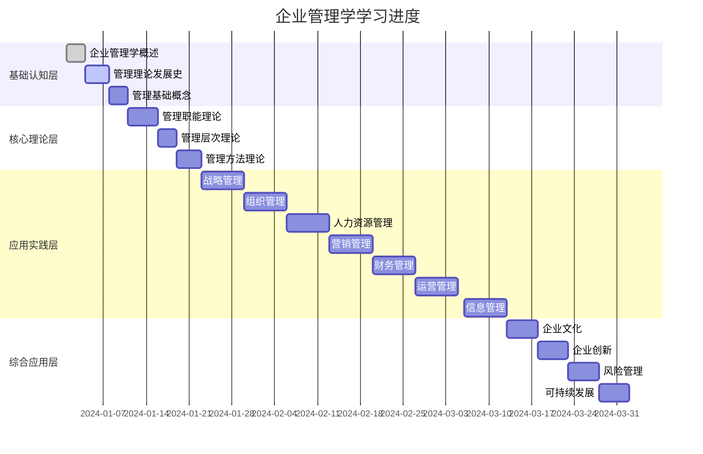

# 学习进度跟踪

## 📊 总体进度概览

## 📈 详细进度记录

### 基础认知层 (0/3 完成)

#### 1. 企业管理学概述
- **开始时间**：2024-01-01
- **预计完成**：2024-01-03
- **实际完成**：⏳ 进行中
- **完成度**：0%
- **学习内容**：
  - [ ] [[企业管理学定义与内涵]]
  - [ ] [[企业管理学基本特征]]
  - [ ] [[企业管理学学科体系]]
  - [ ] [[企业管理学与其他学科关系]]
  - [ ] [[思维导图-企业管理学概述]]
- **学习笔记**：_待填写_
- **掌握程度**：⏳ 未开始

#### 2. 管理理论发展史
- **开始时间**：2024-01-04
- **预计完成**：2024-01-07
- **实际完成**：⏳ 未开始
- **完成度**：0%
- **学习内容**：
  - [ ] [[古典管理理论]]
  - [ ] [[行为科学理论]]
  - [ ] [[现代管理理论]]
  - [ ] [[当代管理理论]]
  - [ ] [[管理理论演进脉络图]]
  - [ ] [[记忆口诀-管理理论发展]]
- **学习笔记**：_待填写_
- **掌握程度**：⏳ 未开始

#### 3. 管理基础概念
- **开始时间**：2024-01-08
- **预计完成**：2024-01-10
- **实际完成**：⏳ 未开始
- **完成度**：0%
- **学习内容**：
  - [ ] [[管理的基本概念]]
  - [ ] [[管理者角色与技能]]
  - [ ] [[管理环境分析]]
  - [ ] [[管理伦理与社会责任]]
  - [ ] [[知识卡片-管理基础概念]]
- **学习笔记**：_待填写_
- **掌握程度**：⏳ 未开始

### 核心理论层 (0/3 完成)

#### 4. 管理职能理论
- **开始时间**：2024-01-11
- **预计完成**：2024-01-15
- **实际完成**：⏳ 未开始
- **完成度**：0%
- **学习内容**：
  - [ ] [[计划职能理论]]
  - [ ] [[组织职能理论]]
  - [ ] [[领导职能理论]]
  - [ ] [[控制职能理论]]
  - [ ] [[管理职能整合]]
  - [ ] [[思维导图-管理职能理论]]
- **学习笔记**：_待填写_
- **掌握程度**：⏳ 未开始

#### 5. 管理层次理论
- **开始时间**：2024-01-16
- **预计完成**：2024-01-18
- **实际完成**：⏳ 未开始
- **完成度**：0%
- **学习内容**：
  - [ ] [[战略管理层]]
  - [ ] [[战术管理层]]
  - [ ] [[作业管理层]]
  - [ ] [[管理层次协调]]
  - [ ] [[记忆口诀-管理层次理论]]
- **学习笔记**：_待填写_
- **掌握程度**：⏳ 未开始

#### 6. 管理方法理论
- **开始时间**：2024-01-19
- **预计完成**：2024-01-22
- **实际完成**：⏳ 未开始
- **完成度**：0%
- **学习内容**：
  - [ ] [[系统管理方法]]
  - [ ] [[权变管理方法]]
  - [ ] [[科学管理方法]]
  - [ ] [[人本管理方法]]
  - [ ] [[知识卡片-管理方法理论]]
- **学习笔记**：_待填写_
- **掌握程度**：⏳ 未开始

## 📊 学习统计

### 总体统计
- **总模块数**：24个
- **已完成模块**：0个
- **进行中模块**：0个
- **未开始模块**：24个
- **完成率**：0%

### 按层级统计
| 层级 | 模块数 | 已完成 | 进行中 | 未开始 | 完成率 |
|------|--------|--------|--------|--------|--------|
| 基础认知层 | 3 | 0 | 0 | 3 | 0% |
| 核心理论层 | 3 | 0 | 0 | 3 | 0% |
| 应用实践层 | 7 | 0 | 0 | 7 | 0% |
| 综合应用层 | 4 | 0 | 0 | 4 | 0% |

### 按难度统计
| 难度 | 模块数 | 已完成 | 完成率 |
|------|--------|--------|--------|
| ⭐ | 5 | 0 | 0% |
| ⭐⭐ | 8 | 0 | 0% |
| ⭐⭐⭐ | 6 | 0 | 0% |
| ⭐⭐⭐⭐ | 4 | 0 | 0% |
| ⭐⭐⭐⭐⭐ | 1 | 0 | 0% |

## 🎯 学习目标

### 短期目标 (1个月内)
- [ ] 完成基础认知层学习
- [ ] 完成核心理论层学习
- [ ] 建立基本概念框架

### 中期目标 (3个月内)
- [ ] 完成应用实践层学习
- [ ] 掌握各管理领域技能
- [ ] 能够独立分析案例

### 长期目标 (6个月内)
- [ ] 完成综合应用层学习
- [ ] 形成综合管理能力
- [ ] 能够指导实践应用

## 📝 学习笔记模板

### 每日学习记录
**日期**：2024-01-01
**学习模块**：[[企业管理学定义与内涵]]
**学习时间**：2小时
**主要内容**：
- 企业管理学的定义
- 企业管理学的内涵
- 企业管理学的基本特征

**重点难点**：
- 管理的本质理解
- 管理与其他学科的区别

**学习心得**：
_待填写_

**下一步计划**：
- 复习今日内容
- 预习下一模块

## 🔗 相关链接

- [[学习路径图]] - 查看完整学习路径
- [[知识难度标识]] - 了解各模块难度
- [[学习目标设定]] - 制定个人学习目标
- [[知识体系总览]] - 整体知识框架

---
*更新时间：2024年*
*学习进度将根据实际学习情况动态更新*

