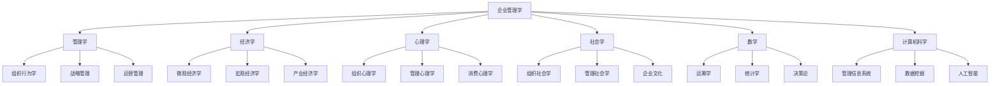
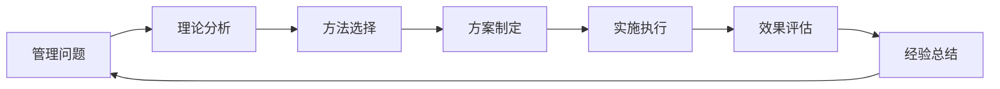
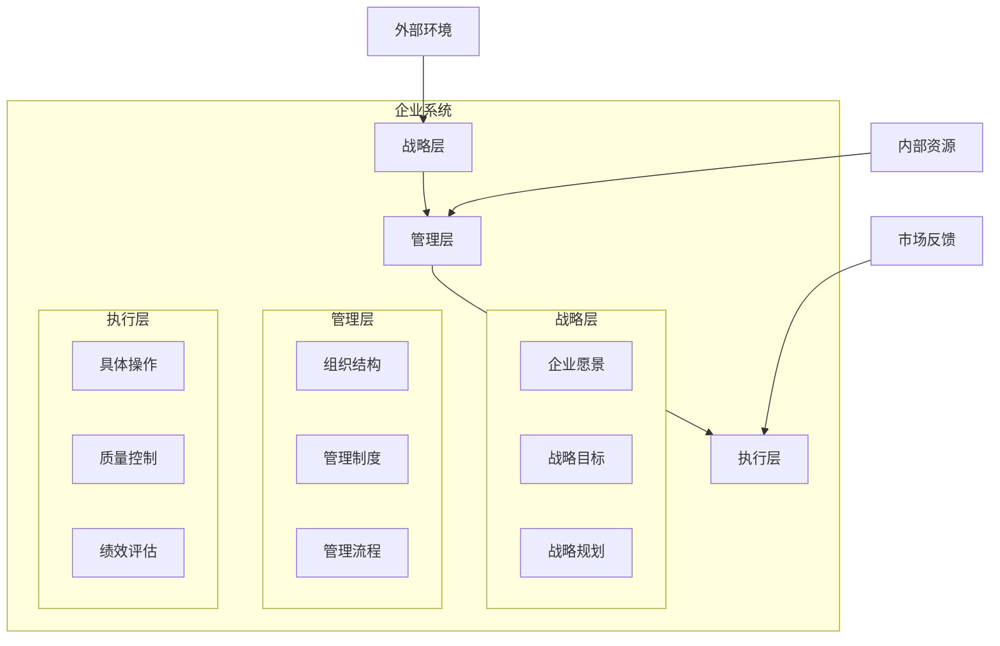
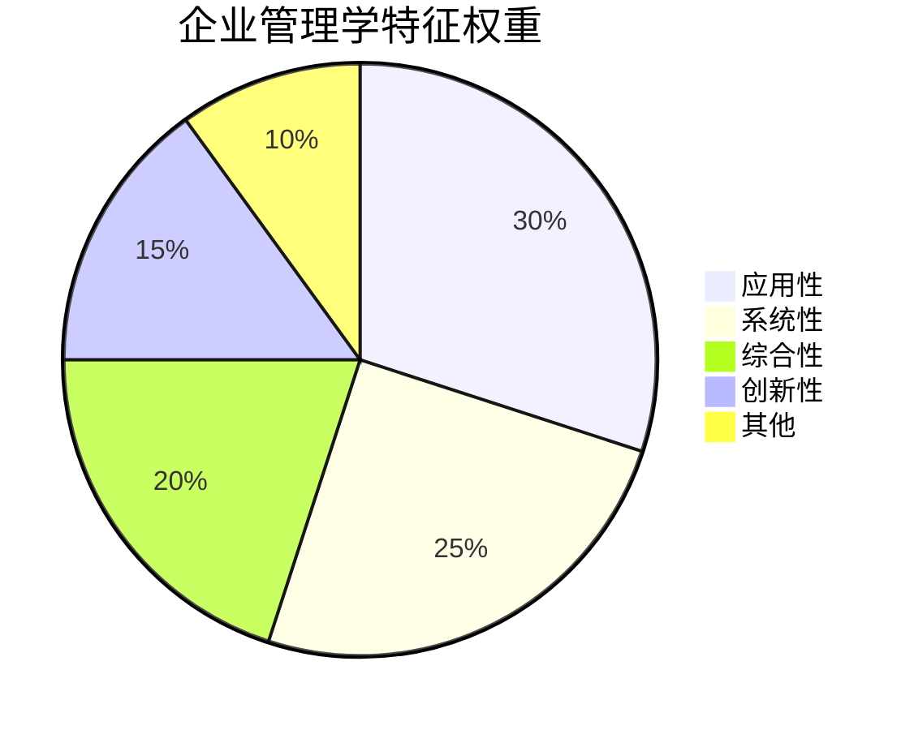

# 企业管理学基本特征

## 🎯 企业管理学的本质特征

### 1. 综合性特征

#### 多学科交叉融合
企业管理学不是单一学科，而是多学科交叉融合的综合性学科：

#### 多领域覆盖
- **战略管理**：企业战略规划与实施
- **组织管理**：组织结构设计与优化
- **人力资源管理**：人才招聘、培训、激励
- **营销管理**：市场分析、产品推广、客户关系
- **财务管理**：资金管理、投资决策、风险控制
- **运营管理**：生产管理、质量管理、供应链管理
- **信息管理**：信息系统、数据管理、数字化转型

#### 多方法运用
| 方法类型 | 具体方法 | 应用领域 |
|----------|----------|----------|
| 定性方法 | 案例研究、访谈、观察 | 战略分析、组织研究 |
| 定量方法 | 统计分析、数学建模 | 财务分析、运营优化 |
| 混合方法 | 问卷调查、实验研究 | 人力资源管理、营销研究 |
| 系统方法 | 系统分析、系统设计 | 组织设计、流程优化 |

### 2. 应用性特征

#### 实践导向
企业管理学以解决实际问题为导向：

#### 问题解决导向
- **识别问题**：准确识别管理问题
- **分析问题**：深入分析问题原因
- **制定方案**：制定解决方案
- **实施方案**：有效实施方案
- **评估效果**：评估实施效果
- **持续改进**：持续改进管理

#### 工具提供
- **分析工具**：SWOT分析、波特五力模型、BCG矩阵
- **决策工具**：决策树、德尔菲法、层次分析法
- **评估工具**：平衡计分卡、KPI指标体系、360度评估
- **管理工具**：项目管理、质量管理、风险管理

### 3. 系统性特征

#### 整体性思维
企业管理学强调从整体角度研究问题：

#### 层次性结构
- **战略层**：企业整体战略规划
- **管理层**：部门管理协调
- **执行层**：具体操作执行
- **支撑层**：技术、信息、文化支撑

#### 关联性分析
- **内部关联**：各部门之间的关联
- **外部关联**：企业与环境的关联
- **时间关联**：不同时期的关联
- **空间关联**：不同地域的关联

### 4. 创新性特征

#### 理论创新
- **新理论提出**：不断提出新的管理理论
- **理论完善**：不断完善现有理论
- **理论整合**：整合不同理论
- **理论应用**：将理论应用于实践

#### 方法创新
- **新方法开发**：开发新的管理方法
- **方法改进**：改进现有方法
- **方法组合**：组合不同方法
- **方法验证**：验证方法有效性

#### 工具创新
- **新工具设计**：设计新的管理工具
- **工具升级**：升级现有工具
- **工具集成**：集成不同工具
- **工具应用**：推广应用工具

## 🔍 企业管理学的特殊性质

### 1. 动态性
- **环境变化**：适应环境变化
- **技术发展**：适应技术发展
- **市场变化**：适应市场变化
- **管理演进**：管理理论不断演进

### 2. 复杂性
- **多因素影响**：受多种因素影响
- **非线性关系**：存在非线性关系
- **不确定性**：存在不确定性
- **动态平衡**：需要动态平衡

### 3. 适应性
- **环境适应**：适应外部环境
- **变化适应**：适应环境变化
- **创新适应**：适应创新发展
- **竞争适应**：适应竞争环境

### 4. 发展性
- **持续发展**：持续发展进步
- **创新发展**：创新发展模式
- **可持续发展**：实现可持续发展
- **高质量发展**：实现高质量发展

## 📊 企业管理学特征对比

### 与其他学科对比
| 特征 | 企业管理学 | 管理学 | 经济学 | 心理学 |
|------|------------|--------|--------|--------|
| 综合性 | ⭐⭐⭐⭐⭐ | ⭐⭐⭐⭐ | ⭐⭐⭐ | ⭐⭐ |
| 应用性 | ⭐⭐⭐⭐⭐ | ⭐⭐⭐⭐ | ⭐⭐⭐ | ⭐⭐ |
| 系统性 | ⭐⭐⭐⭐⭐ | ⭐⭐⭐⭐ | ⭐⭐⭐ | ⭐⭐ |
| 创新性 | ⭐⭐⭐⭐ | ⭐⭐⭐ | ⭐⭐ | ⭐⭐⭐ |
| 实践性 | ⭐⭐⭐⭐⭐ | ⭐⭐⭐⭐ | ⭐⭐ | ⭐⭐ |

### 特征权重分析

## 🎯 特征应用指导

### 1. 综合性应用
- **多角度分析**：从多个角度分析问题
- **多方法结合**：结合多种方法解决问题
- **多学科融合**：融合多学科知识
- **多领域协调**：协调多个领域工作

### 2. 应用性应用
- **问题导向**：以问题为导向
- **实践验证**：通过实践验证理论
- **工具使用**：使用实用工具
- **效果评估**：评估应用效果

### 3. 系统性应用
- **整体规划**：进行整体规划
- **层次管理**：分层次管理
- **关联协调**：协调各种关联
- **动态调整**：动态调整策略

### 4. 创新性应用
- **理论创新**：创新管理理论
- **方法创新**：创新管理方法
- **工具创新**：创新管理工具
- **实践创新**：创新管理实践

## 📚 学习要点总结

### 核心特征
1. **综合性**：多学科交叉融合
2. **应用性**：实践导向，问题解决
3. **系统性**：整体性、层次性、关联性
4. **创新性**：理论、方法、工具创新

### 关键理解
- 企业管理学是综合性应用学科
- 理论与实践相结合
- 系统性与创新性并重
- 动态性与适应性结合

### 实践应用
- 运用综合性思维分析问题
- 注重实践应用和问题解决
- 采用系统性方法管理企业
- 持续创新和改进管理

## 🔗 相关链接

- [[企业管理学定义与内涵]] - 企业管理学基本概念
- [[企业管理学学科体系]] - 学科体系结构
- [[企业管理学与其他学科关系]] - 学科关系
- [[思维导图-企业管理学概述]] - 可视化知识结构

## 📚 延伸阅读

- [[管理的基本概念]] - 管理基础概念
- [[管理者角色与技能]] - 管理者要求
- [[管理环境分析]] - 管理环境
- [[管理伦理与社会责任]] - 管理伦理

---
*更新时间：2024年*
*内容将根据学习反馈持续优化*

