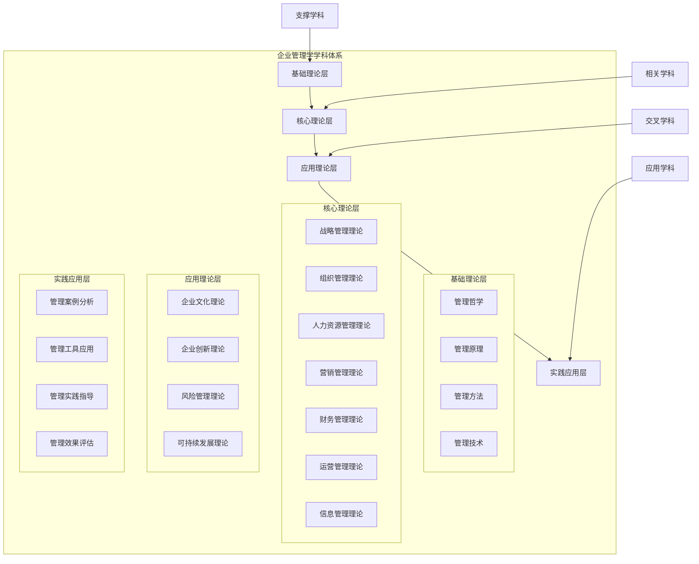
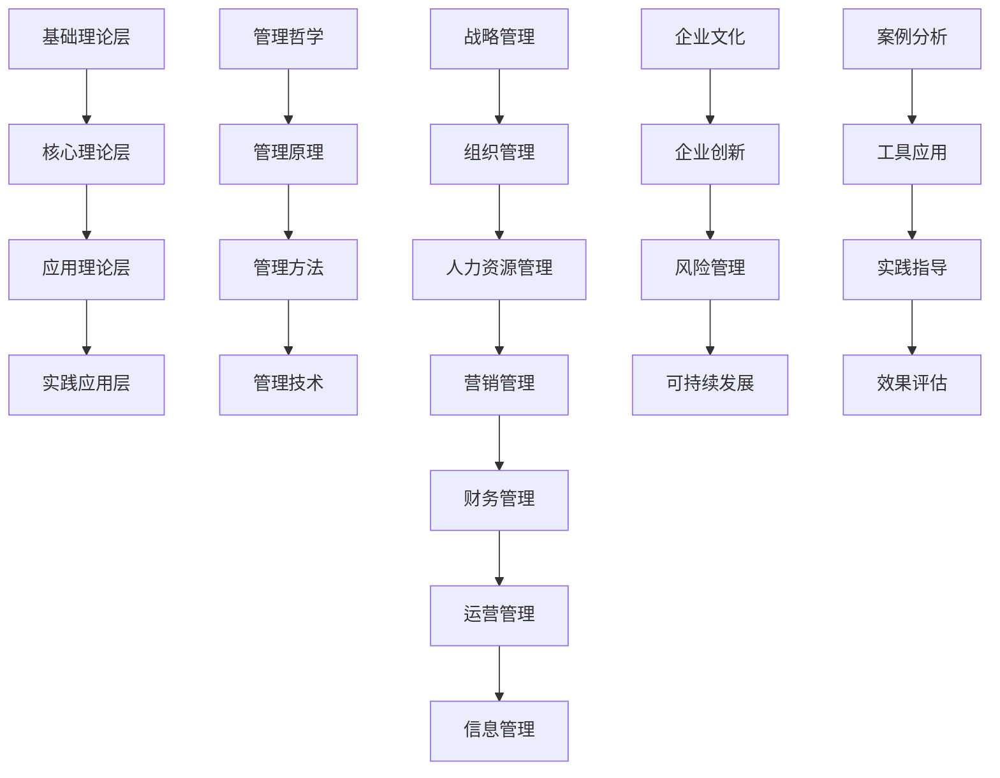

# 企业管理学学科体系

## 🏗️ 学科体系结构

### 整体架构
企业管理学学科体系是一个多层次、多维度的知识结构体系：

## 📚 学科体系层次

### 第一层：基础理论层
**目标**：建立企业管理学的基本理论基础
**内容**：

#### 1. 管理哲学
- **管理本质**：管理的本质和内涵
- **管理价值**：管理的价值和意义
- **管理伦理**：管理的伦理和道德
- **管理文化**：管理的文化和理念

#### 2. 管理原理
- **基本原理**：管理的基本原理
- **一般原理**：管理的一般原理
- **特殊原理**：管理的特殊原理
- **发展原理**：管理的发展原理

#### 3. 管理方法
- **基本方法**：管理的基本方法
- **一般方法**：管理的一般方法
- **特殊方法**：管理的特殊方法
- **创新方法**：管理的创新方法

#### 4. 管理技术
- **基础技术**：管理的基础技术
- **应用技术**：管理的应用技术
- **创新技术**：管理的创新技术
- **信息技术**：管理的信息技术

### 第二层：核心理论层
**目标**：构建企业管理学的核心理论体系
**内容**：

#### 1. 战略管理理论
- **战略分析**：外部环境分析、内部环境分析
- **战略制定**：战略目标设定、战略选择
- **战略实施**：战略执行、战略控制
- **战略评估**：战略绩效评估、战略调整

#### 2. 组织管理理论
- **组织结构**：组织结构类型、设计原则
- **组织行为**：个体行为、群体行为、组织行为
- **组织发展**：组织学习、组织创新、组织变革
- **组织文化**：企业文化内涵、建设、管理

#### 3. 人力资源管理理论
- **人力资源规划**：需求分析、供给分析、供需平衡
- **招聘与选拔**：招聘策略、选拔方法、面试技巧
- **培训与开发**：培训需求、培训计划、培训实施
- **绩效管理**：绩效目标、绩效评估、绩效改进
- **薪酬管理**：薪酬体系、薪酬水平、薪酬结构

#### 4. 营销管理理论
- **市场分析**：市场环境、消费者行为、市场细分
- **营销策略**：产品策略、价格策略、渠道策略
- **营销组合**：4P营销组合、4C营销组合、4R营销组合
- **客户关系管理**：客户价值、客户关系、客户维护

#### 5. 财务管理理论
- **财务分析**：财务报表分析、财务比率分析
- **投资决策**：投资决策方法、投资项目评估
- **融资决策**：融资方式选择、资本结构优化
- **营运资金管理**：现金管理、应收账款管理

#### 6. 运营管理理论
- **生产管理**：生产计划、生产控制、生产优化
- **质量管理**：质量管理体系、质量控制方法
- **供应链管理**：供应链设计、供应商管理
- **项目管理**：项目规划、项目执行、项目控制

#### 7. 信息管理理论
- **信息系统**：信息系统规划、开发、实施
- **数据管理**：数据收集、数据分析、数据挖掘
- **数字化转型**：数字化转型策略、技术应用
- **知识管理**：知识分类、知识共享、知识创新

### 第三层：应用理论层
**目标**：形成企业管理学的应用理论体系
**内容**：

#### 1. 企业文化理论
- **文化内涵**：企业文化的内涵和特征
- **文化类型**：企业文化的类型和模式
- **文化建设**：企业文化的建设过程
- **文化管理**：企业文化的管理方法

#### 2. 企业创新理论
- **创新理论**：创新的基本理论
- **创新类型**：创新的类型和模式
- **创新过程**：创新的过程管理
- **创新绩效**：创新的绩效评估

#### 3. 风险管理理论
- **风险识别**：风险的识别和评估
- **风险控制**：风险的控制策略
- **风险预警**：风险的预警机制
- **风险管理**：风险的管理体系

#### 4. 可持续发展理论
- **可持续发展理念**：可持续发展的基本理念
- **可持续发展战略**：可持续发展的战略制定
- **可持续发展实践**：可持续发展的实践方法
- **可持续发展评估**：可持续发展的评估方法

### 第四层：实践应用层
**目标**：指导企业管理实践应用
**内容**：

#### 1. 管理案例分析
- **经典案例**：经典管理案例分析
- **行业案例**：行业管理案例分析
- **失败案例**：失败管理案例分析
- **案例方法**：案例分析方法

#### 2. 管理工具应用
- **分析工具**：SWOT分析、波特五力模型
- **决策工具**：决策树、德尔菲法
- **评估工具**：平衡计分卡、KPI指标
- **工具指南**：工具使用指南

#### 3. 管理实践指导
- **实践指南**：管理实践指南
- **方法指导**：管理方法指导
- **技能指导**：管理技能指导
- **经验指导**：管理经验指导

#### 4. 管理效果评估
- **效果评估**：管理效果评估
- **绩效评估**：管理绩效评估
- **改进评估**：管理改进评估
- **发展评估**：管理发展评估

## 🔗 学科体系关系

### 层次关系

### 支撑关系
- **基础理论层**支撑**核心理论层**
- **核心理论层**支撑**应用理论层**
- **应用理论层**支撑**实践应用层**
- **实践应用层**反馈**基础理论层**

### 互动关系
- **理论指导实践**：理论指导实践应用
- **实践验证理论**：实践验证理论正确性
- **理论实践结合**：理论与实践相结合
- **理论实践创新**：理论与实践共同创新

## 📊 学科体系特点

### 1. 系统性
- **完整体系**：形成完整的知识体系
- **逻辑清晰**：层次分明，逻辑严密
- **结构合理**：结构合理，层次清晰
- **关系明确**：关系明确，联系紧密

### 2. 层次性
- **基础层次**：基础理论层次
- **核心层次**：核心理论层次
- **应用层次**：应用理论层次
- **实践层次**：实践应用层次

### 3. 综合性
- **多学科融合**：融合多学科知识
- **多领域覆盖**：覆盖多个管理领域
- **多方法结合**：结合多种方法
- **多角度分析**：从多个角度分析

### 4. 发展性
- **持续发展**：持续发展进步
- **创新发展**：创新发展模式
- **动态调整**：动态调整结构
- **与时俱进**：与时俱进发展

## 🎯 学科体系应用

### 1. 学习指导
- **学习路径**：指导学习路径
- **学习重点**：明确学习重点
- **学习方法**：提供学习方法
- **学习评估**：进行学习评估

### 2. 研究指导
- **研究方向**：指导研究方向
- **研究方法**：提供研究方法
- **研究重点**：明确研究重点
- **研究评估**：进行研究评估

### 3. 实践指导
- **实践路径**：指导实践路径
- **实践方法**：提供实践方法
- **实践重点**：明确实践重点
- **实践评估**：进行实践评估

### 4. 教学指导
- **教学内容**：指导教学内容
- **教学方法**：提供教学方法
- **教学重点**：明确教学重点
- **教学评估**：进行教学评估

## 📚 学习要点总结

### 核心结构
1. **基础理论层**：管理哲学、原理、方法、技术
2. **核心理论层**：七大管理领域理论
3. **应用理论层**：企业文化、创新、风险、可持续发展
4. **实践应用层**：案例分析、工具应用、实践指导、效果评估

### 关键理解
- 学科体系层次分明，逻辑清晰
- 各层次相互支撑，形成完整体系
- 理论与实践相结合，相互促进
- 体系持续发展，与时俱进

### 实践应用
- 按照体系层次学习
- 理解各层次关系
- 运用体系指导实践
- 不断完善体系结构

## 🔗 相关链接

- [[企业管理学定义与内涵]] - 企业管理学基本概念
- [[企业管理学基本特征]] - 企业管理学特征
- [[企业管理学与其他学科关系]] - 学科关系
- [[思维导图-企业管理学概述]] - 可视化知识结构

## 📚 延伸阅读

- [[管理的基本概念]] - 管理基础概念
- [[管理者角色与技能]] - 管理者要求
- [[管理环境分析]] - 管理环境
- [[管理伦理与社会责任]] - 管理伦理

---
*更新时间：2024年*
*内容将根据学习反馈持续优化*

