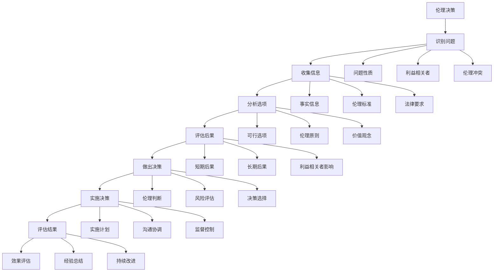
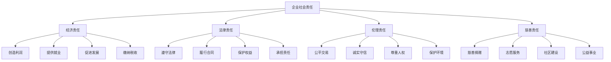
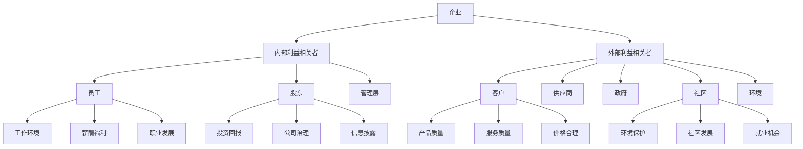
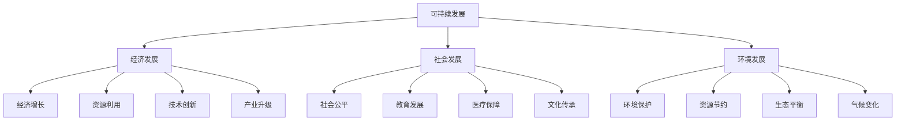

# 管理伦理与社会责任

## 🎯 管理伦理概述

### 基本定义
**管理伦理**是指在管理活动中遵循的道德准则和行为规范，是管理者在决策和行为中应当遵循的道德标准。

### 核心特征
- **道德性**：体现道德要求
- **规范性**：规范管理行为
- **指导性**：指导管理决策
- **约束性**：约束管理行为

## 📊 管理伦理理论

### 1. 伦理理论分类

#### 功利主义理论
- **基本观点**：以最大多数人的最大幸福为原则
- **决策标准**：选择能产生最大效益的行动
- **优点**：注重结果，实用性强
- **缺点**：可能忽视少数人利益

#### 义务论理论
- **基本观点**：行为本身具有道德价值
- **决策标准**：遵循道德义务和原则
- **优点**：强调道德原则，公正性强
- **缺点**：可能忽视结果

#### 美德伦理学
- **基本观点**：强调道德品质和美德
- **决策标准**：具备美德的人会做出正确决策
- **优点**：注重品格培养
- **缺点**：缺乏具体指导

### 2. 伦理决策模型

#### 伦理决策框架

## 🏢 企业社会责任

### 1. 社会责任定义

#### 基本定义
**企业社会责任**是指企业在追求经济利益的同时，应当承担的对社会、环境、利益相关者的责任。

#### 责任层次

### 2. 利益相关者理论

#### 利益相关者分类
- **内部利益相关者**：员工、股东、管理层
- **外部利益相关者**：客户、供应商、政府、社区
- **直接利益相关者**：与企业有直接关系的群体
- **间接利益相关者**：与企业有间接关系的群体

#### 利益相关者关系

## 🔍 伦理问题分析

### 1. 常见伦理问题

#### 利益冲突
- **定义**：个人利益与组织利益冲突
- **表现**：利用职权谋取私利
- **影响**：损害组织利益
- **解决**：建立利益冲突管理机制

#### 信息不对称
- **定义**：信息掌握程度不同
- **表现**：隐瞒重要信息
- **影响**：误导决策
- **解决**：提高信息透明度

#### 权力滥用
- **定义**：滥用管理权力
- **表现**：以权谋私、压迫下属
- **影响**：破坏组织文化
- **解决**：建立权力制衡机制

#### 环境破坏
- **定义**：忽视环境保护
- **表现**：污染环境、浪费资源
- **影响**：损害可持续发展
- **解决**：实施绿色管理

### 2. 伦理问题根源

#### 个人因素
- **道德观念**：道德观念淡薄
- **利益驱动**：利益驱动行为
- **压力影响**：工作压力影响
- **能力不足**：伦理判断能力不足

#### 组织因素
- **文化氛围**：组织文化氛围
- **制度缺陷**：制度设计缺陷
- **监督不力**：监督机制不力
- **激励不当**：激励机制不当

#### 环境因素
- **社会风气**：社会风气影响
- **竞争压力**：市场竞争压力
- **法律缺失**：法律规范缺失
- **监管不力**：监管机制不力

## 📈 伦理管理实践

### 1. 伦理文化建设

#### 伦理价值观
- **诚信**：诚实守信
- **公正**：公平公正
- **责任**：承担责任
- **尊重**：尊重他人

#### 伦理行为准则
- **行为规范**：制定行为规范
- **道德标准**：明确道德标准
- **伦理原则**：确立伦理原则
- **价值观念**：强化价值观念

#### 伦理培训
- **伦理教育**：开展伦理教育
- **案例分析**：进行案例分析
- **角色扮演**：组织角色扮演
- **经验分享**：分享伦理经验

### 2. 伦理管理机制

#### 伦理委员会
- **组织架构**：建立伦理委员会
- **职责分工**：明确职责分工
- **工作流程**：规范工作流程
- **决策机制**：建立决策机制

#### 伦理监督
- **内部监督**：建立内部监督
- **外部监督**：接受外部监督
- **举报机制**：建立举报机制
- **惩罚机制**：建立惩罚机制

#### 伦理评估
- **评估标准**：制定评估标准
- **评估方法**：选择评估方法
- **评估周期**：确定评估周期
- **改进措施**：制定改进措施

## 🌍 可持续发展

### 1. 可持续发展理念

#### 基本概念
**可持续发展**是指既满足当代人的需求，又不损害后代人满足需求能力的发展模式。

#### 三大支柱

### 2. 企业可持续发展

#### 可持续发展战略
- **战略规划**：制定可持续发展战略
- **目标设定**：设定可持续发展目标
- **资源配置**：配置可持续发展资源
- **绩效评估**：评估可持续发展绩效

#### 可持续发展实践
- **绿色生产**：实施绿色生产
- **清洁能源**：使用清洁能源
- **循环经济**：发展循环经济
- **生态设计**：进行生态设计

#### 可持续发展报告
- **报告编制**：编制可持续发展报告
- **信息披露**：披露可持续发展信息
- **第三方验证**：进行第三方验证
- **持续改进**：持续改进可持续发展

## 📊 伦理绩效评估

### 1. 评估指标体系

#### 伦理指标
- **伦理培训**：伦理培训覆盖率
- **伦理事件**：伦理事件发生率
- **伦理满意度**：伦理满意度水平
- **伦理改进**：伦理改进措施

#### 社会责任指标
- **环境保护**：环境保护投入
- **社会贡献**：社会贡献程度
- **员工福利**：员工福利水平
- **社区发展**：社区发展贡献

#### 可持续发展指标
- **资源利用**：资源利用效率
- **碳排放**：碳排放水平
- **绿色产品**：绿色产品比例
- **循环利用**：循环利用程度

### 2. 评估方法

#### 定量评估
- **数据收集**：收集相关数据
- **指标计算**：计算各项指标
- **对比分析**：进行对比分析
- **趋势分析**：分析发展趋势

#### 定性评估
- **问卷调查**：进行问卷调查
- **访谈调研**：进行访谈调研
- **案例分析**：进行案例分析
- **专家评估**：进行专家评估

## 🎯 学习要点总结

### 核心概念
1. **管理伦理**：管理活动中的道德准则和行为规范
2. **企业社会责任**：企业对社会的责任
3. **利益相关者**：与企业相关的各种群体
4. **可持续发展**：既满足当代需求又不损害后代的发展模式
5. **伦理管理**：基于伦理的管理实践

### 关键理解
- 管理伦理是管理活动的基础
- 企业社会责任是企业发展的必然要求
- 利益相关者理论指导企业责任管理
- 可持续发展是企业长期发展的战略选择
- 伦理管理需要制度和文化的支撑

### 实践应用
- 建立伦理管理体系
- 履行企业社会责任
- 平衡利益相关者利益
- 实施可持续发展战略
- 评估伦理和社会责任绩效

## 🔗 相关链接

- [[管理的基本概念]] - 管理基础概念
- [[管理者角色与技能]] - 管理者要求
- [[管理环境分析]] - 管理环境
- [[知识卡片-管理基础概念]] - 知识卡片

## 📚 延伸阅读

- [[可持续发展理念]] - 可持续发展理念
- [[可持续发展战略]] - 可持续发展战略
- [[可持续发展实践]] - 可持续发展实践
- [[可持续发展评估]] - 可持续发展评估

---
*更新时间：2024年*
*内容将根据学习反馈持续优化*
