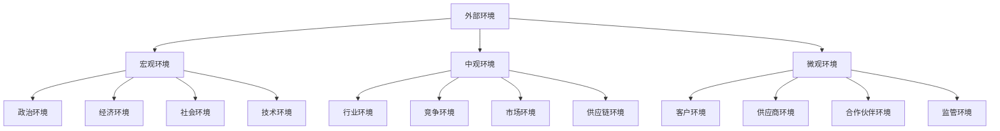
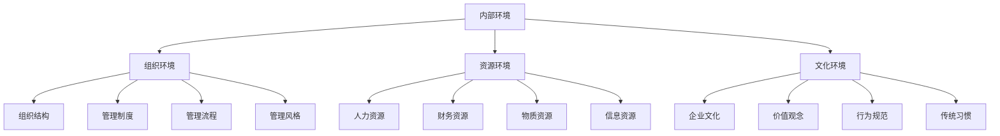
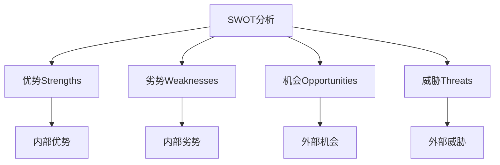
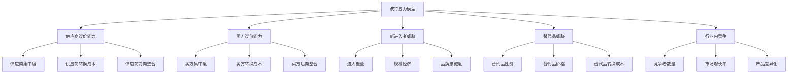
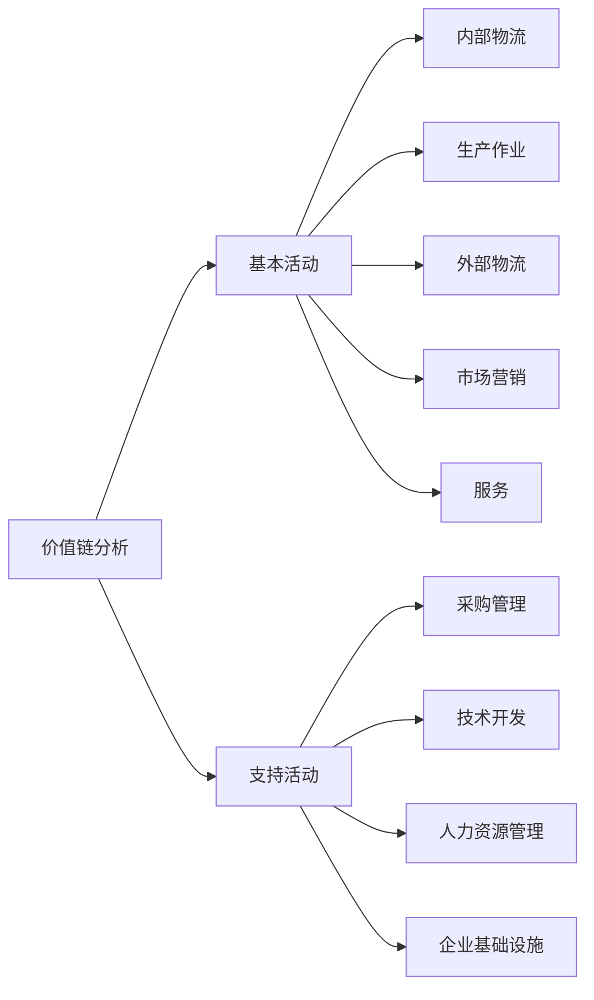

# 管理环境分析

## 🌍 管理环境概述

### 基本定义
**管理环境**是指影响组织管理活动的外部因素和内部因素的总和，是组织生存和发展的客观条件。

### 环境特征
- **复杂性**：环境因素复杂多样
- **动态性**：环境不断变化
- **不确定性**：环境变化不确定
- **关联性**：环境因素相互关联

## 🔍 环境分类

### 1. 按影响范围分类

#### 外部环境

#### 内部环境

### 2. 按影响程度分类

#### 直接环境
- **客户环境**：客户需求和偏好
- **供应商环境**：供应商能力和关系
- **竞争环境**：竞争对手情况
- **监管环境**：法律法规要求

#### 间接环境
- **政治环境**：政治制度和政策
- **经济环境**：经济形势和发展
- **社会环境**：社会文化和社会责任
- **技术环境**：技术发展和创新

## 📊 外部环境分析

### 1. 宏观环境分析（PEST分析）

#### 政治环境（Political）
- **政治制度**：政治制度稳定性
- **政策法规**：政策法规变化
- **政府关系**：与政府关系
- **国际关系**：国际政治关系

#### 经济环境（Economic）
- **经济形势**：宏观经济形势
- **经济增长**：经济增长速度
- **通货膨胀**：通货膨胀水平
- **汇率变化**：汇率变化趋势

#### 社会环境（Social）
- **人口结构**：人口结构变化
- **文化传统**：文化传统影响
- **价值观念**：社会价值观念
- **生活方式**：生活方式变化

#### 技术环境（Technological）
- **技术发展**：技术发展水平
- **技术创新**：技术创新能力
- **技术应用**：技术应用程度
- **技术标准**：技术标准要求

### 2. 中观环境分析

#### 行业环境分析
- **行业生命周期**：行业发展阶段
- **行业竞争结构**：行业竞争格局
- **行业盈利能力**：行业盈利水平
- **行业发展趋势**：行业发展方向

#### 竞争环境分析
- **竞争对手分析**：竞争对手情况
- **竞争强度分析**：竞争激烈程度
- **竞争优势分析**：竞争优势来源
- **竞争策略分析**：竞争策略选择

#### 市场环境分析
- **市场规模**：市场规模大小
- **市场增长率**：市场增长趋势
- **市场细分**：市场细分情况
- **市场需求**：市场需求特点

### 3. 微观环境分析

#### 客户环境分析
- **客户需求**：客户需求特点
- **客户行为**：客户行为模式
- **客户满意度**：客户满意程度
- **客户忠诚度**：客户忠诚程度

#### 供应商环境分析
- **供应商能力**：供应商能力水平
- **供应商关系**：与供应商关系
- **供应商风险**：供应商风险程度
- **供应商成本**：供应商成本水平

## 🏢 内部环境分析

### 1. 组织环境分析

#### 组织结构分析
- **组织架构**：组织架构设计
- **组织层次**：组织层次结构
- **组织职能**：组织职能分工
- **组织协调**：组织协调机制

#### 管理制度分析
- **管理制度**：管理制度完善程度
- **管理流程**：管理流程优化程度
- **管理标准**：管理标准制定情况
- **管理监督**：管理监督机制

#### 管理风格分析
- **领导风格**：领导风格特点
- **决策方式**：决策方式选择
- **沟通方式**：沟通方式特点
- **激励方式**：激励方式选择

### 2. 资源环境分析

#### 人力资源分析
- **人员结构**：人员结构合理性
- **人员素质**：人员素质水平
- **人员能力**：人员能力水平
- **人员发展**：人员发展潜力

#### 财务资源分析
- **资金状况**：资金状况良好程度
- **盈利能力**：盈利能力水平
- **偿债能力**：偿债能力水平
- **运营能力**：运营能力水平

#### 物质资源分析
- **设备设施**：设备设施完善程度
- **技术水平**：技术水平先进程度
- **生产能力**：生产能力水平
- **质量水平**：质量水平高低

#### 信息资源分析
- **信息系统**：信息系统完善程度
- **数据质量**：数据质量水平
- **信息处理**：信息处理能力
- **信息安全**：信息安全保障

### 3. 文化环境分析

#### 企业文化分析
- **企业价值观**：企业价值观念
- **企业精神**：企业精神内涵
- **企业理念**：企业理念体系
- **企业使命**：企业使命愿景

#### 行为规范分析
- **行为准则**：行为准则制定
- **行为标准**：行为标准要求
- **行为监督**：行为监督机制
- **行为激励**：行为激励机制

## 🔄 环境分析方法

### 1. SWOT分析

#### 分析框架

#### 分析步骤
1. **识别优势**：识别内部优势
2. **识别劣势**：识别内部劣势
3. **识别机会**：识别外部机会
4. **识别威胁**：识别外部威胁
5. **制定策略**：制定应对策略

### 2. 波特五力模型

#### 分析框架

### 3. 价值链分析

#### 分析框架

## 📈 环境变化趋势

### 1. 外部环境变化趋势

#### 政治环境变化
- **全球化趋势**：全球化进程加速
- **区域一体化**：区域一体化发展
- **政策调整**：政策调整频繁
- **监管加强**：监管要求加强

#### 经济环境变化
- **经济增长**：经济增长放缓
- **结构调整**：经济结构调整
- **创新驱动**：创新驱动发展
- **绿色发展**：绿色发展理念

#### 社会环境变化
- **人口老龄化**：人口老龄化加剧
- **消费升级**：消费升级趋势
- **社会责任**：社会责任要求提高
- **可持续发展**：可持续发展理念

#### 技术环境变化
- **数字化**：数字化技术发展
- **智能化**：智能化技术应用
- **网络化**：网络化技术普及
- **绿色技术**：绿色技术发展

### 2. 内部环境变化趋势

#### 组织环境变化
- **扁平化**：组织结构扁平化
- **网络化**：组织网络化发展
- **柔性化**：组织柔性化发展
- **虚拟化**：组织虚拟化发展

#### 资源环境变化
- **知识化**：知识资源重要性提高
- **信息化**：信息资源重要性提高
- **绿色化**：绿色资源重要性提高
- **国际化**：国际资源重要性提高

#### 文化环境变化
- **多元化**：文化多元化发展
- **包容性**：文化包容性增强
- **创新性**：文化创新性增强
- **责任性**：文化责任性增强

## 🎯 环境管理策略

### 1. 环境适应策略

#### 被动适应
- **跟随策略**：跟随环境变化
- **调整策略**：调整组织适应
- **应对策略**：应对环境挑战
- **规避策略**：规避环境风险

#### 主动适应
- **预测策略**：预测环境变化
- **准备策略**：准备应对措施
- **影响策略**：影响环境变化
- **创造策略**：创造有利环境

### 2. 环境利用策略

#### 机会利用
- **机会识别**：识别环境机会
- **机会评估**：评估机会价值
- **机会把握**：把握机会时机
- **机会开发**：开发机会潜力

#### 威胁应对
- **威胁识别**：识别环境威胁
- **威胁评估**：评估威胁程度
- **威胁预防**：预防威胁发生
- **威胁应对**：应对威胁挑战

## 📚 学习要点总结

### 核心概念
1. **管理环境**：影响组织管理活动的外部因素和内部因素
2. **环境分类**：外部环境、内部环境；直接环境、间接环境
3. **环境分析**：PEST分析、波特五力模型、价值链分析
4. **环境变化**：环境变化趋势和特点
5. **环境管理**：环境适应策略、环境利用策略

### 关键理解
- 管理环境具有复杂性、动态性、不确定性
- 外部环境和内部环境相互影响
- 环境分析是管理决策的基础
- 环境管理需要主动适应和利用

### 实践应用
- 运用环境分析方法分析环境
- 制定环境适应和利用策略
- 预测环境变化趋势
- 应对环境变化挑战

## 🔗 相关链接

- [[管理的基本概念]] - 管理基础概念
- [[管理者角色与技能]] - 管理者要求
- [[管理伦理与社会责任]] - 管理伦理
- [[知识卡片-管理基础概念]] - 知识卡片

## 📚 延伸阅读

- [[外部环境分析]] - 外部环境分析
- [[内部环境分析]] - 内部环境分析
- [[竞争分析]] - 竞争环境分析
- [[SWOT分析]] - SWOT分析方法

---
*更新时间：2024年*
*内容将根据学习反馈持续优化*
