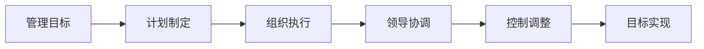
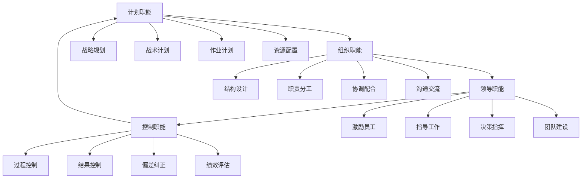
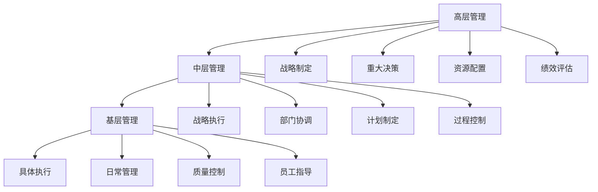

# 管理的基本概念

## 📖 管理的定义

### 基本定义
**管理**是通过计划、组织、领导、控制等职能，协调和整合组织资源，实现组织目标的过程。

### 核心要素
- **管理主体**：管理者
- **管理客体**：被管理者、资源、环境
- **管理目标**：组织目标
- **管理过程**：计划、组织、领导、控制
- **管理手段**：管理方法、工具、技术

## 🎯 管理的本质

### 1. 管理的科学性与艺术性

#### 科学性
- **理论指导**：有系统的理论体系
- **规律性**：遵循客观规律
- **可重复性**：方法可以重复使用
- **可验证性**：结果可以验证

#### 艺术性
- **创造性**：需要创造性思维
- **灵活性**：需要灵活应变
- **经验性**：需要实践经验
- **个性化**：因人而异

### 2. 管理的二重性

#### 自然属性
- **技术性**：技术方法和技术手段
- **工具性**：管理工具和方法
- **效率性**：提高效率
- **科学性**：科学管理

#### 社会属性
- **阶级性**：体现阶级意志
- **文化性**：体现文化特色
- **制度性**：体现制度安排
- **价值性**：体现价值观念

## 🔍 管理的特征

### 1. 基本特征

#### 目的性

#### 系统性
- **整体性**：从整体角度考虑
- **层次性**：分层次管理
- **关联性**：各要素相互关联
- **动态性**：动态变化过程

#### 人本性
- **以人为本**：以人为中心
- **人性假设**：基于人性假设
- **激励约束**：激励与约束并重
- **团队合作**：强调团队合作

#### 创新性
- **持续改进**：持续改进管理
- **创新发展**：创新发展模式
- **适应变化**：适应环境变化
- **突破常规**：突破常规思维

### 2. 管理特征对比

| 特征 | 传统管理 | 现代管理 | 未来管理 |
|------|----------|----------|----------|
| 目的性 | 单一目标 | 多重目标 | 综合目标 |
| 系统性 | 局部系统 | 整体系统 | 生态系统 |
| 人本性 | 工具人 | 社会人 | 自我实现人 |
| 创新性 | 经验管理 | 科学管理 | 智慧管理 |

## 📊 管理的职能

### 1. 四大基本职能

#### 计划职能
- **战略规划**：制定长期战略
- **战术计划**：制定中期计划
- **作业计划**：制定短期计划
- **资源配置**：合理配置资源

#### 组织职能
- **结构设计**：设计组织结构
- **职责分工**：明确职责分工
- **协调配合**：协调各部门
- **沟通交流**：建立沟通机制

#### 领导职能
- **激励员工**：激励员工积极性
- **指导工作**：指导员工工作
- **决策指挥**：做出决策指挥
- **团队建设**：建设高效团队

#### 控制职能
- **过程控制**：控制工作过程
- **结果控制**：控制工作结果
- **偏差纠正**：纠正工作偏差
- **绩效评估**：评估工作绩效

### 2. 职能关系图

## 🌐 管理的层次

### 1. 管理层次结构

#### 高层管理（战略层）
- **职责**：制定战略、重大决策
- **特点**：全局性、长远性、战略性
- **技能**：概念技能、人际技能
- **时间**：长期规划

#### 中层管理（战术层）
- **职责**：执行战略、协调部门
- **特点**：协调性、执行性、战术性
- **技能**：人际技能、技术技能
- **时间**：中期规划

#### 基层管理（作业层）
- **职责**：具体执行、日常管理
- **特点**：操作性、执行性、作业性
- **技能**：技术技能、人际技能
- **时间**：短期执行

### 2. 管理层次关系

## 📈 管理的原理

### 1. 系统原理

#### 基本内容
- **整体性**：系统整体大于部分之和
- **层次性**：系统分层次结构
- **关联性**：系统要素相互关联
- **动态性**：系统动态变化

#### 应用要求
- **整体规划**：从整体角度规划
- **层次管理**：分层次管理
- **协调配合**：协调各要素
- **动态调整**：动态调整策略

### 2. 人本原理

#### 基本内容
- **以人为本**：以人为中心
- **人性假设**：基于人性假设
- **激励约束**：激励与约束并重
- **团队合作**：强调团队合作

#### 应用要求
- **尊重员工**：尊重员工人格
- **关心员工**：关心员工需求
- **激励员工**：激励员工积极性
- **发展员工**：发展员工能力

### 3. 责任原理

#### 基本内容
- **职责明确**：职责分工明确
- **权责对等**：权力与责任对等
- **责任追究**：责任追究机制
- **绩效评估**：绩效评估体系

#### 应用要求
- **明确职责**：明确各岗位职责
- **权责对等**：权力与责任对等
- **责任追究**：建立责任追究机制
- **绩效评估**：建立绩效评估体系

### 4. 效益原理

#### 基本内容
- **效率优先**：提高工作效率
- **效果导向**：注重工作效果
- **效益最大化**：实现效益最大化
- **可持续发展**：实现可持续发展

#### 应用要求
- **提高效率**：提高工作效率
- **注重效果**：注重工作效果
- **效益最大化**：实现效益最大化
- **可持续发展**：实现可持续发展

## 🎯 管理的作用

### 1. 对组织的作用

#### 整合作用
- **资源整合**：整合各种资源
- **力量整合**：整合各种力量
- **优势整合**：整合各种优势
- **能力整合**：整合各种能力

#### 协调作用
- **部门协调**：协调各部门
- **人员协调**：协调各人员
- **工作协调**：协调各项工作
- **关系协调**：协调各种关系

#### 控制作用
- **过程控制**：控制工作过程
- **结果控制**：控制工作结果
- **质量控制**：控制工作质量
- **成本控制**：控制工作成本

### 2. 对社会的作用

#### 推动作用
- **经济发展**：推动经济发展
- **社会进步**：推动社会进步
- **文明建设**：推动文明建设
- **创新发展**：推动创新发展

#### 稳定作用
- **社会稳定**：维护社会稳定
- **秩序维护**：维护社会秩序
- **和谐建设**：建设和谐社会
- **可持续发展**：实现可持续发展

## 📚 学习要点总结

### 核心概念
1. **管理定义**：通过计划、组织、领导、控制实现目标
2. **管理本质**：科学性与艺术性、自然属性与社会属性
3. **管理特征**：目的性、系统性、人本性、创新性
4. **管理职能**：计划、组织、领导、控制四大职能
5. **管理层次**：高层、中层、基层三个层次
6. **管理原理**：系统、人本、责任、效益四大原理

### 关键理解
- 管理是科学性与艺术性的统一
- 管理具有自然属性和社会属性
- 管理四大职能相互关联、循环进行
- 管理层次不同，职责和技能要求不同
- 管理原理指导管理实践

### 实践应用
- 运用管理原理指导管理实践
- 根据管理层次确定管理重点
- 运用管理职能实现管理目标
- 体现管理特征提高管理效果

## 🔗 相关链接

- [[管理者角色与技能]] - 管理者要求
- [[管理环境分析]] - 管理环境
- [[管理伦理与社会责任]] - 管理伦理
- [[知识卡片-管理基础概念]] - 知识卡片

## 📚 延伸阅读

- [[计划职能理论]] - 计划职能
- [[组织职能理论]] - 组织职能
- [[领导职能理论]] - 领导职能
- [[控制职能理论]] - 控制职能

---
*更新时间：2024年*
*内容将根据学习反馈持续优化*
