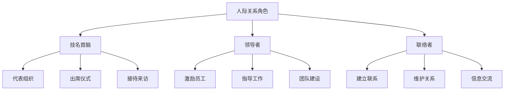
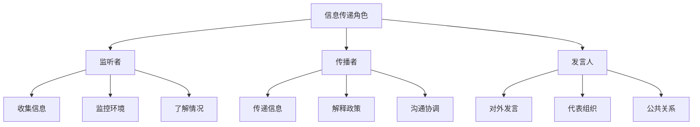
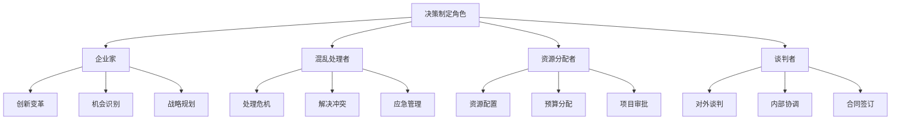
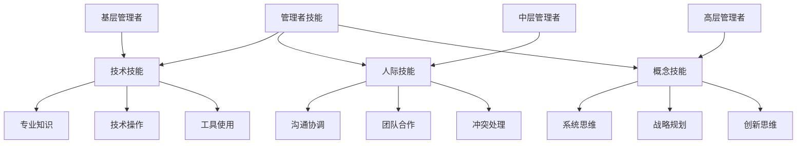
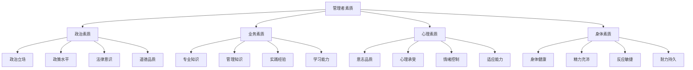
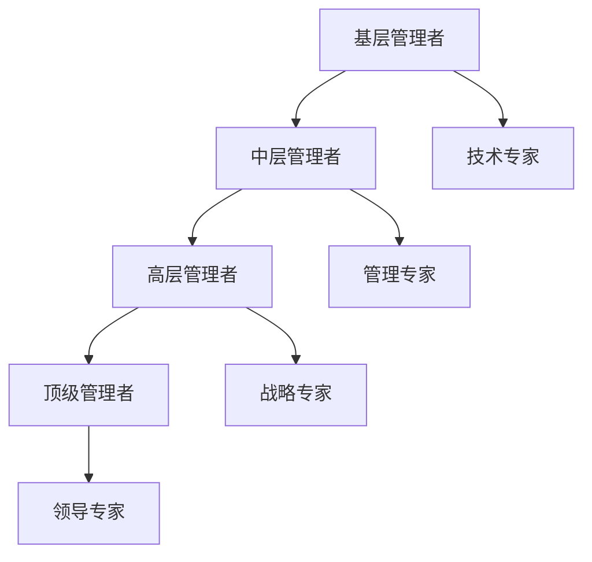

# 管理者角色与技能

## 👤 管理者的定义

### 基本定义
**管理者**是指在组织中负责计划、组织、领导、控制等管理活动，通过他人完成工作，实现组织目标的人员。

### 核心特征
- **责任性**：承担管理责任
- **权威性**：具有管理权威
- **协调性**：协调各种关系
- **决策性**：做出管理决策

## 🎭 管理者角色

### 1. 明茨伯格的管理者角色理论

#### 人际关系角色

#### 信息传递角色

#### 决策制定角色

### 2. 角色重要性分析

| 角色类型 | 重要性 | 时间分配 | 技能要求 |
|----------|--------|----------|----------|
| 人际关系角色 | ⭐⭐⭐⭐ | 30% | 人际技能 |
| 信息传递角色 | ⭐⭐⭐⭐⭐ | 40% | 沟通技能 |
| 决策制定角色 | ⭐⭐⭐⭐⭐ | 30% | 决策技能 |

## 🛠️ 管理者技能

### 1. 卡茨的管理者技能理论

#### 技术技能
- **定义**：运用专业知识和技术的能力
- **内容**：专业方法、工具使用、技术操作
- **重要性**：基层管理者最重要
- **发展**：通过专业培训和实践

#### 人际技能
- **定义**：与他人协作和沟通的能力
- **内容**：沟通协调、团队合作、冲突处理
- **重要性**：各层管理者都重要
- **发展**：通过人际交往和实践

#### 概念技能
- **定义**：理解和处理复杂情况的能力
- **内容**：系统思维、战略规划、创新思维
- **重要性**：高层管理者最重要
- **发展**：通过学习和思考

### 2. 技能层次分布

### 3. 技能要求对比

| 管理层次 | 技术技能 | 人际技能 | 概念技能 |
|----------|----------|----------|----------|
| 高层管理 | ⭐⭐ | ⭐⭐⭐⭐⭐ | ⭐⭐⭐⭐⭐ |
| 中层管理 | ⭐⭐⭐ | ⭐⭐⭐⭐⭐ | ⭐⭐⭐⭐ |
| 基层管理 | ⭐⭐⭐⭐⭐ | ⭐⭐⭐⭐ | ⭐⭐ |

## 🎯 管理者素质

### 1. 基本素质

#### 政治素质
- **政治立场**：坚定的政治立场
- **政策水平**：较高的政策水平
- **法律意识**：强烈的法律意识
- **道德品质**：良好的道德品质

#### 业务素质
- **专业知识**：扎实的专业知识
- **管理知识**：系统的管理知识
- **实践经验**：丰富的实践经验
- **学习能力**：持续的学习能力

#### 心理素质
- **意志品质**：坚强的意志品质
- **心理承受**：较强的心理承受能力
- **情绪控制**：良好的情绪控制能力
- **适应能力**：较强的适应能力

#### 身体素质
- **身体健康**：良好的身体健康
- **精力充沛**：充沛的精力
- **反应敏捷**：敏捷的反应能力
- **耐力持久**：持久的耐力

### 2. 素质模型

## 📊 管理者类型

### 1. 按管理层次分类

#### 高层管理者（Top Managers）
- **职责**：制定战略、重大决策
- **特点**：全局性、长远性、战略性
- **技能**：概念技能、人际技能
- **时间**：长期规划

#### 中层管理者（Middle Managers）
- **职责**：执行战略、协调部门
- **特点**：协调性、执行性、战术性
- **技能**：人际技能、技术技能
- **时间**：中期规划

#### 基层管理者（First-line Managers）
- **职责**：具体执行、日常管理
- **特点**：操作性、执行性、作业性
- **技能**：技术技能、人际技能
- **时间**：短期执行

### 2. 按管理领域分类

#### 综合管理者
- **特点**：管理整个组织
- **职责**：全面管理
- **技能**：综合技能
- **要求**：全面素质

#### 专业管理者
- **特点**：管理特定领域
- **职责**：专业管理
- **技能**：专业技能
- **要求**：专业素质

### 3. 按管理风格分类

#### 专制型管理者
- **特点**：独断专行
- **优点**：决策迅速
- **缺点**：缺乏民主
- **适用**：紧急情况

#### 民主型管理者
- **特点**：民主决策
- **优点**：员工参与
- **缺点**：决策缓慢
- **适用**：常规管理

#### 放任型管理者
- **特点**：放任自流
- **优点**：员工自主
- **缺点**：缺乏控制
- **适用**：创新工作

## 🔄 管理者发展

### 1. 发展路径

#### 纵向发展

#### 横向发展
- **跨部门轮岗**：不同部门工作
- **跨领域学习**：学习不同领域
- **跨行业经验**：积累不同行业经验
- **跨文化管理**：跨文化管理经验

### 2. 发展方法

#### 自我发展
- **自我学习**：主动学习
- **自我反思**：定期反思
- **自我提升**：持续提升
- **自我管理**：自我管理

#### 组织发展
- **培训计划**：制定培训计划
- **导师制度**：建立导师制度
- **轮岗制度**：实施轮岗制度
- **晋升机制**：完善晋升机制

#### 外部发展
- **外部培训**：参加外部培训
- **学术交流**：参与学术交流
- **行业会议**：参加行业会议
- **国际交流**：国际交流学习

## 📈 管理者绩效

### 1. 绩效评估

#### 评估维度
- **工作成果**：工作成果质量
- **工作过程**：工作过程效率
- **工作态度**：工作态度表现
- **工作能力**：工作能力水平

#### 评估方法
- **360度评估**：全方位评估
- **目标管理**：目标达成评估
- **关键绩效指标**：KPI评估
- **平衡计分卡**：BSC评估

### 2. 绩效提升

#### 提升策略
- **明确目标**：明确绩效目标
- **制定计划**：制定提升计划
- **执行计划**：执行提升计划
- **评估效果**：评估提升效果

#### 提升方法
- **技能培训**：技能培训提升
- **经验积累**：经验积累提升
- **反思改进**：反思改进提升
- **持续学习**：持续学习提升

## 🎯 学习要点总结

### 核心概念
1. **管理者定义**：负责管理活动，通过他人完成工作
2. **管理者角色**：人际关系、信息传递、决策制定三大角色
3. **管理者技能**：技术技能、人际技能、概念技能
4. **管理者素质**：政治、业务、心理、身体四大素质
5. **管理者类型**：按层次、领域、风格分类
6. **管理者发展**：纵向发展、横向发展

### 关键理解
- 管理者角色具有多样性
- 不同层次管理者技能要求不同
- 管理者素质要求全面
- 管理者需要持续发展

### 实践应用
- 根据角色要求履行职责
- 发展所需技能
- 提升综合素质
- 规划发展路径

## 🔗 相关链接

- [[管理的基本概念]] - 管理基础概念
- [[管理环境分析]] - 管理环境
- [[管理伦理与社会责任]] - 管理伦理
- [[知识卡片-管理基础概念]] - 知识卡片

## 📚 延伸阅读

- [[战略管理层]] - 高层管理
- [[战术管理层]] - 中层管理
- [[作业管理层]] - 基层管理
- [[管理层次协调]] - 管理层次协调

---
*更新时间：2024年*
*内容将根据学习反馈持续优化*
