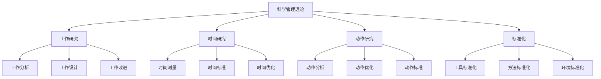
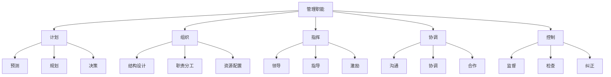
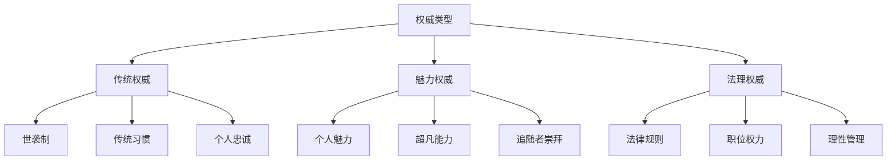

# 古典管理理论

## 📚 理论概述

### 基本定义
**古典管理理论**是20世纪初形成的管理理论体系，以科学管理、行政管理、官僚组织理论为代表，强调效率、标准化和理性管理。

### 历史背景
- **工业革命**：大规模工业生产需要科学管理
- **效率需求**：提高生产效率和管理效率
- **标准化**：建立标准化的工作程序
- **理性化**：强调理性和科学的方法

## 🔬 科学管理理论

### 1. 泰勒的科学管理理论

#### 核心观点
- **科学方法**：用科学方法替代经验管理
- **标准化**：建立标准化的工作程序
- **效率优先**：提高工作效率
- **劳资合作**：劳资双方合作共赢

#### 主要内容

#### 科学管理原则
1. **科学工作方法**：用科学方法研究工作
2. **科学选择工人**：科学选择合适工人
3. **科学培训工人**：科学培训工人技能
4. **劳资合作**：劳资双方合作
5. **管理职能分离**：管理职能与执行职能分离

#### 主要贡献
- **提高效率**：显著提高工作效率
- **标准化**：建立标准化工作程序
- **科学方法**：引入科学管理方法
- **管理理论**：奠定管理理论基础

#### 局限性
- **忽视人性**：忽视人的社会性
- **机械性**：过于机械和僵化
- **单一目标**：只关注效率目标
- **缺乏灵活性**：缺乏灵活性

### 2. 吉尔布雷斯夫妇的动作研究

#### 核心观点
- **动作分析**：分析工作动作
- **动作优化**：优化工作动作
- **疲劳研究**：研究疲劳因素
- **效率提升**：提升工作效率

#### 主要贡献
- **动作研究**：开创动作研究领域
- **疲劳研究**：研究疲劳因素
- **效率提升**：提升工作效率
- **人性关怀**：关注工人健康

## 🏢 行政管理理论

### 1. 法约尔的行政管理理论

#### 核心观点
- **管理职能**：管理具有特定职能
- **管理原则**：管理遵循特定原则
- **管理教育**：管理可以教育
- **管理理论**：管理有理论体系

#### 管理职能

#### 管理原则
1. **分工原则**：分工提高效率
2. **权力与责任**：权力与责任对等
3. **纪律**：纪律是管理基础
4. **统一指挥**：一个上级一个命令
5. **统一领导**：统一领导方向
6. **个人利益服从整体**：个人利益服从整体利益
7. **报酬**：合理报酬激励
8. **集权**：适度集权
9. **等级链**：建立等级链
10. **秩序**：建立秩序
11. **公平**：公平对待员工
12. **人员稳定**：人员稳定
13. **首创精神**：鼓励首创精神
14. **团队精神**：培养团队精神

#### 主要贡献
- **管理职能**：明确管理职能
- **管理原则**：建立管理原则
- **管理教育**：强调管理教育
- **管理理论**：建立管理理论体系

### 2. 古利克的管理七职能

#### 管理七职能
- **计划**：制定计划
- **组织**：组织资源
- **人事**：人事管理
- **指挥**：指挥协调
- **协调**：协调配合
- **报告**：报告沟通
- **预算**：预算控制

## 🏛️ 官僚组织理论

### 1. 韦伯的官僚组织理论

#### 核心观点
- **理性组织**：建立理性组织
- **权威类型**：三种权威类型
- **组织特征**：官僚组织特征
- **效率原则**：效率原则

#### 权威类型

#### 官僚组织特征
1. **专业化分工**：专业化分工
2. **等级制度**：等级制度
3. **规则制度**：规则制度
4. **非人格化**：非人格化
5. **职业化**：职业化
6. **技术能力**：技术能力

#### 主要贡献
- **组织理论**：建立组织理论
- **权威理论**：权威类型理论
- **效率理论**：效率理论
- **理性管理**：理性管理理论

## 📊 理论对比分析

### 1. 三大理论对比

| 理论 | 代表人物 | 核心观点 | 主要贡献 | 局限性 |
|------|----------|----------|----------|--------|
| 科学管理理论 | 泰勒 | 科学方法提高效率 | 提高工作效率 | 忽视人性 |
| 行政管理理论 | 法约尔 | 管理职能和原则 | 管理理论体系 | 缺乏灵活性 |
| 官僚组织理论 | 韦伯 | 理性组织设计 | 组织设计理论 | 过于僵化 |

### 2. 理论特点

#### 共同特点
- **效率导向**：追求效率
- **科学方法**：科学方法
- **标准化**：标准化
- **理性管理**：理性管理

#### 不同特点
- **科学管理**：关注工作方法
- **行政管理**：关注管理职能
- **官僚组织**：关注组织结构

## 🎯 理论应用

### 1. 现代应用

#### 科学管理应用
- **工作研究**：工作研究方法
- **时间研究**：时间研究方法
- **标准化**：标准化管理
- **效率提升**：效率提升方法

#### 行政管理应用
- **管理职能**：管理职能理论
- **管理原则**：管理原则应用
- **管理教育**：管理教育培训
- **管理理论**：管理理论指导

#### 官僚组织应用
- **组织设计**：组织设计理论
- **权威管理**：权威管理理论
- **制度管理**：制度管理理论
- **效率管理**：效率管理理论

### 2. 实践指导

#### 管理实践
- **科学方法**：运用科学方法
- **标准化**：建立标准化
- **效率提升**：提升效率
- **理性管理**：理性管理

#### 组织实践
- **组织设计**：科学组织设计
- **制度建立**：建立制度
- **权威管理**：权威管理
- **效率管理**：效率管理

## 📚 学习要点总结

### 核心概念
1. **科学管理理论**：泰勒的科学管理理论
2. **行政管理理论**：法约尔的行政管理理论
3. **官僚组织理论**：韦伯的官僚组织理论
4. **管理职能**：计划、组织、指挥、协调、控制
5. **管理原则**：14条管理原则
6. **权威类型**：传统权威、魅力权威、法理权威

### 关键理解
- 古典管理理论强调效率和科学方法
- 三大理论各有侧重，相互补充
- 古典管理理论为现代管理理论奠定基础
- 古典管理理论存在局限性

### 实践应用
- 运用科学方法提高效率
- 建立标准化工作程序
- 运用管理职能理论
- 运用管理原则指导实践
- 设计合理的组织结构
- 建立有效的管理制度

## 🔗 相关链接

- [[行为科学理论]] - 行为科学理论
- [[现代管理理论]] - 现代管理理论
- [[当代管理理论]] - 当代管理理论
- [[管理理论演进脉络图]] - 理论发展脉络

## 📚 延伸阅读

- [[科学管理方法]] - 科学管理方法
- [[管理职能理论]] - 管理职能理论
- [[组织设计理论]] - 组织设计理论
- [[效率管理理论]] - 效率管理理论

---
*更新时间：2024年*
*内容将根据学习反馈持续优化*
