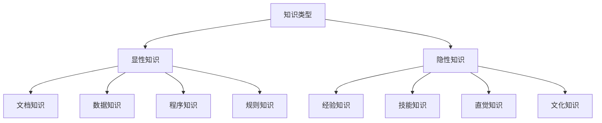
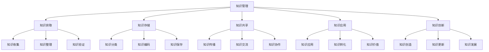
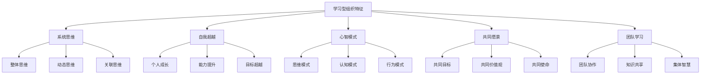
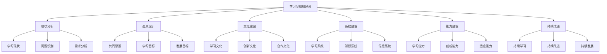
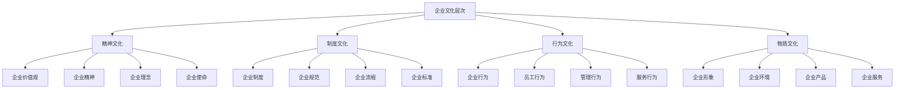
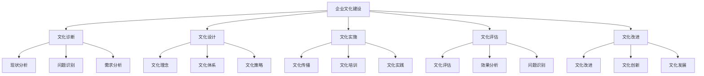
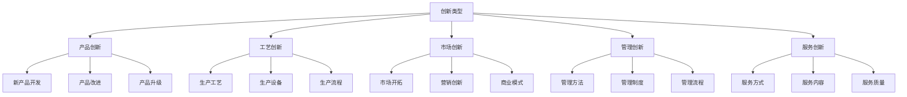
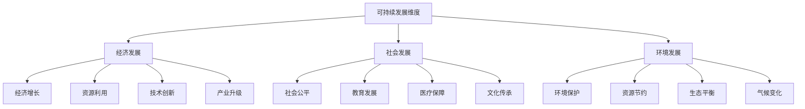

# 当代管理理论

## 📚 理论概述

### 基本定义
**当代管理理论**是20世纪80年代至今形成的管理理论体系，以知识管理、学习型组织、企业文化、创新管理等为代表，强调知识、学习、文化、创新在管理中的重要作用。

### 历史背景
- **知识经济**：知识经济时代到来
- **全球化**：经济全球化发展
- **信息化**：信息技术快速发展
- **可持续发展**：可持续发展理念

## 🧠 知识管理理论

### 1. 知识管理概述

#### 核心观点
- **知识资源**：知识是重要资源
- **知识创造**：知识创造价值
- **知识共享**：知识共享增值
- **知识创新**：知识创新驱动

#### 知识类型

#### 知识管理过程

#### 知识管理策略
- **知识获取策略**：获取外部知识
- **知识创造策略**：创造内部知识
- **知识共享策略**：共享组织知识
- **知识应用策略**：应用知识价值

### 2. 知识管理实践

#### 知识管理系统
- **知识库**：建立知识库
- **知识地图**：绘制知识地图
- **知识社区**：建设知识社区
- **知识门户**：建立知识门户

#### 知识管理工具
- **知识管理软件**：知识管理软件
- **协作工具**：协作工具
- **搜索引擎**：知识搜索引擎
- **专家系统**：专家系统

## 📚 学习型组织理论

### 1. 学习型组织概述

#### 核心观点
- **组织学习**：组织学习能力
- **持续学习**：持续学习文化
- **知识创造**：知识创造能力
- **适应变化**：适应环境变化

#### 学习型组织特征

#### 五项修炼
1. **系统思维**：系统思维方法
2. **自我超越**：个人能力超越
3. **心智模式**：改善心智模式
4. **共同愿景**：建立共同愿景
5. **团队学习**：团队学习能力

### 2. 学习型组织建设

#### 建设过程

#### 建设策略
- **文化策略**：建设学习文化
- **系统策略**：建设学习系统
- **能力策略**：提升学习能力
- **激励策略**：激励学习行为

## 🏢 企业文化理论

### 1. 企业文化概述

#### 核心观点
- **文化价值**：文化创造价值
- **文化认同**：文化认同感
- **文化传承**：文化传承发展
- **文化创新**：文化创新发展

#### 企业文化层次

#### 企业文化功能
- **导向功能**：引导员工行为
- **凝聚功能**：凝聚员工力量
- **激励功能**：激励员工积极性
- **约束功能**：约束员工行为
- **辐射功能**：影响外部环境

### 2. 企业文化建设

#### 建设过程

#### 建设策略
- **理念策略**：确立文化理念
- **传播策略**：传播企业文化
- **培训策略**：培训企业文化
- **实践策略**：实践企业文化

## 💡 创新管理理论

### 1. 创新管理概述

#### 核心观点
- **创新驱动**：创新驱动发展
- **创新文化**：创新文化氛围
- **创新管理**：创新管理方法
- **创新绩效**：创新绩效评估

#### 创新类型

#### 创新过程

### 2. 创新管理实践

#### 创新管理体系
- **创新战略**：创新战略规划
- **创新组织**：创新组织结构
- **创新流程**：创新管理流程
- **创新文化**：创新文化氛围

#### 创新管理工具
- **创新方法**：创新方法工具
- **创新平台**：创新平台建设
- **创新激励**：创新激励机制
- **创新评估**：创新评估体系

## 🌍 可持续发展理论

### 1. 可持续发展概述

#### 核心观点
- **可持续发展**：可持续发展理念
- **三重底线**：经济、社会、环境
- **责任管理**：责任管理理论
- **绿色管理**：绿色管理理论

#### 可持续发展维度

#### 可持续发展原则
- **公平原则**：代际公平、代内公平
- **持续原则**：持续发展能力
- **共同原则**：共同承担责任
- **预防原则**：预防环境破坏

### 2. 可持续发展实践

#### 可持续发展战略
- **绿色战略**：绿色发展战略
- **循环经济**：循环经济模式
- **清洁生产**：清洁生产方式
- **生态设计**：生态设计理念

#### 可持续发展管理
- **环境管理**：环境管理体系
- **社会责任**：社会责任管理
- **绿色供应链**：绿色供应链管理
- **可持续发展报告**：可持续发展报告

## 📊 理论对比分析

### 1. 主要理论对比

| 理论 | 核心观点 | 主要贡献 | 局限性 |
|------|----------|----------|--------|
| 知识管理 | 知识创造价值 | 知识管理理论 | 实施困难 |
| 学习型组织 | 组织学习能力 | 学习理论 | 文化障碍 |
| 企业文化 | 文化创造价值 | 文化管理理论 | 变化缓慢 |
| 创新管理 | 创新驱动发展 | 创新理论 | 风险较高 |
| 可持续发展 | 可持续发展理念 | 责任管理理论 | 成本较高 |

### 2. 理论特点

#### 共同特点
- **知识导向**：知识管理导向
- **学习导向**：学习能力导向
- **文化导向**：文化价值导向
- **创新导向**：创新驱动导向
- **责任导向**：责任管理导向

#### 不同特点
- **知识管理**：关注知识资源
- **学习型组织**：关注学习能力
- **企业文化**：关注文化价值
- **创新管理**：关注创新能力
- **可持续发展**：关注责任管理

## 🎯 理论应用

### 1. 现代应用

#### 战略管理
- **知识战略**：知识管理战略
- **学习战略**：学习型组织战略
- **文化战略**：企业文化战略
- **创新战略**：创新管理战略
- **可持续发展战略**：可持续发展战略

#### 组织管理
- **知识组织**：知识管理组织
- **学习组织**：学习型组织
- **文化组织**：企业文化组织
- **创新组织**：创新管理组织
- **责任组织**：责任管理组织

#### 人力资源管理
- **知识管理**：知识管理人才
- **学习管理**：学习能力管理
- **文化管理**：文化认同管理
- **创新管理**：创新能力管理
- **责任管理**：责任意识管理

### 2. 实践指导

#### 管理实践
- **知识管理**：知识管理实践
- **学习管理**：学习管理实践
- **文化管理**：文化管理实践
- **创新管理**：创新管理实践
- **责任管理**：责任管理实践

#### 组织实践
- **知识组织**：知识管理组织
- **学习组织**：学习型组织
- **文化组织**：企业文化组织
- **创新组织**：创新管理组织
- **责任组织**：责任管理组织

## 📚 学习要点总结

### 核心概念
1. **知识管理**：知识管理理论
2. **学习型组织**：学习型组织理论
3. **企业文化**：企业文化理论
4. **创新管理**：创新管理理论
5. **可持续发展**：可持续发展理论
6. **当代管理**：当代管理理论

### 关键理解
- 当代管理理论强调知识管理
- 学习型组织强调学习能力
- 企业文化强调文化价值
- 创新管理强调创新能力
- 可持续发展强调责任管理
- 当代管理理论综合发展

### 实践应用
- 运用知识管理理论
- 建设学习型组织
- 建设企业文化
- 实施创新管理
- 实施可持续发展
- 建立当代管理体系

## 🔗 相关链接

- [[古典管理理论]] - 古典管理理论
- [[行为科学理论]] - 行为科学理论
- [[现代管理理论]] - 现代管理理论
- [[管理理论演进脉络图]] - 理论发展脉络

## 📚 延伸阅读

- [[知识管理方法]] - 知识管理方法
- [[学习型组织建设]] - 学习型组织建设
- [[企业文化建设]] - 企业文化建设
- [[创新管理方法]] - 创新管理方法

---
*更新时间：2024年*
*内容将根据学习反馈持续优化*
