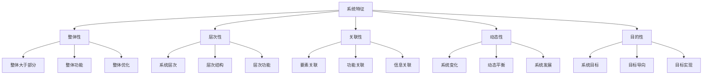
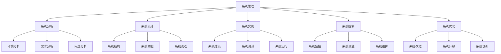
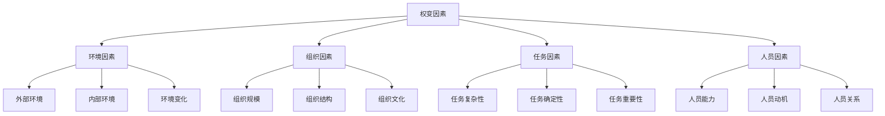
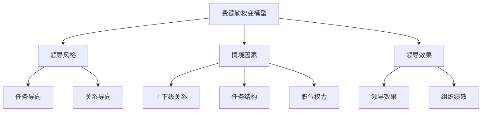
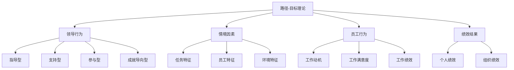
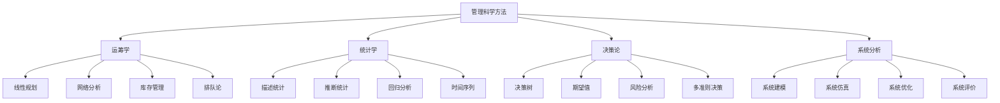
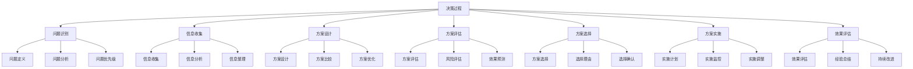
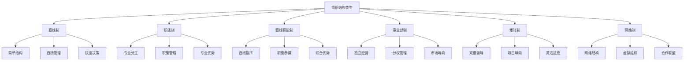
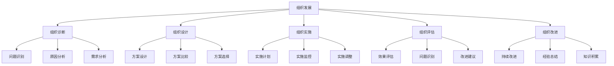

# 现代管理理论

## 📚 理论概述

### 基本定义
**现代管理理论**是20世纪50-80年代形成的管理理论体系，以系统理论、权变理论、管理科学理论等为代表，强调系统思维、权变管理和科学方法。

### 历史背景
- **科技发展**：科学技术快速发展
- **环境变化**：环境变化加剧
- **系统思维**：系统思维发展
- **管理复杂化**：管理问题复杂化

## 🔄 系统理论

### 1. 系统理论概述

#### 核心观点
- **系统思维**：系统思维方法
- **整体性**：系统整体性
- **层次性**：系统层次性
- **关联性**：系统关联性
- **动态性**：系统动态性

#### 系统特征

#### 系统类型
- **开放系统**：与外界有物质、能量、信息交换
- **封闭系统**：与外界无交换
- **静态系统**：系统状态不变
- **动态系统**：系统状态变化

### 2. 系统管理理论

#### 核心观点
- **组织系统**：组织是开放系统
- **系统管理**：系统管理方法
- **系统优化**：系统优化方法
- **系统控制**：系统控制方法

#### 系统管理过程

#### 管理启示
- **系统思维**：运用系统思维
- **整体管理**：整体管理方法
- **系统优化**：系统优化方法
- **系统控制**：系统控制方法

## 🔀 权变理论

### 1. 权变理论概述

#### 核心观点
- **权变思维**：权变思维方法
- **环境适应**：适应环境变化
- **情境管理**：情境管理方法
- **灵活管理**：灵活管理方法

#### 权变因素

#### 权变管理
- **环境权变**：根据环境选择管理方式
- **组织权变**：根据组织特点选择管理方式
- **任务权变**：根据任务特点选择管理方式
- **人员权变**：根据人员特点选择管理方式

### 2. 权变理论模型

#### 费德勒权变模型

#### 路径-目标理论

#### 管理启示
- **权变思维**：运用权变思维
- **情境管理**：根据情境管理
- **灵活管理**：灵活管理方法
- **适应管理**：适应环境管理

## 📊 管理科学理论

### 1. 管理科学概述

#### 核心观点
- **科学方法**：科学管理方法
- **定量分析**：定量分析方法
- **模型建立**：建立管理模型
- **优化决策**：优化决策方法

#### 管理科学方法

#### 管理科学应用
- **生产管理**：生产计划、生产控制
- **库存管理**：库存优化、库存控制
- **质量管理**：质量控制、质量改进
- **项目管理**：项目计划、项目控制

### 2. 决策理论

#### 决策过程

#### 决策类型
- **程序化决策**：常规决策
- **非程序化决策**：非常规决策
- **确定性决策**：确定环境决策
- **风险性决策**：风险环境决策
- **不确定性决策**：不确定环境决策

## 🌐 组织理论

### 1. 组织设计理论

#### 核心观点
- **组织设计**：组织设计方法
- **组织结构**：组织结构类型
- **组织功能**：组织功能设计
- **组织协调**：组织协调机制

#### 组织结构类型

#### 组织设计原则
- **目标原则**：目标导向
- **分工原则**：专业分工
- **协调原则**：协调配合
- **权责原则**：权责对等
- **效率原则**：效率优先

### 2. 组织发展理论

#### 核心观点
- **组织发展**：组织发展方法
- **组织变革**：组织变革理论
- **组织学习**：组织学习理论
- **组织创新**：组织创新理论

#### 组织发展过程

## 📈 理论对比分析

### 1. 主要理论对比

| 理论 | 核心观点 | 主要贡献 | 局限性 |
|------|----------|----------|--------|
| 系统理论 | 系统思维 | 整体管理 | 过于抽象 |
| 权变理论 | 权变管理 | 情境管理 | 缺乏指导 |
| 管理科学 | 科学方法 | 定量分析 | 忽视定性 |
| 组织理论 | 组织设计 | 组织结构 | 缺乏创新 |

### 2. 理论特点

#### 共同特点
- **科学方法**：科学管理方法
- **系统思维**：系统思维方法
- **权变管理**：权变管理方法
- **定量分析**：定量分析方法

#### 不同特点
- **系统理论**：关注系统整体
- **权变理论**：关注环境适应
- **管理科学**：关注定量分析
- **组织理论**：关注组织结构

## 🎯 理论应用

### 1. 现代应用

#### 战略管理
- **系统分析**：系统分析环境
- **权变战略**：权变战略选择
- **科学决策**：科学决策方法
- **组织设计**：组织设计理论

#### 运营管理
- **系统优化**：系统优化方法
- **权变管理**：权变管理方法
- **科学方法**：科学管理方法
- **组织协调**：组织协调机制

#### 人力资源管理
- **系统思维**：系统思维方法
- **权变管理**：权变管理方法
- **科学方法**：科学管理方法
- **组织发展**：组织发展理论

### 2. 实践指导

#### 管理实践
- **系统思维**：运用系统思维
- **权变管理**：权变管理方法
- **科学方法**：科学管理方法
- **组织设计**：组织设计理论

#### 组织实践
- **系统管理**：系统管理方法
- **权变适应**：权变适应方法
- **科学决策**：科学决策方法
- **组织发展**：组织发展方法

## 📚 学习要点总结

### 核心概念
1. **系统理论**：系统思维和系统管理
2. **权变理论**：权变管理和情境管理
3. **管理科学**：科学方法和定量分析
4. **组织理论**：组织设计和组织发展
5. **决策理论**：决策过程和决策方法
6. **管理模型**：管理模型建立

### 关键理解
- 现代管理理论强调系统思维
- 权变理论强调环境适应
- 管理科学强调定量分析
- 组织理论强调结构设计
- 决策理论强调科学决策
- 现代管理理论综合发展

### 实践应用
- 运用系统思维管理
- 运用权变理论适应环境
- 运用管理科学方法
- 运用组织理论设计
- 运用决策理论决策
- 建立现代管理体系

## 🔗 相关链接

- [[古典管理理论]] - 古典管理理论
- [[行为科学理论]] - 行为科学理论
- [[当代管理理论]] - 当代管理理论
- [[管理理论演进脉络图]] - 理论发展脉络

## 📚 延伸阅读

- [[系统管理方法]] - 系统管理方法
- [[权变管理理论]] - 权变管理理论
- [[管理科学方法]] - 管理科学方法
- [[组织设计理论]] - 组织设计理论

---
*更新时间：2024年*
*内容将根据学习反馈持续优化*
