# 管理理论演进脉络图

## 📚 理论发展脉络

### 整体发展脉络
管理理论从20世纪初至今经历了四个主要发展阶段，每个阶段都有其独特的理论特征和实践重点：

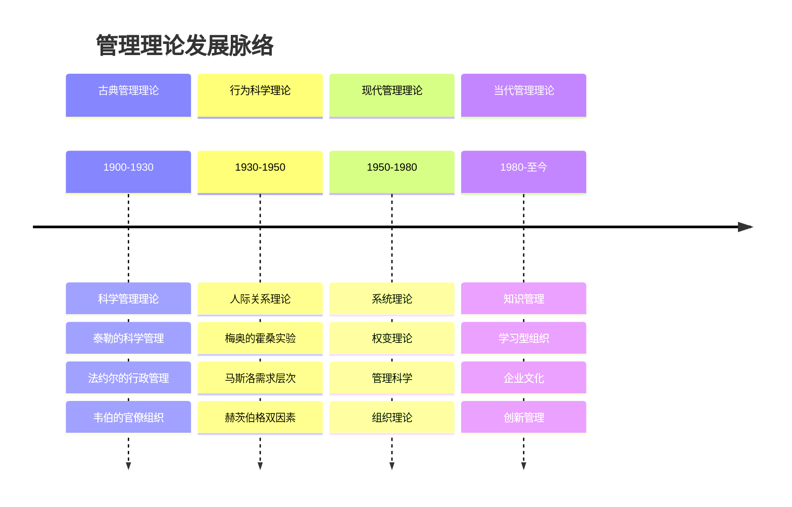

## 🔄 理论演进关系

### 1. 理论继承关系
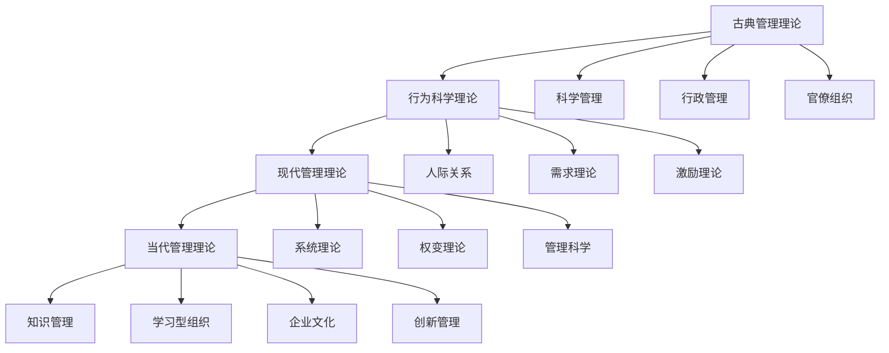

### 2. 理论发展特点
```mermaid
graph TB
    A[管理理论发展特点] --> B[从物到人]
    A --> C[从个体到系统]
    A --> D[从静态到动态]
    A --> E[从封闭到开放]
    A --> F[从单一到综合]
    
    B --> B1[古典理论：关注物]
    B --> B2[行为理论：关注人]
    B --> B3[现代理论：人机结合]
    B --> B4[当代理论：以人为本]
    
    C --> C1[古典理论：个体效率]
    C --> C2[行为理论：群体行为]
    C --> C3[现代理论：系统管理]
    C --> C4[当代理论：网络组织]
    
    D --> D1[古典理论：静态管理]
    D --> D2[行为理论：动态激励]
    D --> D3[现代理论：权变管理]
    D --> D4[当代理论：持续学习]
    
    E --> E1[古典理论：封闭系统]
    E --> E2[行为理论：半开放系统]
    E --> E3[现代理论：开放系统]
    E --> E4[当代理论：生态系统]
    
    F --> F1[古典理论：单一方法]
    F --> F2[行为理论：多种方法]
    F --> F3[现代理论：综合方法]
    F --> F4[当代理论：整合方法]
```

## 📊 理论特征对比

### 1. 各阶段理论特征
| 发展阶段 | 时间 | 核心特征 | 代表人物 | 主要贡献 |
|----------|------|----------|----------|----------|
| 古典管理理论 | 1900-1930 | 效率导向、科学方法 | 泰勒、法约尔、韦伯 | 奠定管理理论基础 |
| 行为科学理论 | 1930-1950 | 人性导向、人际关系 | 梅奥、马斯洛、赫茨伯格 | 重视人的因素 |
| 现代管理理论 | 1950-1980 | 系统导向、权变管理 | 巴纳德、西蒙、德鲁克 | 系统化管理 |
| 当代管理理论 | 1980-至今 | 知识导向、创新管理 | 圣吉、野中郁次郎、波特 | 知识经济管理 |

### 2. 理论演进趋势
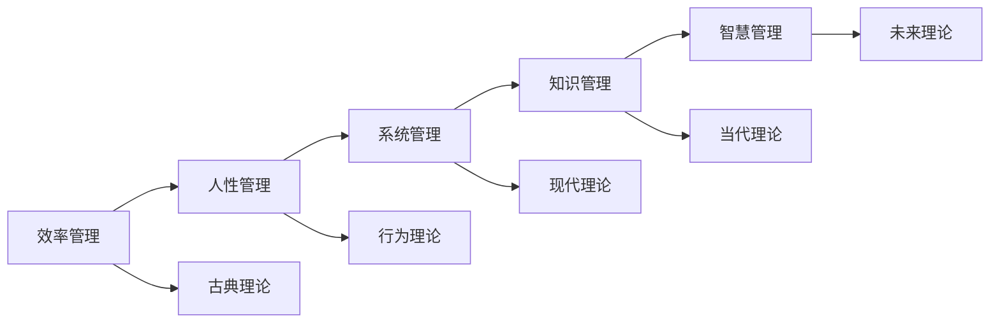

## 🎯 理论应用演进

### 1. 管理实践演进
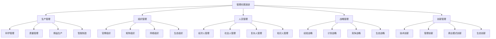

### 2. 管理工具演进
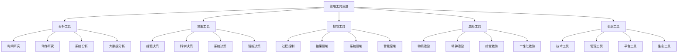

## 🌐 理论发展环境

### 1. 外部环境变化
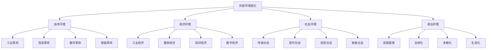

### 2. 内部环境变化
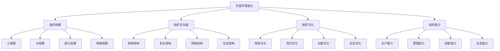

## 📈 理论发展趋势

### 1. 未来发展趋势
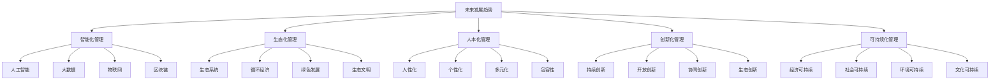

### 2. 理论整合趋势
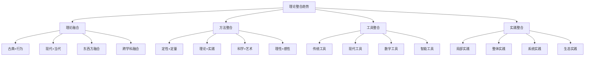

## 🎯 学习指导

### 1. 学习路径
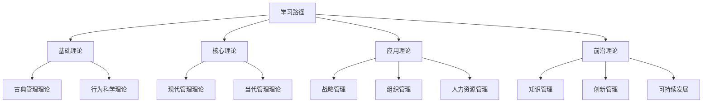

### 2. 学习方法
- **历史学习**：了解理论发展历史
- **比较学习**：比较不同理论特点
- **系统学习**：系统学习理论体系
- **实践学习**：结合实践学习理论
- **创新学习**：创新学习方法

## 📚 学习要点总结

### 核心概念
1. **理论演进**：管理理论发展脉络
2. **理论特征**：各阶段理论特征
3. **理论关系**：理论继承和发展关系
4. **理论应用**：理论在实践中的应用
5. **理论趋势**：理论发展趋势

### 关键理解
- 管理理论发展具有历史性
- 理论发展受环境变化影响
- 理论发展具有继承性
- 理论发展具有创新性
- 理论发展具有实践性

### 实践应用
- 了解理论发展历史
- 掌握理论发展脉络
- 运用理论指导实践
- 预测理论发展趋势
- 创新理论应用方法

## 🔗 相关链接

- [[古典管理理论]] - 古典管理理论
- [[行为科学理论]] - 行为科学理论
- [[现代管理理论]] - 现代管理理论
- [[当代管理理论]] - 当代管理理论

## 📚 延伸阅读

- [[管理理论发展史]] - 管理理论发展史
- [[管理理论比较]] - 管理理论比较
- [[管理理论应用]] - 管理理论应用
- [[管理理论趋势]] - 管理理论趋势

---
*更新时间：2024年*
*内容将根据学习反馈持续优化*
