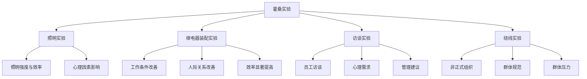
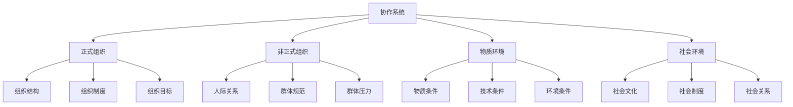
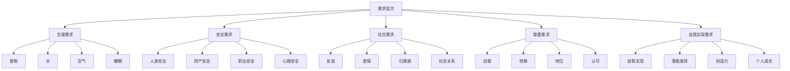
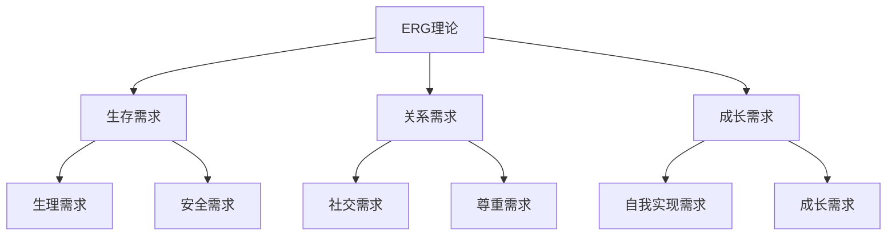
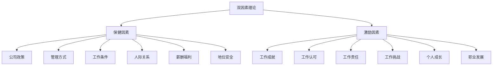
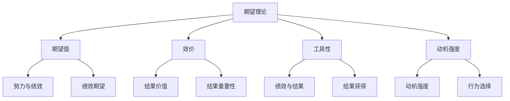
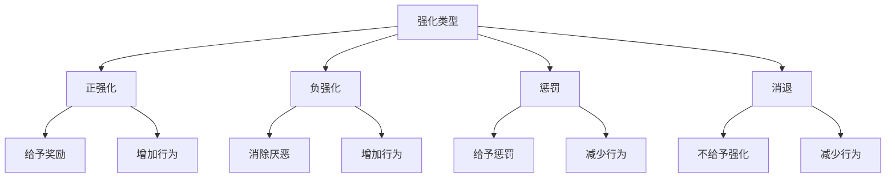

# 行为科学理论

## 📚 理论概述

### 基本定义
**行为科学理论**是20世纪30-50年代形成的管理理论，以人际关系理论、需求层次理论、双因素理论等为代表，强调人的因素在管理中的重要作用。

### 历史背景
- **经济危机**：1929年经济危机暴露古典管理理论缺陷
- **人性觉醒**：认识到人的社会性和心理需求
- **心理学发展**：心理学理论发展
- **社会变革**：社会变革需要新的管理理论

## 👥 人际关系理论

### 1. 梅奥的人际关系理论

#### 核心观点
- **社会人假设**：人是社会人，不是经济人
- **非正式组织**：非正式组织影响效率
- **人际关系**：人际关系影响效率
- **士气理论**：士气影响效率

#### 霍桑实验

#### 主要发现
1. **社会人假设**：人是社会人，有社会需求
2. **非正式组织**：非正式组织影响效率
3. **人际关系**：人际关系影响效率
4. **士气理论**：士气影响效率
5. **管理方式**：管理方式影响效率

#### 主要贡献
- **人性理论**：建立人性理论
- **人际关系**：重视人际关系
- **非正式组织**：认识非正式组织
- **管理理论**：发展管理理论

### 2. 巴纳德的组织理论

#### 核心观点
- **协作系统**：组织是协作系统
- **权威接受**：权威来自接受
- **组织平衡**：组织需要平衡
- **管理职能**：管理职能理论

#### 协作系统理论

#### 权威接受理论
- **权威来源**：权威来自接受
- **接受条件**：接受权威的条件
- **权威类型**：不同类型权威
- **权威管理**：权威管理方法

## 🧠 需求层次理论

### 1. 马斯洛的需求层次理论

#### 核心观点
- **需求层次**：需求有层次性
- **需求满足**：需求满足有顺序
- **需求发展**：需求不断发展
- **需求激励**：需求激励理论

#### 需求层次结构

#### 需求特点
1. **层次性**：需求有层次性
2. **顺序性**：需求满足有顺序
3. **发展性**：需求不断发展
4. **个体性**：需求有个体差异
5. **动态性**：需求动态变化

#### 管理启示
- **需求识别**：识别员工需求
- **需求满足**：满足员工需求
- **需求激励**：利用需求激励
- **需求发展**：促进需求发展

### 2. 奥尔德弗的ERG理论

#### 核心观点
- **三种需求**：生存需求、关系需求、成长需求
- **需求满足**：需求可以同时满足
- **需求挫折**：需求挫折影响行为
- **需求回归**：需求可以回归

#### ERG理论结构

#### 与马斯洛理论对比
| 特征 | 马斯洛理论 | ERG理论 |
|------|------------|---------|
| 需求层次 | 5个层次 | 3个层次 |
| 需求满足 | 顺序满足 | 同时满足 |
| 需求挫折 | 未涉及 | 涉及挫折 |
| 需求回归 | 未涉及 | 涉及回归 |

## 💡 双因素理论

### 1. 赫茨伯格的双因素理论

#### 核心观点
- **双因素**：保健因素和激励因素
- **因素作用**：不同因素作用不同
- **因素管理**：不同因素管理不同
- **因素激励**：激励因素激励作用

#### 双因素结构

#### 因素特点
- **保健因素**：防止不满，不产生满意
- **激励因素**：产生满意，不防止不满
- **因素作用**：不同因素作用不同
- **因素管理**：不同因素管理不同

#### 管理启示
- **保健因素**：满足保健因素
- **激励因素**：提供激励因素
- **因素平衡**：平衡两种因素
- **因素激励**：利用激励因素

## 🎯 期望理论

### 1. 弗鲁姆的期望理论

#### 核心观点
- **期望值**：期望值影响动机
- **效价**：效价影响动机
- **工具性**：工具性影响动机
- **动机强度**：动机强度公式

#### 期望理论模型

#### 动机强度公式
**动机强度 = 期望值 × 效价 × 工具性**

#### 管理启示
- **期望值**：提高期望值
- **效价**：提高效价
- **工具性**：提高工具性
- **动机激励**：利用动机激励

## 🔄 强化理论

### 1. 斯金纳的强化理论

#### 核心观点
- **强化作用**：强化影响行为
- **强化类型**：正强化、负强化、惩罚、消退
- **强化程序**：强化程序影响行为
- **行为塑造**：强化塑造行为

#### 强化类型

#### 强化程序
- **连续强化**：每次行为都强化
- **间歇强化**：间歇性强化
- **固定比率**：固定比率强化
- **变动比率**：变动比率强化

#### 管理启示
- **强化类型**：选择合适强化类型
- **强化程序**：设计强化程序
- **行为塑造**：塑造期望行为
- **强化管理**：管理强化过程

## 📊 理论对比分析

### 1. 主要理论对比

| 理论 | 代表人物 | 核心观点 | 主要贡献 | 局限性 |
|------|----------|----------|----------|--------|
| 人际关系理论 | 梅奥 | 社会人假设 | 重视人际关系 | 忽视经济因素 |
| 需求层次理论 | 马斯洛 | 需求层次性 | 需求激励理论 | 缺乏实证支持 |
| 双因素理论 | 赫茨伯格 | 双因素作用 | 激励理论 | 文化差异 |
| 期望理论 | 弗鲁姆 | 期望值影响 | 动机理论 | 过于复杂 |
| 强化理论 | 斯金纳 | 强化影响行为 | 行为塑造理论 | 忽视认知因素 |

### 2. 理论特点

#### 共同特点
- **人性假设**：社会人假设
- **人际关系**：重视人际关系
- **心理需求**：关注心理需求
- **激励理论**：激励理论

#### 不同特点
- **人际关系**：关注人际关系
- **需求理论**：关注需求层次
- **双因素**：关注因素作用
- **期望理论**：关注期望值
- **强化理论**：关注行为强化

## 🎯 理论应用

### 1. 现代应用

#### 人力资源管理
- **员工激励**：运用激励理论
- **需求满足**：满足员工需求
- **人际关系**：改善人际关系
- **行为塑造**：塑造员工行为

#### 组织管理
- **组织文化**：建设组织文化
- **团队建设**：建设高效团队
- **沟通管理**：改善沟通管理
- **冲突管理**：管理组织冲突

#### 领导管理
- **领导风格**：选择领导风格
- **领导行为**：改善领导行为
- **领导激励**：运用激励理论
- **领导发展**：发展领导能力

### 2. 实践指导

#### 管理实践
- **人性管理**：基于人性管理
- **需求管理**：满足员工需求
- **激励管理**：运用激励理论
- **行为管理**：管理员工行为

#### 组织实践
- **文化建设**：建设组织文化
- **团队建设**：建设高效团队
- **沟通改善**：改善沟通
- **冲突管理**：管理冲突

## 📚 学习要点总结

### 核心概念
1. **人际关系理论**：梅奥的人际关系理论
2. **需求层次理论**：马斯洛的需求层次理论
3. **双因素理论**：赫茨伯格的双因素理论
4. **期望理论**：弗鲁姆的期望理论
5. **强化理论**：斯金纳的强化理论
6. **社会人假设**：人是社会人

### 关键理解
- 行为科学理论重视人的因素
- 人际关系影响管理效率
- 需求层次影响激励效果
- 双因素理论指导激励管理
- 期望理论解释动机强度
- 强化理论塑造行为

### 实践应用
- 重视人际关系管理
- 满足员工需求层次
- 运用双因素理论激励
- 利用期望理论激励
- 运用强化理论塑造行为
- 建立人性化管理体系

## 🔗 相关链接

- [[古典管理理论]] - 古典管理理论
- [[现代管理理论]] - 现代管理理论
- [[当代管理理论]] - 当代管理理论
- [[管理理论演进脉络图]] - 理论发展脉络

## 📚 延伸阅读

- [[人际关系管理]] - 人际关系管理
- [[员工激励理论]] - 员工激励理论
- [[组织行为学]] - 组织行为学
- [[领导力理论]] - 领导力理论

---
*更新时间：2024年*
*内容将根据学习反馈持续优化*
