# 作业管理层

## 🎯 作业管理层概述

### 基本定义
**作业管理层**是组织基层的管理层，负责具体作业的执行、一线员工的管理、日常运营的监控，确保组织目标在操作层面得到有效实现。

### 核心特征
- **操作性**：负责具体操作
- **执行性**：执行具体任务
- **监控性**：监控作业过程
- **基础性**：管理基础工作

## 🔄 作业管理层职责

### 1. 作业执行职责

#### 任务执行
- **任务接收**：接收上级任务
- **任务分解**：分解具体任务
- **任务分配**：分配给员工
- **任务执行**：执行具体任务

#### 过程监控
- **进度监控**：监控执行进度
- **质量监控**：监控执行质量
- **安全监控**：监控执行安全
- **成本监控**：监控执行成本

#### 结果控制
- **结果检查**：检查执行结果
- **结果评估**：评估执行结果
- **结果改进**：改进执行结果
- **结果报告**：报告执行结果

### 2. 员工管理职责

#### 员工指导
- **工作指导**：指导员工工作
- **技能指导**：指导员工技能
- **方法指导**：指导工作方法
- **标准指导**：指导工作标准

#### 员工激励
- **目标激励**：激励员工目标
- **过程激励**：激励执行过程
- **结果激励**：激励执行结果
- **发展激励**：激励员工发展

#### 员工培训
- **岗前培训**：培训新员工
- **在职培训**：培训在职员工
- **技能培训**：培训员工技能
- **安全培训**：培训安全知识

## 🏢 作业管理层结构

### 1. 组织结构

#### 班组长
- **组成**：各班组组长
- **职责**：班组管理、任务执行、员工管理
- **权力**：班组决策权、任务分配权、员工管理权
- **作用**：班组管理核心

#### 主管
- **组成**：各主管
- **职责**：部门管理、作业监控、员工指导
- **权力**：部门决策权、作业控制权、员工指导权
- **作用**：部门管理主体

#### 领班
- **组成**：各领班
- **职责**：作业管理、员工管理、质量控制
- **权力**：作业决策权、员工管理权、质量控制权
- **作用**：作业管理支撑

### 2. 管理机制

#### 管理流程

```mermaid
graph TB
    A[作业管理流程] --> B[任务接收]
    A --> C[任务分解]
    A --> D[任务分配]
    A --> E[任务执行]
    A --> F[过程监控]
    A --> G[结果控制]
    A --> H[问题解决]
    A --> I[持续改进]
    
    B --> B1[任务理解]
    B --> B2[任务分析]
    B --> B3[任务确认]
    B --> B4[任务接收]
    
    C --> C1[任务分解]
    C --> C2[任务细化]
    C --> C3[任务排序]
    C --> C4[任务确认]
    
    D --> D1[员工分析]
    D --> D2[任务匹配]
    D --> D3[任务分配]
    D --> D4[任务确认]
    
    E --> E1[任务执行]
    E --> E2[过程监控]
    E --> E3[问题解决]
    E --> E4[结果检查]
    
    F --> F1[进度监控]
    F --> F2[质量监控]
    F --> F3[安全监控]
    F --> F4[成本监控]
    
    G --> G1[结果检查]
    G --> G2[结果评估]
    G --> G3[结果改进]
    G --> G4[结果报告]
    
    H --> H1[问题识别]
    H --> H2[问题分析]
    H --> H3[问题解决]
    H --> H4[问题预防]
    
    I --> I1[经验总结]
    I --> I2[流程优化]
    I --> I3[能力提升]
    I --> I4[持续改进]
```

#### 控制机制
- **过程控制**：控制执行过程
- **结果控制**：控制执行结果
- **质量控制**：控制执行质量
- **安全控制**：控制执行安全

## 📊 作业管理层技能

### 1. 核心技能

#### 操作能力
- **技术操作**：掌握技术操作
- **设备操作**：掌握设备操作
- **流程操作**：掌握流程操作
- **标准操作**：掌握标准操作

#### 管理能力
- **员工管理**：管理员工能力
- **任务管理**：管理任务能力
- **质量管理**：管理质量能力
- **安全管理**：管理安全能力

#### 沟通能力
- **向上沟通**：与上级沟通
- **向下沟通**：与下级沟通
- **横向沟通**：与同级沟通
- **外部沟通**：与外部沟通

#### 问题解决能力
- **问题识别**：识别问题能力
- **问题分析**：分析问题能力
- **问题解决**：解决问题能力
- **问题预防**：预防问题能力

### 2. 技能发展

#### 技术能力
- **技术知识**：掌握技术知识
- **技术技能**：掌握技术技能
- **技术经验**：积累技术经验
- **技术创新**：推动技术创新

#### 管理能力
- **管理知识**：掌握管理知识
- **管理技能**：掌握管理技能
- **管理经验**：积累管理经验
- **管理创新**：推动管理创新

## 🎯 作业管理层挑战

### 1. 执行挑战

#### 任务复杂
- **任务多样**：任务种类多样
- **任务变化**：任务要求变化
- **任务紧急**：任务时间紧急
- **任务标准**：任务标准严格

#### 资源约束
- **人员不足**：人员配备不足
- **设备不足**：设备配备不足
- **材料不足**：材料供应不足
- **时间不足**：时间安排不足

#### 质量要求
- **质量标准**：质量标准严格
- **质量监控**：质量监控严格
- **质量改进**：质量改进要求
- **质量责任**：质量责任重大

### 2. 管理挑战

#### 员工管理
- **员工多样**：员工背景多样
- **员工流动**：员工流动频繁
- **员工培训**：员工培训需求
- **员工激励**：员工激励困难

#### 沟通协调
- **沟通障碍**：沟通存在障碍
- **协调困难**：协调存在困难
- **信息不对称**：信息掌握不对称
- **反馈滞后**：反馈信息滞后

#### 变革适应
- **技术变革**：技术不断变革
- **流程变革**：流程不断变革
- **标准变革**：标准不断变革
- **管理变革**：管理不断变革

## 📈 作业管理层发展

### 1. 个人发展

#### 能力提升
- **操作能力**：提升操作能力
- **管理能力**：提升管理能力
- **沟通能力**：提升沟通能力
- **问题解决能力**：提升问题解决能力

#### 知识更新
- **技术知识**：更新技术知识
- **管理知识**：更新管理知识
- **行业知识**：更新行业知识
- **标准知识**：更新标准知识

#### 经验积累
- **操作经验**：积累操作经验
- **管理经验**：积累管理经验
- **问题解决经验**：积累问题解决经验
- **变革经验**：积累变革经验

### 2. 团队发展

#### 团队建设
- **团队组建**：组建高效团队
- **团队培训**：培训团队成员
- **团队激励**：激励团队成员
- **团队发展**：发展团队能力

#### 文化建设
- **部门文化**：建设部门文化
- **团队文化**：建设团队文化
- **执行文化**：建设执行文化
- **质量文化**：建设质量文化

## 🔍 作业管理层评估

### 1. 评估维度

#### 执行绩效
- **任务完成**：任务完成质量
- **质量达标**：质量达标程度
- **安全达标**：安全达标程度
- **效率提升**：效率提升程度

#### 管理效果
- **员工管理**：员工管理效果
- **任务管理**：任务管理效果
- **质量管理**：质量管理效果
- **安全管理**：安全管理效果

#### 团队效果
- **团队建设**：团队建设效果
- **团队协作**：团队协作效果
- **团队发展**：团队发展效果
- **团队创新**：团队创新效果

### 2. 评估方法

#### 定量评估
- **任务完成率**：任务完成率
- **质量达标率**：质量达标率
- **安全达标率**：安全达标率
- **效率提升率**：效率提升率

#### 定性评估
- **上级评估**：上级评估意见
- **下级评估**：下级评估意见
- **同级评估**：同级评估意见
- **客户评估**：客户评估意见

## 🎯 学习要点总结

### 核心概念
1. **作业管理层**：组织基层的管理层
2. **作业执行**：执行具体作业
3. **员工管理**：管理一线员工
4. **作业技能**：操作能力、管理能力、沟通能力
5. **作业挑战**：执行挑战、管理挑战
6. **作业发展**：个人发展、团队发展

### 关键理解
- 作业管理层是组织执行的基础
- 作业管理层负责具体作业
- 作业管理层需要具备核心技能
- 作业管理层面临各种挑战

### 实践应用
- 运用操作能力执行任务
- 运用管理能力管理员工
- 运用沟通能力沟通协调
- 运用问题解决能力解决问题

## 🔗 相关链接

- [[战略管理层]] - 战略管理层
- [[战术管理层]] - 战术管理层
- [[管理层次协调]] - 管理层次协调
- [[记忆口诀-管理层次理论]] - 记忆口诀

## 📚 延伸阅读

- [[作业管理]] - 作业管理理论
- [[员工管理]] - 员工管理理论
- [[质量管理]] - 质量管理理论
- [[安全管理]] - 安全管理理论

---
*更新时间：2024年*
*内容将根据学习反馈持续优化*
