# 战术管理层

## 🎯 战术管理层概述

### 基本定义
**战术管理层**是组织中间层次的管理层，负责执行战略决策、协调部门工作、管理日常运营，确保战略目标在部门层面得到有效实现。

### 核心特征
- **协调性**：协调各部门工作
- **执行性**：执行战略决策
- **战术性**：制定战术策略
- **管理性**：管理日常运营

## 🔄 战术管理层职责

### 1. 战略执行职责

#### 战略分解
- **目标分解**：将战略目标分解为部门目标
- **任务分解**：将战略任务分解为具体任务
- **资源分解**：将战略资源分解为部门资源
- **责任分解**：将战略责任分解为部门责任

#### 计划制定
- **部门计划**：制定部门工作计划
- **项目计划**：制定项目执行计划
- **资源计划**：制定资源配置计划
- **时间计划**：制定时间安排计划

#### 执行监控
- **进度监控**：监控执行进度
- **质量监控**：监控执行质量
- **成本监控**：监控执行成本
- **风险监控**：监控执行风险

### 2. 部门管理职责

#### 部门协调
- **内部协调**：协调部门内部工作
- **外部协调**：协调与其他部门关系
- **上下协调**：协调与上下级关系
- **横向协调**：协调与同级部门关系

#### 团队管理
- **团队建设**：建设高效团队
- **团队激励**：激励团队成员
- **团队培训**：培训团队成员
- **团队发展**：发展团队能力

#### 绩效管理
- **目标设定**：设定部门目标
- **绩效评估**：评估部门绩效
- **绩效改进**：改进部门绩效
- **绩效激励**：激励部门绩效

## 🏢 战术管理层结构

### 1. 组织结构

#### 部门经理
- **组成**：各部门经理
- **职责**：部门管理、战略执行、绩效管理
- **权力**：部门决策权、资源调配权、人员管理权
- **作用**：部门管理核心

#### 项目经理
- **组成**：各项目经理
- **职责**：项目管理、项目执行、项目控制
- **权力**：项目决策权、资源调配权、进度控制权
- **作用**：项目管理主体

#### 职能经理
- **组成**：各职能经理
- **职责**：职能管理、专业指导、技术支持
- **权力**：专业决策权、技术指导权、标准制定权
- **作用**：专业管理支撑

### 2. 管理机制

#### 管理流程

```mermaid
graph TB
    A[战术管理流程] --> B[战略接收]
    A --> C[计划制定]
    A --> D[资源调配]
    A --> E[执行监控]
    A --> F[问题解决]
    A --> G[绩效评估]
    A --> H[持续改进]
    
    B --> B1[战略理解]
    B --> B2[目标分解]
    B --> B3[任务分配]
    B --> B4[责任明确]
    
    C --> C1[计划设计]
    C --> C2[计划评估]
    C --> C3[计划优化]
    C --> C4[计划确认]
    
    D --> D1[资源识别]
    D --> D2[资源分配]
    D --> D3[资源协调]
    D --> D4[资源保障]
    
    E --> E1[进度监控]
    E --> E2[质量监控]
    E --> E3[成本监控]
    E --> E4[风险监控]
    
    F --> F1[问题识别]
    F --> F2[问题分析]
    F --> F3[问题解决]
    F --> F4[问题预防]
    
    G --> G1[绩效评估]
    G --> G2[绩效分析]
    G --> G3[绩效改进]
    G --> G4[绩效激励]
    
    H --> H1[经验总结]
    H --> H2[流程优化]
    H --> H3[能力提升]
    H --> H4[持续改进]
```

#### 协调机制
- **会议协调**：定期会议协调
- **沟通协调**：日常沟通协调
- **制度协调**：制度规范协调
- **文化协调**：文化氛围协调

## 📊 战术管理层技能

### 1. 核心技能

#### 执行能力
- **计划执行**：执行计划能力
- **任务执行**：执行任务能力
- **项目执行**：执行项目能力
- **目标执行**：执行目标能力

#### 协调能力
- **部门协调**：协调部门关系
- **团队协调**：协调团队关系
- **资源协调**：协调资源配置
- **关系协调**：协调各种关系

#### 管理能力
- **团队管理**：管理团队能力
- **项目管理**：管理项目能力
- **绩效管理**：管理绩效能力
- **变革管理**：管理变革能力

#### 沟通能力
- **向上沟通**：与上级沟通
- **向下沟通**：与下级沟通
- **横向沟通**：与同级沟通
- **外部沟通**：与外部沟通

### 2. 技能发展

#### 专业能力
- **专业知识**：掌握专业知识
- **专业技能**：掌握专业技能
- **专业经验**：积累专业经验
- **专业创新**：推动专业创新

#### 管理能力
- **管理知识**：掌握管理知识
- **管理技能**：掌握管理技能
- **管理经验**：积累管理经验
- **管理创新**：推动管理创新

## 🎯 战术管理层挑战

### 1. 执行挑战

#### 战略理解
- **理解偏差**：对战略理解偏差
- **执行偏差**：执行过程偏差
- **目标偏差**：目标设定偏差
- **方法偏差**：方法选择偏差

#### 资源约束
- **资源不足**：资源供给不足
- **资源浪费**：资源使用浪费
- **资源配置**：资源配置不当
- **资源协调**：资源协调困难

#### 时间压力
- **时间紧迫**：时间要求紧迫
- **进度滞后**：执行进度滞后
- **时间冲突**：时间安排冲突
- **时间管理**：时间管理困难

### 2. 协调挑战

#### 部门冲突
- **目标冲突**：部门目标冲突
- **资源冲突**：资源分配冲突
- **责任冲突**：责任划分冲突
- **利益冲突**：利益分配冲突

#### 沟通障碍
- **信息不对称**：信息掌握不对称
- **沟通不畅**：沟通渠道不畅
- **理解偏差**：理解存在偏差
- **反馈滞后**：反馈信息滞后

#### 文化差异
- **部门文化**：部门文化差异
- **个人文化**：个人文化差异
- **专业文化**：专业文化差异
- **地域文化**：地域文化差异

## 📈 战术管理层发展

### 1. 个人发展

#### 能力提升
- **执行能力**：提升执行能力
- **协调能力**：提升协调能力
- **管理能力**：提升管理能力
- **沟通能力**：提升沟通能力

#### 知识更新
- **管理知识**：更新管理知识
- **专业知识**：更新专业知识
- **行业知识**：更新行业知识
- **技术知识**：更新技术知识

#### 经验积累
- **管理经验**：积累管理经验
- **执行经验**：积累执行经验
- **协调经验**：积累协调经验
- **变革经验**：积累变革经验

### 2. 团队发展

#### 团队建设
- **团队组建**：组建高效团队
- **团队培训**：培训团队成员
- **团队激励**：激励团队成员
- **团队发展**：发展团队能力

#### 文化建设
- **部门文化**：建设部门文化
- **团队文化**：建设团队文化
- **执行文化**：建设执行文化
- **创新文化**：建设创新文化

## 🔍 战术管理层评估

### 1. 评估维度

#### 执行绩效
- **目标达成**：目标达成程度
- **任务完成**：任务完成质量
- **项目成功**：项目成功程度
- **效率提升**：效率提升程度

#### 协调效果
- **部门协调**：部门协调效果
- **团队协调**：团队协调效果
- **资源协调**：资源协调效果
- **关系协调**：关系协调效果

#### 管理效果
- **团队管理**：团队管理效果
- **项目管理**：项目管理效果
- **绩效管理**：绩效管理效果
- **变革管理**：变革管理效果

### 2. 评估方法

#### 定量评估
- **目标达成率**：目标达成率
- **任务完成率**：任务完成率
- **项目成功率**：项目成功率
- **效率提升率**：效率提升率

#### 定性评估
- **上级评估**：上级评估意见
- **下级评估**：下级评估意见
- **同级评估**：同级评估意见
- **客户评估**：客户评估意见

## 🎯 学习要点总结

### 核心概念
1. **战术管理层**：组织中间层次的管理层
2. **战略执行**：执行战略决策
3. **部门管理**：管理部门工作
4. **战术技能**：执行能力、协调能力、管理能力
5. **战术挑战**：执行挑战、协调挑战
6. **战术发展**：个人发展、团队发展

### 关键理解
- 战术管理层是战略执行的关键
- 战术管理层负责部门管理
- 战术管理层需要具备核心技能
- 战术管理层面临各种挑战

### 实践应用
- 运用执行能力执行战略
- 运用协调能力协调部门
- 运用管理能力管理团队
- 运用沟通能力沟通协调

## 🔗 相关链接

- [[战略管理层]] - 战略管理层
- [[作业管理层]] - 作业管理层
- [[管理层次协调]] - 管理层次协调
- [[记忆口诀-管理层次理论]] - 记忆口诀

## 📚 延伸阅读

- [[战略执行]] - 战略执行理论
- [[部门管理]] - 部门管理理论
- [[项目管理]] - 项目管理理论
- [[团队管理]] - 团队管理理论

---
*更新时间：2024年*
*内容将根据学习反馈持续优化*
