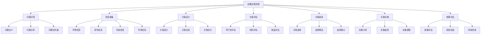

# 战略管理层

## 👑 战略管理层概述

### 基本定义
**战略管理层**是组织最高层次的管理层，负责制定组织长期发展战略、重大决策和资源配置，确保组织在复杂环境中实现长期目标。

### 核心特征
- **全局性**：从全局角度思考问题
- **长远性**：关注长期发展目标
- **战略性**：制定战略决策
- **决策性**：做出重大决策

## 🎯 战略管理层职责

### 1. 战略规划职责

#### 战略分析
- **环境分析**：分析外部环境和内部环境
- **竞争分析**：分析竞争对手和竞争态势
- **机会分析**：识别发展机会和威胁
- **资源分析**：分析组织资源和能力

#### 战略制定
- **使命愿景**：制定组织使命和愿景
- **战略目标**：设定长期战略目标
- **战略选择**：选择合适的发展战略
- **战略规划**：制定战略实施规划

#### 战略实施
- **资源配置**：配置战略资源
- **组织调整**：调整组织结构
- **文化变革**：推动文化变革
- **战略监控**：监控战略执行

### 2. 重大决策职责

#### 投资决策
- **投资项目**：决定重大投资项目
- **并购决策**：决定并购重组
- **技术投资**：决定技术投资方向
- **市场投资**：决定市场投资策略

#### 组织决策
- **组织结构**：决定组织结构调整
- **人事决策**：决定高层人事安排
- **制度决策**：决定重大制度变革
- **文化决策**：决定文化发展方向

#### 风险决策
- **风险识别**：识别重大风险
- **风险评估**：评估风险程度
- **风险应对**：制定风险应对策略
- **危机管理**：处理重大危机

## 🏢 战略管理层结构

### 1. 组织结构

#### 董事会
- **组成**：董事长、董事、独立董事
- **职责**：重大决策、监督执行、风险控制
- **权力**：决策权、监督权、任免权
- **作用**：公司治理核心

#### 高级管理层
- **组成**：CEO、COO、CFO、CTO等
- **职责**：战略执行、日常管理、绩效管理
- **权力**：执行权、管理权、指挥权
- **作用**：战略执行主体

#### 战略委员会
- **组成**：战略专家、行业专家、管理专家
- **职责**：战略研究、战略建议、战略评估
- **权力**：建议权、咨询权、评估权
- **作用**：战略决策支持

### 2. 决策机制

#### 决策流程

#### 决策方法
- **集体决策**：董事会集体决策
- **专家决策**：专家咨询决策
- **数据决策**：基于数据分析决策
- **情景决策**：多种情景分析决策

## 📊 战略管理层技能

### 1. 核心技能

#### 战略思维
- **系统思维**：系统分析问题
- **创新思维**：创新解决问题
- **前瞻思维**：预测未来趋势
- **批判思维**：批判性分析

#### 决策能力
- **信息分析**：分析各种信息
- **方案设计**：设计解决方案
- **风险评估**：评估决策风险
- **效果预测**：预测决策效果

#### 领导能力
- **愿景领导**：描绘组织愿景
- **变革领导**：推动组织变革
- **团队领导**：领导管理团队
- **文化领导**：塑造组织文化

#### 沟通能力
- **内部沟通**：与内部沟通
- **外部沟通**：与外部沟通
- **媒体沟通**：与媒体沟通
- **投资者沟通**：与投资者沟通

### 2. 技能发展

#### 学习能力
- **持续学习**：持续学习新知识
- **经验学习**：从经验中学习
- **案例学习**：从案例中学习
- **实践学习**：从实践中学习

#### 适应能力
- **环境适应**：适应环境变化
- **变化适应**：适应组织变化
- **竞争适应**：适应竞争变化
- **技术适应**：适应技术变化

## 🎯 战略管理层挑战

### 1. 外部挑战

#### 环境变化
- **经济环境**：经济形势变化
- **政治环境**：政治环境变化
- **社会环境**：社会环境变化
- **技术环境**：技术环境变化

#### 竞争加剧
- **市场竞争**：市场竞争加剧
- **技术竞争**：技术竞争加剧
- **人才竞争**：人才竞争加剧
- **资源竞争**：资源竞争加剧

#### 不确定性
- **市场不确定性**：市场变化不确定
- **技术不确定性**：技术发展不确定
- **政策不确定性**：政策变化不确定
- **需求不确定性**：需求变化不确定

### 2. 内部挑战

#### 组织复杂性
- **结构复杂**：组织结构复杂
- **流程复杂**：管理流程复杂
- **关系复杂**：各种关系复杂
- **文化复杂**：组织文化复杂

#### 资源约束
- **资金约束**：资金资源约束
- **人才约束**：人才资源约束
- **技术约束**：技术资源约束
- **时间约束**：时间资源约束

#### 变革阻力
- **文化阻力**：文化变革阻力
- **制度阻力**：制度变革阻力
- **人员阻力**：人员变革阻力
- **利益阻力**：利益变革阻力

## 📈 战略管理层发展

### 1. 个人发展

#### 能力提升
- **战略能力**：提升战略能力
- **决策能力**：提升决策能力
- **领导能力**：提升领导能力
- **沟通能力**：提升沟通能力

#### 知识更新
- **管理知识**：更新管理知识
- **行业知识**：更新行业知识
- **技术知识**：更新技术知识
- **市场知识**：更新市场知识

#### 经验积累
- **管理经验**：积累管理经验
- **决策经验**：积累决策经验
- **领导经验**：积累领导经验
- **变革经验**：积累变革经验

### 2. 团队发展

#### 团队建设
- **团队组建**：组建高效团队
- **团队培训**：培训团队成员
- **团队激励**：激励团队成员
- **团队发展**：发展团队能力

#### 文化建设
- **价值观**：建立共同价值观
- **行为规范**：建立行为规范
- **文化氛围**：营造文化氛围
- **文化传承**：传承组织文化

## 🔍 战略管理层评估

### 1. 评估维度

#### 战略绩效
- **目标达成**：战略目标达成度
- **市场表现**：市场表现情况
- **财务绩效**：财务绩效表现
- **竞争地位**：竞争地位变化

#### 决策质量
- **决策正确性**：决策正确程度
- **决策及时性**：决策及时程度
- **决策有效性**：决策有效程度
- **决策创新性**：决策创新程度

#### 领导效果
- **团队建设**：团队建设效果
- **文化塑造**：文化塑造效果
- **变革推动**：变革推动效果
- **组织发展**：组织发展效果

### 2. 评估方法

#### 定量评估
- **财务指标**：财务绩效指标
- **市场指标**：市场表现指标
- **运营指标**：运营效率指标
- **发展指标**：发展能力指标

#### 定性评估
- **专家评估**：专家评估意见
- **员工反馈**：员工反馈意见
- **客户反馈**：客户反馈意见
- **投资者反馈**：投资者反馈意见

## 🎯 学习要点总结

### 核心概念
1. **战略管理层**：组织最高层次的管理层
2. **战略规划**：制定长期发展战略
3. **重大决策**：做出重大决策
4. **战略技能**：战略思维、决策能力、领导能力
5. **战略挑战**：外部挑战、内部挑战
6. **战略发展**：个人发展、团队发展

### 关键理解
- 战略管理层是组织最高决策层
- 战略管理层负责长期发展战略
- 战略管理层需要具备核心技能
- 战略管理层面临各种挑战

### 实践应用
- 运用战略思维分析问题
- 运用决策能力做出决策
- 运用领导能力领导团队
- 运用沟通能力沟通协调

## 🔗 相关链接

- [[战术管理层]] - 战术管理层
- [[作业管理层]] - 作业管理层
- [[管理层次协调]] - 管理层次协调
- [[记忆口诀-管理层次理论]] - 记忆口诀

## 📚 延伸阅读

- [[战略管理]] - 战略管理理论
- [[决策理论]] - 决策理论
- [[领导力理论]] - 领导力理论
- [[组织变革]] - 组织变革理论

---
*更新时间：2024年*
*内容将根据学习反馈持续优化*
